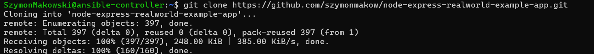
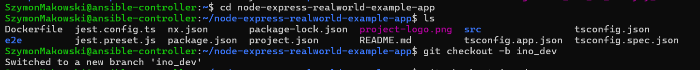
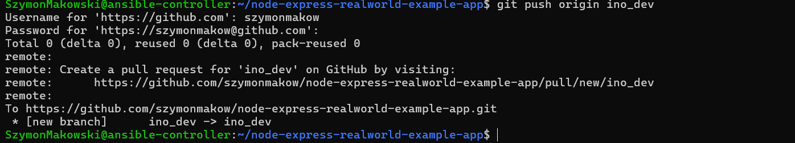
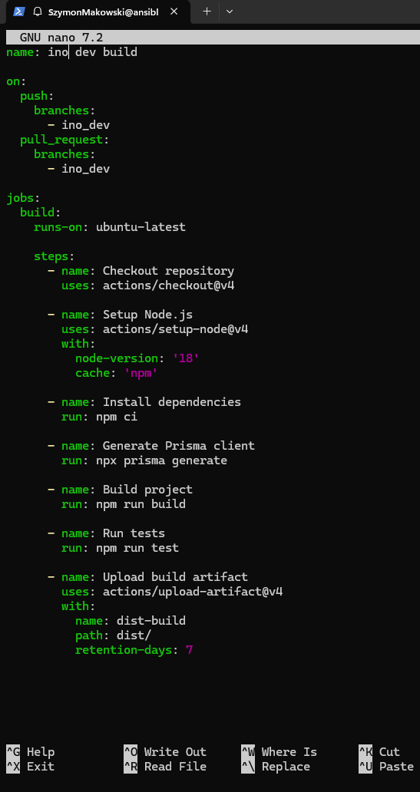
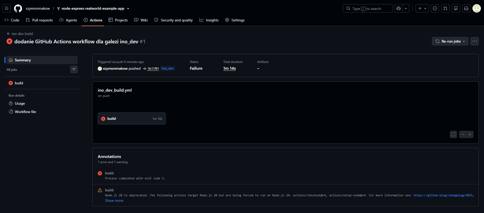
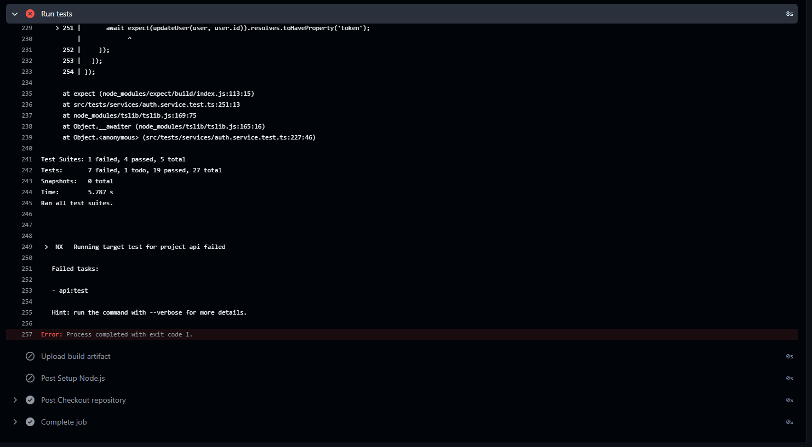
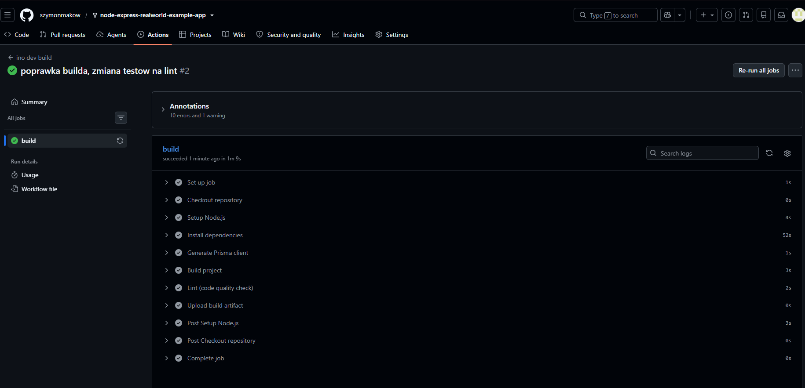
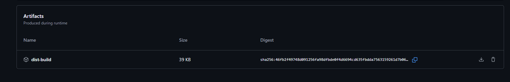
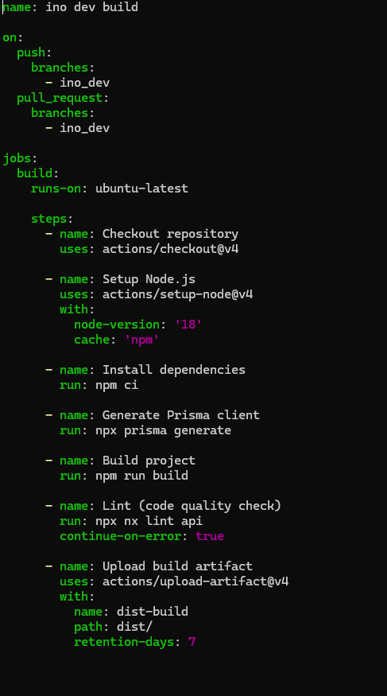

# Sprawozdanie 13 — Szymon Makowski ITE

## Shift-left — GitHub Actions

---

## Środowisko pracy

- Host: Windows 11
- Maszyna wirtualna: Ubuntu 24.04 LTS (VirtualBox)
- Połączenie: SSH z PowerShell / VS Code Remote SSH
- Repozytorium: szymonmakow/node-express-realworld-example-app (fork)

## Cel ćwiczenia

Celem laboratorium było zapoznanie się z koncepcją GitHub Actions jako narzędzia realizującego ideę shift-left — przesunięcia weryfikacji jakości kodu (build, testy, lint) możliwie wcześnie w cyklu wytwarzania oprogramowania, bezpośrednio po commitach do repozytorium, a nie dopiero na etapie wdrożenia.

## Przebieg ćwiczenia

### 1. Fork repozytorium

Do ćwiczenia wybrano projekt node-express-realworld-example-app — implementację backendu RealWorld w Node.js/TypeScript, opartą na frameworku Express, ORM Prisma oraz monorepo NX. Repozytorium zostało sforkowane na konto szymonmakow:

```bash
git clone https://github.com/szymonmakow/node-express-realworld-example-app.git
cd node-express-realworld-example-app
```



### 2. Utworzenie gałęzi ino_dev

```bash
git checkout -b ino_dev
git push origin ino_dev
```

Gałąź ino_dev stała się gałęzią docelową dla triggera Akcji — zgodnie z wymaganiem ćwiczenia, że build ma być wywoływany na podstawie kontrybucji do tej dedykowanej gałęzi.




### 3. Weryfikacja istniejących workflows

Przed dodaniem własnej konfiguracji sprawdzono, czy fork zawiera już jakiekolwiek pliki workflow:

```bash
ls -la .github/workflows/ 2>/dev/null || echo "Brak katalogu .github/workflows"
```

Wynik: katalog .github/workflows nie istniał w forkowanym repozytorium — nie było nic do usunięcia.

### 4. Pierwsza wersja Akcji (build + test)

Utworzono plik .github/workflows/ino_dev_build.yml z triggerem na push i pull_request skierowane do gałęzi ino_dev:

```yaml
name: ino dev build

on:
  push:
    branches:
      - ino_dev
  pull_request:
    branches:
      - ino_dev

jobs:
  build:
    runs-on: ubuntu-latest
    steps:
      - name: Checkout repository
        uses: actions/checkout@v4
      - name: Setup Node.js
        uses: actions/setup-node@v4
        with:
          node-version: '18'
          cache: 'npm'
      - name: Install dependencies
        run: npm ci
      - name: Generate Prisma client
        run: npx prisma generate
      - name: Build project
        run: npm run build
      - name: Run tests
        run: npm run test
      - name: Upload build artifact
        uses: actions/upload-artifact@v4
        with:
          name: dist-build
          path: dist/
          retention-days: 7
```



Po commicie i wypchnięciu na ino_dev, Akcja uruchomiła się automatycznie. Build zakończył się sukcesem, jednak krok Run tests zawiódł:



Przyczyną było odwołanie do realnej bazy danych przez Prisma, której środowisko ubuntu-latest w GitHub Actions nie udostępnia bez dodatkowej konfiguracji (np. service kontenera PostgreSQL):



### 5. Modyfikacja Akcji — zastąpienie testów weryfikacją code quality

Zgodnie z wytyczną ćwiczenia ("jeżeli build jest zbyt duży/problematyczny, zmodyfikuj akcję aby wykonywała inną czynność związaną z code quality"), podjęto decyzję o usunięciu kroku testowego (zależnego od niedostępnej w CI bazy danych) i zastąpieniu go statyczną analizą kodu za pomocą ESLint (przez NX):

```bash
npm install
npx nx lint api
```

Lokalne uruchomienie lintu lokalnie wykazało 33 realne błędy jakości kodu w projekcie (głównie @typescript-eslint/no-explicit-any oraz @typescript-eslint/no-unused-vars), co potwierdziło, że narzędzie faktycznie analizuje kod, a nie jest pustą formalnością.

Zaktualizowano workflow:

```yaml
      - name: Build project
        run: npm run build

      - name: Lint (code quality check)
        run: npx nx lint api
        continue-on-error: true

      - name: Upload build artifact
        uses: actions/upload-artifact@v4
        with:
          name: dist-build
          path: dist/
          retention-days: 7
```

Krok lint oznaczono jako continue-on-error: true — jest to standardowa praktyka przy wprowadzaniu nowego quality gate: narzędzie raportuje wykryte problemy (widoczne w zakładce Annotations), ale nie blokuje jeszcze pipeline'u, dopóki zespół nie zdecyduje się zaostrzyć reguły do blokującej.

### 6. Weryfikacja finalnego przebiegu

Po wypchnięciu poprawki, Akcja zakończyła się sukcesem — wszystkie kroki, łącznie z lintem i uploadem artefaktu, zostały wykonane:



Annotacje (10 errors, 1 warning) pozostały widoczne jako informacja dla zespołu, mimo że job zakończył się statusem succeeded.

### 7. Artefakt builda

Zbudowane pliki (katalog dist/) zostały załączone jako artefakt run'u (dist-build) za pomocą akcji actions/upload-artifact@v4, zgodnie z dokumentacją GitHub na temat przechowywania i udostępniania danych z workflow. 



## Finalna konfiguracja Akcji

```yaml
name: INO Dev Build

on:
  push:
    branches:
      - ino_dev
  pull_request:
    branches:
      - ino_dev

jobs:
  build:
    runs-on: ubuntu-latest
    steps:
      - name: Checkout repository
        uses: actions/checkout@v4
      - name: Setup Node.js
        uses: actions/setup-node@v4
        with:
          node-version: '18'
          cache: 'npm'
      - name: Install dependencies
        run: npm ci
      - name: Generate Prisma client
        run: npx prisma generate
      - name: Build project
        run: npm run build
      - name: Lint (code quality check)
        run: npx nx lint api
        continue-on-error: true
      - name: Upload build artifact
        uses: actions/upload-artifact@v4
        with:
          name: dist-build
          path: dist/
          retention-days: 7
```



## Wnioski

Ćwiczenie pokazało praktycznie, jak GitHub Actions realizuje filozofię shift-left — błędy (brakujący klient Prisma, niedziałające testy integracyjne wymagające bazy danych) zostały wykryte automatycznie tuż po pushu, zanim mogłyby trafić dalej w proces wytwórczy. Istotnym wnioskiem praktycznym jest to, że środowisko CI nie jest identyczne ze środowiskiem lokalnym czy produkcyjnym — testy zależne od zewnętrznych usług (bazy danych) wymagają jawnej konfiguracji lub zastąpienia szybszą, samodzielną weryfikacją, taką jak statyczna analiza kodu. Wybór`nx lint jako zamiennika dla testów integracyjnych był uzasadniony, ponieważ realnie wykrył błędy jakości kodu w projekcie, dowodząc, że krok ten ma rzeczywistą wartość diagnostyczną, a nie jest jedynie formalnym wymogiem pipeline'u.