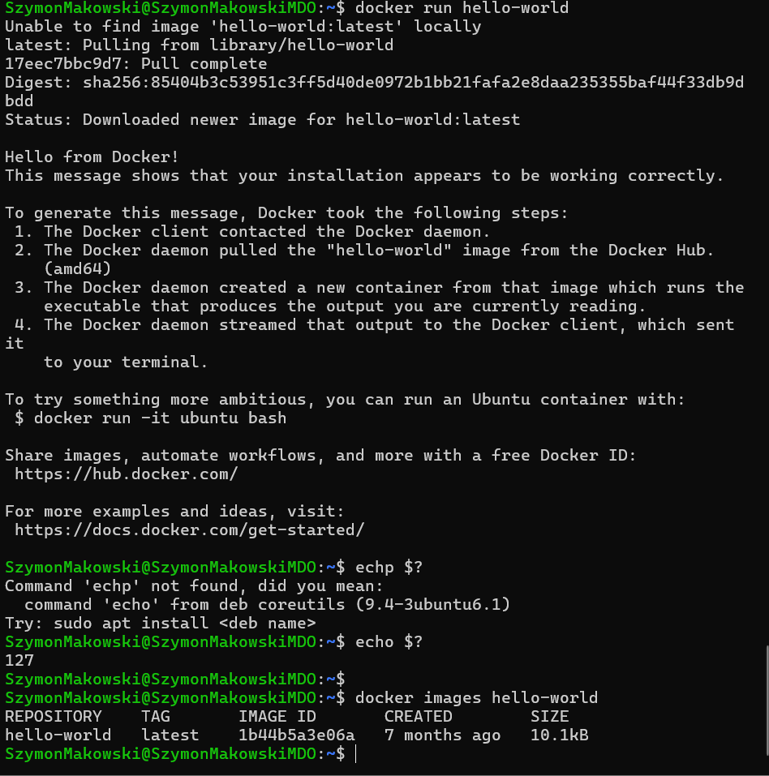
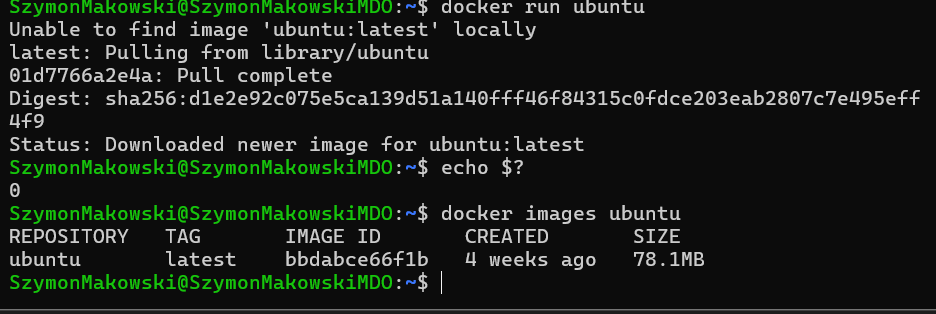
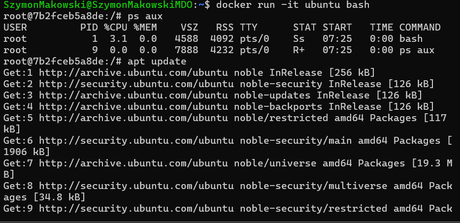
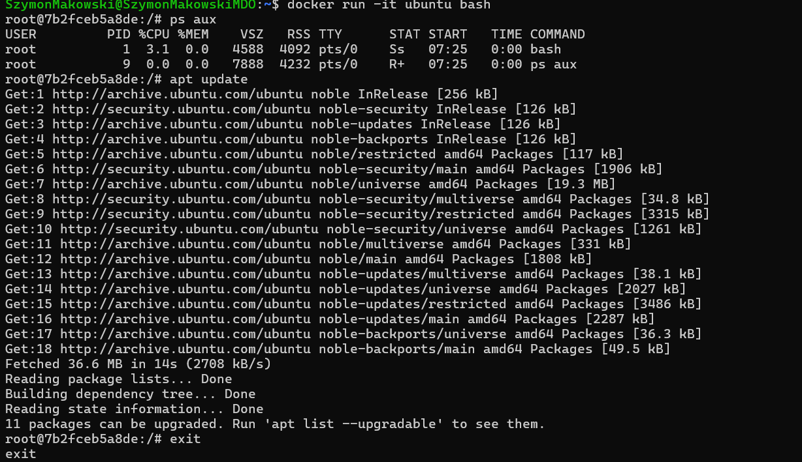
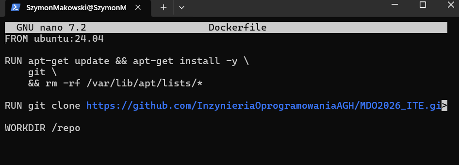
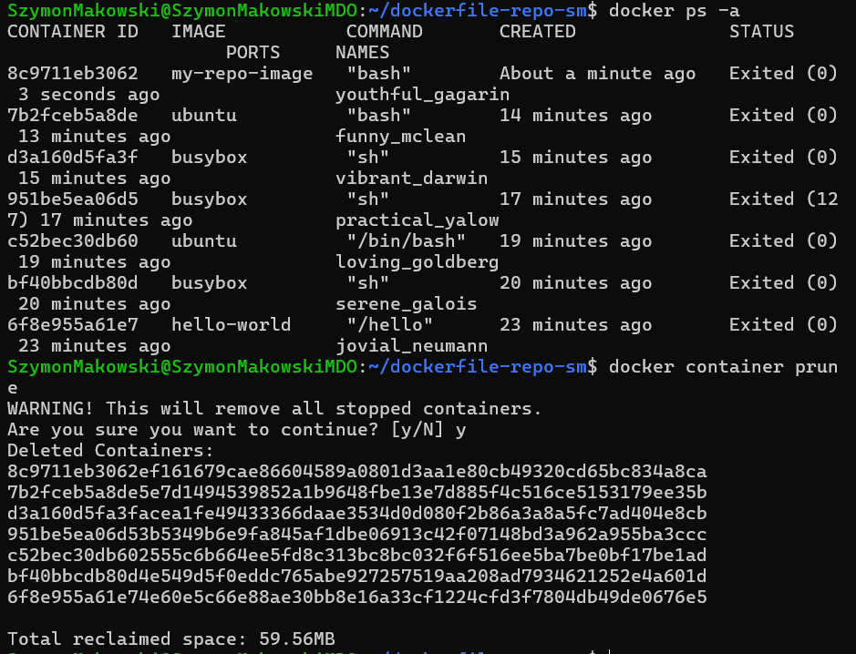
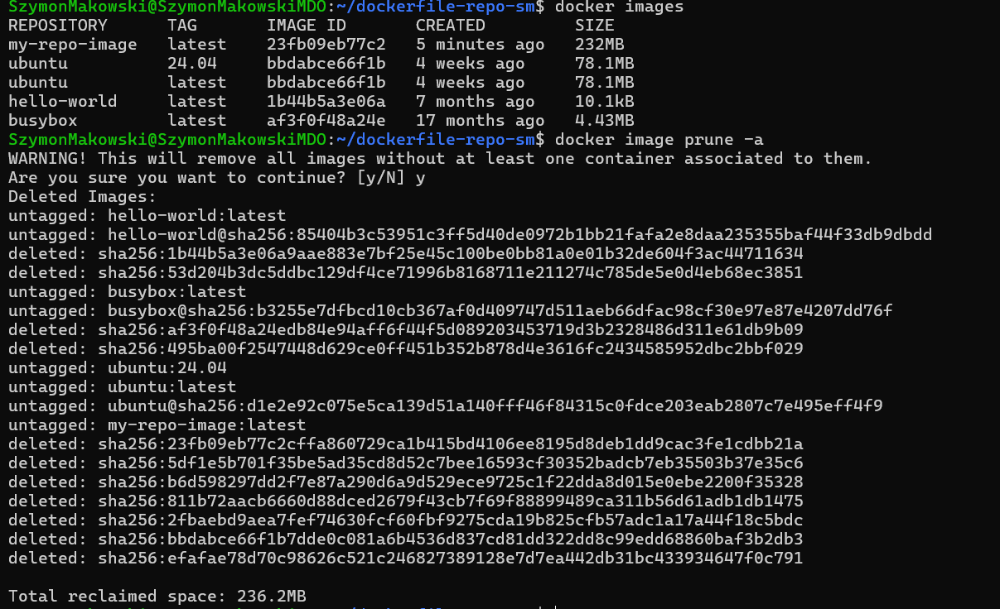

# Sprawozdanie 2 - Szymon Makowski ITE

## Środowisko pracy
- Host: Windows 11
- Maszyna wirtualna: Ubuntu 24.04 LTS (VirtualBox)
- Połączenie: SSH z PowerShell/VS Code Remote SSH
- Użytkownik VM: SzymonMakowski (bez root)

---

## 1. Instalacja Dockera

Zainstalowano Dockera z repozytoriów Ubuntu:

sudo apt update

sudo apt install docker.io -y

docker --version

sudo systemctl enable docker

sudo systemctl start docker

sudo usermod -aG docker $USER

newgrp docker


---

## 2. Rejestracja w Docker Hub

Zarejestrowano konto na [hub.docker.com](https://hub.docker.com) i zapoznano z dostępnymi obrazami.

---

## 3. Uruchomienie obrazów

### hello-world

docker run hello-world

echo $?

docker images hello-world



### busybox

docker run busybox

echo $?

docker images busybox


### ubuntu

docker run ubuntu

echo $?

docker images ubuntu



---

## 4. Uruchomienie kontenera busybox interaktywnie

Podłączono się do kontenera interaktywnie i sprawdzono wersję:

docker run -it busybox sh
busybox | head -1
exit

Wersja BusyBox: `v1.37.0 (2024-09-26 21:31:42 UTC)`


---

## 5. System w kontenerze (ubuntu)

Uruchomiono kontener z obrazu ubuntu, zaprezentowano PID1 i zaktualizowano pakiety:

docker run -it ubuntu bash

ps aux

apt update

exit

PID1 w kontenerze to `bash` – w przeciwieństwie do systemu hosta, gdzie PID1 to `systemd`.




---

## 6. Własny Dockerfile

Stworzono plik `Dockerfile` bazujący na Ubuntu, instalujący git i klonujący repozytorium przedmiotowe.

### Treść Dockerfile:


Zbudowano i uruchomiono obraz:

docker build -t my-repo-image .

docker run -it my-repo-image bash

ls /repo

exit

Po uruchomieniu kontenera zweryfikowano obecność sklonowanego repozytorium.


## 7. Uruchomione kontenery

Wyświetlono wszystkie kontenery (włącznie z zakończonymi):

docker ps -a

Wyczyszczono zakończone kontenery:

docker container prune




## 8. Czyszczenie obrazów

Wyświetlono i wyczyszczono wszystkie obrazy z lokalnego magazynu:

docker images

docker image prune -a

Odzyskano 236.2MB miejsca.




## Historia poleceń
```bash
sudo apt update
sudo apt install docker.io -y
docker --version
sudo systemctl enable docker
sudo systemctl start docker
sudo usermod -aG docker $USER
newgrp docker
docker run hello-world
echo $?
docker images hello-world
docker run busybox
docker images busybox
docker run -it busybox sh
docker run -it ubuntu bash
ps aux
apt update
mkdir ~/dockerfile-repo-sm
cd ~/dockerfile-repo-sm
nano Dockerfile
docker build -t my-repo-image .
docker run -it my-repo-image bash
ls /repo
docker ps -a
docker container prune
docker images
docker image prune -a
```
