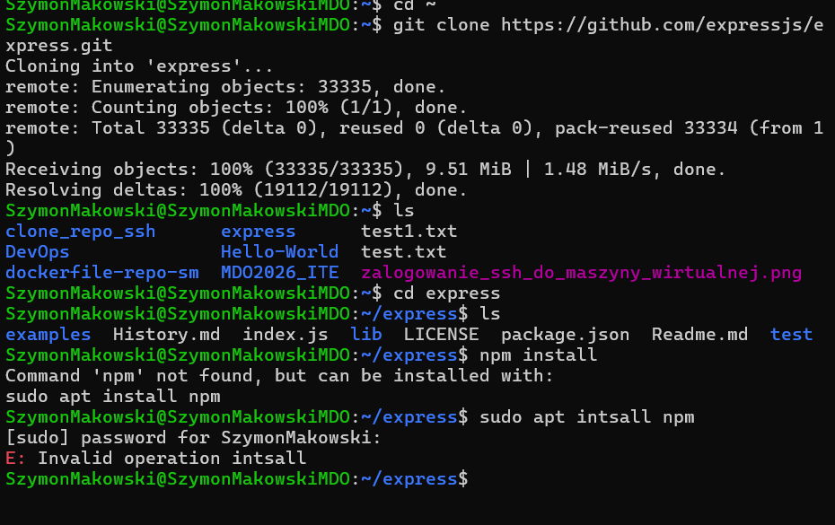
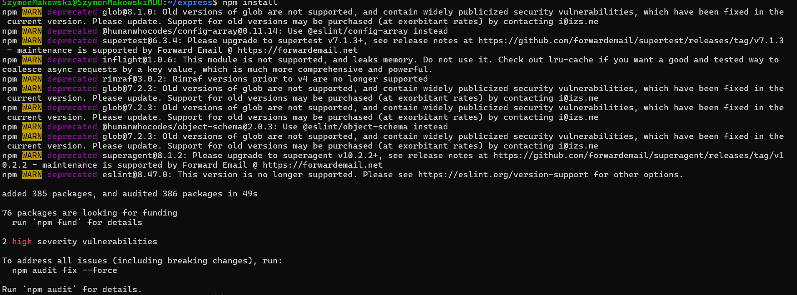
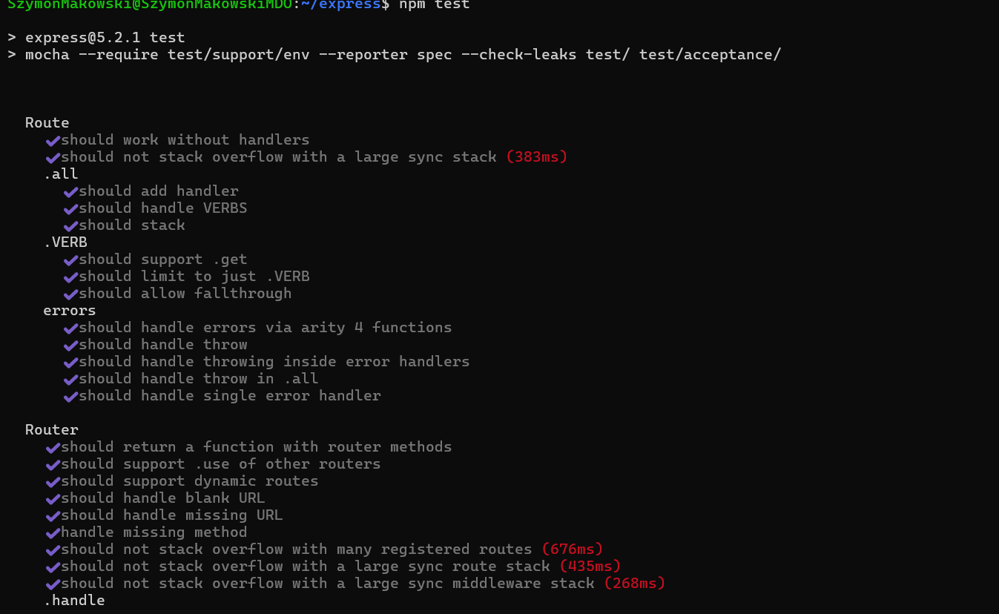
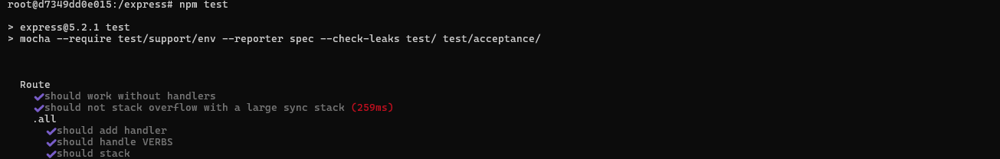
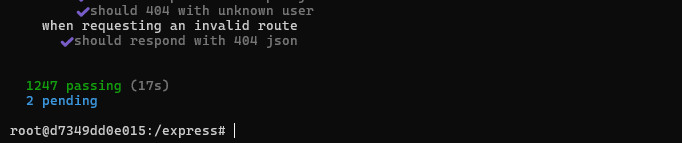
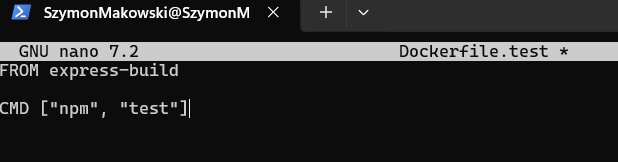
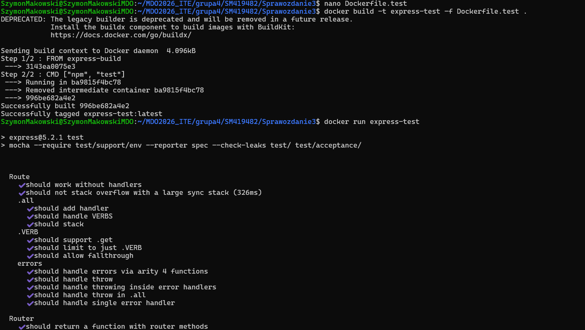
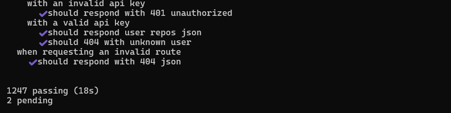

# Sprawozdanie 3 - Szymon Makowski ITE

## Środowisko pracy
- Host: Windows 11
- Maszyna wirtualna: Ubuntu 24.04 LTS (VirtualBox)
- Połączenie: SSH z PowerShell/VS Code Remote SSH
- Użytkownik VM: SzymonMakowski (bez root)

---

## 1. Wybór oprogramowania

Wybrano repozytorium **expressjs/express** – popularny framework webowy dla Node.js.

- Licencja: MIT (otwarta)
- System budowania: npm
- Build: npm install
- Testy: npm test (Mocha)
- Repozytorium: https://github.com/expressjs/express

---

## 2. Klonowanie i build lokalny

Sklonowano repozytorium i zainstalowano zależności:
```bash
git clone https://github.com/expressjs/express.git
cd express
npm install
```


---

## 3. Testy lokalne

Uruchomiono testy jednostkowe:
```bash
npm test
```
Wynik: **1246 testów przeszło** w 20 sekund.




---

## 4. Build w kontenerze interaktywnie

Uruchomiono kontener node:20 i wykonano kroki build i test wewnątrz:
```bash
git clone https://github.com/expressjs/express.git
cd express
npm install
npm test
```




---

## 5. Dockerfile.build

Kontener przeprowadza wszystkie kroki aż do builda:


Zbudowano obraz:
```bash
docker build -t express-build -f Dockerfile.build .
```


---

## 6. Dockerfile.test

Kontener bazuje na pierwszym i wykonuje testy (bez builda):



Zbudowano i uruchomiono obraz:
```bash
docker build -t express-test -f Dockerfile.test .
docker run express-test
```



---

## 7. Weryfikacja działania kontenerów
```bash
docker ps -a
docker images
```

Kontener `express-test` zakończył się z kodem `0` (sukces) – testy przeszły poprawnie.
Obrazy `express-build` i `express-test` mają rozmiar ~1.2GB każdy.


---

## Co pracuje w kontenerze?

W kontenerze express-test uruchomiony jest proces npm test który wykonuje testy jednostkowe frameworka Express.js przy użyciu Mocha. Kontener kończy pracę po zakończeniu testów – nie jest to serwis działający ciągle, lecz jednorazowe zadanie.

---

## Historia poleceń
```bash
git clone https://github.com/expressjs/express.git
cd express
sudo apt install npm
npm install
npm test
docker run -it node:20 bash
mkdir ~/MDO2026_ITE/grupa4/SM419482/Sprawozdanie3
cd ~/MDO2026_ITE/grupa4/SM419482/Sprawozdanie3
nano Dockerfile.build
docker build -t express-build -f Dockerfile.build .
nano Dockerfile.test
docker build -t express-test -f Dockerfile.test .
docker run express-test
docker ps -a
docker images
```