# Sprawozdanie 4 - Szymon Makowski ITE

## Środowisko pracy
- Host: Windows 11
- Maszyna wirtualna: Ubuntu 24.04 LTS (VirtualBox)
- Połączenie: SSH z PowerShell/VS Code Remote SSH
- Użytkownik VM: SzymonMakowski (bez root)

---

## 1. Zachowywanie stanu między kontenerami

### Przygotowanie woluminów
```bash
docker volume create wolumin-wejciowy
docker volume create wolumin-wyjsciowy
docker volume ls
```
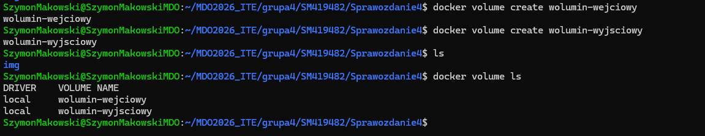

### Uruchomienie kontenera z woluminami
```bash
docker run -it --mount source=wolumin-wejciowy,target=/input --mount source=wolumin-wyjsciowy,target=/output node:20 bash
```


Usunięto git z kontenera:
```bash
apt remove git -y
which git
```
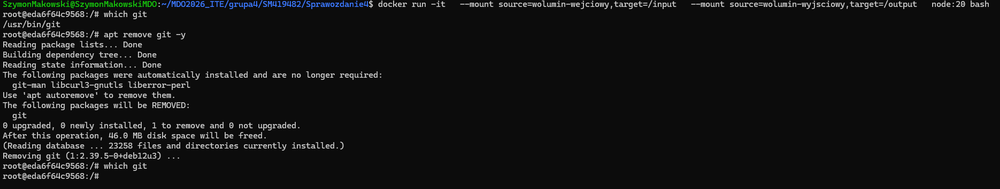

### Klonowanie na wolumin wejściowy z hosta
Repozytorium sklonowano z poziomu hosta bezpośrednio do katalogu woluminu:
```bash
docker volume inspect wolumin-wejciowy
sudo git clone https://github.com/expressjs/express.git /var/lib/docker/volumes/wolumin-wejciowy/_data
```

Ponieważ kontener bazowy nie ma gita, klonowanie z hosta pozwala dostarczyć kod do kontenera bez instalowania dodatkowych narzędzi wewnątrz.


### Build w kontenerze i zapis na wolumin wyjściowy
```bash
docker run -it --mount source=wolumin-wejciowy,target=/input --mount source=wolumin-wyjsciowy,target=/output node:20 bash

cd /input
npm install
cp -r node_modules /output/
```


### Ponowne klonowanie wewnątrz kontenera
```bash
apt install git -y
rm -rf /input/.[!.]*
git clone https://github.com/expressjs/express.git /input
npm install --prefix /input
cp -r /input/node_modules /output/
```

### Możliwość wykonania kroków przez Dockerfile z RUN --mount
Instrukcja `RUN --mount=type=cache` w Dockerfile pozwala na montowanie woluminów podczas budowania obrazu bez zapisywania ich w finalnym obrazie. Przykład:
```dockerfile
RUN --mount=type=bind,source=.,target=/input cd /input && npm install
```

---

## 2. Eksponowanie portu i łączność między kontenerami

### Uruchomienie serwera iperf3
```bash
docker run -dit --name iperf-server networkstatic/iperf3 -s
```

### Połączenie między kontenerami przez IP
```bash
docker inspect iperf-server
docker logs iperf-server
```
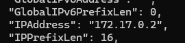
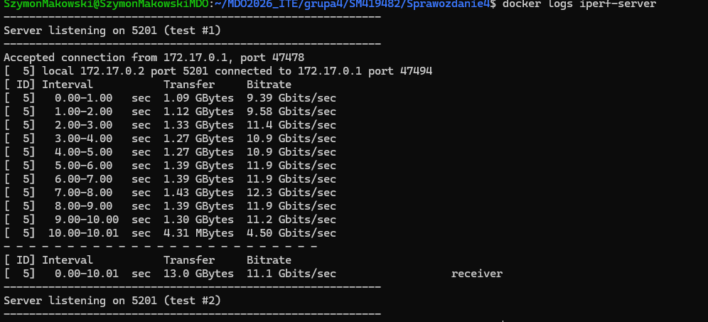

### Dedykowana sieć mostkowa
```bash
docker network create moja-siec
docker run -dit --name iperf-server --network moja-siec networkstatic/iperf3 -s
docker run -dit --name iperf-client --network moja-siec networkstatic/iperf3 -s
docker exec -it iperf-client bash
iperf3 -c iperf-server
```

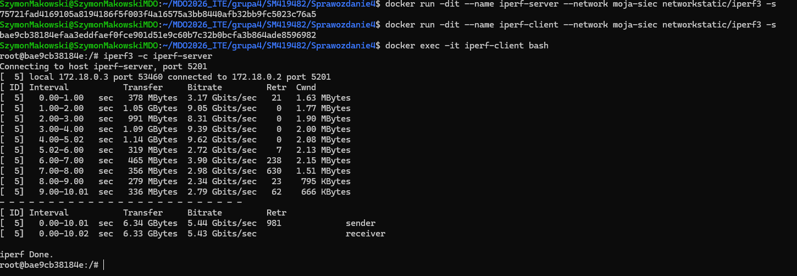
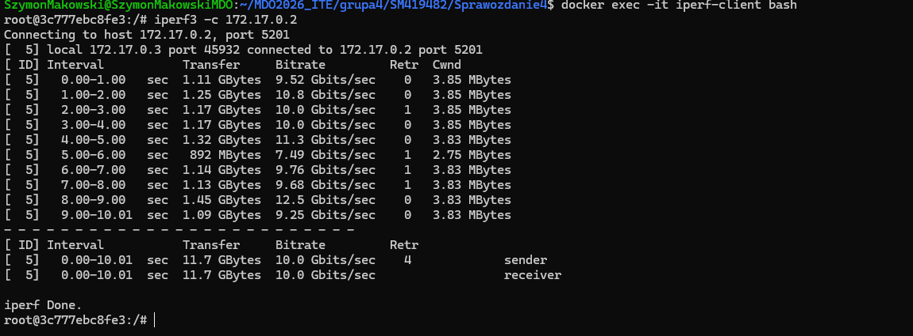

### Połączenie spoza kontenera
```bash
docker run -dit --name iperf-server -p 5201:5201 networkstatic/iperf3 -s
iperf3 -c localhost
```
Połączenie spoza hosta (`iperf3 -c 192.168.1.100`) zakończyło się błędem `Connection timed out` – firewall VirtualBox blokuje port 5201.

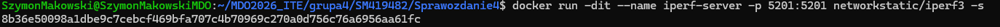
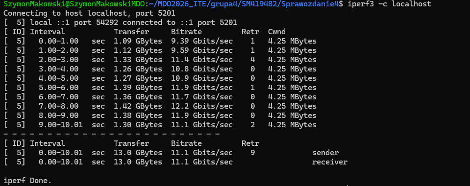

---

## 3. SSHD w kontenerze

```bash
docker run -it -p 2222:22 --name sshd-container ubuntu bash
apt update
apt install openssh-server -y
mkdir /var/run/sshd
echo 'root:password123' | chpasswd
sed -i 's/#PermitRootLogin prohibit-password/PermitRootLogin yes/' /etc/ssh/sshd_config
service ssh start
```


Połączenie z kontenera z hosta:
```bash
ssh root@localhost -p 2222
```
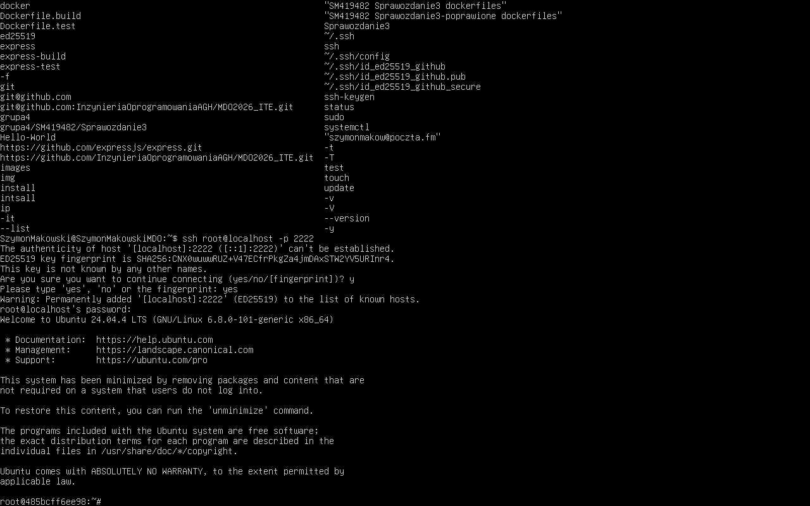

### Zalety i wady SSH w kontenerze
**Zalety:**
- Znany i sprawdzony protokół
- Możliwość przesyłania plików (SCP/SFTP)
- Szyfrowana komunikacja

**Wady:**
- Niezgodne z filozofią kontenerów (jeden proces = jeden kontener)
- Wymaga zarządzania kluczami/hasłami
- Lepszym rozwiązaniem jest `docker exec`

---

## 4. Jenkins z DIND

### Dockerfile Jenkinsa
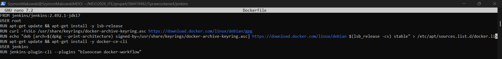
### Uruchomienie DIND i Jenkinsa
```bash
docker network create jenkins

docker run --name jenkins-docker --rm --detach --privileged --network jenkins --network-alias docker --env DOCKER_TLS_CERTDIR=/certs --volume jenkins-docker-certs:/certs/client --volume jenkins-data:/var/jenkins_home --publish 2376:2376 docker:dind --storage-driver overlay2

docker build -t myjenkins-blueocean:2.492.1-1 .

docker run --name jenkins-blueocean --restart=on-failure --detach --network jenkins --env DOCKER_HOST=tcp://docker:2376 --env DOCKER_CERT_PATH=/certs/client --env DOCKER_TLS_VERIFY=1 --volume jenkins-data:/var/jenkins_home --volume jenkins-docker-certs:/certs/client:ro --publish 8081:8080 --publish 50000:50000 myjenkins-blueocean:2.492.1-1
```

### Działające kontenery
```bash
docker ps
```
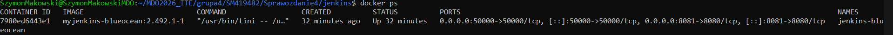

### Ekran logowania Jenkins
Hasło inicjalizacyjne pobrano z logów:
```bash
docker logs jenkins-blueocean
```
Hasło: `a7a2088dc10448a8aee11f91b3e69d4e`

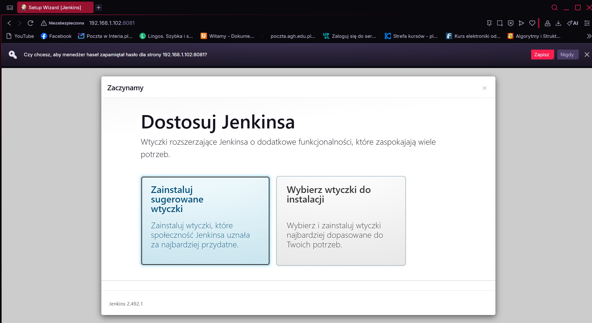

---

## Historia poleceń
```bash
docker volume create wolumin-wejciowy
docker volume create wolumin-wyjsciowy
docker volume ls
docker run -it --mount source=wolumin-wejciowy,target=/input --mount source=wolumin-wyjsciowy,target=/output node:20 bash
apt remove git -y
docker volume inspect wolumin-wejciowy
sudo git clone https://github.com/expressjs/express.git /var/lib/docker/volumes/wolumin-wejciowy/_data
docker run -it -p 2222:22 --name sshd-container ubuntu bash
docker network create jenkins
docker run --name jenkins-docker --rm --detach --privileged --network jenkins --network-alias docker --env DOCKER_TLS_CERTDIR=/certs --volume jenkins-docker-certs:/certs/client --volume jenkins-data:/var/jenkins_home --publish 2376:2376 docker:dind --storage-driver overlay2
docker build -t myjenkins-blueocean:2.492.1-1 .
docker run --name jenkins-blueocean --restart=on-failure --detach --network jenkins --env DOCKER_HOST=tcp://docker:2376 --env DOCKER_CERT_PATH=/certs/client --env DOCKER_TLS_VERIFY=1 --volume jenkins-data:/var/jenkins_home --volume jenkins-docker-certs:/certs/client:ro --publish 8081:8080 --publish 50000:50000 myjenkins-blueocean:2.492.1-1
docker logs jenkins-blueocean
docker ps
```