# Sprawozdania 5–7: CI/CD z Jenkins i Docker
### Szymon Makowski – ITE

---

## Środowisko pracy

* Host: Windows 11
* Maszyna wirtualna: Ubuntu 24.04 LTS (VirtualBox)
* Połączenie: SSH z PowerShell / VS Code Remote SSH
* Użytkownik VM: SzymonMakowski (bez root)
* Repozytorium aplikacji: fork expressjs/express

---

# Sprawozdanie 5 – Jenkins z DIND i pierwsze pipeline'y

## 1. Wprowadzenie teoretyczne

### Czym jest Jenkins?

Jenkins to otwartoźródłowy serwer automatyzacji, będący jednym z najpopularniejszych narzędzi w ekosystemie CI/CD. Umożliwia automatyzację budowania, testowania i wdrażania aplikacji poprzez definiowanie pipeline'ów – sekwencji kroków realizowanych po każdym commicie lub zdarzeniu wyzwalającym.

Jenkins wspiera dwa modele definiowania pipeline'ów:
- Freestyle Projects – konfiguracja przez interfejs graficzny, prosta, ale ograniczona
- Pipeline as Code – pipeline definiowany w pliku Jenkinsfile znajdującym się w repozytorium, co pozwala traktować infrastrukturę budowania jako część kodu 

### Docker-in-Docker (DIND)

Typowym wyzwaniem przy uruchamianiu Jenkinsa w kontenerze Docker jest potrzeba wykonywania poleceń docker build, docker run itp. wewnątrz środowiska CI.

W tym ćwiczeniu zastosowano podejście DIND, uruchamiając kontener docker:dind jako usługę pomocniczą w tej samej sieci Docker co Jenkins.

### Sieć Docker

Kontenery Jenkins i DIND komunikują się przez dedykowaną sieć bridge jenkins. Docker network tworzy izolowaną sieć wirtualną, w której kontenery mogą się odnajdywać po nazwach (DNS wewnętrzny). Dzięki parametrowi --network-alias docker kontener DIND jest dostępny pod hostname docker dla innych kontenerów w tej sieci.

---

## 2. Uruchomienie środowiska Jenkins + DIND

### Dockerfile Jenkinsa

Obraz Jenkins Blue Ocean rozszerza oficjalny obraz Jenkinsa o dodatkowe wtyczki – w tym Blue Ocean UI oraz integrację z Dockerem.

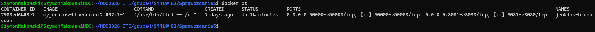

### Tworzenie sieci i uruchamianie kontenerów

Najpierw tworzymy dedykowaną sieć Docker, która umożliwi komunikację między kontenerami:

```bash
docker network create jenkins
```

Następnie uruchamiamy kontener DIND (`docker:dind`) jako uprzywilejowany demon Docker:

```bash
docker run \
  --name jenkins-docker \
  --rm --detach \
  --privileged \
  --network jenkins \
  --network-alias docker \
  --env DOCKER_TLS_CERTDIR=/certs \
  --volume jenkins-docker-certs:/certs/client \
  --volume jenkins-data:/var/jenkins_home \
  --publish 2376:2376 \
  docker:dind \
  --storage-driver overlay2
```

Kluczowe parametry:
- --privileged – wymagane dla DIND, aby wewnętrzny demon Docker mógł działać
- --network-alias docker – kontener DIND dostępny pod adresem docker w sieci jenkins
- --volume jenkins-data – wolumen współdzielony z Jenkinsem (katalog domowy Jenkinsa)
- --storage-driver overlay2 – wydajny sterownik systemu plików dla Dockera

Budowanie obrazu Jenkinsa i uruchomienie kontenera:

```bash
docker build -t myjenkins-blueocean:2.492.1-1 .

docker run \
  --name jenkins-blueocean \
  --restart=on-failure \
  --detach \
  --network jenkins \
  --env DOCKER_HOST=tcp://docker:2376 \
  --env DOCKER_CERT_PATH=/certs/client \
  --env DOCKER_TLS_VERIFY=1 \
  --volume jenkins-data:/var/jenkins_home \
  --volume jenkins-docker-certs:/certs/client:ro \
  --publish 8081:8080 \
  --publish 50000:50000 \
  myjenkins-blueocean:2.492.1-1
```

Parametr DOCKER_HOST=tcp://docker:2376 wskazuje Jenkinsowi, że ma używać demona Docker działającego w kontenerze DIND, a nie lokalnego.

### Weryfikacja działania kontenerów

```bash
docker ps
```


### Pierwsze uruchomienie Jenkinsa

Hasło inicjalizacyjne pobierane jest z logów kontenera:

```bash
docker logs jenkins-blueocean
```

Hasło: a7a2088dc10448a8aee11f91b3e69d4e


Po pierwszym logowaniu instalowane są zalecane wtyczki, a następnie tworzony jest konto administratora.

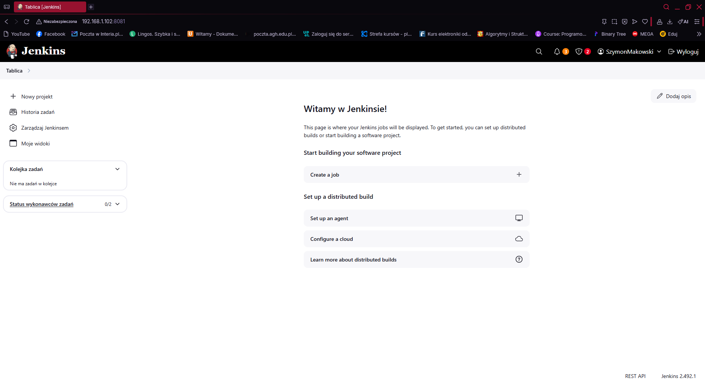

---

## 3. Projekty wstępne – poznanie Jenkinsa

### 3.1 Projekt wyświetlający uname

Pierwszy projekt typu Freestyle to klasyczny „Hello World" w środowisku CI. Krok Execute shell wykonuje:

```bash
uname -a
```

Polecenie uname -a wyświetla pełne informacje o systemie operacyjnym agenta: nazwę jądra, hostname, wersję, architekturę sprzętową. Jest to szybki sposób na potwierdzenie, że agent działa poprawnie i znamy jego środowisko.


### 3.2 Projekt zwracający błąd przy nieparzystej godzinie

Ten projekt ilustruje mechanizm kontroli statusu wyjścia (exit code) w Jenkinsie. Jenkins uznaje build za zakończony błędem, gdy krok zwróci kod wyjścia różny od 0:

```bash
HOUR=$(date +%H)

if [ $((HOUR % 2)) -ne 0 ]; then
  echo "Godzina nieparzysta - BŁĄD"
  exit 1
else
  echo "Godzina parzysta - OK"
fi
```

Mechanizm exit 1 jest fundamentem obsługi błędów w pipeline'ach CI/CD – pozwala warunkowo zatrzymać pipeline i zaalarmować zespół. W praktyce stosuje się to np. do weryfikacji warunków środowiskowych przed uruchomieniem deploymentu.

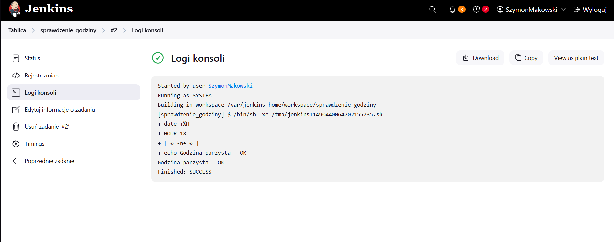

### 3.3 Pobieranie obrazu Docker z poziomu Jenkinsa

Projekt weryfikuje poprawność integracji Jenkinsa z DIND:

```bash
docker pull ubuntu
```

Poprawne wykonanie tego kroku potwierdza, że Jenkins może komunikować się z demonem Docker przez zmienną DOCKER_HOS` i wykonywać operacje na kontenerach – co jest warunkiem koniecznym do realizacji pipeline'ów z budową obrazów.


---

## 4. Pipeline w UI Jenkinsa

Pipeline jako obiekt Jenkins Pipeline pozwala definiować wieloetapowy proces w języku Groovy. Konfiguracja przez UI jest dobrym punktem startowym – pipeline wpisuje się bezpośrednio w pole tekstowe w konfiguracji projektu.

Zalety:
- Szybka iteracja bez konieczności commitowania do repozytorium
- Natychmiastowa wizualizacja etapów w Blue Ocean

Wady:
- Kod nie jest wersjonowany razem z aplikacją
- Trudniejsza współpraca zespołowa


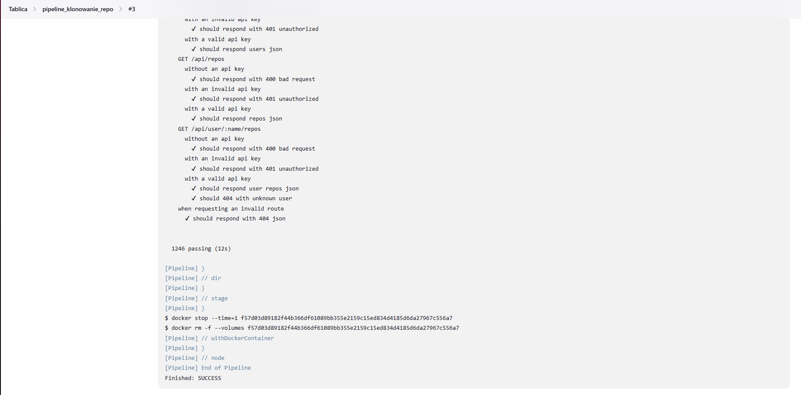

---

## 5. Pipeline z Jenkinsfile w repozytorium (Pipeline from SCM)

### Koncepcja Pipeline as Code

Przechowywanie Jenkinsfile w repozytorium Git obok kodu aplikacji to wzorzec Pipeline as Code. Korzyści:

- Wersjonowanie – każda zmiana pipeline'u jest śledzona w historii Git
- Code review – zmiany pipeline'u podlegają tym samym procedurom przeglądowym co kod aplikacji
- Odtwarzalność – każda gałąź może mieć własny pipeline
- Audytowalność – wiadomo kto, kiedy i dlaczego zmienił konfigurację CI/CD

### Przygotowanie

1. Sforkowano repozytorium https://github.com/expressjs/express na własne konto GitHub
2. W katalogu głównym repozytorium utworzono plik Jenkinsfile
3. W Jenkinsie skonfigurowano nowy Pipeline z parametrami:
   - Definition: Pipeline script from SCM
   - SCM: Git
   - Repository URL: https://github.com/szymonmakow/express.git
   - Branch: */master
   - Script Path: Jenkinsfile

### Jenkinsfile


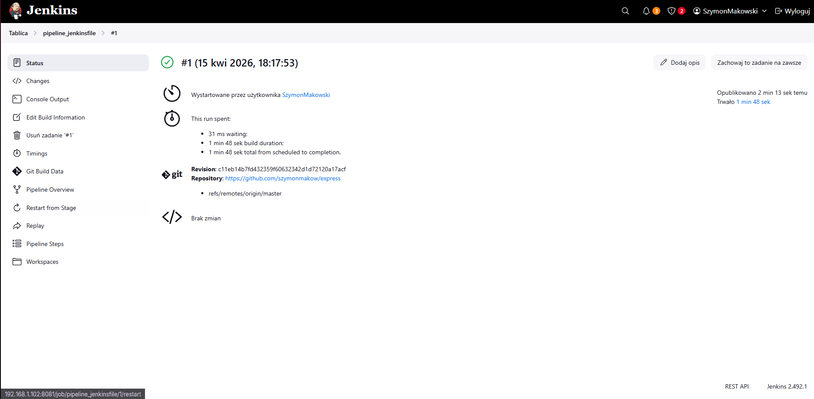

---

# Sprawozdanie 6 – Pipeline CI/CD: Build, Test, Artifacts, Deploy, Publish

## 1. Wprowadzenie teoretyczne

### Continuous Integration i Continuous Delivery

CI (Continuous Integration) to praktyka częstego integrowania zmian kodu do wspólnego repozytorium, połączona z automatycznym uruchamianiem budowy i testów po każdym commicie. Celem jest wczesne wykrywanie konfliktów i błędów.

CD (Continuous Delivery / Deployment) rozszerza CI o automatyzację procesu dostarczania oprogramowania do środowisk testowych lub produkcyjnych. W przypadku Continuous Delivery wdrożenie na produkcję wymaga ręcznej akceptacji; Continuous Deployment wdraża automatycznie przy każdym przejściu pipeline'u.

### Ścieżka krytyczna pipeline

Typowy pipeline CI/CD dla aplikacji Node.js obejmuje następujące etapy:

```
Commit / Trigger -> Checkout -> Build -> Test -> Artifacts -> Deploy -> Smoke Test -> Publish
```

Każdy etap jest zależny od poprzedniego – błąd na którymkolwiek etapie zatrzymuje pipeline i zapobiega wdrożeniu wadliwego kodu. To fundamentalna zasada fail-fast.

### Konteneryzacja etapów pipeline

Uruchamianie każdego etapu pipeline w osobnym kontenerze Docker zapewnia:
- Izolację – jeden etap nie wpływa na środowisko drugiego
- Powtarzalność – to samo środowisko lokalnie i na serwerze CI
- Czystość – kontener startuje zawsze w tym samym stanie
- Elastyczność – różne etapy mogą używać różnych obrazów bazowych

---

## 2. Opis aplikacji

Wybraną aplikacją jest biblioteka Express.js, dostępna publicznie na platformie GitHub. Express to minimalistyczny framework webowy dla Node.js, który stanowi fundament ogromnej liczby aplikacji i API w ekosystemie JavaScript. Projekt objęty jest licencją MIT, co pozwala na swobodne wykorzystanie w celach edukacyjnych.

Zrobiono forka repozytorium na osobiste konto GitHub:
https://github.com/szymonmakow/express


### Uruchomienie lokalne

```bash
npm install
npm test
```

Testy przechodzą poprawnie, co potwierdza poprawność działania aplikacji przed przeniesieniem jej do pipeline'u CI/CD.

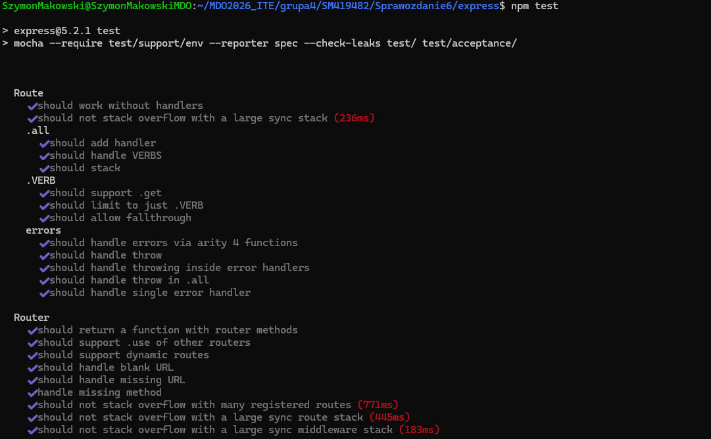


---

## 3. Architektura pipeline

Pipeline zaimplementowany jest w Jenkinsie jako zadanie typu Pipeline from SCM. Kod pipeline'u znajduje się w pliku Jenkinsfile w repozytorium – zgodnie z podejściem Pipeline as Code omówionym w Sprawozdaniu 5.

Każdy etap pipeline realizowany jest w kontenerze Docker, co zapewnia izolację środowiska i powtarzalność procesu.

### Diagram przepływu CI/CD

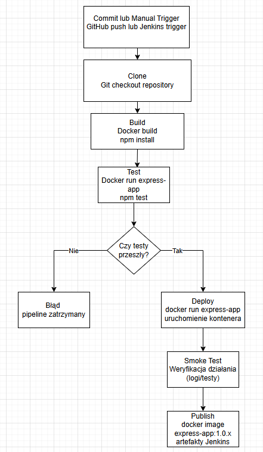

---

## 4. Konteneryzacja – wybór obrazu bazowego

Do budowy aplikacji Express.js wykorzystano obraz node:18. Jest to oficjalny obraz Docker z preinstalowanym środowiskiem Node.js 18 LTS oraz narzędziami npm i npx. Wybór wersji LTS (Long Term Support) zapewnia stabilność i długoterminowe wsparcie bezpieczeństwa.

---

## 5. Etap Build

### Dockerfile

Obraz budowany jest na podstawie Dockerfile, który instaluje zależności i przygotowuje środowisko uruchomieniowe:


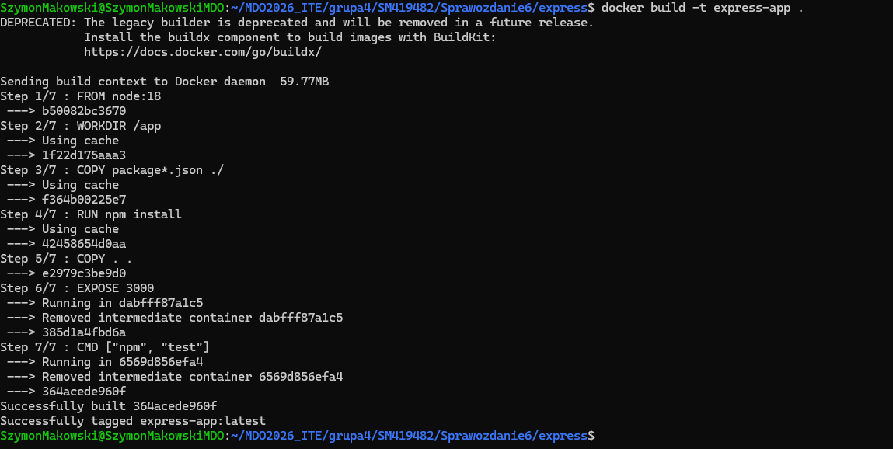

Zastosowanie dedykowanego Dockerfile (zamiast bezpośredniego uruchamiania npm install na agencie) to dobra praktyka – obraz staje się artefaktem, który może być uruchomiony w identyczny sposób w każdym środowisku.

---

## 6. Etap Test

Testy wykonywane są w osobnym etapie pipeline, w kontenerze zbudowanym z tego samego obrazu co Build. Oddzielenie etapu testowania od budowania zapewnia modularność i czytelność pipeline'u:

```groovy
docker.image("express-app:${VERSION}").inside {
    sh 'npm test > test-results.txt'
}
```

Przekierowanie wyjścia do pliku test-results.txt pozwala na archiwizację wyników i ich późniejszą analizę. Jest to standardowa praktyka w CI/CD – wyniki testów jako artefakt dają audytowalność i możliwość porównywania wyników między buildami.

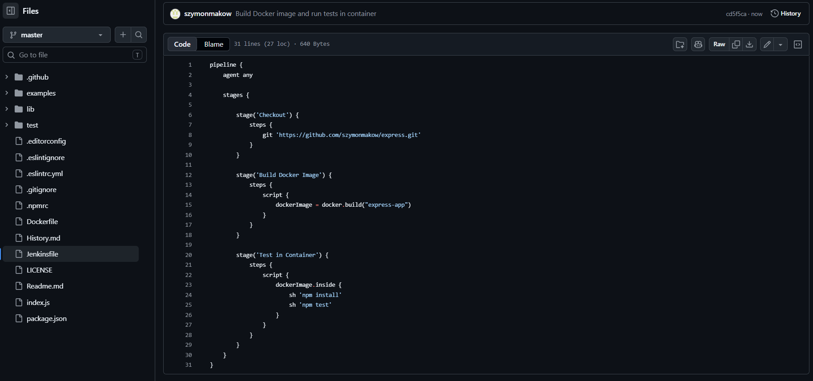
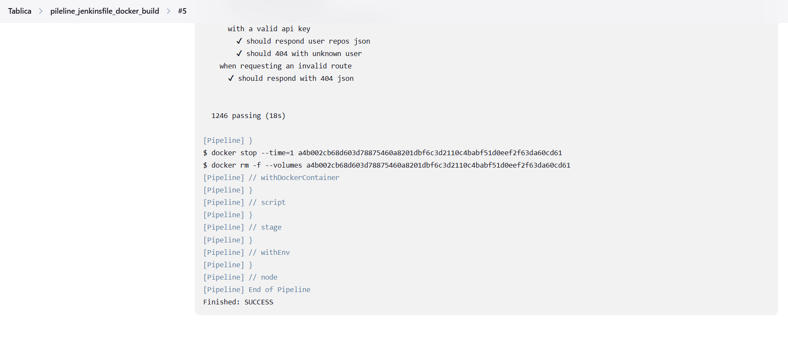

---

## 7. Artefakty

Artefakt w kontekście CI/CD to plik lub zbiór plików będący wynikiem procesu budowania lub testowania, który zostaje zachowany i powiązany z konkretnym buildem. Artefakty umożliwiają:
- Odtworzenie wyników konkretnego buildu
- Analizę trendów (np. pogarszające się wyniki testów)
- Dostarczenie gotowego pakietu do kolejnych etapów pipeline'u

Artefaktem pipeline jest plik test-results.txt archiwizowany przez Jenkins:

```groovy
archiveArtifacts artifacts: 'test-results.txt', fingerprint: true
```

Parametr fingerprint: true generuje skrót MD5 pliku, który Jenkins przechowuje i może wykorzystać do śledzenia, w którym buildzie dany artefakt powstał. Każdy artefakt powiązany jest z numerem buildu Jenkins, co pozwala na jednoznaczną identyfikację jego pochodzenia.


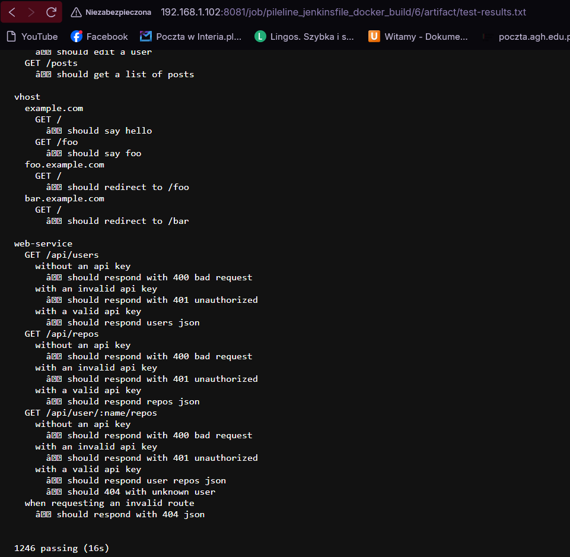

---

## 8. Etap Deploy

Etap Deploy polega na uruchomieniu kontenera Docker z zbudowanym obrazem:

```bash
docker run --name express-container express-app:${VERSION}
```

Ponieważ projekt Express jest biblioteką, a nie samodzielną aplikacją serwerową ze stałym procesem, deploy polega na wykonaniu kontenera i uruchomieniu testów jako formy weryfikacji działania – co stanowi uproszczony, lecz funkcjonalny model wdrożenia dla bibliotek.

### Smoke Test

Smoke test (ang. test dymny) to minimalna weryfikacja poprawności wdrożenia – sprawdza, czy system w ogóle działa, zanim przeprowadzone zostaną bardziej szczegółowe testy. Nazwa pochodzi z elektroniki – „dym oznacza błąd". W tym pipeline, smoke test weryfikuje:
- Poprawne wykonanie kontenera
- Wcześniejsze przejście testów jednostkowych


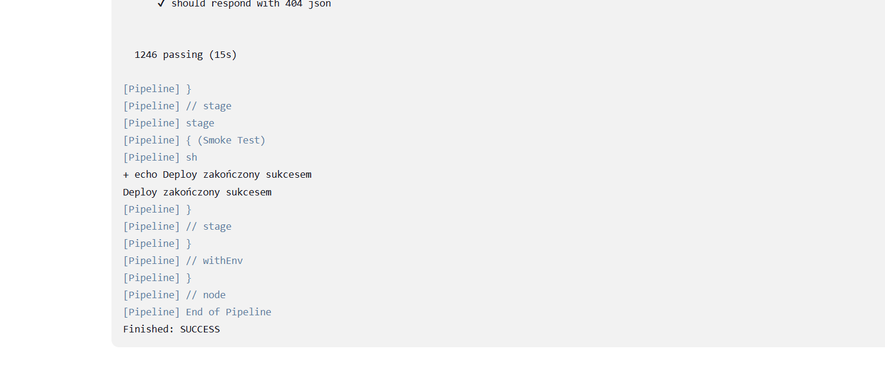

---

## 9. Etap Publish

Artefaktem końcowym jest obraz Docker express-app:${VERSION}.

### Wersjonowanie semantyczne

Zastosowano schemat wersjonowania 1.0.${BUILD_NUMBER}. Schemat ten zapewnia:
- Unikalność – każdy build generuje unikalną wersję
- Monotoniczność – wyższy numer = nowszy build
- Identyfikowalność – znając numer wersji, można powiązać obraz z konkretnym buildem Jenkinsa

W środowiskach produkcyjnych stosuje się często Semantic Versioning, gdzie numer jest zarządzany manualnie lub przez narzędzia takie jak semantic-release.

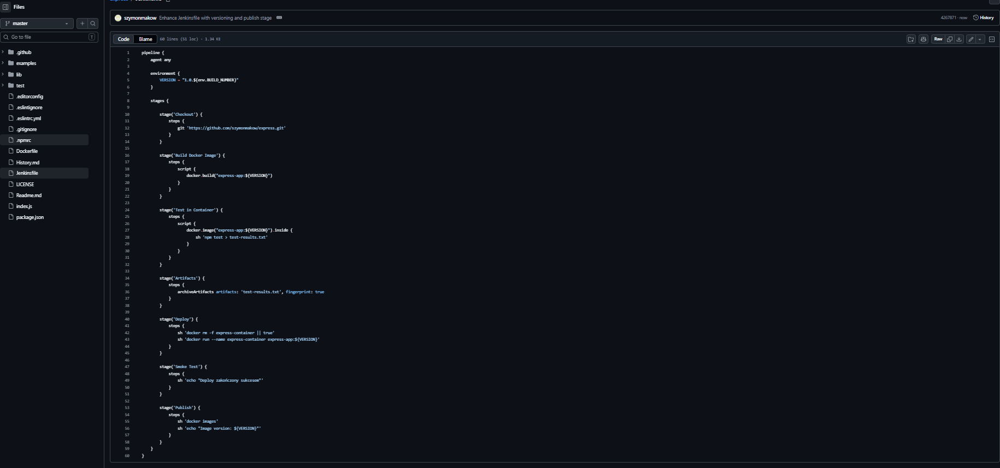
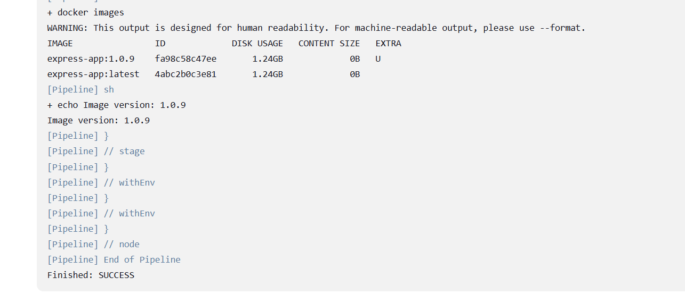

---

## 10. Kompletny Jenkinsfile

```groovy
pipeline {
    agent any

    environment {
        VERSION = "1.0.${env.BUILD_NUMBER}"
    }

    stages {

        stage('Checkout') {
            steps {
                git 'https://github.com/szymonmakow/express.git'
            }
        }

        stage('Build Docker Image') {
            steps {
                script {
                    docker.build("express-app:${VERSION}")
                }
            }
        }

        stage('Test in Container') {
            steps {
                script {
                    docker.image("express-app:${VERSION}").inside {
                        sh 'npm test > test-results.txt'
                    }
                }
            }
        }

        stage('Artifacts') {
            steps {
                archiveArtifacts artifacts: 'test-results.txt', fingerprint: true
            }
        }

        stage('Deploy') {
            steps {
                sh 'docker rm -f express-container || true'
                sh 'docker run --name express-container express-app:${VERSION}'
            }
        }

        stage('Smoke Test') {
            steps {
                sh 'echo "Deploy zakończony sukcesem"'
            }
        }

        stage('Publish') {
            steps {
                sh 'docker images'
                sh 'echo "Image version: ${VERSION}"'
            }
        }
    }
}
```

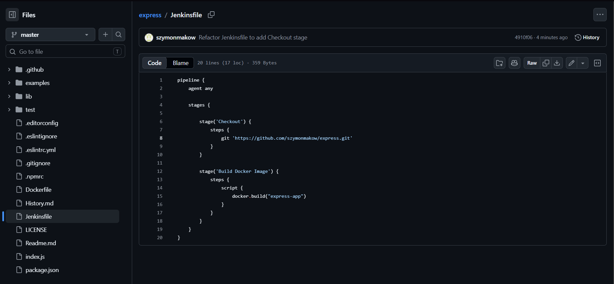


---

# Sprawozdanie 7 – Rozbudowany pipeline CI/CD z publikacją na Docker Hub

## 1. Cel ćwiczenia

Celem ćwiczenia było:

* Przygotowanie aplikacji Express do uruchomienia w kontenerze Docker
* Stworzenie deklaratywnego pipeline CI/CD w Jenkinsie (Jenkinsfile w repozytorium)
* Automatyzacja procesu: build - test - deploy - publish
* Opublikowanie gotowego obrazu Docker na Docker Hub

---

## 2. Przygotowanie aplikacji

Aplikacja Express (sforkowana w poprzednich zajęciach) została skopiowana do katalogu sprawozdania:

```bash
cp -r ../Sprawozdanie6/express/* Sprawozdanie7/express-app/
```

Katalog express-app/ zawiera pełny kod źródłowy biblioteki Express wraz z testami i przykładami, w tym examples/hello-world/index.js – gotowy serwer HTTP, który posłuży jako entrypoint kontenera.

---

## 3. Dockerfile – budowa obrazu

Stworzono wieloetapowy (multi-stage) Dockerfile, który rozdziela środowisko budowania od środowiska uruchomieniowego:

```dockerfile
#build
FROM node:18 AS builder
WORKDIR /app
COPY . .
RUN npm install

#runtime
FROM node:18-alpine
WORKDIR /app
COPY --from=builder /app /app

EXPOSE 3000
CMD ["node", "examples/hello-world/index.js"]
```

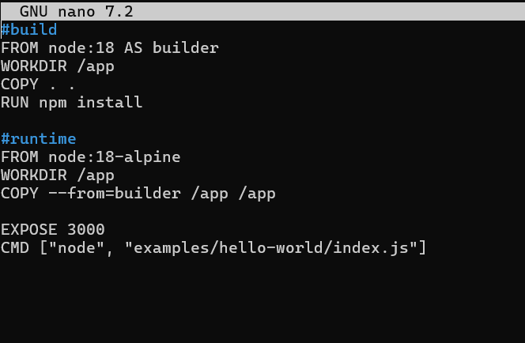

Obraz runtime nie zawiera narzędzi buildowych, kompilatora ani cache npm – jest mniejszy, bezpieczniejszy i szybszy do pobrania.

---

## 4. Ręczna weryfikacja obrazu (przed uruchomieniem pipeline)

Przed konfiguracją Jenkinsa zweryfikowano poprawność Dockerfile lokalnie:

```bash
docker build -t express-sm419482 .
```

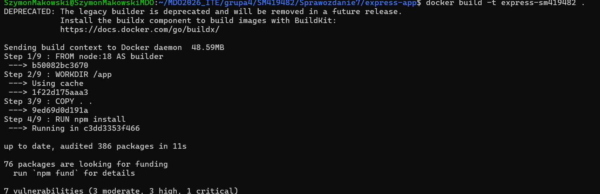


docker build wykonuje kolejne instrukcje Dockerfile i tworzy lokalny obraz o nazwie express-sm419482. Flaga -t (tag) nadaje mu nazwę.

```bash
docker run -d --name express -p 3000:3000 express-sm419482
```

Aplikacja odpowiedziała poprawnie – serwer Express działa.


```bash
docker stop express || true
docker rm express || true
```

|| true zapobiega błędowi jeśli kontener już nie istnieje.

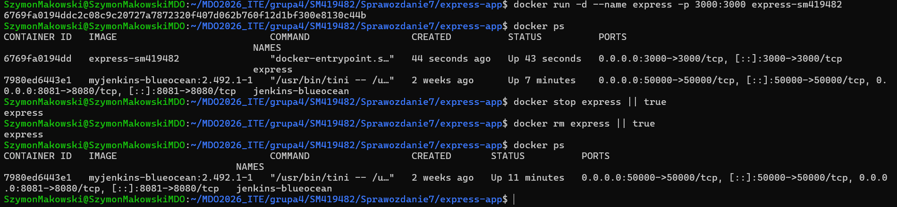

---

## 5. Jenkinsfile – deklaratywny pipeline

Jenkinsfile umieszczono w repozytorium (Sprawozdanie7/express-app/Jenkinsfile), dzięki czemu infrastruktura budowania staje się częścią kodu źródłowego.

```groovy
pipeline {
    agent any
    environment {
        VERSION        = "1.0.${env.BUILD_NUMBER}"
        REGISTRY       = "szymonmakow/express-app"
        CONTAINER_NAME = "express-container"
    }
    stages {
        stage('Clean') {
            steps {
                cleanWs()
            }
        }
        stage('Checkout') {
            steps {
                checkout scm
            }
        }
        stage('Build') {
            steps {
                script {
                    app = docker.build("${REGISTRY}:${VERSION}", "--no-cache grupa4/SM419482/Sprawozdanie7/express-app")
                }
            }
        }
        stage('Test') {
            steps {
                sh "docker run --rm --name express-test ${REGISTRY}:${VERSION} npm test -- --exit 2>&1 | tee test-results.txt || true"
            }
        }
        stage('Artifacts') {
            steps {
                archiveArtifacts artifacts: 'test-results.txt', fingerprint: true
            }
        }
        stage('Deploy') {
            steps {
                sh "docker rm -f ${CONTAINER_NAME} || true"
                sh "docker run -d --name ${CONTAINER_NAME} ${REGISTRY}:${VERSION}"
            }
        }
        stage('Smoke Test') {
            steps {
                sh '''
                for i in $(seq 1 10); do
                    docker exec express-container node -e \
                        "require('http').get('http://localhost:3000', r => { console.log('status:', r.statusCode); process.exit(r.statusCode < 500 ? 0 : 1)>
                        && exit 0
                    echo "czekanie na start aplikacji..."
                    sleep 2
                done
                echo "Smoke test FAILED"
                exit 1
                '''
            }
        }
        stage('Publish') {
            steps {
                script {
                    docker.withRegistry('https://index.docker.io/v1/', 'dockerhub-creds') {
                        app.push()
                        app.push('latest')
                    }
                }
                echo "opublikowano obraz: ${REGISTRY}:${VERSION}"
            }
        }
    }
    post {
        always {
            sh "docker rm -f ${CONTAINER_NAME} || true"
            sh "docker rmi ${REGISTRY}:${VERSION} || true"
        }
        success {
            echo "obraz gotowy do użycia: ${REGISTRY}:${VERSION}"
        }
        failure {
            echo "pipeline nie przeszedł poprawnie"
        }
    }
}
```

**Jenkinsfile – kluczowe elementy**

**Zmienne środowiskowe**
```groovy
VERSION  = "1.0.${env.BUILD_NUMBER}"  // unikalny tag dla każdego buildu
REGISTRY = "szymonmakow/express-app"  // rejestr Docker Hub
```

**Clean + Checkout**
```groovy
cleanWs()      // czyści workspace – gwarancja świeżego kodu przy każdym uruchomieniu
checkout scm   // pobiera kod z repozytorium zdefiniowanego w konfiguracji Jenkinsa
```

**Build**
```groovy
app = docker.build("${REGISTRY}:${VERSION}", "--no-cache grupa4/SM419482/Sprawozdanie7/express-app")
```
Buduje obraz Docker. --no-cache wymusza pobranie świeżych warstw przy każdym buildzie.

**Test**
```groovy
docker run --rm ... npm test -- --exit 2>&1 | tee test-results.txt || true
```
Uruchamia testy wewnątrz kontenera. --exit wymusza zakończenie procesu Mocha po testach (bez tego pipeline by się zawiesił). || true nie przerywa pipeline przy failującym teście.

**Artifacts**
```groovy
archiveArtifacts artifacts: 'test-results.txt', fingerprint: true
```
Dołącza wyniki testów do historii buildu w Jenkinsie.

**Deploy**
```groovy
docker rm -f ${CONTAINER_NAME} || true          // usuwa poprzedni kontener
docker run -d --name ${CONTAINER_NAME} ...      // uruchamia nowy kontener w tle (-d)
```

**Smoke Test**

Odpytuje aplikację wewnątrz kontenera przez docker exec zamiast przez localhost – konieczne w setupie DIND, gdzie kontener nie jest widoczny z poziomu Jenkinsa przez sieć.

**Publish**
```groovy
docker.withRegistry('https://index.docker.io/v1/', 'dockerhub-creds') {
    app.push()          // push z tagiem wersji np. 1.0.12
    app.push('latest')  // push z tagiem latest
}
```
Loguje się do Docker Hub przy użyciu credentials zapisanych w Jenkinsie (nie hardkodowane hasło).

**Post**
```groovy
always {
    docker rm -f ...   // usuwa kontener
    docker rmi ...     // usuwa lokalny obraz
}
```
Sprzątanie wykonywane zawsze – niezależnie od sukcesu lub porażki – zapewnia idempotentność przy kolejnym uruchomieniu.

---

## 6. Konfiguracja Jenkinsa

### Środowisko Jenkins

### Credentials

W Jenkins dodano dane logowania do Docker Hub:

* Kind: Username with password
* Username: szymonmakow
* Password: Access Token z Docker Hub (Read & Write)
* ID: dockerhub-creds

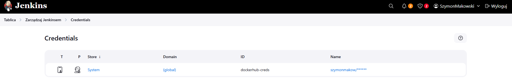

### Konfiguracja pipeline

* Definition: Pipeline script from SCM
* SCM: Git
* Repository URL: https://github.com/InzynieriaOprogramowaniaAGH/MDO2026_ITE
* Branch: */SM419482
* Script Path: grupa4/SM419482/Sprawozdanie7/express-app/Jenkinsfile

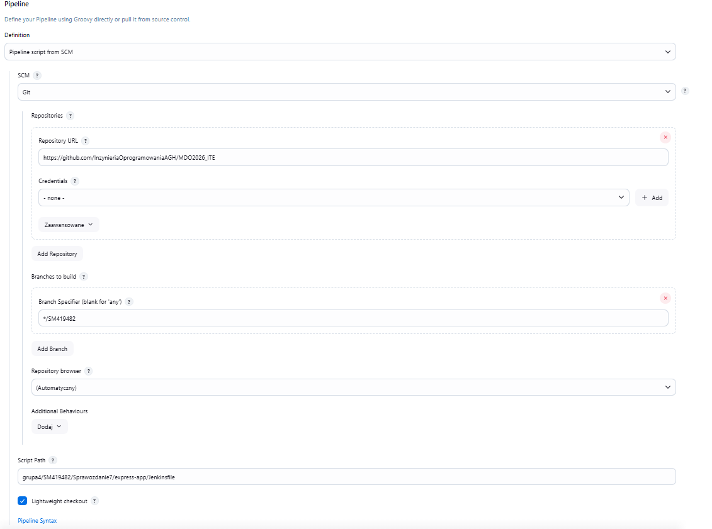

---

## 7. Wynik działania pipeline

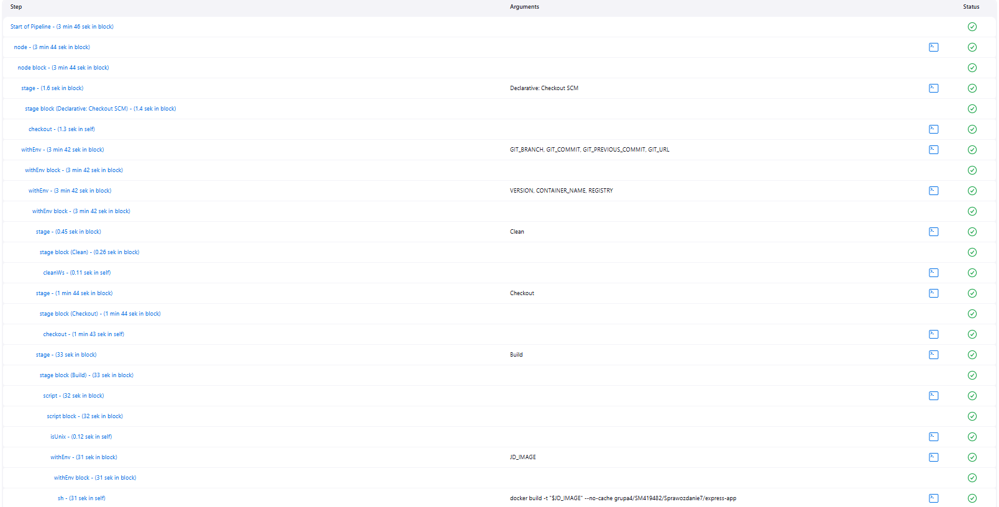
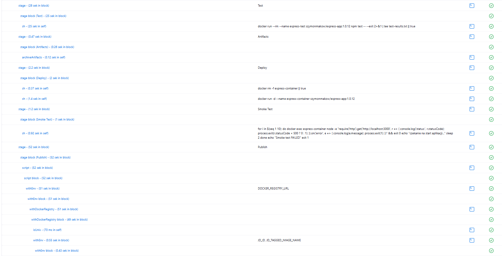
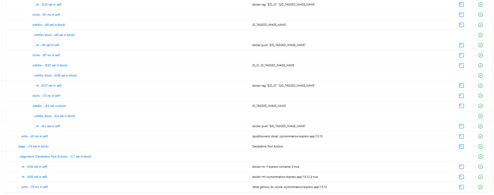

---

## 8. Publikacja na Docker Hub

Obraz został opublikowany w rejestrze Docker Hub i jest dostępny publicznie:

```bash
docker pull szymonmakow/express-app:latest
docker run -d -p 3000:3000 szymonmakow/express-app:latest
```

---

## 9. Definition of Done – weryfikacja procesu CI/CD

### Czy obraz może być pobrany z rejestru i uruchomiony bez modyfikacji?

Tak. Obraz szymonmakow/express-app:latest opublikowany na Docker Hub można pobrać i uruchomić na dowolnej maszynie z Dockerem:

```bash
docker pull szymonmakow/express-app:latest
docker run -d -p 3000:3000 szymonmakow/express-app:latest
```

Nie wymaga żadnych modyfikacji – wszystkie zależności (node_modules) są wbudowane w obraz na etapie RUN npm install w Dockerfile.

### Czy artefakt z pipeline działa na innej maszynie?

Tak. Obraz jest samowystarczalny i zawiera:

* środowisko uruchomieniowe Node.js 18 (Alpine)
* kod źródłowy aplikacji Express
* wszystkie zainstalowane zależności npm
* skonfigurowany entrypoint (CMD)

Dzięki temu może zostać uruchomiony na dowolnej maszynie spełniającej jedyne wymaganie: zainstalowany Docker.

### Wniosek

Proces CI/CD spełnia wszystkie założenia:

* Jenkinsfile żyje w repozytorium – infrastruktura jest częścią kodu
* Pipeline działa idempotentnie – każde uruchomienie zaczyna od czystego stanu
* Tworzy artefakt wdrożeniowy (obraz Docker) dostępny w publicznym rejestrze
* Automatyzuje cały proces od pobrania kodu do publikacji obrazu

---