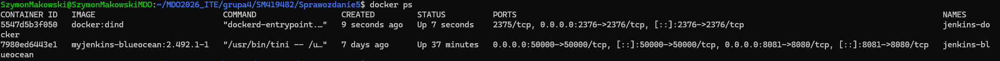
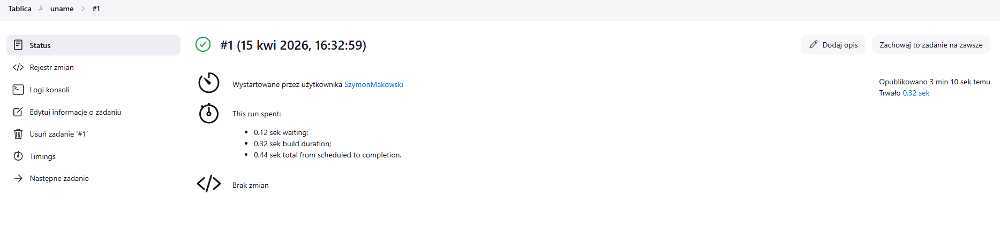
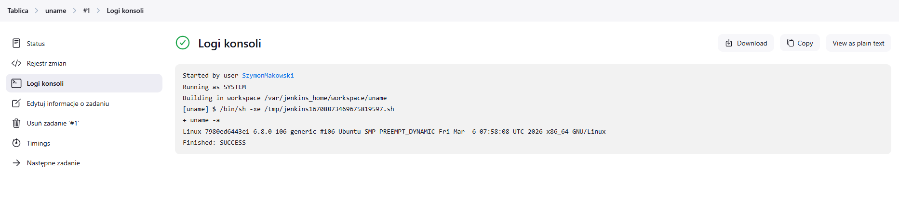
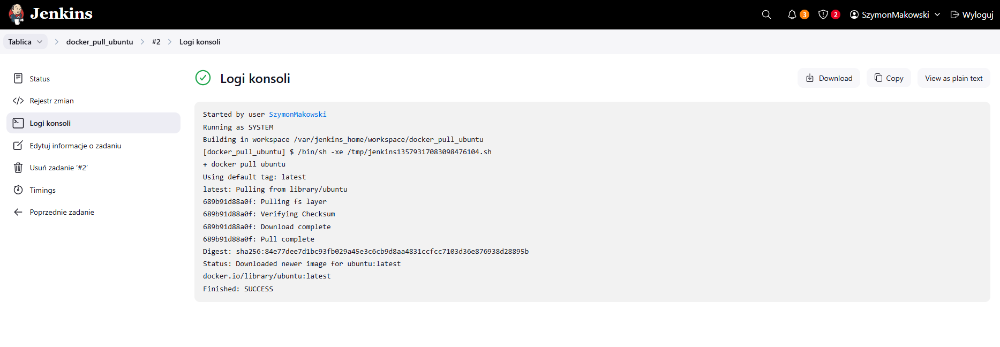
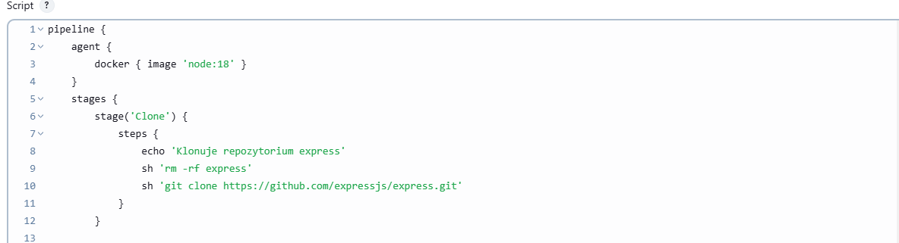
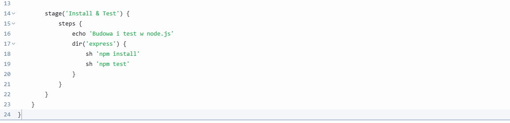
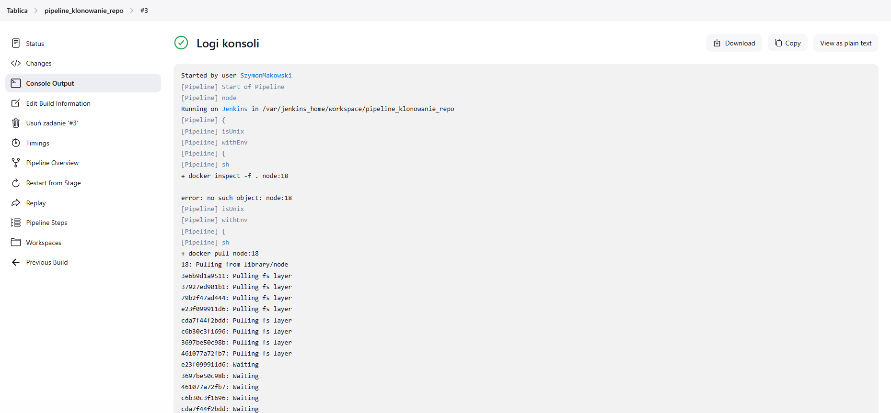
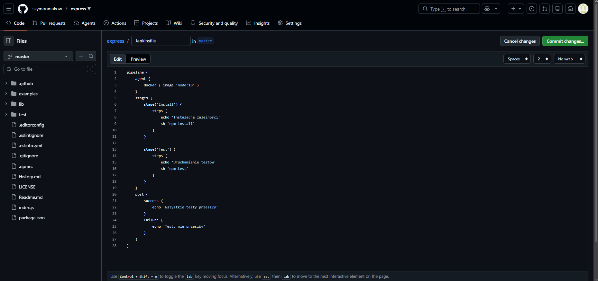

# Sprawozdanie 5 - Szymon Makowski ITE

## Środowisko pracy
- Host: Windows 11
- Maszyna wirtualna: Ubuntu 24.04 LTS (VirtualBox)
- Połączenie: SSH z PowerShell/VS Code Remote SSH
- Użytkownik VM: SzymonMakowski (bez root)
- Kontener Jenkins

## 1. Jenkins z DIND

### Dockerfile Jenkinsa

### Uruchomienie DIND i Jenkinsa
```bash
docker network create jenkins

docker run --name jenkins-docker --rm --detach --privileged --network jenkins --network-alias docker --env DOCKER_TLS_CERTDIR=/certs --volume jenkins-docker-certs:/certs/client --volume jenkins-data:/var/jenkins_home --publish 2376:2376 docker:dind --storage-driver overlay2

docker build -t myjenkins-blueocean:2.492.1-1 .

docker run --name jenkins-blueocean --restart=on-failure --detach --network jenkins --env DOCKER_HOST=tcp://docker:2376 --env DOCKER_CERT_PATH=/certs/client --env DOCKER_TLS_VERIFY=1 --volume jenkins-data:/var/jenkins_home --volume jenkins-docker-certs:/certs/client:ro --publish 8081:8080 --publish 50000:50000 myjenkins-blueocean:2.492.1-1
```

### Działające kontenery
```bash
docker ps
```


### Ekran logowania Jenkins
Hasło inicjalizacyjne pobrano z logów:
```bash
docker logs jenkins-blueocean
```
Hasło: `a7a2088dc10448a8aee11f91b3e69d4e`


Następnie utworzono użytkownika i zalogowano się na konto.


---

## 2. Projekty wstępne

### 2.1 Projekt wyświetlający uname

Utworzono projekt, który w kroku Execute shell wykonuje polecenie:

```bash
uname -a
```

Projekt zakończył się sukcesem, wyświetlając informacje o systemie operacyjnym agenta.




### 2.2 Projekt zwracający błąd przy nieparzystej godzinie

Utworzono projekt, który sprawdza aktualną godzinę i zwraca błąd, gdy jest nieparzysta:

```bash
HOUR=$(date +%H)

if [ $((HOUR % 2)) -ne 0 ]; then
  echo "Godzina nieparzysta - BŁĄD"
  exit 1
else
  echo "Godzina parzysta - OK"
fi
```


### 2.3 Pobieranie obrazu kontenera Ubuntu

Utworzono projekt wykonujący polecenie:

```bash
docker pull ubuntu
```

Obraz został pobrany poprawnie, co potwierdziło dostępność Dockera na agencie.



---

## 3. Pipeline w UI Jenkinsa





---

## 4. Pipeline Jenkinsfile w repozytorium (SCM)
### Kroki

1. Sforkowano repozytorium [expressjs/express](https://github.com/expressjs/express) na własne konto GitHub.
2. W głównym katalogu repo utworzono plik Jenkinsfile z treścią pipeline.
3. W Jenkinsie utworzono nowy obiekt typu Pipeline z konfiguracją:
   - Definition: Pipeline script from SCM
   - SCM: Git
   - Repository URL: https://github.com/szymonmakow/express.git
   - Branch: */master
   - Script Path: Jenkinsfile

### Jenkinsfile


