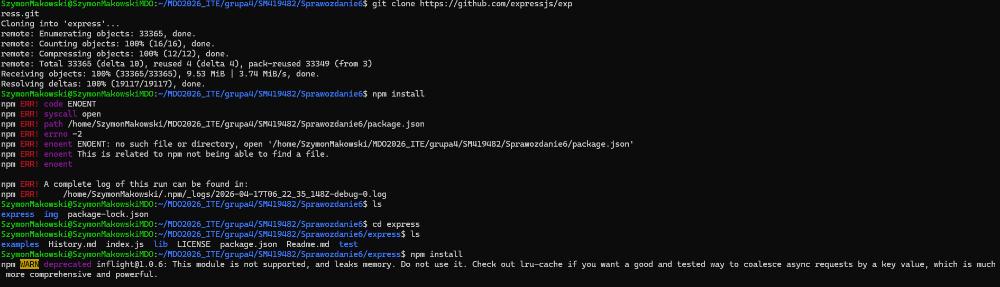
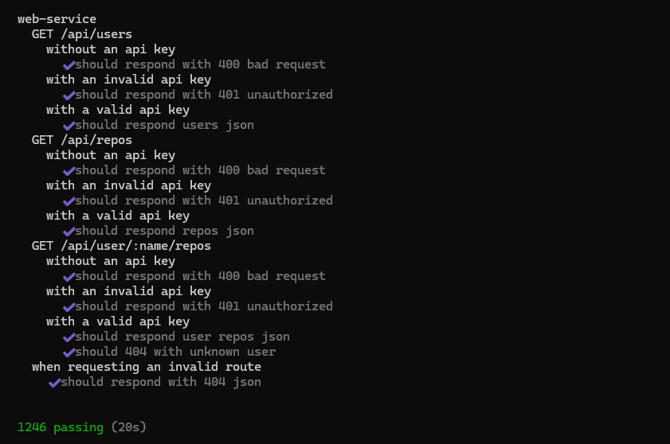
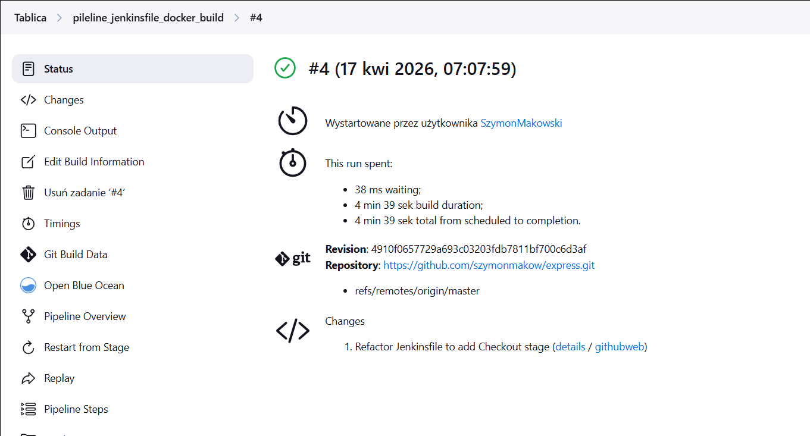
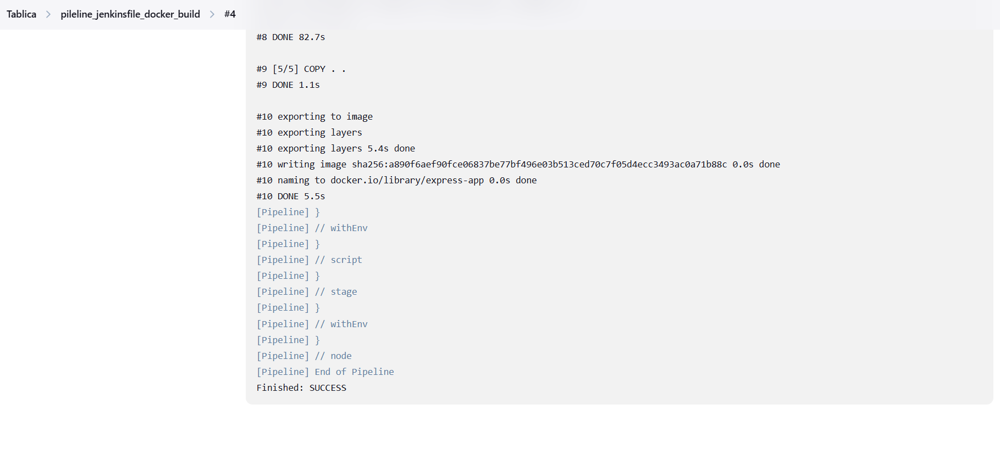
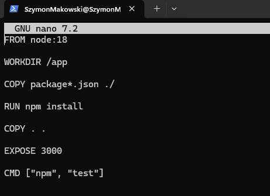
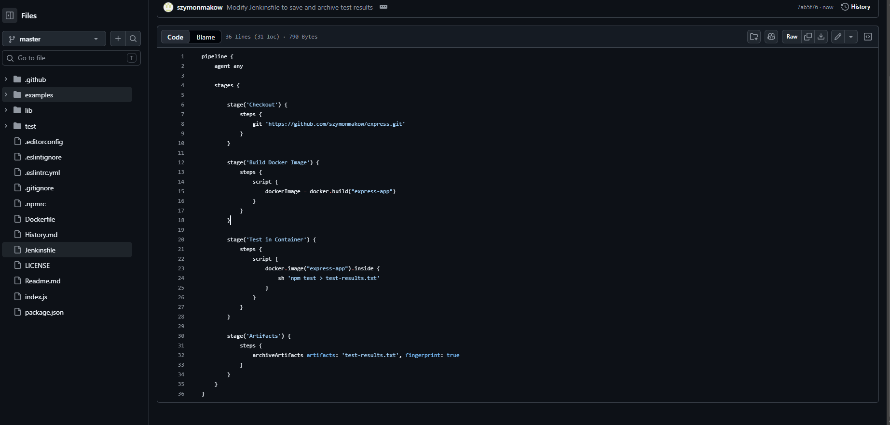
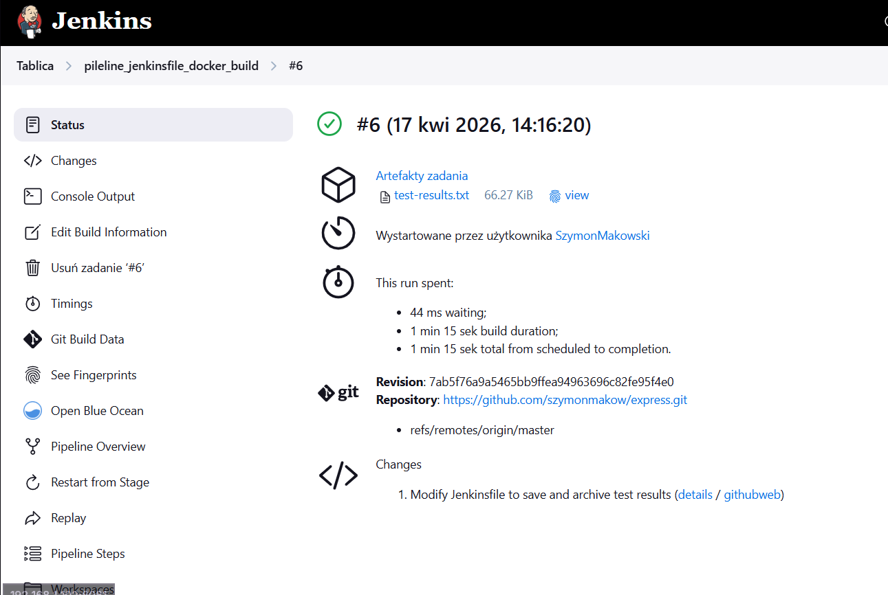
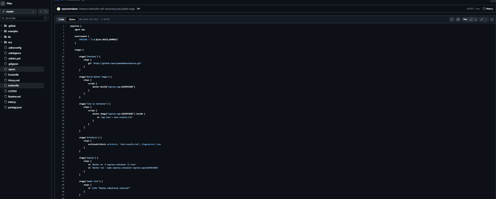

# Sprawozdanie 6 - Szymon Makowski ITE

## Środowisko pracy
- Host: Windows 11
- Maszyna wirtualna: Ubuntu 24.04 LTS (VirtualBox)
- Połączenie: SSH z PowerShell/VS Code Remote SSH
- Użytkownik VM: SzymonMakowski (bez root)
- Kontener Jenkins

## 1. Wprowadzenie

Celem zadania było zaprojektowanie oraz implementacja pipeline CI/CD z wykorzystaniem narzędzia Jenkins oraz konteneryzacji Docker. Pipeline obejmuje pełny proces od pobrania kodu źródłowego, przez budowę i testowanie, aż po wdrożenie oraz publikację artefaktu.

---

## 2. Opis aplikacji

Wybraną aplikacją jest biblioteka Express, dostępna publicznie na platformie GitHub. Zrobiono forka tego repozytorium na osobiste konto
na GitHubie https://github.com/szymonmakow/express



Projekt stanowi bibliotekę dla frameworka Node.js, służącą do budowy aplikacji webowych.

### Licencja

Projekt objęty jest licencją open-source (MIT), co pozwala na jego swobodne wykorzystanie w celach edukacyjnych.

### Uruchomienie lokalne

```bash
npm install
npm test
```

Testy przechodzą poprawnie, co potwierdza poprawność działania aplikacji.



---

## 3. Ścieżka krytyczna pipeline

Pipeline realizuje następujące etapy:

* Commit / manual trigger
* Clone
* Build
* Test
* Deploy
* Publish

Diagram procesu CI/CD


---

## 4. Architektura pipeline

Pipeline został zaimplementowany w Jenkinsie jako zadanie typu Pipeline (Pipeline from SCM). Kod pipeline znajduje się w pliku Jenkinsfile w repozytorium.

Każdy etap pipeline realizowany jest w kontenerze Docker, co zapewnia izolację środowiska oraz powtarzalność procesu.





---

## 5. Konteneryzacja

### Wybór obrazu bazowego

Do budowy aplikacji wykorzystano obraz Node:18. Obraz zawiera środowisko Node.js oraz wszystkie narzędzia niezbędne do instalacji zależności i uruchomienia aplikacji.

---

## 6. Build

Proces budowy realizowany jest przy użyciu Dockerfile:




---

## 7. Test

Testy wykonywane są w osobnym etapie pipeline, w kontenerze utworzonym na podstawie obrazu build:

```groovy
docker.image("express-app:${VERSION}").inside {
    sh 'npm test > test-results.txt'
}
```
Oddzielenie etapu testowania od budowania zapewnia modularność oraz zgodność z podejściem CI/CD.


---

## 8. Artefakty

Artefaktem pipeline jest plik test-results.txt. Zawiera on wyniki testów i jest archiwizowany przez Jenkins:

```groovy
archiveArtifacts artifacts: 'test-results.txt', fingerprint: true
```

### Identyfikacja artefaktu

Każdy artefakt jest powiązany z numerem builda Jenkins, co pozwala na jednoznaczną identyfikację jego pochodzenia.





---

## 9. Deploy

Etap deploy polega na uruchomieniu kontenera Docker:

```bash
docker run --name express-container express-app:${VERSION}
```

Ponieważ projekt Express jest biblioteką, a nie aplikacją serwerową, deploy polega na wykonaniu kontenera i testów jako formy weryfikacji działania.


## 9.1. Smoke test

Weryfikacja poprawności działania odbywa się poprzez:

* poprawne wykonanie kontenera
* wcześniejsze przejście testów




---

## 11. Publish

Artefaktem końcowym jest obraz Docker express-app:${VERSION}


### Wersjonowanie

Zastosowano wersjonowanie 1.0.${BUILD_NUMBER}. Zapewnia to unikalność każdej wersji.

### Publikacja

Artefakt:

* dostępny lokalnie w Jenkins (Docker image)
* możliwy do publikacji w Docker Hub


---

## 12. Jenkinsfile

```groovy
pipeline {
    agent any

    environment {
        VERSION = "1.0.${env.BUILD_NUMBER}"
    }

    stages {

        stage('Checkout') {
            steps {
                git 'https://github.com/szymonmakow/express.git'
            }
        }

        stage('Build Docker Image') {
            steps {
                script {
                    docker.build("express-app:${VERSION}")
                }
            }
        }

        stage('Test in Container') {
            steps {
                script {
                    docker.image("express-app:${VERSION}").inside {
                        sh 'npm test > test-results.txt'
                    }
                }
            }
        }

        stage('Artifacts') {
            steps {
                archiveArtifacts artifacts: 'test-results.txt', fingerprint: true
            }
        }

        stage('Deploy') {
            steps {
                sh 'docker rm -f express-container || true'
                sh 'docker run --name express-container express-app:${VERSION}'
            }
        }

        stage('Smoke Test') {
            steps {
                sh 'echo "Deploy zakończony sukcesem"'
            }
        }

        stage('Publish') {
            steps {
                sh 'docker images'
                sh 'echo "Image version: ${VERSION}"'
            }
        }
    }
}
```


