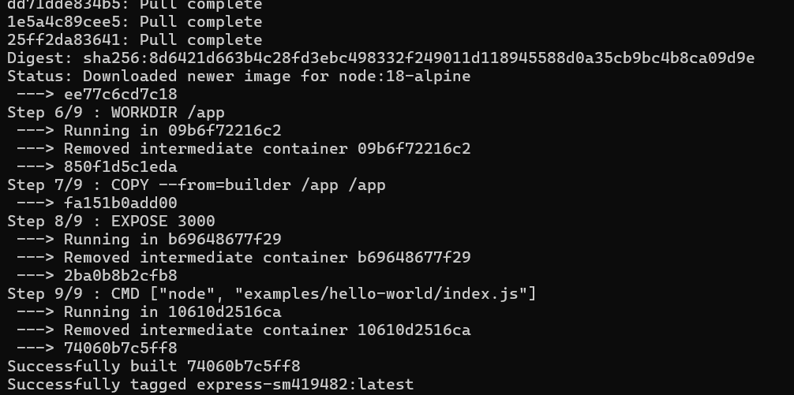
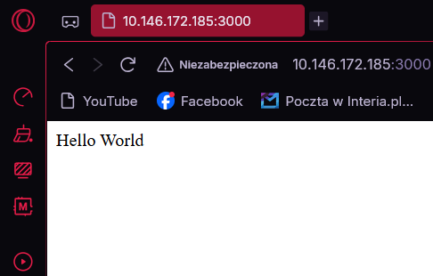

# Sprawozdanie 7 – Szymon Makowski ITE
## CI/CD: Jenkins + Docker (pipeline automatyzujący build, test, deploy i publish)

---

## Środowisko pracy

* Host: Windows 11
* Maszyna wirtualna: Ubuntu 24.04 LTS (VirtualBox)
* Połączenie: SSH z PowerShell / VS Code Remote SSH
* Użytkownik VM: SzymonMakowski (bez root)
* Repozytorium aplikacji: fork expressjs/express

---

## 1. Cel ćwiczenia

Celem ćwiczenia było:

* Przygotowanie aplikacji Express do uruchomienia w kontenerze Docker
* Stworzenie deklaratywnego pipeline CI/CD w Jenkinsie (Jenkinsfile w repozytorium)
* Automatyzacja procesu: build - test - deploy - publish
* Opublikowanie gotowego obrazu Docker na Docker Hub

---

## 2. Przygotowanie aplikacji

Aplikacja Express (sforkowana w poprzednich zajęciach) została skopiowana do katalogu sprawozdania:

```bash
cp -r ../Sprawozdanie6/express/* Sprawozdanie7/express-app/
```

Katalog express-app/ zawiera pełny kod źródłowy biblioteki Express wraz z testami i przykładami, w tym examples/hello-world/index.js – gotowy serwer HTTP, który posłuży jako entrypoint kontenera.

---

## 3. Dockerfile – budowa obrazu

Stworzono wieloetapowy (multi-stage) Dockerfile, który rozdziela środowisko budowania od środowiska uruchomieniowego:

```dockerfile
#build
FROM node:18 AS builder
WORKDIR /app
COPY . .
RUN npm install

#runtime
FROM node:18-alpine
WORKDIR /app
COPY --from=builder /app /app

EXPOSE 3000
CMD ["node", "examples/hello-world/index.js"]
```


Obraz runtime nie zawiera narzędzi buildowych, kompilatora ani cache npm – jest mniejszy, bezpieczniejszy i szybszy do pobrania.

---

## 4. Ręczna weryfikacja obrazu (przed uruchomieniem pipeline)

Przed konfiguracją Jenkinsa zweryfikowano poprawność Dockerfile lokalnie:

```bash
docker build -t express-sm419482 .
```




docker build wykonuje kolejne instrukcje Dockerfile i tworzy lokalny obraz o nazwie express-sm419482. Flaga -t (tag) nadaje mu nazwę.

```bash
docker run -d --name express -p 3000:3000 express-sm419482
```

Aplikacja odpowiedziała poprawnie – serwer Express działa.



```bash
docker stop express || true
docker rm express || true
```

|| true zapobiega błędowi jeśli kontener już nie istnieje.


---

## 5. Jenkinsfile – deklaratywny pipeline

Jenkinsfile umieszczono w repozytorium (Sprawozdanie7/express-app/Jenkinsfile), dzięki czemu infrastruktura budowania staje się częścią kodu źródłowego.

```groovy
pipeline {
    agent any
    environment {
        VERSION        = "1.0.${env.BUILD_NUMBER}"
        REGISTRY       = "szymonmakow/express-app"
        CONTAINER_NAME = "express-container"
    }
    stages {
        stage('Clean') {
            steps {
                cleanWs()
            }
        }
        stage('Checkout') {
            steps {
                checkout scm
            }
        }
        stage('Build') {
            steps {
                script {
                    app = docker.build("${REGISTRY}:${VERSION}", "--no-cache grupa4/SM419482/Sprawozdanie7/express-app")
                }
            }
        }
        stage('Test') {
            steps {
                sh "docker run --rm --name express-test ${REGISTRY}:${VERSION} npm test -- --exit 2>&1 | tee test-results.txt || true"
            }
        }
        stage('Artifacts') {
            steps {
                archiveArtifacts artifacts: 'test-results.txt', fingerprint: true
            }
        }
        stage('Deploy') {
            steps {
                sh "docker rm -f ${CONTAINER_NAME} || true"
                sh "docker run -d --name ${CONTAINER_NAME} ${REGISTRY}:${VERSION}"
            }
        }
        stage('Smoke Test') {
            steps {
                sh '''
                for i in $(seq 1 10); do
                    docker exec express-container node -e \
                        "require('http').get('http://localhost:3000', r => { console.log('status:', r.statusCode); process.exit(r.statusCode < 500 ? 0 : 1)>
                        && exit 0
                    echo "czekanie na start aplikacji..."
                    sleep 2
                done
                echo "Smoke test FAILED"
                exit 1
                '''
            }
        }
        stage('Publish') {
            steps {
                script {
                    docker.withRegistry('https://index.docker.io/v1/', 'dockerhub-creds') {
                        app.push()
                        app.push('latest')
                    }
                }
                echo "opublikowano obraz: ${REGISTRY}:${VERSION}"
            }
        }
    }
    post {
        always {
            sh "docker rm -f ${CONTAINER_NAME} || true"
            sh "docker rmi ${REGISTRY}:${VERSION} || true"
        }
        success {
            echo "obraz gotowy do użycia: ${REGISTRY}:${VERSION}"
        }
        failure {
            echo "pipeline nie przeszedł poprawnie"
        }
    }
}
```

**Jenkinsfile – kluczowe elementy**

**Zmienne środowiskowe**
```groovy
VERSION  = "1.0.${env.BUILD_NUMBER}"  // unikalny tag dla każdego buildu
REGISTRY = "szymonmakow/express-app"  // rejestr Docker Hub
```

**Clean + Checkout**
```groovy
cleanWs()      // czyści workspace – gwarancja świeżego kodu przy każdym uruchomieniu
checkout scm   // pobiera kod z repozytorium zdefiniowanego w konfiguracji Jenkinsa
```

**Build**
```groovy
app = docker.build("${REGISTRY}:${VERSION}", "--no-cache grupa4/SM419482/Sprawozdanie7/express-app")
```
Buduje obraz Docker. --no-cache wymusza pobranie świeżych warstw przy każdym buildzie.

**Test**
```groovy
docker run --rm ... npm test -- --exit 2>&1 | tee test-results.txt || true
```
Uruchamia testy wewnątrz kontenera. --exit wymusza zakończenie procesu Mocha po testach (bez tego pipeline by się zawiesił). || true nie przerywa pipeline przy failującym teście.

**Artifacts**
```groovy
archiveArtifacts artifacts: 'test-results.txt', fingerprint: true
```
Dołącza wyniki testów do historii buildu w Jenkinsie.

**Deploy**
```groovy
docker rm -f ${CONTAINER_NAME} || true          // usuwa poprzedni kontener
docker run -d --name ${CONTAINER_NAME} ...      // uruchamia nowy kontener w tle (-d)
```

**Smoke Test**

Odpytuje aplikację wewnątrz kontenera przez docker exec zamiast przez localhost – konieczne w setupie DIND, gdzie kontener nie jest widoczny z poziomu Jenkinsa przez sieć.

**Publish**
```groovy
docker.withRegistry('https://index.docker.io/v1/', 'dockerhub-creds') {
    app.push()          // push z tagiem wersji np. 1.0.12
    app.push('latest')  // push z tagiem latest
}
```
Loguje się do Docker Hub przy użyciu credentials zapisanych w Jenkinsie (nie hardkodowane hasło).

**Post**
```groovy
always {
    docker rm -f ...   // usuwa kontener
    docker rmi ...     // usuwa lokalny obraz
}
```
Sprzątanie wykonywane zawsze – niezależnie od sukcesu lub porażki – zapewnia idempotentność przy kolejnym uruchomieniu.

---

## 6. Konfiguracja Jenkinsa

### Środowisko Jenkins

### Credentials

W Jenkins dodano dane logowania do Docker Hub:

* Kind: Username with password
* Username: szymonmakow
* Password: Access Token z Docker Hub (Read & Write)
* ID: dockerhub-creds


### Konfiguracja pipeline

* Definition: Pipeline script from SCM
* SCM: Git
* Repository URL: https://github.com/InzynieriaOprogramowaniaAGH/MDO2026_ITE
* Branch: */SM419482
* Script Path: grupa4/SM419482/Sprawozdanie7/express-app/Jenkinsfile


---

## 7. Wynik działania pipeline


---

## 8. Publikacja na Docker Hub

Obraz został opublikowany w rejestrze Docker Hub i jest dostępny publicznie:

```bash
docker pull szymonmakow/express-app:latest
docker run -d -p 3000:3000 szymonmakow/express-app:latest
```

---

## 9. Definition of Done – weryfikacja procesu CI/CD

### Czy obraz może być pobrany z rejestru i uruchomiony bez modyfikacji?

Tak. Obraz szymonmakow/express-app:latest opublikowany na Docker Hub można pobrać i uruchomić na dowolnej maszynie z Dockerem:

```bash
docker pull szymonmakow/express-app:latest
docker run -d -p 3000:3000 szymonmakow/express-app:latest
```

Nie wymaga żadnych modyfikacji – wszystkie zależności (node_modules) są wbudowane w obraz na etapie RUN npm install w Dockerfile.

### Czy artefakt z pipeline działa na innej maszynie?

Tak. Obraz jest samowystarczalny i zawiera:

* środowisko uruchomieniowe Node.js 18 (Alpine)
* kod źródłowy aplikacji Express
* wszystkie zainstalowane zależności npm
* skonfigurowany entrypoint (CMD)

Dzięki temu może zostać uruchomiony na dowolnej maszynie spełniającej jedyne wymaganie: zainstalowany Docker.

### Wniosek

Proces CI/CD spełnia wszystkie założenia:

* Jenkinsfile żyje w repozytorium – infrastruktura jest częścią kodu
* Pipeline działa idempotentnie – każde uruchomienie zaczyna od czystego stanu
* Tworzy artefakt wdrożeniowy (obraz Docker) dostępny w publicznym rejestrze
* Automatyzuje cały proces od pobrania kodu do publikacji obrazu

---

## Historia poleceń

```bash
cp -r ../Sprawozdanie6/express/* Sprawozdanie7/express-app/
docker build -t express-sm419482 .
docker run -d --name express -p 3000:3000 express-sm419482
docker stop express || true
docker rm express || true
docker run --name jenkins-docker --rm --detach \ --privileged --network jenkins --network-alias docker \ --env DOCKER_TLS_CERTDIR=/certs \ --volume jenkins-docker-certs:/certs/client \ --volume jenkins-data:/var/jenkins_home \ --publish 2376:2376 \ docker:dind --storage-driver overlay2
docker exec jenkins-blueocean docker info
docker exec jenkins-docker docker ps
```