# Sprawozdanie zbiorcze 8-12 Szymon Makowski ITE


# Sprawozdanie 8 - Ansible

---

## Środowisko pracy

* Host: Windows 11
* Maszyna wirtualna: Ubuntu 24.04 LTS (VirtualBox)
* Połączenie: SSH z PowerShell / VS Code Remote SSH
* Użytkownik VM: SzymonMakowski (bez root)
* Aplikacja: kontener Docker `szymonmakow/express-app` (Express.js)
* Główna VM: ansible-controller, 192.168.1.103 — host zarządzający
* Druga VM: ansible-target, 192.168.1.104 — węzeł docelowy

---

## Cel ćwiczenia

Celem ćwiczenia było zapoznanie się z narzędziem Ansible do automatyzacji zarządzania infrastrukturą. Ćwiczenie obejmowało konfigurację dwóch maszyn wirtualnych, inwentaryzację hostów, zdalne wywoływanie procedur za pomocą playbooków oraz wdrożenie aplikacji przy użyciu roli Ansible.

---

## 1. Przygotowanie maszyny ansible-target

Maszyna docelowa została sklonowana z maszyny głównej w VirtualBoxie, a następnie oczyszczona z niepotrzebnych pakietów i artefaktów po klonowaniu — w tym kluczy hosta SSH, machine-id oraz plików projektowych. Hostname ustawiono poleceniem `hostnamectl set-hostname ansible-target`, co pozwala na jednoznaczną identyfikację maszyny w sieci bez polegania na adresach IP.

```bash
sudo hostnamectl set-hostname ansible-target
sudo apt install -y tar
sudo apt install -y openssh-server
sudo systemctl enable ssh
sudo systemctl start ssh
```

Utworzono użytkownika ansible, który będzie używany przez Ansible do łączenia się z maszyną docelową:

```bash
sudo adduser ansible
sudo usermod -aG sudo ansible
```

## Instalacja Ansible na maszynie głównej

Ansible zainstalowano z repozytorium dystrybucji Ubuntu. Jest to najprostsza metoda instalacji zapewniająca stabilną wersję przetestowaną pod kątem zgodności z systemem operacyjnym.

```bash
sudo apt update
sudo apt install -y ansible
ansible --version
```

---

## Wymiana kluczy SSH

Aby Ansible mógł łączyć się z maszyną docelową bez podawania hasła, wygenerowano parę kluczy RSA na maszynie głównej i skopiowano klucz publiczny do użytkownika ansible na ansible-target. Mechanizm `ssh-copy-id` automatycznie dodaje klucz do pliku `~/.ssh/authorized_keys` na maszynie docelowej.

```bash
ssh-keygen -t rsa -b 4096 -C "glowny klucz ansible" -f ~/.ssh/id_rsa -N ""
ssh-copy-id ansible@192.168.1.104
ssh ansible@ansible-target
```

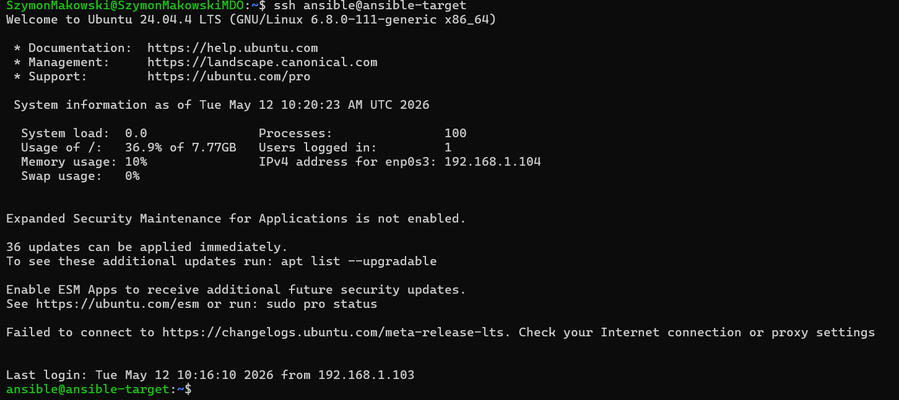

---

## 2. Inwentaryzacja

### Konfiguracja DNS w /etc/hosts

Zamiast używać adresów IP, dodano wpisy do pliku `/etc/hosts` na obu maszynach, umożliwiając wywoływanie hostów po nazwach. Jest to najprostsze rozwiązanie dla środowiska laboratoryjnego, niewymagające konfiguracji serwera DNS.

```bash
echo "192.168.1.103   ansible-controller" | sudo tee -a /etc/hosts
echo "192.168.1.104   ansible-target" | sudo tee -a /etc/hosts
```

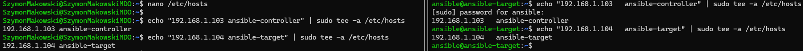
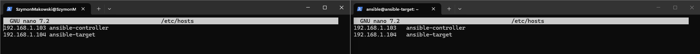

Weryfikacja łączności:

```bash
ping -c 2 ansible-controller
ping -c 2 ansible-target
```

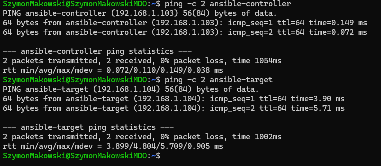

### Plik inwentaryzacji

Plik `inventory.ini` definiuje dwie sekcje: Orchestrators zawierającą maszynę główną oraz Endpoints zawierającą maszynę docelową. Sekcja Orchestrators używa `ansible_connection=local`, co oznacza że Ansible nie łączy się przez SSH lecz wykonuje zadania lokalnie.

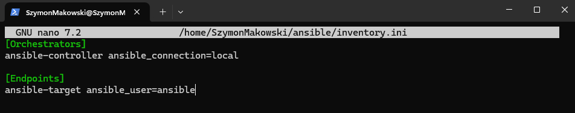

### Ansible ping do wszystkich maszyn

Moduł `ansible.builtin.ping` weryfikuje, że Ansible może połączyć się z hostem i wykonać na nim kod Python.

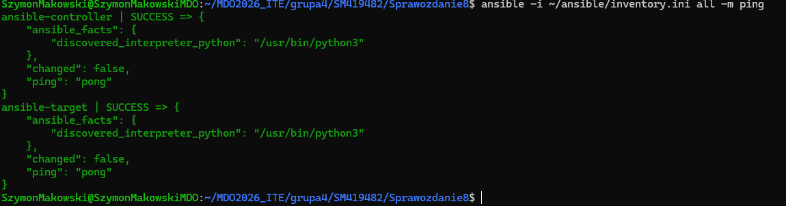

---

## 3. Zdalne wywoływanie procedur — playbooki

Plik `ansible.cfg` wskazuje domyślną ścieżkę do ról i pliku inwentaryzacji, dzięki czemu nie trzeba podawać tych parametrów przy każdym wywołaniu:

```ini
[defaults]
roles_path = ./roles
inventory = ./inventory.ini
```

### Playbook ping.yml

Playbook wysyła żądanie ping do wszystkich hostów zdefiniowanych w inwentaryzacji. Różnica względem modułu ad-hoc polega na tym, że playbook jest plikiem YAML przechowywanym w repozytorium — stanowi dokumentację i można go uruchamiać wielokrotnie.

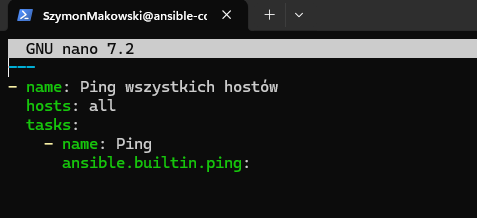

```bash
ansible-playbook -i inventory.ini ./playbooks/ping.yml
```

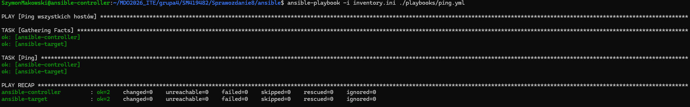

### Playbook copy_inventory.yml — idempotentność

Playbook kopiuje plik inwentaryzacji na maszynę docelową. Kluczową obserwacją jest idempotentność — przy pierwszym uruchomieniu Ansible raportuje `changed=1` (plik został skopiowany), przy drugim `changed=0` (plik już istnieje i jest identyczny, więc nie ma potrzeby działania).

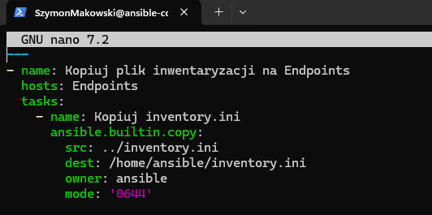

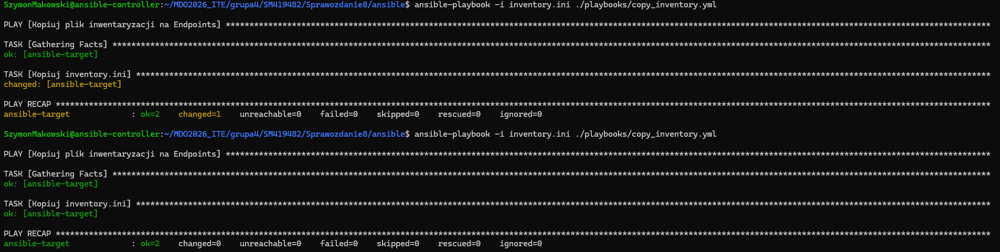

### Playbook update.yml — aktualizacja pakietów

Playbook aktualizuje pakiety na maszynie docelowej. Użyto flagi `force_apt_get: true` jako obejście znanego błędu w Ansible dotyczącego modułu apt z opcją upgrade.

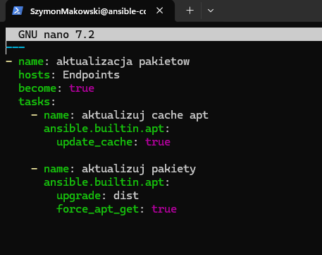

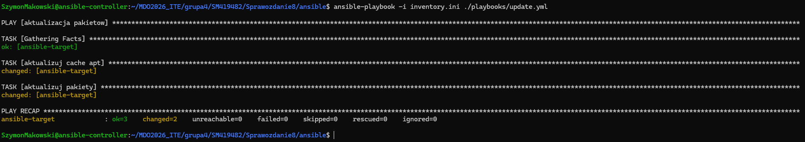

### Playbook restart_service.yml — restart usług

Playbook restartuje usługi sshd i rngd. Usługa rngd (generator liczb losowych) nie jest zainstalowana na minimalnym Ubuntu — użycie `ignore_errors: true` sprawia, że Ansible raportuje błąd jako ignored, zamiast przerywać wykonanie playbooka.

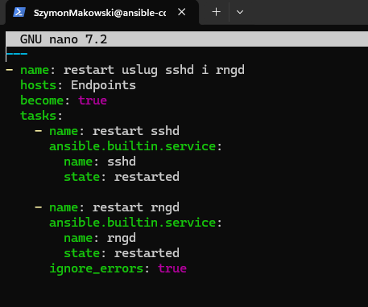

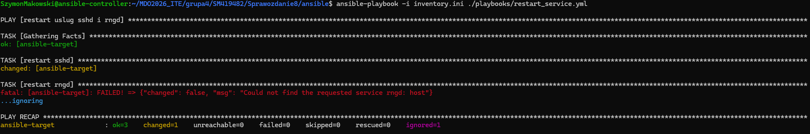

### Operacje przy wyłączonym SSH

Aby zademonstrować zachowanie Ansible, gdy host jest nieosiągalny, zatrzymano usługę SSH na ansible-target. Ansible domyślnie używa mechanizmu SSH ControlMaster (multiplexing połączeń), który utrzymuje otwarte połączenie w tle — dlatego do pełnego zablokowania dostępu należy zatrzymać zarówno `ssh.service`, jak i `ssh.socket`.

```bash
ssh ansible@ansible-target "sudo systemctl stop ssh.socket ssh.service"

ansible-playbook -i inventory.ini ./playbooks/ping.yml \
  -e "ansible_ssh_common_args='-o ControlMaster=no -o ControlPath=none'"
```

Ansible raportuje status UNREACHABLE dla niedostępnego hosta i kontynuuje wykonanie dla pozostałych hostów.

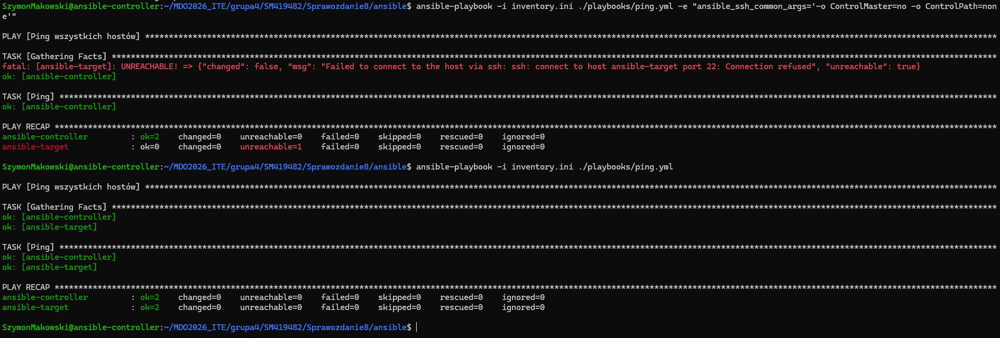

---

## 4. Zarządzanie artefaktem — rola Ansible

### Inicjalizacja roli

Rolę zainicjowano narzędziem `ansible-galaxy`, które tworzy standardową strukturę katalogów.

```bash
ansible-galaxy role init roles/express_app
```

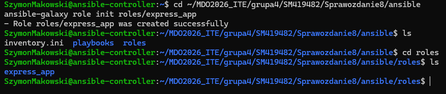

### meta/main.yml

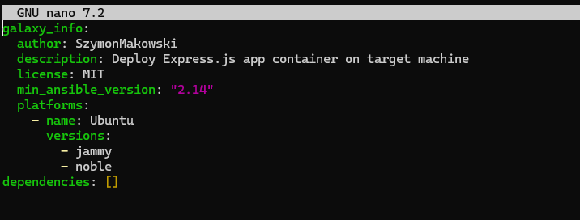

### tasks/main.yml — opis kroków

Rola realizuje następujące etapy:

1. **Sanity check** — sprawdzenie, czy Docker jest już zainstalowany. Wynik zapisywany jest w zmiennej `docker_check`, a kolejne kroki instalacji są warunkowo pomijane (`when: docker_check.failed`).

2. **Instalacja Dockera** — jeśli Docker nie istnieje, Ansible instaluje zależności, dodaje klucz GPG i repozytorium Docker, a następnie instaluje pakiety docker-ce. Użytkownik ansible jest dodawany do grupy docker, aby mógł zarządzać kontenerami bez sudo.

3. **Deploy** — pobierany jest obraz `szymonmakow/express-app` z Docker Hub i uruchamiany kontener z przekierowaniem portu 3000:3000.

4. **Weryfikacja** — Ansible czeka na dostępność portu 3000 (`wait_for`), a następnie wysyła żądanie HTTP do aplikacji (`uri`). Odpowiedź Hello World potwierdza poprawne uruchomienie kontenera.

5. **Cleanup** — kontener jest zatrzymywany i usuwany wraz z obrazem, przywracając maszynę docelową do stanu sprzed wdrożenia.

```yaml
---
# tasks file for roles/express_app
- name: sprawdzenie czy Docker jest zainstalowany
  ansible.builtin.command: docker --version
  register: docker_check
  ignore_errors: true

- name: zainstalowanie zaleznosci Dockera
  ansible.builtin.apt:
    name:
      - apt-transport-https
      - ca-certificates
      - curl
      - gnupg
    state: present
    update_cache: true
  become: true
  when: docker_check.failed

- name: dodanie klucza GPG Docker
  ansible.builtin.shell: |
    curl -fsSL https://download.docker.com/linux/ubuntu/gpg | gpg --dearmor -o /etc/apt/keyrings/docker.gpg
  become: true
  when: docker_check.failed

- name: dodanie repozytorium Docker
  ansible.builtin.shell: |
    echo "deb [arch=amd64 signed-by=/etc/apt/keyrings/docker.gpg] https://download.docker.com/linux/ubuntu noble stable" > /etc/apt/sources.list.d/docker.list
  become: true
  when: docker_check.failed

- name: zainstalowanie Dockera
  ansible.builtin.apt:
    name:
      - docker-ce
      - docker-ce-cli
      - containerd.io
    state: present
    update_cache: true
  become: true
  when: docker_check.failed

- name: uruchomienie i wlaczenie Dockera
  ansible.builtin.service:
    name: docker
    state: started
    enabled: true
  become: true

- name: dodanie użytkownika ansible do grupy docker
  ansible.builtin.user:
    name: ansible
    groups: docker
    append: true
  become: true

# Deploy
- name: pobranie obrazu z Docker Hub
  community.docker.docker_image:
    name: szymonmakow/express-app
    source: pull
  become: true

- name: uruchomienie kontenera
  community.docker.docker_container:
    name: express-app
    image: szymonmakow/express-app
    state: started
    ports:
      - "3000:3000"
  become: true
  register: container_info

# Weryfikacja
- name: czekanie na start aplikacji
  ansible.builtin.wait_for:
    port: 3000
    delay: 3
    timeout: 30

- name: sprawdzenie lacznosci z kontenerem
  ansible.builtin.uri:
    url: http://localhost:3000
    return_content: true
  register: app_response

- name: wyswietlenie odpowiedzi aplikacji
  ansible.builtin.debug:
    var: app_response.content

# Cleanup
- name: zatrzymanie kontenera
  community.docker.docker_container:
    name: express-app
    state: stopped
  become: true

- name: usuwanie kontenera
  community.docker.docker_container:
    name: express-app
    state: absent
  become: true

- name: usuwanie obrazu
  community.docker.docker_image:
    name: szymonmakow/express-app
    state: absent
  become: true
```

### Wyniki uruchomienia playbooka deploy.yml

Playbook deploy.yml:

```yaml
---
- name: Deploy Express App
  hosts: Endpoints
  roles:
    - express_app
```

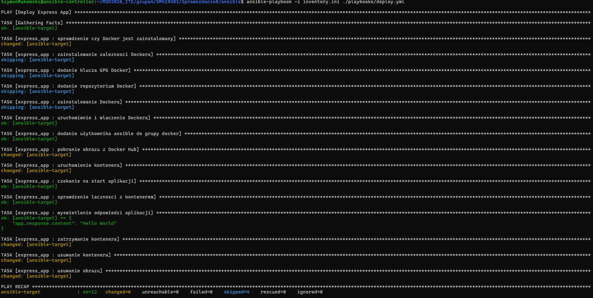

---

# Sprawozdanie 9 - Pliki odpowiedzi dla wdrożeń nienadzorowanych

---

## Środowisko pracy

* Host: Windows 11
* Maszyna wirtualna: Fedora 43 Server Edition (DVD ISO) (VirtualBox)
* Połączenie: SSH z PowerShell / VS Code Remote SSH
* Aplikacja: kontener Docker `szymonmakow/express-app:latest` (Express.js)

---

## Cel ćwiczenia

Celem ćwiczenia było przygotowanie źródła instalacji nienadzorowanej systemu operacyjnego Fedora z wykorzystaniem pliku odpowiedzi (Kickstart), który automatyzuje cały proces instalacji oraz uruchamia oprogramowanie zbudowane w ramach poprzednich laboratoriów (kontener Docker z aplikacją Express.js).

---

## 1. Pierwsza instalacja Fedory (ręczna)

Pierwszym krokiem było pobranie obrazu ISO systemu Fedora 43 Server Edition. Wybrano wariant Server DVD, który zawiera wszystkie pakiety na płycie — nie wymaga pobierania ich podczas instalacji. Utworzono nową maszynę wirtualną w VirtualBox.

Przeprowadzono standardową instalację graficzną przez instalator Anaconda. Po zakończeniu instalacji i uruchomieniu systemu zalogowano się i pobrano automatycznie wygenerowany plik odpowiedzi:

```bash
cat /root/anaconda-ks.cfg
```

Plik ten zawiera kompletną konfigurację przeprowadzonej instalacji i stanowi punkt wyjścia do przygotowania instalacji nienadzorowanej.

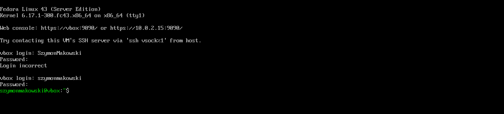

---

## 2. Analiza i modyfikacja pliku anaconda-ks.cfg

Oryginalny plik odpowiedzi wymagał następujących modyfikacji:

1. Tryb instalacji — zmieniono na `text` (instalacja tekstowa, bez GUI)
2. Akceptacja EULA — dodano `eula --agreed` (automatyczna akceptacja bez pytania)
3. Czyszczenie dysku — dodano `clearpart --all --initlabel` (gwarantuje formatowanie całego dysku, nawet jeśli nie jest pusty)
4. Hostname — ustawiono `szymon-devops-host` zamiast domyślnego localhost
5. Sieć — `--onboot=on` zapewnia włączenie karty sieciowej przy starcie
6. Hasła — ustawiono w trybie plaintext dla uproszczenia środowiska testowego
7. Sekcja `%post` — dodano instalację Dockera i konfigurację serwisu systemd dla kontenera
8. Automatyczny restart — dyrektywa `reboot` na końcu pliku

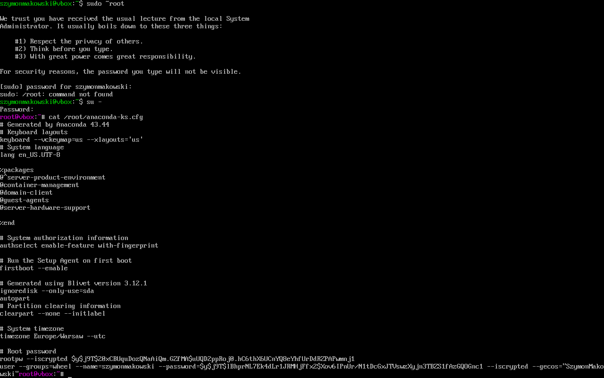

---

## 3. Przygotowany plik odpowiedzi (fedora-ks.cfg)

```kickstart
#version=DEVEL

#instalacja tekstowa
text

eula --agreed

cdrom

#lokalizacja
keyboard --xlayouts='pl'
lang pl_PL.UTF-8
timezone Europe/Warsaw --utc

#siec
network --bootproto=dhcp --device=enp0s3 --onboot=on --ipv6=auto
network --hostname=szymon-devops-host

#dyski
clearpart --all --initlabel
#automatyczne partycjonowanie
autopart
ignoredisk --only-use=sda

#bootloader
bootloader --append="rhgb quiet" --location=mbr

#security
selinux --disabled
firewall --disabled

#hasla
rootpw --plaintext root123
user --groups=wheel --name=szymon --password=szymon123 --plaintext --gecos="Szymon Makowski"

#pakiety
%packages
#minimalne srodowisko serwerowe
@^server-product-environment
#narzedzia sieciowe
curl
wget
%end

#po instalacji
%post --log=/root/ks-post.log

echo "=== START SEKCJI POST ==="

dnf install -y dnf-plugins-core
dnf config-manager addrepo --from-repofile=https://download.docker.com/linux/fedora/docker-ce.repo
dnf install -y docker-ce docker-ce-cli containerd.io docker-buildx-plugin docker-compose-plugin

systemctl enable docker
usermod -aG docker szymon

cat > /etc/systemd/system/express-app.service << 'EOF'
[Unit]
Description=Express App Container
After=docker.service
Requires=docker.service

[Service]
Type=oneshot
RemainAfterExit=yes
ExecStartPre=-/usr/bin/docker stop express-app
ExecStartPre=-/usr/bin/docker rm express-app
ExecStartPre=-/usr/bin/docker pull szymonmakow/express-app:latest
ExecStart=/usr/bin/docker run -d \
    --name express-app \
    -p 3000:3000 \
    szymonmakow/express-app:latest
ExecStop=/usr/bin/docker stop express-app

[Install]
WantedBy=multi-user.target
EOF

systemctl enable express-app.service

echo "=== KONIEC SEKCJI POST ==="

%end

reboot
```

### Kluczowe decyzje projektowe

- `clearpart --all` — zapewnia, że instalacja powiedzie się nawet jeśli dysk nie jest pusty
- Docker instalowany w `%post` — nie można używać `docker run` ani `systemctl start docker` podczas instalacji systemu
- `systemctl enable` zamiast `systemctl start` — rejestruje serwisy do uruchomienia przy pierwszym starcie systemu
- Znak `-` przed `ExecStartPre` — oznacza, że błąd polecenia jest ignorowany (np. gdy kontener jeszcze nie istnieje przy pierwszym uruchomieniu)

---

## 4. Udostępnienie pliku KS przez HTTP

Aby instalator mógł pobrać plik odpowiedzi, uruchomiono prosty serwer HTTP na komputerze Windows w folderze z plikiem:

```powershell
python -m http.server 8081 --bind 0.0.0.0
```

Poprawność działania serwera zweryfikowano, wykonując zapytanie z maszyny wirtualnej Fedory:

```bash
curl http://10.0.2.2:8081/fedora-ks.cfg
```

Serwer zwrócił poprawną zawartość pliku, co potwierdziły logi w PowerShell.

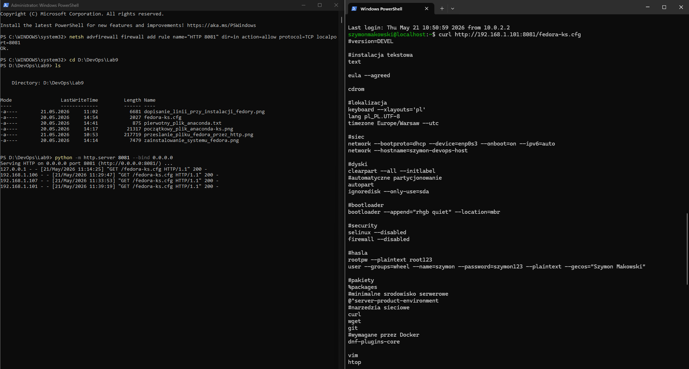

---

## 5. Instalacja nienadzorowana

Utworzono nową, czystą maszynę wirtualną. Podłączono ten sam obraz ISO Fedory 43. Po uruchomieniu VM, w menu GRUB zaznaczono opcję "Install Fedora 43" i naciśnięto klawisz `e`, aby edytować parametry rozruchu.

Na końcu linii zaczynającej się od `linux` dopisano parametr wskazujący lokalizację pliku odpowiedzi:

```
inst.ks=http://192.168.1.101:8081/fedora-ks.cfg
```

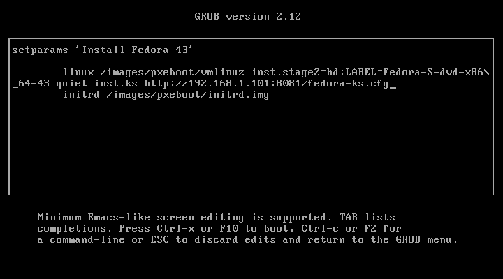

Następnie naciśnięto Ctrl+X, aby uruchomić instalację. Anaconda automatycznie pobrała plik KS i przeprowadziła instalację bez żadnej interakcji użytkownika.

Instalator kolejno wykonał:
- skonfigurowanie urządzeń do przechowywania danych,
- tworzenie partycji (`clearpart --all`, `autopart`),
- instalację pakietów z DVD,
- tworzenie użytkowników,
- wykonanie skryptów `%post` (instalacja Dockera, konfiguracja serwisów),
- automatyczny restart systemu.


---

## 6. Weryfikacja po instalacji

Po uruchomieniu systemu zalogowano się i zweryfikowano poprawność instalacji.

### Sprawdzenie hostname

```bash
hostname
```

Wynik: `szymon-devops-host` — zgodnie z konfiguracją w pliku KS.

### Sprawdzenie statusu Dockera

```bash
docker --version
systemctl status docker
```

Docker uruchomił się automatycznie przy starcie systemu ze statusem active (running).

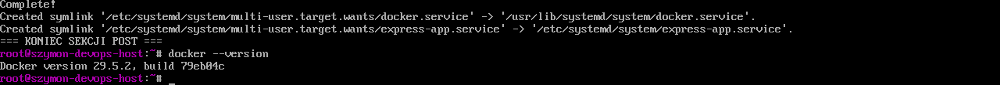
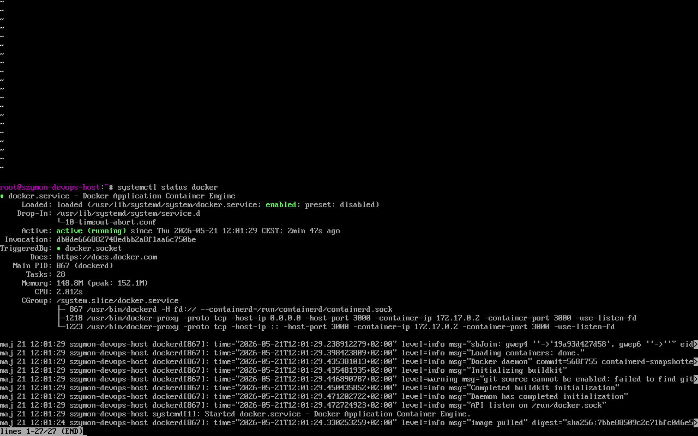

### Sprawdzenie statusu serwisu kontenera

```bash
systemctl status express-app
```

Serwis express-app uruchomił się automatycznie, pobrał obraz z Docker Hub i uruchomił kontener.

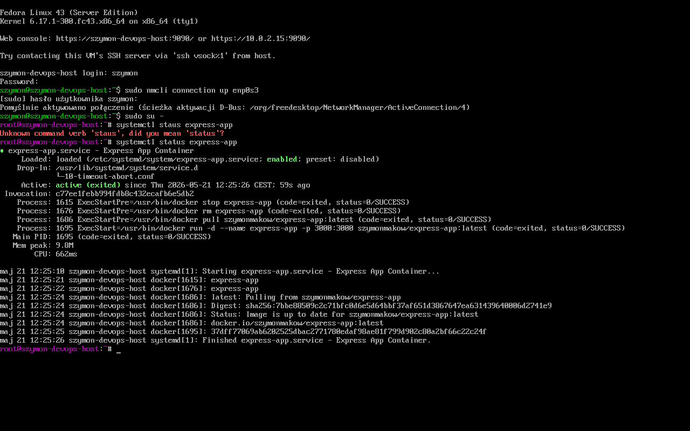

### Sprawdzenie działającego kontenera

```bash
docker ps
```

Kontener express-app widoczny jako działający, nasłuchujący na porcie 3000.

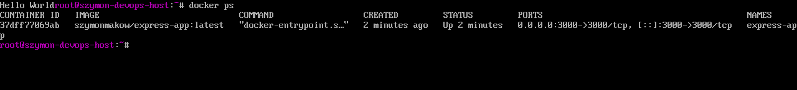

### Weryfikacja odpowiedzi aplikacji

```bash
curl http://localhost:3000
```

Aplikacja Express.js odpowiedziała poprawnie, potwierdzając że serwis działa od razu po uruchomieniu systemu.

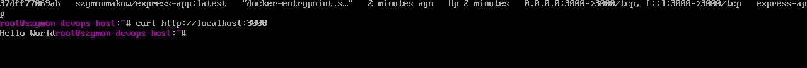

---

## Podsumowanie

Przeprowadzono pełną instalację nienadzorowaną systemu Fedora 43 z wykorzystaniem pliku odpowiedzi Kickstart. System po pierwszym uruchomieniu automatycznie:

- uruchamia usługę Docker,
- pobiera obraz kontenera `szymonmakow/express-app:latest` z Docker Hub,
- uruchamia kontener z aplikacją Express.js na porcie 3000.

Kluczowym aspektem zadania było zrozumienie ograniczeń środowiska instalatora — polecenia `docker run` oraz `systemctl start` nie działają podczas fazy `%post`, ponieważ system nie jest jeszcze w pełni uruchomiony. Rozwiązaniem jest użycie `systemctl enable`, które rejestruje serwisy do automatycznego uruchomienia po pierwszym starcie systemu.

---

# Sprawozdanie 10 — Wdrażanie na zarządzalne kontenery: Kubernetes 1

---

## Środowisko pracy

- Host: Windows 11
- Maszyna wirtualna: Ubuntu 24.04 LTS (VirtualBox)
- Połączenie: SSH z PowerShell / VS Code Remote SSH
- Obraz aplikacji: `szymonmakow/express-app:latest` (Express.js, Node.js)
- Kubernetes: minikube v1.38.1, kubectl v1.35.5, driver: Docker

---

## Cel ćwiczenia

Celem laboratorium było zapoznanie się z lokalnym stosem Kubernetes przy użyciu minikube, uruchomienie aplikacji skonteneryzowanej jako pod, obsługa Kubernetes Dashboard oraz przygotowanie deklaratywnego pliku wdrożenia YAML z wieloma replikami.

---

## 1. Instalacja klastra Kubernetes

### Wymagania sprzętowe

Minikube wymaga minimalnie 2 CPU, 2 GB RAM oraz 20 GB miejsca na dysku. Zasoby maszyny zweryfikowano poleceniami:

```bash
free -h
nproc
docker --version
docker ps
```

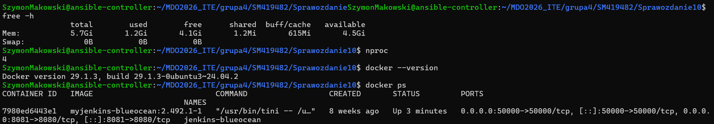

Wymagania sprzętowe zostały spełnione z zapasem — maszyna dysponuje 4 CPU i 5.7 GiB RAM. Minikube domyślnie alokuje 2 CPU i 3072 MB RAM na kontener Docker, co widać w logach uruchamiania.

### Instalacja minikube

Pobrano binarny plik minikube z oficjalnego repozytorium projektu i zainstalowano go jako polecenie systemowe:

```bash
curl -LO https://storage.googleapis.com/minikube/releases/latest/minikube-linux-amd64
sudo install minikube-linux-amd64 /usr/local/bin/minikube
minikube version
```

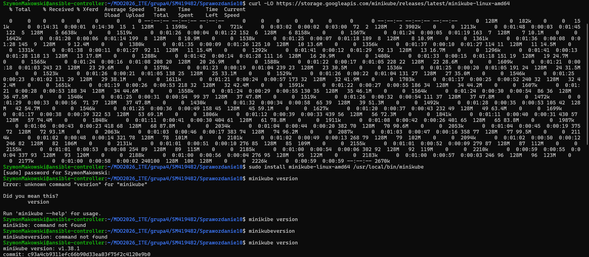

Poziom bezpieczeństwa instalacji: binarka pobrana bezpośrednio ze storage.googleapis.com — oficjalnego repozytorium projektu.

### Polecenie kubectl i alias minikubctl

Na maszynie dostępny był już natywny kubectl w wersji v1.35.5. Zgodnie z wymaganiami instrukcji zdefiniowano alias minikubctl wskazujący na kubectl wbudowany w minikube:

```bash
kubectl version --client
# Client Version: v1.35.5

alias minikubctl="minikube kubectl --"
```

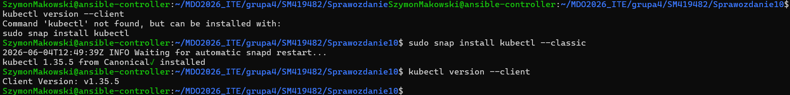

### Uruchomienie klastra

Klaster uruchomiono z driverem Docker. Minikube tworzy dedykowany kontener Docker działający jako węzeł Kubernetes:

```bash
minikube start --driver=docker
```

Pełny log uruchamiania:

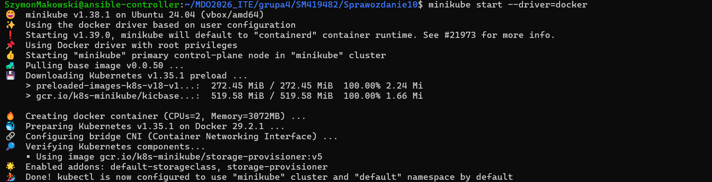

Węzeł minikube jest jednocześnie control-plane i worker node — typowe dla single-node klastra lokalnego. Status Ready potwierdza poprawne uruchomienie.

### Działające pody systemowe

```bash
kubectl get pods -A
```

```
NAMESPACE     NAME                               READY   STATUS    RESTARTS        AGE
kube-system   coredns-7d764666f9-qt5ch           1/1     Running   0               4m17s
kube-system   etcd-minikube                      1/1     Running   0               5m51s
kube-system   kube-apiserver-minikube            1/1     Running   0               5m51s
kube-system   kube-controller-manager-minikube   1/1     Running   2 (5m18s ago)   5m51s
kube-system   kube-proxy-rwzxb                   1/1     Running   0               4m18s
kube-system   kube-scheduler-minikube            1/1     Running   0               5m51s
kube-system   storage-provisioner                1/1     Running   1 (2m39s ago)   3m51s
```

---

## 2. Uruchomienie Kubernetes Dashboard

### Uruchomienie proxy dashboardu

Dashboard uruchomiono w trybie `--url` — bez automatycznego otwierania przeglądarki, ponieważ VM nie posiada środowiska graficznego:

```bash
minikube dashboard --url
```

Minikube automatycznie zainstalował komponenty dashboardu i uruchomił proxy.

Wygenerowany URL:

```
http://127.0.0.1:40777/api/v1/namespaces/kubernetes-dashboard/services/http:kubernetes-dashboard:/proxy/
```

Weryfikacja podów dashboardu w osobnym terminalu:

```bash
kubectl get pods -n kubernetes-dashboard
```

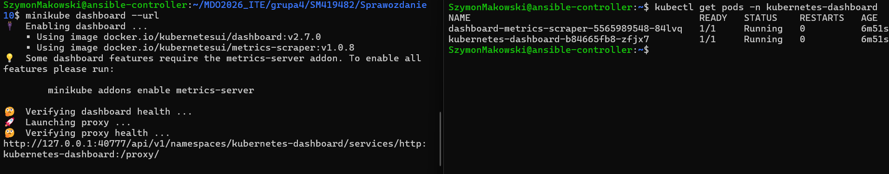

### Dostęp z hosta — tunel SSH

Aby uzyskać dostęp z przeglądarki na hoście Windows, wykonano tunel SSH z przekierowaniem portu:

```powershell
ssh -L 40777:127.0.0.1:40777 SzymonMakowski@192.168.1.104
```

Następnie w przeglądarce na hoście otwarto:

```
http://127.0.0.1:40777/api/v1/namespaces/kubernetes-dashboard/services/http:kubernetes-dashboard:/proxy/
```

Dashboard został pomyślnie otwarty — interfejs pokazuje namespace default. Połączenie przez tunel SSH zapewnia bezpieczny dostęp bez eksponowania dashboardu na zewnątrz VM.

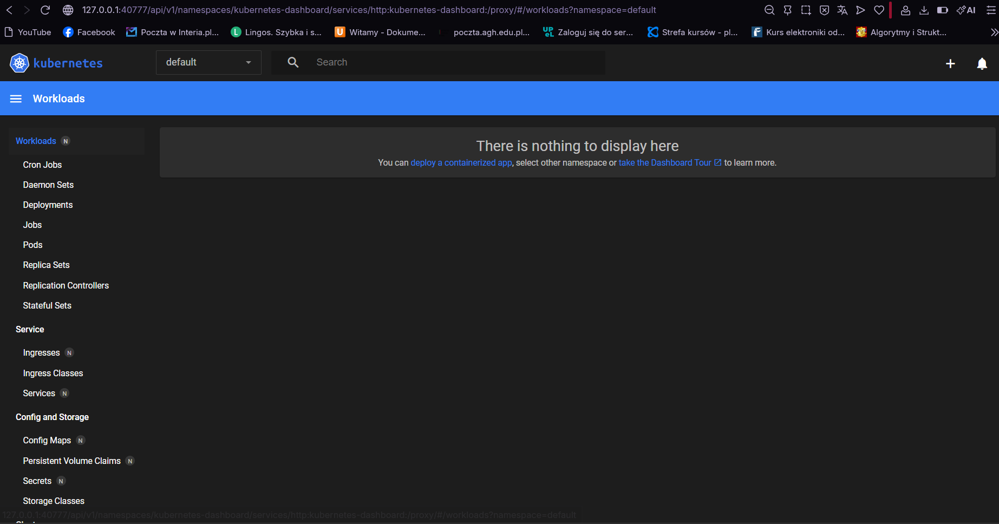

---

## 3. Analiza posiadanego kontenera

### Wybrany obraz Docker

Do wdrożenia wybrano obraz `szymonmakow/express-app`, zbudowany i opublikowany w ramach jednych z poprzednich zajęć. Obraz zawiera aplikację Node.js/Express.js nasłuchującą na porcie 3000.

Weryfikacja działania kontenera (lokalnie, przed wdrożeniem na k8s):

```bash
docker run -d -p 3000:3000 szymonmakow/express-app
curl http://localhost:3000
# Hello World
```

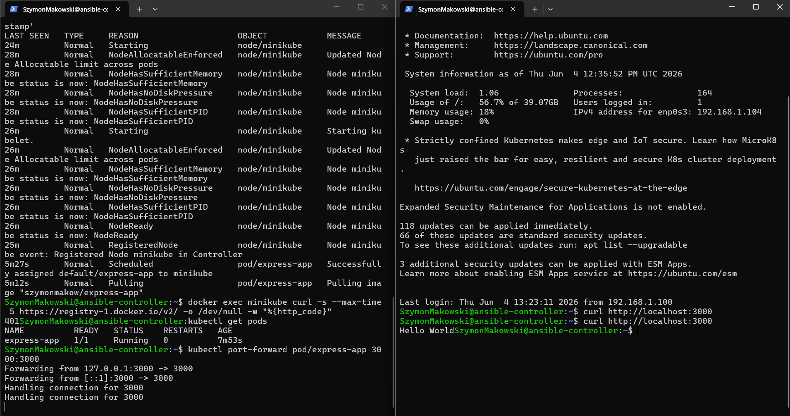

Aplikacja wystawia interfejs funkcjonalny przez sieć na porcie 3000, co czyni ją odpowiednim kandydatem do wdrożenia w klastrze Kubernetes.

---

## 4. Uruchamianie oprogramowania na k8s

### Uruchomienie poda

Uruchomiono pojedynczy pod z aplikacją `express-app`:

```bash
minikube kubectl -- run express-app --image=szymonmakow/express-app --port=3000 --labels app=express-app
```

```
pod/express-app created
```

Polecenie `kubectl run` tworzy pojedynczy pod bez nadrzędnego Deployment/ReplicaSet. Kontener zostaje automatycznie opakowany w pod przez warstwę abstrakcji Kubernetes.

### Weryfikacja poda via kubectl

Po pobraniu obrazu z Docker Hub (pobieranie zajęło kilka minut — minikube działa w izolowanym kontenerze bez cache'u):

```bash
kubectl get pods
```

```
NAME          READY   STATUS    RESTARTS   AGE
express-app   1/1     Running   0          7m53s
```

Status 1/1 Running oznacza, że jeden z jednego zdefiniowanych kontenerów działa poprawnie. RESTARTS=0 wskazuje na brak awarii.

Szczegółowy opis poda:

```bash
kubectl describe pod express-app
```

```
Name:             express-app
Namespace:        default
Node:             minikube/192.168.49.2
Labels:           app=express-app
Status:           Running
Containers:
  express-app:
    Image:          szymonmakow/express-app
    Port:           3000/TCP
    State:          Running
```

### Weryfikacja poda via Dashboard

Dashboard potwierdził działanie poda:

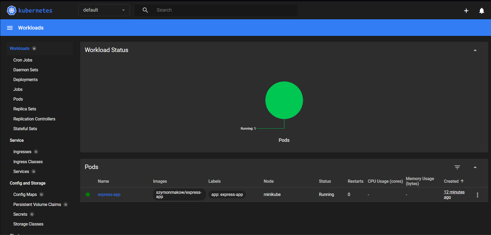

### Wyprowadzenie portu i weryfikacja komunikacji

Port poda wyprowadzono na localhost VM za pomocą `kubectl port-forward`:

```bash
kubectl port-forward pod/express-app 3000:3000
```

Polecenie mapuje port 3000 z localhost VM bezpośrednio na port 3000 kontenera wewnątrz poda (tunel bez pośrednictwa Service). W osobnym terminalu zweryfikowano komunikację:

```bash
curl http://localhost:3000
```

```
Hello World
```

Aplikacja odpowiedziała poprawnie. Port-forward jest narzędziem do debugowania — w produkcji ruch kieruje się przez Service.

---

## 5. Przekucie wdrożenia manualnego w plik YAML

### Plik wdrożenia nginx-deployment.yml

Przygotowano plik YAML definiujący Deployment nginx z 4 replikami:

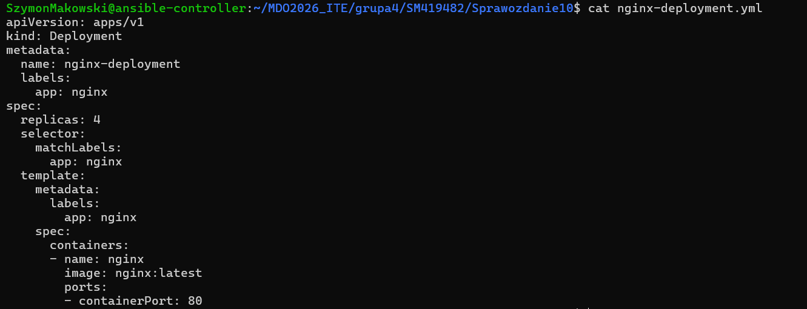

Kluczowe elementy pliku:
- `replicas: 4` — Kubernetes utrzymuje dokładnie 4 działające pody,
- `selector.matchLabels` — łączy Deployment z podami przez etykietę `app: nginx`,
- `template` — szablon każdego poda: obraz `nginx:latest`, port 80.

### Wdrożenie za pomocą kubectl apply

Plik wdrożono deklaratywnie:

```bash
kubectl apply -f nginx-deployment.yml
```

```
deployment.apps/nginx-deployment created
```

`kubectl apply` jest idempotentne — ponowne wywołanie na tym samym pliku zaktualizuje istniejący zasób zamiast zgłaszać błąd. Jest to preferowane podejście w GitOps (w odróżnieniu od `kubectl create`).

Stan wdrożenia obserwowano poleceniem `kubectl rollout status`, które blokowało terminal do momentu osiągnięcia żądanego stanu:

```bash
kubectl rollout status deployment/nginx-deployment
```

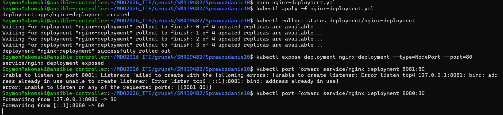

### Eksponowanie wdrożenia jako serwis

Deployment wyeksponowano jako serwis typu NodePort:

```bash
kubectl expose deployment nginx-deployment --type=NodePort --port=80
```

```
service/nginx-deployment exposed
```

Weryfikacja serwisu:

```bash
kubectl get services
```

Weryfikacja stanu podów po zakończeniu rollout:

```bash
kubectl get pods
```

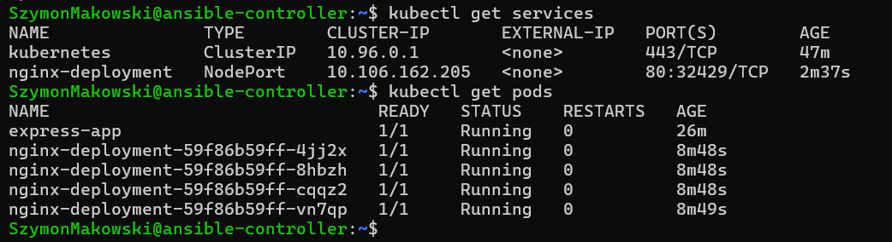

### Przekierowanie portu do serwisu i weryfikacja

Port-forward do serwisu (zamiast bezpośrednio do poda — ruch przechodzi przez warstwę Service):

```bash
kubectl port-forward service/nginx-deployment 8080:80
```

Weryfikacja odpowiedzi w osobnym terminalu:

```bash
curl http://localhost:8080
```

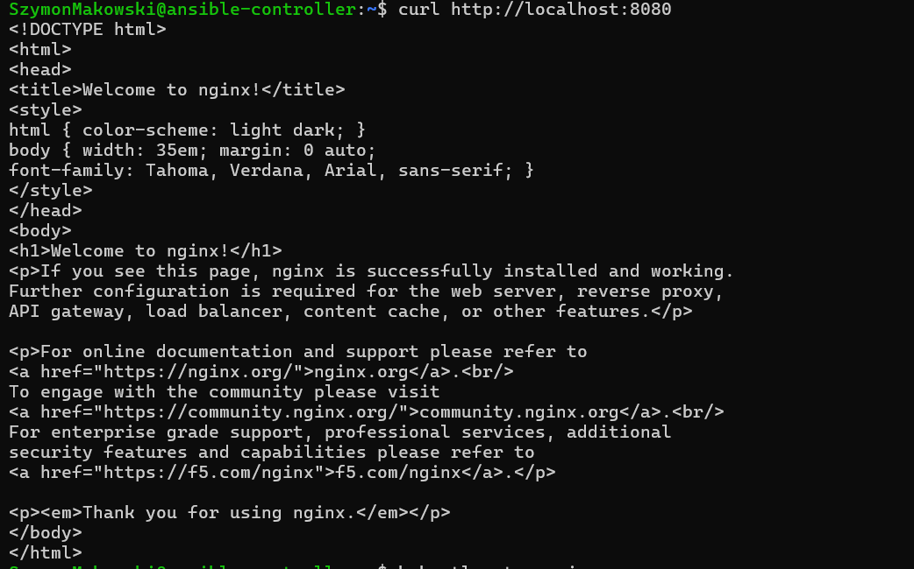

Nginx odpowiedział domyślną stroną powitalną, potwierdzając poprawną komunikację przez serwis z replikami Deployment.

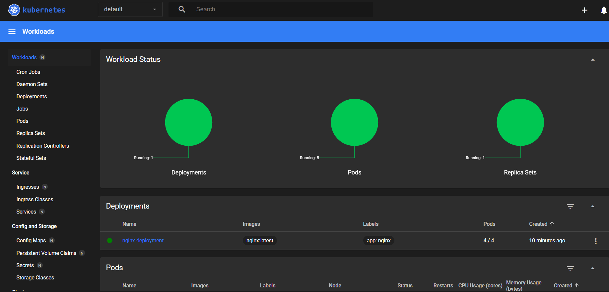
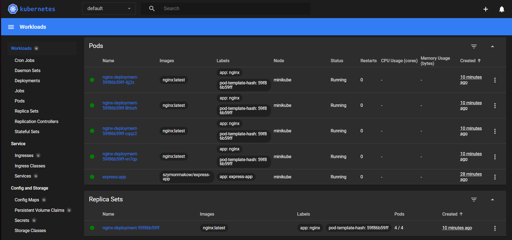

---

## Podsumowanie

1. Zainstalowano i uruchomiono minikube z driverem Docker na maszynie Ubuntu 24.04.
2. Skonfigurowano dostęp do Kubernetes Dashboard przez tunel SSH.
3. Uruchomiono aplikację `szymonmakow/express-app` jako pojedynczy pod i zweryfikowano komunikację przez `kubectl port-forward`.
4. Przygotowano deklaratywny plik YAML z deploymentem nginx i 4 replikami, wdrożono go przez `kubectl apply` i monitorowano rollout.
5. Wyeksponowano deployment jako serwis NodePort i zweryfikowano komunikację przez service.

---

# Sprawozdanie 11 — Wdrażanie na zarządzalne kontenery: Kubernetes 2

---

## Środowisko pracy

- Host: Windows 11
- Maszyna wirtualna: Ubuntu 24.04 LTS (VirtualBox)
- Połączenie: SSH z PowerShell / VS Code Remote SSH
- Obraz aplikacji: `szymonmakow/express-app:latest` (Express.js, Node.js)
- Kubernetes: minikube v1.38.1, kubectl v1.35.5, driver: Docker

---

## Cel ćwiczenia

Celem laboratorium było zapoznanie się z zaawansowanymi mechanizmami wdrożeń w Kubernetes: zarządzaniem wersjami obrazów, skalowaniem replik, historią wdrożeń, rollbackiem oraz różnymi strategiami wdrożeń (Recreate, RollingUpdate, Canary).

---

## 1. Przygotowanie środowiska

Klaster minikube był zatrzymany — uruchomiono go poleceniem:

```bash
minikube start
```

```bash
minikube status
```

```
minikube
type: Control Plane
host: Running
kubelet: Running
apiserver: Running
kubeconfig: Configured
```

---

## 2. Przygotowanie obrazów Docker

Przygotowano trzy wersje obrazu aplikacji `szymonmakow/express-app` na Docker Hub:

| Tag | Opis |
|-----|------|
| v1.0 | Pierwsza stabilna wersja (na bazie latest) |
| v2.0 | Druga wersja z dodanym plikiem /app/version.txt |
| v3.0-broken | Wersja z błędnym entrypointem — crashuje natychmiast |

### 2.1 Tworzenie v1.0

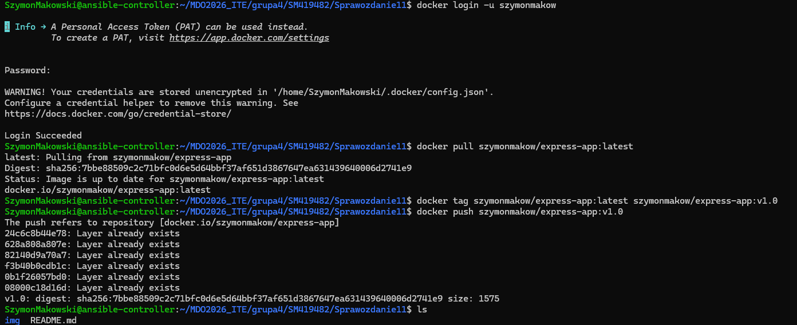

### 2.2 Tworzenie v2.0 przez docker commit

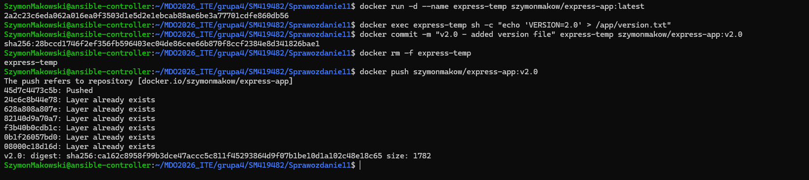

Technika `docker commit` pozwala zapisać zmiany wprowadzone do działającego kontenera jako nową warstwę obrazu — bez konieczności pisania Dockerfile.

### 2.3 Tworzenie v3.0-broken

Utworzono Dockerfile z błędnym entrypointem (`exit 1`):

```dockerfile
FROM szymonmakow/express-app:latest
ENTRYPOINT ["sh", "-c", "echo 'Starting...' && exit 1"]
```

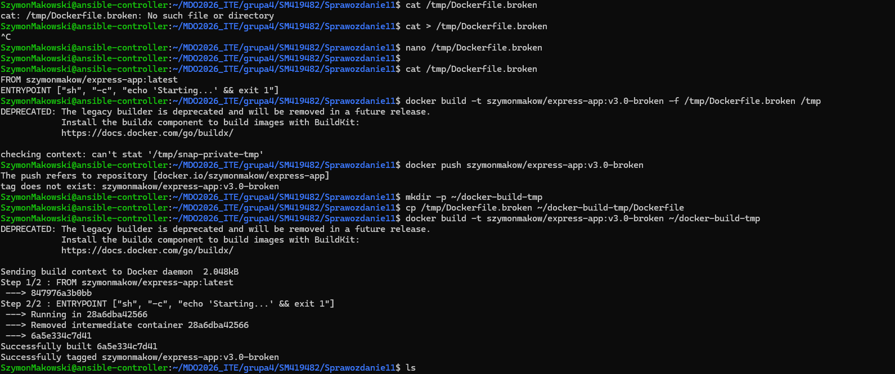
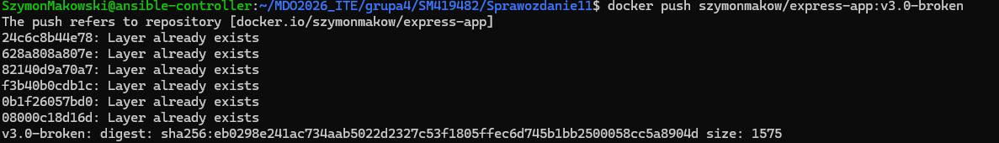

### 2.4 Załadowanie obrazów do minikube

Minikube korzysta z własnego daemona Docker, więc obrazy muszą być do niego załadowane:

```bash
minikube image load szymonmakow/express-app:v1.0
minikube image load szymonmakow/express-app:v2.0
minikube image load szymonmakow/express-app:v3.0-broken
minikube image ls | grep express
```

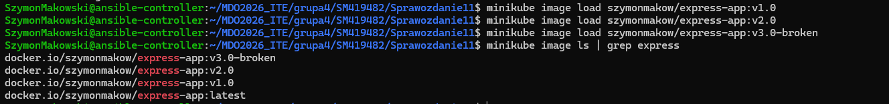

---

## 3. Podstawowy deployment

Utworzono plik `deployment.yaml` zawierający Deployment z 4 replikami oraz Service typu NodePort:

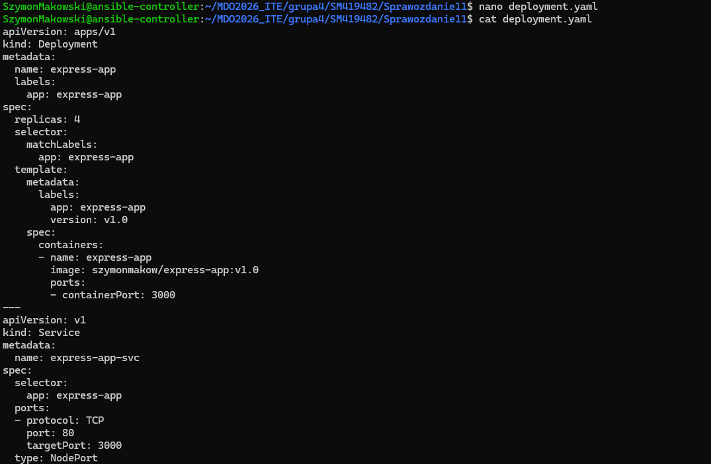

```bash
kubectl apply -f deployment.yaml
kubectl rollout status deployment/express-app
```

```
deployment "express-app" successfully rolled out
```

```bash
kubectl get pods
```

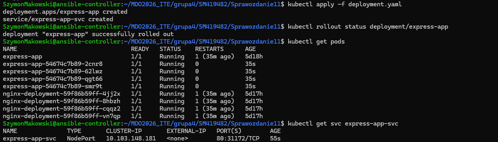

---

## 4. Zmiany liczby replik

### 4.1 Zwiększenie do 8 replik

```bash
sed -i 's/replicas: 4/replicas: 8/' deployment.yaml
kubectl apply -f deployment.yaml
kubectl rollout status deployment/express-app
```

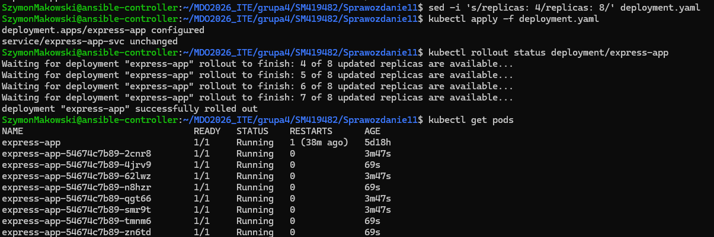

Kubernetes stopniowo uruchamiał nowe pody aż do osiągnięcia 8 replik.

### 4.2 Zmniejszenie do 1 repliki

```bash
sed -i 's/replicas: 8/replicas: 1/' deployment.yaml
kubectl apply -f deployment.yaml
```

W trakcie skalowania w dół widoczny był stan Terminating dla 7 podów.

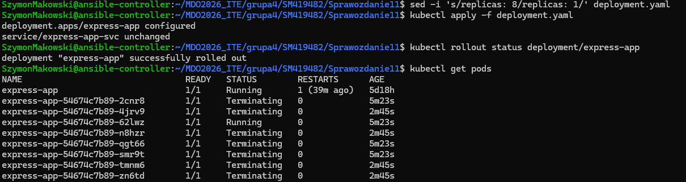

### 4.3 Zmniejszenie do 0 replik

```bash
sed -i 's/replicas: 1/replicas: 0/' deployment.yaml
kubectl apply -f deployment.yaml
kubectl get pods -l app=express-app
```

Ostatni pod przeszedł w stan Terminating, deployment był całkowicie pusty — żadne pody nie działały. Serwis nadal istniał, ale nie obsługiwał ruchu.

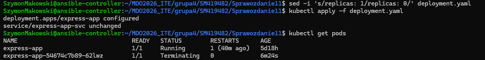

### 4.4 Przeskalowanie z powrotem do 4 replik

```bash
sed -i 's/replicas: 0/replicas: 4/' deployment.yaml
kubectl apply -f deployment.yaml
kubectl rollout status deployment/express-app
```

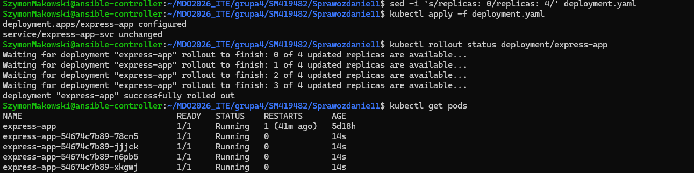

Nowe pody otrzymały inne sufiksy nazw niż poprzednie, ponieważ ReplicaSet tworzył je od zera.

---

## 5. Aktualizacja wersji obrazu i rollback

### 5.1 Aktualizacja do v2.0

```bash
sed -i 's/image: szymonmakow\/express-app:v1.0/image: szymonmakow\/express-app:v2.0/' deployment.yaml
kubectl apply -f deployment.yaml
kubectl rollout status deployment/express-app
```

W trakcie aktualizacji widoczna była stopniowa wymiana podów — stare przechodziły w Terminating, nowe startowały jako Running.

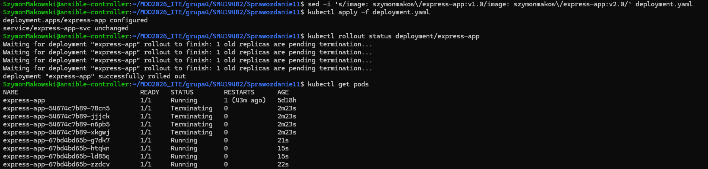

### 5.2 Powrót do v1.0

```bash
sed -i 's/image: szymonmakow\/express-app:v2.0/image: szymonmakow\/express-app:v1.0/' deployment.yaml
kubectl apply -f deployment.yaml
kubectl rollout status deployment/express-app
```

Kubernetes rozpoznał istniejący ReplicaSet dla v1.0 i przywrócił go zamiast tworzyć nowy.

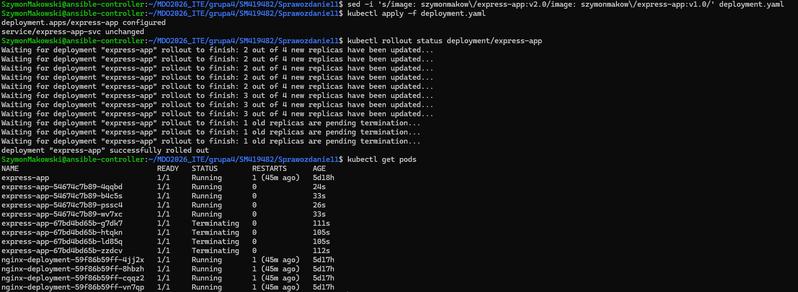

### 5.3 Zastosowanie wadliwego obrazu v3.0-broken

```bash
sed -i 's/image: szymonmakow\/express-app:v1.0/image: szymonmakow\/express-app:v3.0-broken/' deployment.yaml
kubectl apply -f deployment.yaml
kubectl rollout status deployment/express-app --timeout=60s
```

```bash
kubectl get pods -l app=express-app
```

Kubernetes zastosował strategię RollingUpdate — nie usunął wszystkich starych podów przed potwierdzeniem działania nowych. Dzięki temu 3 pody v1.0 nadal działały, a 2 nowe pody z v3.0-broken crashowały w pętli CrashLoopBackOff.

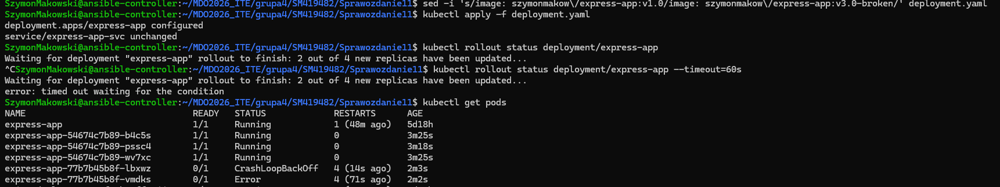

### 5.4 Historia wdrożeń i rollback

```bash
kubectl rollout history deployment/express-app
```

Rewizje nie zawierają opisu (brak flagi `--record`, która jest przestarzała w nowszych wersjach kubectl). Każda rewizja odpowiada zmianie obrazu.

```bash
kubectl rollout undo deployment/express-app
kubectl rollout status deployment/express-app
```

```
deployment "express-app" rolled back
deployment "express-app" successfully rolled out
```

Rollback natychmiast przywrócił poprzednią działającą wersję.

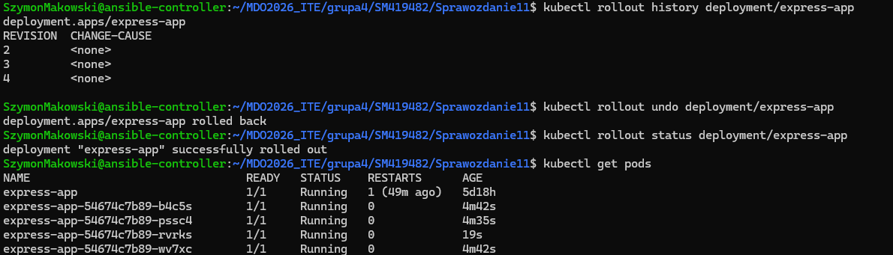

---

## 6. Skrypt weryfikujący wdrożenie

Napisano skrypt `check-rollout.sh` sprawdzający, czy deployment zakończył się w ciągu 60 sekund:

```bash
#!/bin/bash
DEPLOYMENT=${1:-express-app}
TIMEOUT=60

echo "Sprawdzam wdrożenie: $DEPLOYMENT (timeout: ${TIMEOUT}s)"

if kubectl rollout status deployment/$DEPLOYMENT --timeout=${TIMEOUT}s; then
    echo "SUCCESS: Wdrożenie $DEPLOYMENT zakończyło się sukcesem w ciągu ${TIMEOUT}s"
    exit 0
else
    echo "FAILED: Wdrożenie $DEPLOYMENT nie zakończyło się w ciągu ${TIMEOUT}s"
    echo "--- Stan podów ---"
    kubectl get pods -l app=$DEPLOYMENT
    echo "--- Ostatnie eventy ---"
    kubectl describe deployment/$DEPLOYMENT | tail -20
    exit 1
fi
```

Test na działającym deploymencie:

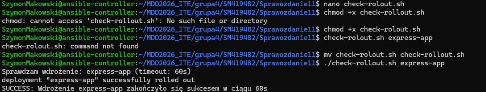

Test na wadliwym obrazie v3.0-broken:

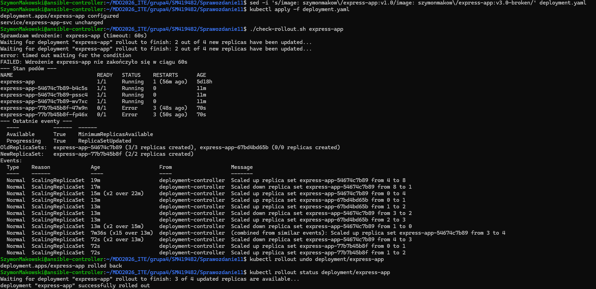

Skrypt zwraca kod wyjścia 0 przy sukcesie i 1 przy błędzie, co pozwala na jego użycie w pipeline CI/CD.

---

## 7. Strategie wdrożeń

### 7.1 Recreate

Plik `deployment-recreate.yaml`:

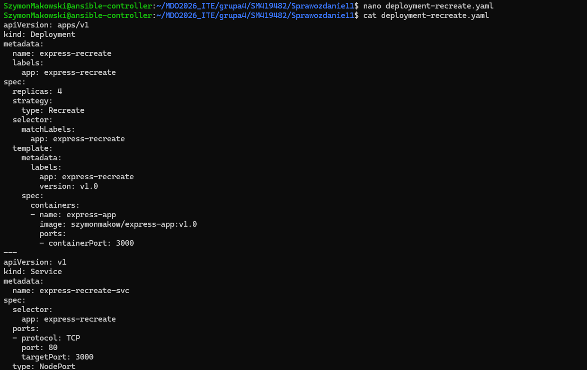

Obserwacja:

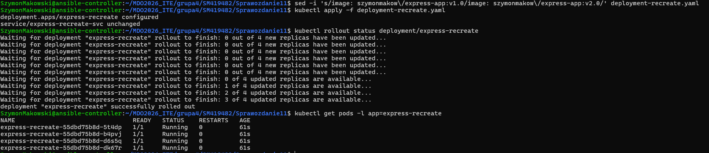

Widoczna jest charakterystyczna przerwa — faza "0 out of 4 new replicas have been updated" oznacza, że wszystkie stare pody zostały usunięte zanim wystartowały nowe. W tym czasie aplikacja była **niedostępna**.

### 7.2 Rolling Update z parametrami

Plik `deployment-rolling.yaml`:

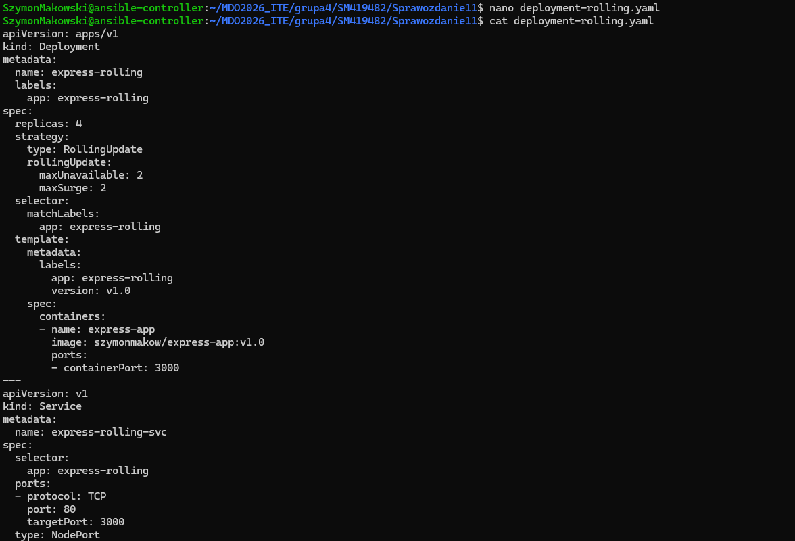

Parametry:
- `maxUnavailable: 2` — maksymalnie 2 pody mogą być niedostępne jednocześnie,
- `maxSurge: 2` — maksymalnie 2 dodatkowe pody mogą być tworzone ponad docelową liczbę replik (>20% z 4 = >0.8, czyli co najmniej 1).

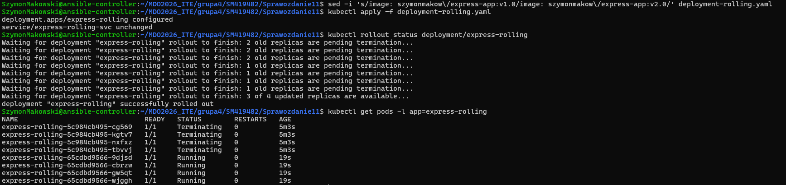

### 7.3 Canary Deployment

Plik `deployment-canary.yaml` zawiera dwa osobne Deploymenty współdzielące jeden Serwis poprzez wspólną etykietę `app: express-canary`:

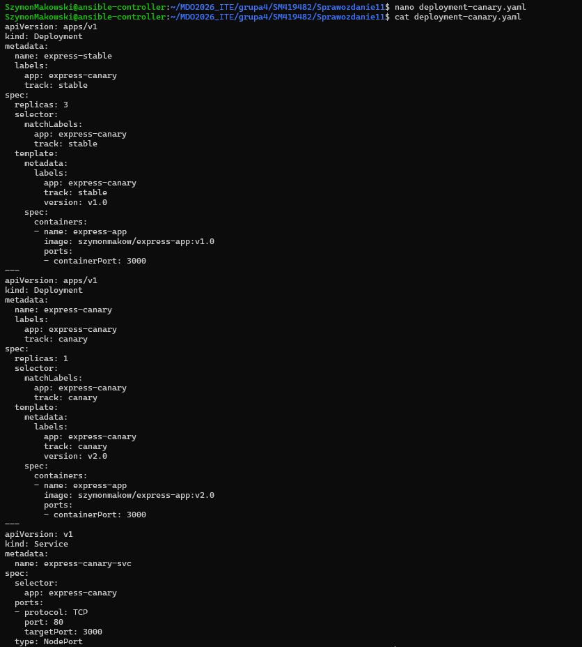

Stan podów:

```
NAME                              READY   STATUS    AGE
express-canary-799794f7f9-wqgm7   1/1     Running   63s   # v2.0
express-stable-69bf4ddcc4-g8m4h   1/1     Running   63s   # v1.0
express-stable-69bf4ddcc4-jbz2k   1/1     Running   63s   # v1.0
express-stable-69bf4ddcc4-k62d9   1/1     Running   63s   # v1.0
```

Serwis `express-canary-svc` rozdziela ruch między wszystkie 4 pody z etykietą `app: express-canary` — 75% ruchu trafia do stable (v1.0), 25% do canary (v2.0).

---

## 8. Porównanie strategii wdrożeń

| Cecha | Recreate | Rolling Update | Canary |
|-------|----------|----------------|--------|
| Dostępność podczas aktualizacji | **Brak** — chwilowy downtime | **Pełna** — zawsze min. (replicas - maxUnavailable) podów | **Pełna** — stable zawsze działa |
| Szybkość | Najszybsza | Zależna od parametrów | Najwolniejsza (ręczna) |
| Ryzyko | Wysokie (brak rollbacku w trakcie) | Średnie | Niskie (tylko % ruchu na nową wersję) |
| Użycie zasobów | Niskie | Chwilowo wyższe (maxSurge) | Wyższe (dwa deploymenty) |
| Zastosowanie | Środowiska dev/test | Produkcja — typowe wdrożenia | Produkcja — testowanie nowych funkcji |

---

## 9. Serwisy (Services)

Każdy deployment posiada dedykowany Service typu NodePort:

```
NAME                   TYPE        CLUSTER-IP       EXTERNAL-IP   PORT(S)        AGE
express-app-svc        NodePort    10.103.148.181   <none>        80:31172/TCP   34m
express-canary-svc     NodePort    10.99.183.197    <none>        80:32206/TCP   5m19s
express-recreate-svc   NodePort    10.98.49.94      <none>        80:31866/TCP   5m39s
express-rolling-svc    NodePort    10.102.237.159   <none>        80:32377/TCP   5m30s
```

NodePort eksponuje serwis na porcie hosta (zakres 30000–32767), umożliwiając dostęp z zewnątrz klastra przez `minikube ip`.

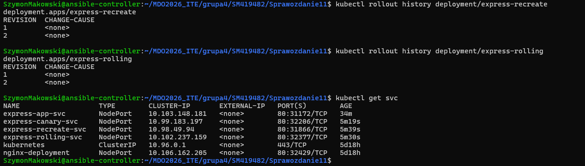

---

# Sprawozdanie 12 — Wdrażanie na zarządzalne kontenery w chmurze (Azure)

---

## Środowisko pracy

- Host: Windows 11
- Maszyna wirtualna: Ubuntu 24.04 LTS (VirtualBox)
- Połączenie: SSH z PowerShell / VS Code Remote SSH
- Obraz aplikacji: oficjalny obraz httpd (Apache HTTP Server) z Docker Hub
- Platforma Microsoft Azure: Azure Container Instances, Azure Cloud Shell

---

## Cel ćwiczenia

Celem laboratorium było zapoznanie się z platformą Microsoft Azure i wdrożenie kontenera aplikacji webowej na usługę Azure Container Instances (ACI). Ćwiczenie obejmowało: aktywację subskrypcji studenckiej, utworzenie resource group, wdrożenie kontenera z obrazu dostępnego na Docker Hub, weryfikację działania usługi HTTP, pobranie logów oraz posprzątanie zasobów po zakończeniu pracy.

---

## Wybór obrazu kontenera

W niniejszym laboratorium zdecydowano się na użycie oficjalnego obrazu httpd (Apache HTTP Server) z Docker Hub, a nie obrazu `szymonmakow/express-app` używanego w poprzednich laboratoriach. Decyzja ta wynikała z następujących przyczyn:

1. **Ograniczenia polityki subskrypcji studenckiej Azure** — subskrypcja Azure for Students podlega zasadom narzucanym przez platformę, które ograniczają dostępność usług ACI w poszczególnych regionach. Próba wdrożenia kontenera w regionach `westeurope` oraz `eastus` kończyła się błędem `RequestDisallowedByAzure`, niezależnie od użytego obrazu. Działającym regionem okazał się `polandcentral`.

2. **Prostota i oficjalny status obrazu** — httpd to oficjalny, minimalny obraz Apache serwujący HTTP na porcie 80, bez dodatkowych zależności. Idealnie nadaje się do demonstracji wdrożenia kontenera w chmurze, gdyż celem laboratorium jest sam proces wdrożenia (tworzenie resource group, ACI, weryfikacja dostępu HTTP, cleanup), a nie weryfikacja konkretnej aplikacji.

Po potwierdzeniu, że region `polandcentral` działa poprawnie z obrazem httpd, dalsze próby z obrazem `szymonmakow/express-app` nie były już konieczne do osiągnięcia celu ćwiczenia.

---

## 1. Aktywacja subskrypcji Azure

Logowanie do Azure Cloud Shell i weryfikacja aktywnej subskrypcji:

```
az account show
{
  "environmentName": "AzureCloud",
  "homeTenantId": "80b1033f-21e0-4a82-bbc0-f05fdccd3bc8",
  "id": "2994e1c0-01c2-46ac-a09a-a615fceb8efc",
  "isDefault": true,
  "managedByTenants": [],
  "name": "Azure for Students",
  "state": "Enabled",
  "tenantId": "80b1033f-21e0-4a82-bbc0-f05fdccd3bc8",
  "user": {
    "cloudShellID": true,
    "name": "smakowski@student.agh.edu.pl",
    "type": "user"
  }
}
```

Subskrypcja w stanie "Enabled" — konto gotowe do pracy.

---

## 2. Rejestracja dostawcy zasobów

Przed pierwszym użyciem Azure Container Instances na subskrypcji studenckiej konieczna była rejestracja providera Microsoft.ContainerInstance:

```
az provider show --namespace Microsoft.ContainerInstance --query "registrationState"
"NotRegistered"

az provider register --namespace Microsoft.ContainerInstance
Registering is still on-going. You can monitor using 'az provider show -n Microsoft.ContainerInstance'

az provider show --namespace Microsoft.ContainerInstance --query "registrationState"
"Registered"
```

---

## 3. Utworzenie Resource Group

Resource group została utworzona w regionie `polandcentral`:

```
az group create --name SM419482-rg --location polandcentral
{
  "id": "/subscriptions/2994e1c0-01c2-46ac-a09a-a615fceb8efc/resourceGroups/SM419482-rg",
  "location": "polandcentral",
  "managedBy": null,
  "name": "SM419482-rg",
  "properties": {
    "provisioningState": "Succeeded"
  },
  "tags": null,
  "type": "Microsoft.Resources/resourceGroups"
}
```

`"provisioningState": "Succeeded"` potwierdza poprawne utworzenie grupy zasobów.

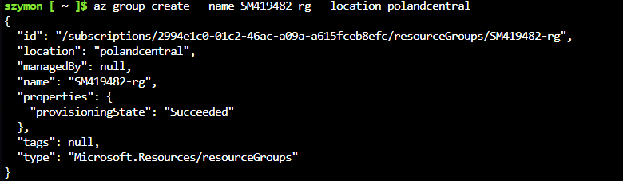

---

## 4. Wdrożenie kontenera z Docker Hub

Kontener wdrożono przy użyciu obrazu httpd (Apache HTTP Server) pobranego bezpośrednio z Docker Hub — bez konieczności tworzenia Azure Container Registry:

```
az container create --resource-group SM419482-rg --name sm419482-app --image httpd --cpu 1 --memory 1 --ports 80 --ip-address Public --os-type Linux
```

Fragment odpowiedzi JSON potwierdzający sukces:

```json
{
  "containers": [
    {
      "image": "httpd",
      "instanceView": {
        "currentState": {
          "state": "Running",
          "startTime": "2026-06-12T08:30:57.626000+00:00",
          "detailStatus": ""
        },
        "events": [
          {
            "message": "pulling image \"httpd@sha256:939797d877aeeb5cc3a0da054ae006754151fae1a7c5c6d7e037fb359041ed67\"",
            "name": "Pulling"
          },
          {
            "message": "Successfully pulled image \"httpd@sha256:939797d877aeeb5cc3a0da054ae006754151fae1a7c5c6d7e037fb359041ed67\"",
            "name": "Pulled"
          },
          {
            "message": "Started container",
            "name": "Started"
          }
        ]
      },
      "name": "sm419482-app",
      "ports": [{ "port": 80, "protocol": "TCP" }],
      "resources": {
        "requests": { "cpu": 1.0, "memoryInGb": 1.0 }
      }
    }
  ],
  "ipAddress": {
    "ip": "74.248.183.66",
    "ports": [{ "port": 80, "protocol": "TCP" }],
    "type": "Public"
  },
  "location": "polandcentral",
  "name": "sm419482-app",
  "provisioningState": "Succeeded",
  "instanceView": { "state": "Running" }
}
```

Kontener uruchomiony, publiczne IP: 74.248.183.66, port 80/TCP.

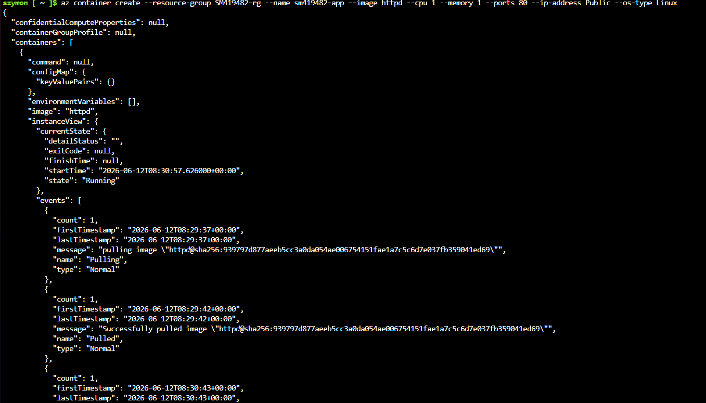

---

## 5. Weryfikacja działania kontenera

### Stan kontenera

```
az container show --resource-group SM419482-rg --name sm419482-app --query "containers[0].instanceView.currentState" --output table
```

Kontener w stanie Running.

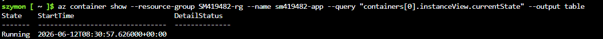

### Logi kontenera

```
az container logs --resource-group SM419482-rg --name sm419482-app
```

Logi potwierdzają poprawne uruchomienie serwera Apache 2.4.68 w trybie FOREGROUND.

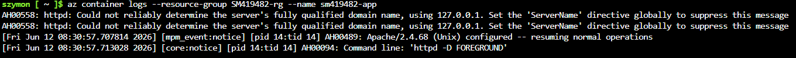

### Dostęp HTTP do serwowanej usługi

Metoda dostępu: publiczny adres IP przydzielony przez ACI (74.248.183.66), port 80.

Odpowiedź HTTP 200 z domyślną stroną Apache potwierdza, że usługa HTTP jest dostępna publicznie.

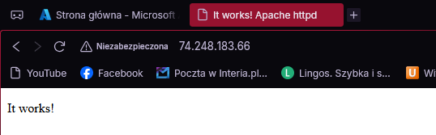

---

## 6. Zatrzymanie i usunięcie kontenera oraz resource group

### Zatrzymanie kontenera

```
az container stop --resource-group SM419482-rg --name sm419482-app
```

### Usunięcie kontenera

```
az container delete --resource-group SM419482-rg --name sm419482-app --yes
```

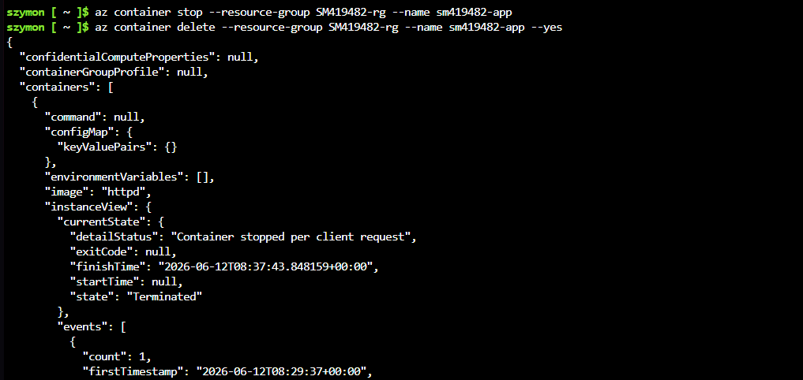

### Usunięcie resource group

```
az group delete --name SM419482-rg --yes
```

### Weryfikacja usunięcia

```
az group list --output table
```

Pusta odpowiedź potwierdza całkowite usunięcie resource group SM419482-rg wraz ze wszystkimi zasobami. Kredyty nie będą dalej naliczane.


---

## Podsumowanie zbiorcze

Laboratoria 8–12 obejmowały pełną ścieżkę od automatyzacji infrastruktury on-premise do orkiestracji kontenerów w chmurze:

- **Ansible** (lab 8) wprowadził zarządzanie konfiguracją przez playbooki i role, z naciskiem na idempotentność operacji oraz automatyzację wdrożenia aplikacji `szymonmakow/express-app` na zdalnym hoście.
- **Kickstart** (lab 9) pokazał, jak zautomatyzować instalację całego systemu operacyjnego wraz z pierwszym uruchomieniem usług kontenerowych, z istotnym ograniczeniem dotyczącym niedostępności `docker run` i `systemctl start` w fazie `%post`.
- **Kubernetes 1 i 2** (laby 10–11) rozwinęły temat konteneryzacji o orkiestrację: deklaratywne wdrożenia, skalowanie, historię rollout i rollback, a także porównanie strategii wdrożeń (Recreate, RollingUpdate, Canary) pod kątem dostępności i ryzyka.
- **Azure Container Instances** (lab 12) przeniósł temat wdrożeń kontenerowych do środowiska chmurowego, z praktycznym napotkaniem i obejściem ograniczeń regionalnych subskrypcji studenckiej.

Wspólnym mianownikiem wszystkich laboratoriów było podejście deklaratywne i powtarzalne — od ról Ansible, przez pliki Kickstart, po manifesty YAML Kubernetesa — oraz konsekwentne stosowanie tego samego obrazu aplikacji (`szymonmakow/express-app`) jako punktu odniesienia między różnymi platformami wdrożeniowymi.
