# Sprawozdanie 8 — Szymon Makowski ITE
## Ansible

---

## Środowisko pracy

* Host: Windows 11
* Maszyna wirtualna: Ubuntu 24.04 LTS (VirtualBox)
* Połączenie: SSH z PowerShell / VS Code Remote SSH
* Użytkownik VM: SzymonMakowski (bez root)
* Repozytorium aplikacji: fork expressjs/express
* Główna VM: ansible-controller 192.168.1.103 Orchestrator (dyrygent)
* Druga VM: ansible-target 192.168.1.104 Endpoint (węzeł docelowy)

---

## Cel ćwiczenia

Celem ćwiczenia było zapoznanie się z narzędziem Ansible do automatyzacji zarządzania infrastrukturą. Ćwiczenie obejmowało konfigurację dwóch maszyn wirtualnych, inwentaryzację hostów, zdalne wywoływanie procedur za pomocą playbooków oraz wdrożenie aplikacji przy użyciu roli Ansible.

---

## 1. Przygotowanie maszyny ansible-target

Maszyna docelowa została sklonowana z maszyny głównej w VirtualBoxie, a następnie oczyszczona z niepotrzebnych pakietów i artefaktów po klonowaniu — w tym kluczy hosta SSH, machine-id oraz plików projektowych. Hostname ustawiono poleceniem hostnamectl set-hostname ansible-target, co pozwala na jednoznaczną identyfikację maszyny w sieci bez polegania na adresach IP.

```bash
sudo hostnamectl set-hostname ansible-target
sudo apt install -y tar
sudo apt install -y openssh-server
sudo systemctl enable ssh
sudo systemctl start ssh
```

Utworzono użytkownika ansible, który będzie używany przez Ansible do łączenia się z maszyną docelową:

```bash
sudo adduser ansible
sudo usermod -aG sudo ansible
```

## Instalacja Ansible na maszynie głównej

Ansible zainstalowano z repozytorium dystrybucji Ubuntu. Jest to najprostsza metoda instalacji zapewniająca stabilną wersję przetestowaną pod kątem zgodności z systemem operacyjnym.

```bash
sudo apt update
sudo apt install -y ansible
ansible --version
```

---

## Wymiana kluczy SSH

Aby Ansible mógł łączyć się z maszyną docelową bez podawania hasła, wygenerowano parę kluczy RSA na maszynie głównej i skopiowano klucz publiczny do użytkownika ansible na ansible-target. Mechanizm ssh-copy-id automatycznie dodaje klucz do pliku ~/.ssh/authorized_keys na maszynie docelowej.

```bash
ssh-keygen -t rsa -b 4096 -C "glowny klucz ansible" -f ~/.ssh/id_rsa -N ""
ssh-copy-id ansible@192.168.1.104
ssh ansible@ansible-target
```

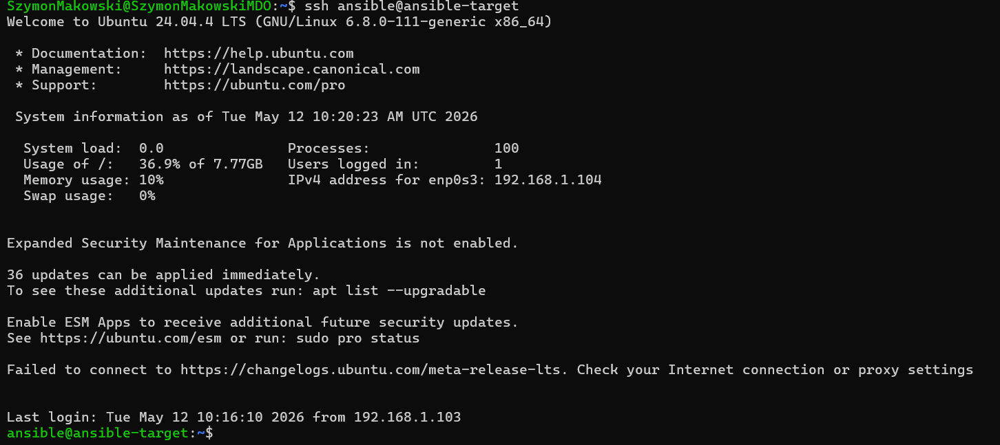

---

## 2. Inwentaryzacja

### Konfiguracja DNS w /etc/hosts

Zamiast używać adresów IP, dodano wpisy do pliku /etc/hosts na obu maszynach, umożliwiając wywoływanie hostów po nazwach. Jest to najprostsze rozwiązanie dla środowiska laboratoryjnego, niewymagające konfiguracji serwera DNS.

```bash
echo "192.168.1.103   ansible-controller" | sudo tee -a /etc/hosts
echo "192.168.1.104   ansible-target" | sudo tee -a /etc/hosts
```

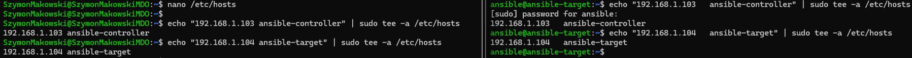
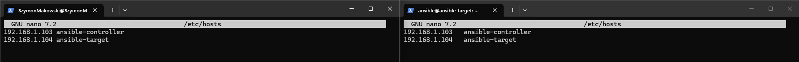

Weryfikacja łączności:

```bash
ping -c 2 ansible-controller
ping -c 2 ansible-target
```

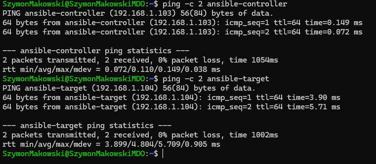

### Plik inwentaryzacji

Plik inventory.ini definiuje dwie sekcje: Orchestrators zawierającą maszynę główną oraz Endpoints zawierającą maszynę docelową. Sekcja Orchestrators używa ansible_connection=local, co oznacza że Ansible nie łączy się przez SSH lecz wykonuje zadania lokalnie.

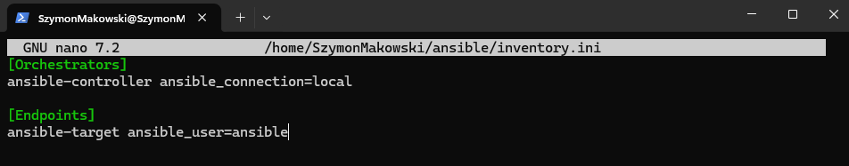

### Ansible ping do wszystkich maszyn

Moduł ansible.builtin.ping weryfikuje że Ansible może połączyć się z hostem i wykonać na nim kod Python. 


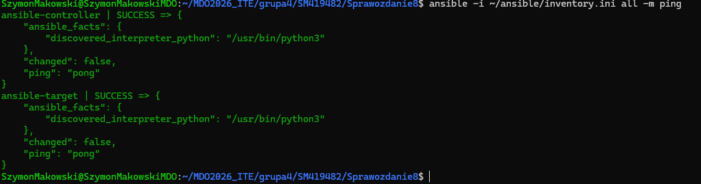

---

## 3. Zdalne wywoływanie procedur — playbooki

Plik ansible.cfg wskazuje domyślną ścieżkę do ról i pliku inwentaryzacji, dzięki czemu nie trzeba podawać tych parametrów przy każdym wywołaniu:

```ini
[defaults]
roles_path = ./roles
inventory = ./inventory.ini
```

### Playbook ping.yml

Playbook wysyła żądanie ping do wszystkich hostów zdefiniowanych w inwentaryzacji. Różnica względem modułu ad-hoc polega na tym, że playbook jest plikiem YAML przechowywanym w repozytorium — stanowi dokumentację i można go uruchamiać wielokrotnie.

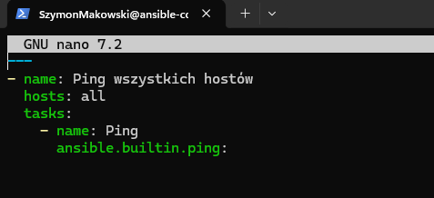

```bash
ansible-playbook -i inventory.ini ./playbooks/ping.yml
```

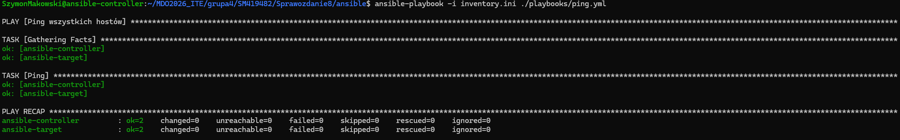

### Playbook copy_inventory.yml — idempotentność

Playbook kopiuje plik inwentaryzacji na maszynę docelową. Kluczową obserwacją jest idempotentność — przy pierwszym uruchomieniu Ansible raportuje changed=1 (plik został skopiowany), przy drugim changed=0 (plik już istnieje i jest identyczny, więc nie ma potrzeby działania).

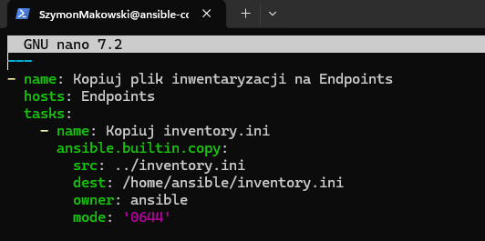


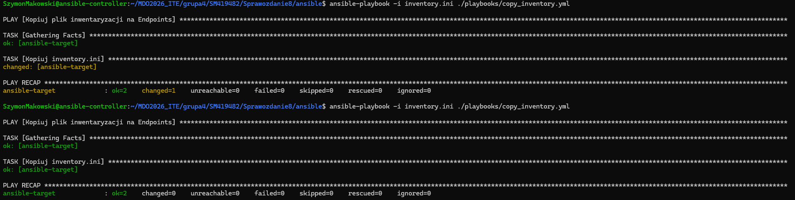

### Playbook update.yml — aktualizacja pakietów

Playbook aktualizuje pakiety na maszynie docelowej. Użyto flagi force_apt_get: true jako obejście znanego buga w Ansible dotyczącego modułu apt z opcją upgrade. 

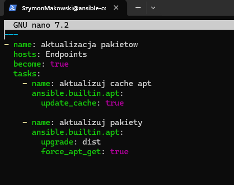

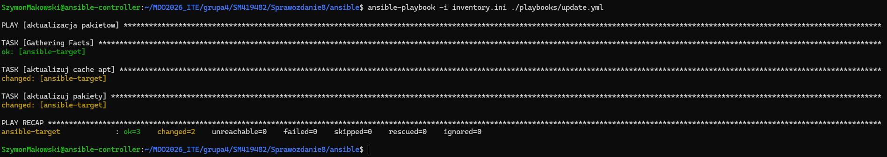

### Playbook restart_service.yml — restart usług

Playbook restartuje usługi sshd i rngd. Usługa rngd (generator liczb losowych) nie jest zainstalowana na minimalnym Ubuntu — użycie ignore_errors: true, sprawia, że Ansible raportuje błąd jako ignored zamiast przerywać wykonanie playbooka.

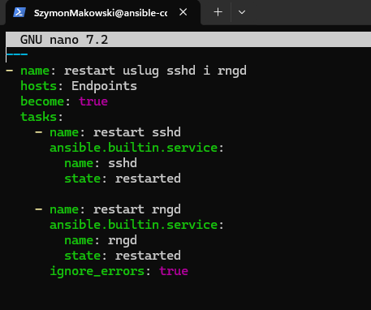

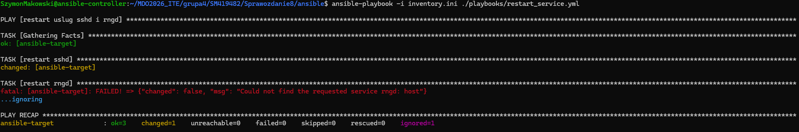

### Operacje przy wyłączonym SSH

Aby zademonstrować zachowanie Ansible gdy host jest nieosiągalny, zatrzymano usługę SSH na ansible-target. Ansible domyślnie używa mechanizmu SSH ControlMaster (multiplexing połączeń), który utrzymuje otwarte połączenie w tle — dlatego do pełnego zablokowania dostępu należy zatrzymać zarówno ssh.service jak i ssh.socket.

```bash
ssh ansible@ansible-target "sudo systemctl stop ssh.socket ssh.service"
ansible-playbook -i inventory.ini ./playbooks/ping.yml \ -e "ansible_ssh_common_args='-o ControlMaster=no -o ControlPath=none'"
```

Ansible raportuje status UNREACHABLE dla niedostępnego hosta i kontynuuje wykonanie dla pozostałych hostów.

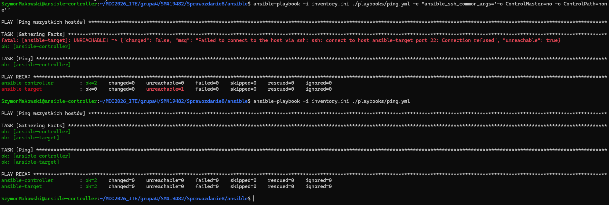

---

## 3. Zarządzanie artefaktem — rola Ansible

### Inicjalizacja roli

Rolę zainicjowano narzędziem ansible-galaxy, które tworzy standardową strukturę katalogów. 

```bash
ansible-galaxy role init roles/express_app
```

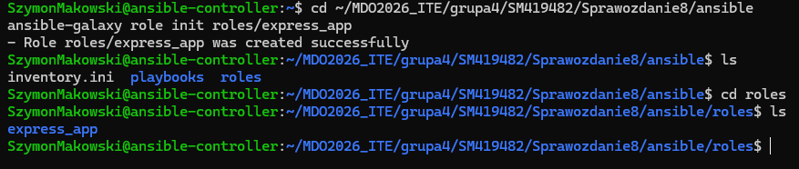

### meta/main.yml

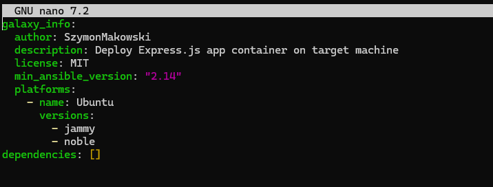

### tasks/main.yml — opis kroków

Rola realizuje następujące etapy:

1. Sanity check — sprawdzenie czy Docker jest już zainstalowany. Wynik zapisywany jest w zmiennej docker_check, a kolejne kroki instalacji są warunkowo pomijane (when: docker_check.failed).

2. Instalacja Dockera — jeśli Docker nie istnieje, Ansible instaluje zależności, dodaje klucz GPG i repozytorium Docker, a następnie instaluje pakiety docker-ce. Użytkownik ansible jest dodawany do grupy docker aby mógł zarządzać kontenerami bez sudo.

3. Deploy — pobierany jest obraz szymonmakow/express-app z Docker Hub i uruchamiany kontener z przekierowaniem portu 3000:3000.

4. Weryfikacja — Ansible czeka na dostępność portu 3000 (wait_for), a następnie wysyła żądanie HTTP do aplikacji (uri). Odpowiedź Hello World potwierdza poprawne uruchomienie kontenera.

5. Cleanup — kontener jest zatrzymywany i usuwany wraz z obrazem, przywracając maszynę docelową do stanu sprzed wdrożenia.

```yaml
---
# tasks file for roles/express_app
- name: sprawdzenie czy Docker jest zainstalowany
  ansible.builtin.command: docker --version
  register: docker_check
  ignore_errors: true

- name: zainstalowanie zaleznosci Dockera
  ansible.builtin.apt:
    name:
      - apt-transport-https
      - ca-certificates
      - curl
      - gnupg
    state: present
    update_cache: true
  become: true
  when: docker_check.failed

- name: dodanie klucza GPG Docker
  ansible.builtin.shell: |
    curl -fsSL https://download.docker.com/linux/ubuntu/gpg | gpg --dearmor -o /etc/apt/keyrings/docker.gpg
  become: true
  when: docker_check.failed

- name: dodanie repozytorium Docker
  ansible.builtin.shell: |
    echo "deb [arch=amd64 signed-by=/etc/apt/keyrings/docker.gpg] https://download.docker.com/linux/ubuntu noble stable" > /etc/apt/sources.list.d/docker.list
  become: true
  when: docker_check.failed

- name: zainstalowanie Dockera
  ansible.builtin.apt:
    name:
      - docker-ce
      - docker-ce-cli
      - containerd.io
    state: present
    update_cache: true
  become: true
  when: docker_check.failed

- name: uruchomiwnie i wlaczenie Dockera
  ansible.builtin.service:
    name: docker
    state: started
    enabled: true
  become: true

- name: dodanie użytkownika ansible do grupy docker
  ansible.builtin.user:
    name: ansible
    groups: docker
    append: true
  become: true

# Deploy
- name: pobranie obrazu z Docker Hub
  community.docker.docker_image:
    name: szymonmakow/express-app
    source: pull
  become: true

- name: uruchomienie kontenera
  community.docker.docker_container:
    name: express-app
    image: szymonmakow/express-app
    state: started
    ports:
      - "3000:3000"
  become: true
  register: container_info

# Weryfikacja
- name: czekanie na start aplikacji
  ansible.builtin.wait_for:
    port: 3000
    delay: 3
    timeout: 30

- name: sprawdzenie lacznosci z kontenerem
  ansible.builtin.uri:
    url: http://localhost:3000
    return_content: true
  register: app_response

- name: wyswietlenie odpowiedzi aplikacji
  ansible.builtin.debug:
    var: app_response.content

# Cleanup
- name: zatrzymanie kontenera
  community.docker.docker_container:
    name: express-app
    state: stopped
  become: true

- name: usuwanie kontenera
  community.docker.docker_container:
    name: express-app
    state: absent
  become: true

- name: usuwanie obrazu
  community.docker.docker_image:
    name: szymonmakow/express-app
    state: absent
  become: true

```

### Wyniki uruchomienia playbooka deploy.yml

Playbook deploy.yml
```yaml
---
- name: Deploy Express App
  hosts: Endpoints
  roles:
    - express_app
```

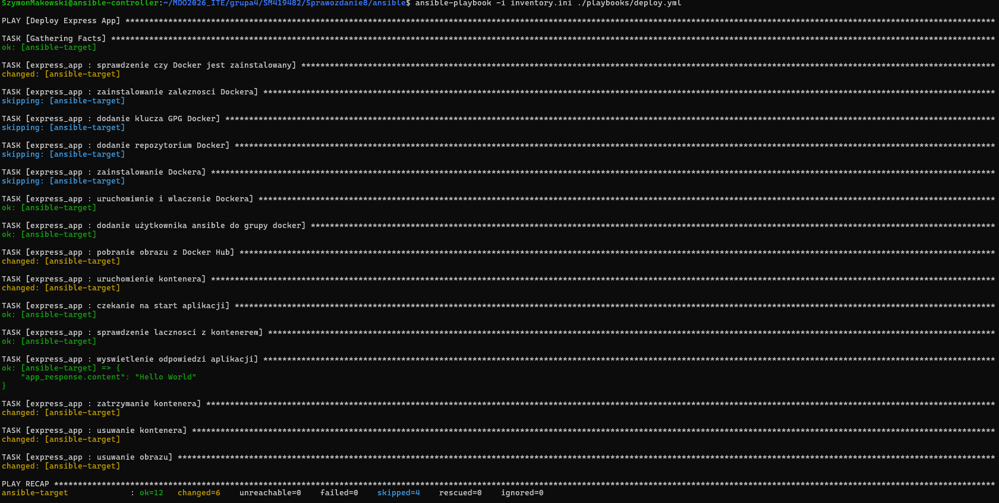

---
