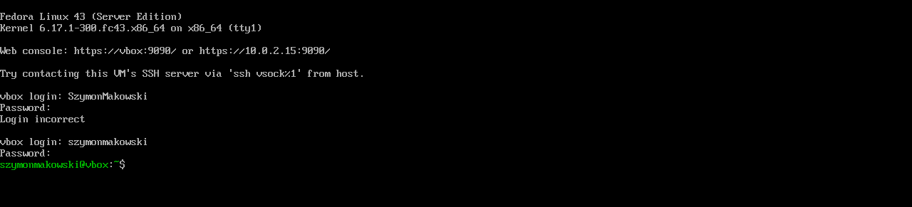
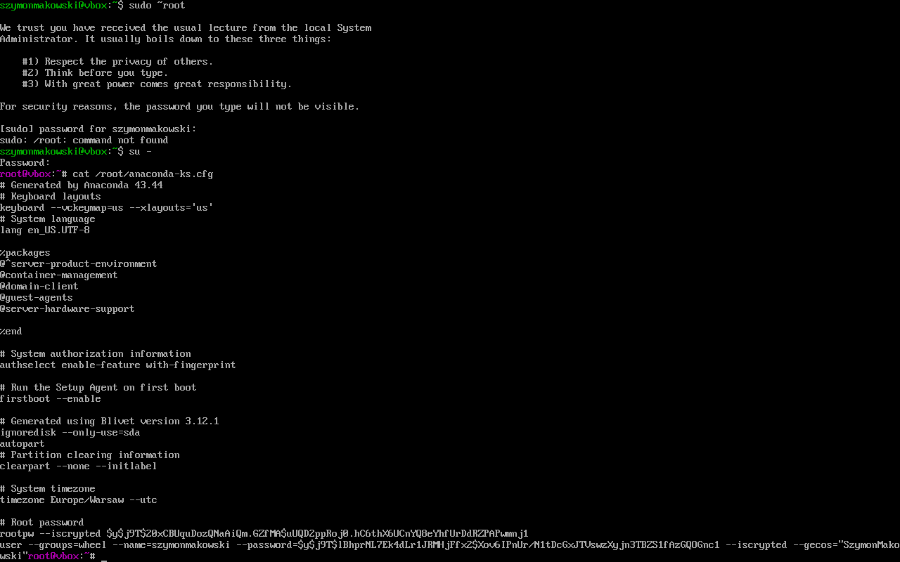
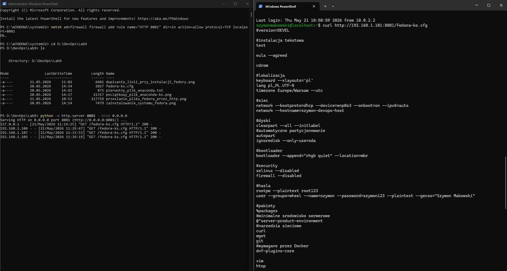
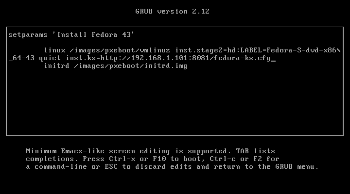
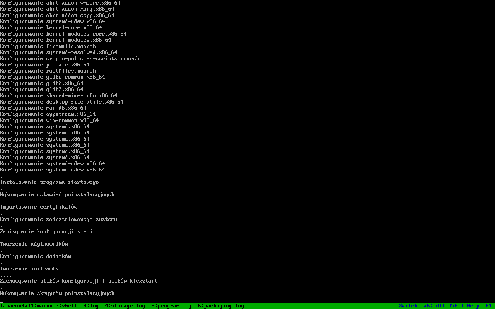
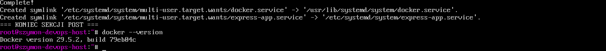
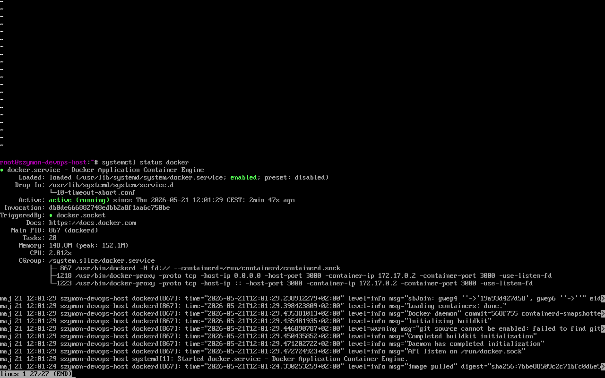
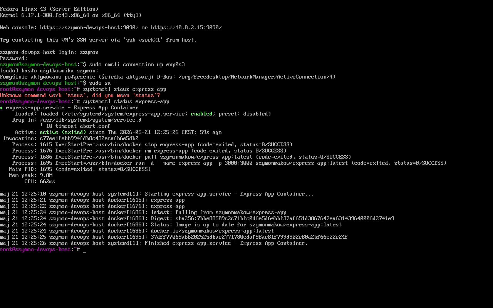
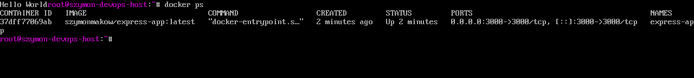
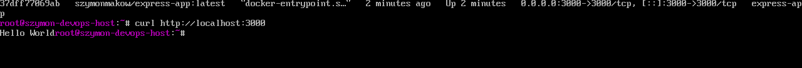

# Sprawozdanie 9 — Szymon Makowski ITE
## Pliki odpowiedzi dla wdrożeń nienadzorowanych

---

## Środowisko pracy

* Host: Windows 11
* Maszyna wirtualna: Fedora 43 Server Edition (DVD ISO) (VirtualBox)
* Połączenie: SSH z PowerShell / VS Code Remote SSH
* Repozytorium aplikacji: fork expressjs/express
* Aplikacja: kontener Docker szymonmakow/express-app:latest (Express.js)

---

## Cel ćwiczenia

Celem ćwiczenia było przygotowanie źródła instalacji nienadzorowanej systemu operacyjnego Fedora z wykorzystaniem pliku odpowiedzi (Kickstart), który automatyzuje cały proces instalacji oraz uruchamia oprogramowanie zbudowane w ramach poprzednich laboratoriów (kontener Docker z aplikacją Express.js).
---


## 1. Pierwsza instalacja Fedory (ręczna)

Pierwszym krokiem było pobranie obrazu ISO systemu Fedora 43 Server Edition. Wybrano wariant Server DVD, który zawiera wszystkie pakiety na płycie – nie wymaga pobierania ich podczas instalacji. Utworzono nową maszynę wirtualną w VirtualBox.

Przeprowadzono standardową instalację graficzną przez instalator Anaconda. Po zakończeniu instalacji i uruchomieniu systemu zalogowano się i pobrano automatycznie wygenerowany plik odpowiedzi:

```bash
cat /root/anaconda-ks.cfg
```

Plik ten zawiera kompletną konfigurację przeprowadzonej instalacji i stanowi punkt wyjścia do przygotowania instalacji nienadzorowanej.



---

## 2. Analiza i modyfikacja pliku anaconda-ks.cfg

Oryginalny plik odpowiedzi wymagał następujących modyfikacji:

1. Tryb instalacji – zmieniono na text (instalacja tekstowa, bez GUI)
2. Akceptacja EULA – dodano eula --agreed (automatyczna akceptacja bez pytania)
3. Czyszczenie dysku – dodano clearpart --all --initlabel (gwarantuje formatowanie całego dysku, nawet jeśli nie jest pusty)
4. Hostname – ustawiono szymon-devops-host zamiast domyślnego localhost
5. Sieć – --onboot=on zapewnia włączenie karty sieciowej przy starcie
6. Hasła – ustawiono w trybie plaintext dla uproszczenia środowiska testowego
7. Sekcja %post – dodano instalację Dockera i konfigurację serwisu systemd dla kontenera
8. Automatyczny restart – dyrektywa reboot na końcu pliku


---

## 3. Przygotowany plik odpowiedzi (fedora-ks.cfg)

```kickstart
#version=DEVEL

#instalacja tekstowa 
text

eula --agreed

cdrom

#lokalizacja
keyboard --xlayouts='pl'
lang pl_PL.UTF-8
timezone Europe/Warsaw --utc

#siec
network --bootproto=dhcp --device=enp0s3 --onboot=on --ipv6=auto
network --hostname=szymon-devops-host

#dyski
clearpart --all --initlabel
#automatyczne partycjonowanie
autopart
ignoredisk --only-use=sda

#bootloader
bootloader --append="rhgb quiet" --location=mbr

#security
selinux --disabled
firewall --disabled

#hasla
rootpw --plaintext root123
user --groups=wheel --name=szymon --password=szymon123 --plaintext --gecos="Szymon Makowski"

#pakiety
%packages
#minimalne srodowisko serwerowe
@^server-product-environment
#narzedzia sieciowe
curl
wget
%end

#po instalacji
%post --log=/root/ks-post.log

echo "=== START SEKCJI POST ==="

dnf install -y dnf-plugins-core
dnf config-manager addrepo --from-repofile=https://download.docker.com/linux/fedora/docker-ce.repo
dnf install -y docker-ce docker-ce-cli containerd.io docker-buildx-plugin docker-compose-plugin

systemctl enable docker
usermod -aG docker szymon

cat > /etc/systemd/system/express-app.service << 'EOF'
[Unit]
Description=Express App Container
After=docker.service
Requires=docker.service

[Service]
Type=oneshot
RemainAfterExit=yes
ExecStartPre=-/usr/bin/docker stop express-app
ExecStartPre=-/usr/bin/docker rm express-app
ExecStartPre=-/usr/bin/docker pull szymonmakow/express-app:latest
ExecStart=/usr/bin/docker run -d \
    --name express-app \
    -p 3000:3000 \
    szymonmakow/express-app:latest
ExecStop=/usr/bin/docker stop express-app

[Install]
WantedBy=multi-user.target
EOF

systemctl enable express-app.service

echo "=== KONIEC SEKCJI POST ==="

%end

reboot
```

### Kluczowe decyzje projektowe

- clearpart --all – zapewnia że instalacja powiedzie się nawet jeśli dysk nie jest pusty
- Docker instalowany w %post – nie można używać docker run ani systemctl start docker podczas instalacji systemu
- *systemctl enable zamiast systemctl start – rejestruje serwisy do uruchomienia przy pierwszym starcie systemu
- Znak - przed ExecStartPre – oznacza że błąd polecenia jest ignorowany (np. gdy kontener jeszcze nie istnieje przy pierwszym uruchomieniu)

---

## 4. Udostępnienie pliku KS przez HTTP

Aby instalator mógł pobrać plik odpowiedzi, uruchomiono prosty serwer HTTP na komputerze Windows w folderze z plikiem:

```powershell
python -m http.server 8081 --bind 0.0.0.0
```

Poprawność działania serwera zweryfikowano wykonując zapytanie z maszyny wirtualnej Fedory:

```bash
curl http://10.0.2.2:8081/fedora-ks.cfg
```

Serwer zwrócił poprawną zawartość pliku, co potwierdziły logi w PowerShell.



---

## 5. Instalacja nienadzorowana

Utworzono nową, czystą maszynę wirtualną. Podłączono ten sam obraz ISO Fedory 43. Po uruchomieniu VM, w menu GRUB zaznaczono opcję "Install Fedora 43" i naciśnięto klawisz e aby edytować parametry rozruchu.

Na końcu linii zaczynającej się od linux dopisano parametr wskazujący lokalizację pliku odpowiedzi:

```
inst.ks=http://192.168.1.101:8081/fedora-ks.cfg
```



Następnie naciśnięto Ctrl+X aby uruchomić instalację. Anaconda automatycznie pobrała plik KS i przeprowadziła instalację bez żadnej interakcji użytkownika.

Instalator kolejno wykonał:
- Skonfigurowanie urządzeń do przechowywania danych
- Tworzenie partycji (clearpart --all, autopart)
- Instalację pakietów z DVD
- Tworzenie użytkowników
- Wykonanie skryptów %post (instalacja Dockera, konfiguracja serwisów)
- Automatyczny restart systemu



---

## Etap 6 – Weryfikacja po instalacji

Po uruchomieniu systemu zalogowano się i zweryfikowano poprawność instalacji:

### Sprawdzenie hostname

```bash
hostname
```
Wynik: `szymon-devops-host` – zgodnie z konfiguracją w pliku KS.

### Sprawdzenie statusu Dockera

```bash
docker --version
systemctl status docker
```

Docker uruchomił się automatycznie przy starcie systemu ze statusem active (running).




### Sprawdzenie statusu serwisu kontenera

```bash
systemctl status express-app
```

Serwis express-app uruchomił się automatycznie, pobrał obraz z Docker Hub i uruchomił kontener.



### Sprawdzenie działającego kontenera

```bash
docker ps
```

Kontener express-app widoczny jako działający, nasłuchujący na porcie 3000.



### Weryfikacja odpowiedzi aplikacji

```bash
curl http://localhost:3000
```

Aplikacja Express.js odpowiedziała poprawnie, potwierdzając że serwis działa od razu po uruchomieniu systemu.



---

## Podsumowanie

Przeprowadzono pełną instalację nienadzorowaną systemu Fedora 43 z wykorzystaniem pliku odpowiedzi Kickstart. System po pierwszym uruchomieniu automatycznie:

- uruchamia usługę Docker
- pobiera obraz kontenera szymonmakow/express-app:latest z Docker Hub
- uruchamia kontener z aplikacją Express.js na porcie 3000

Kluczowym aspektem zadania było zrozumienie ograniczeń środowiska instalatora – polecenia docker run oraz systemctl start nie działają podczas fazy %post, ponieważ system nie jest jeszcze w pełni uruchomiony. Rozwiązaniem jest użycie systemctl enable, które rejestruje serwisy do automatycznego uruchomienia po pierwszym starcie systemu.