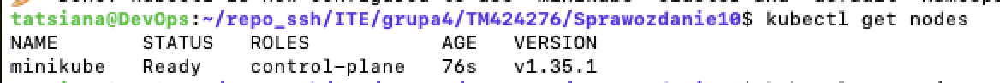
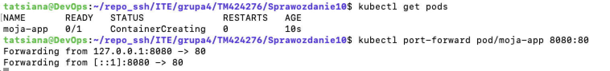
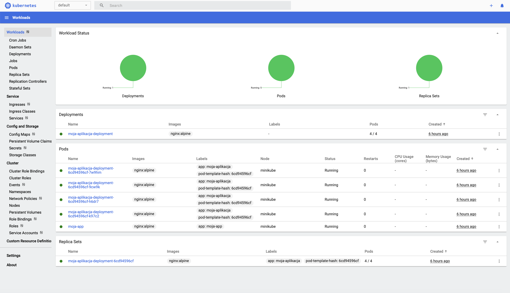
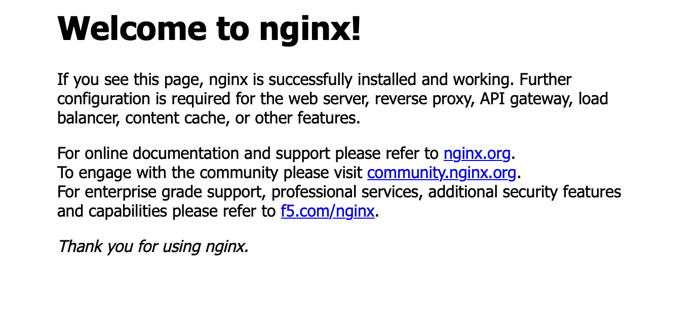

# Sprawozdanie 10 - Wdrażanie na zarządzalne kontenery: Kubernetes

---

## 1. Cel zadania
Celem laboratorium było poznanie technologii orkiestracji kontenerów przy użyciu systemu Kubernetes. Zadanie obejmowało instalację klastra (Minikube), wdrożenie aplikacji w formie Deploymentu oraz zapoznanie się z koncepcjami takimi jak Pody, Serwisy i replikacja kontenerów.

---

## 2. Instalacja i konfiguracja środowiska
Instalację przeprowadzono na maszynie wirtualnej w trybie Bridged. Ze względu na wymagania sprzętowe Kubernetesa, zwiększono liczbę dostępnych procesorów do 2 (VT-x/AMD-V) oraz zarządzono pamięcią RAM (Minikube uruchomiono z parametrem `--memory=1800mb`).

*Rys 1. Potwierdzenie gotowości klastra (`kubectl get nodes`).*

---

## 3. Wdrażanie aplikacji (Deployment)
Zdefiniowano Deployment w pliku `deployment.yml`, określając 4 repliki kontenera `nginx:alpine`.

Po wykonaniu komendy `kubectl apply -f deployment.yml`, pomyślnie zweryfikowano stan wdrożenia z poziomu terminala:

*Rys 2. Potwierdzenie uruchomienia replik aplikacji.*

---

## 4. Graficzny interfejs klastra (Dashboard)
Zgodnie z wymaganiami, uruchomiono wbudowany interfejs zarządzania klastrem za pomocą komendy `minikube dashboard`. Ze względu na pracę w środowisku headless (bez interfejsu graficznego w maszynie wirtualnej), połączono się z nim poprzez tunelowanie portów na maszynę hosta. W interfejsie zweryfikowano poprawność działania utworzonych podów oraz wdrożenia.

*Rys 3. Interfejs graficzny Kubernetes Dashboard ukazujący poprawnie działające pody wdrożonej aplikacji.*

---

## 5. Wystawienie serwisu i weryfikacja
Aplikacja została wyeksponowana za pomocą serwisu typu `NodePort`. Dostęp do usługi docelowej uzyskano poprzez kolejne tunelowanie portów z maszyny hosta (macOS), co pozwoliło na ostateczną weryfikację.

*Rys 4. Strona powitalna Nginx wyświetlona w przeglądarce, będąca dowodem na pełną komunikację z aplikacją w kontenerze.*

---

## 6. Wnioski
1. **Orkiestracja:** Kubernetes automatycznie zarządza cyklem życia kontenerów. W przypadku awarii lub usunięcia poda, Deployment automatycznie tworzy nowy, aby zachować zdefiniowaną, pożądaną liczbę replik.
2. **Problemy sprzętowe:** Wymagania dotyczące liczby rdzeni procesora są kluczowe dla stabilności `control-plane` w Minikube. Zwiększenie zasobów VM pozwoliło na bezproblemowe działanie klastra, nawet przy minimalnej zalecanej ilości pamięci RAM.
3. **Dostępność i monitoring:** Użycie serwisu (`NodePort`) pozwala na bezpieczną abstrakcję usług wewnątrz klastra od infrastruktury sieciowej zewnętrznej, a wbudowany Dashboard znacząco ułatwia monitorowanie zdrowia całego ekosystemu.