# Sprawozdanie 11 - Wdrażanie na zarządzalne kontenery: Kubernetes (2)


**Środowisko:** Minikube (tryb lokalny z użyciem `minikube docker-env`)

---

## 1. Przygotowanie nowych obrazów

Zgodnie z wymaganiami, proces budowy obrazów zrealizowano w wariancie "lokalnie+przeniesienie", kompilując je bezpośrednio wewnątrz demona Dockera działającego w klastrze Minikube. Utworzono trzy warianty aplikacji opartej o obraz `nginx:alpine`:

1. **Wersja 1 (Stabilna):**
   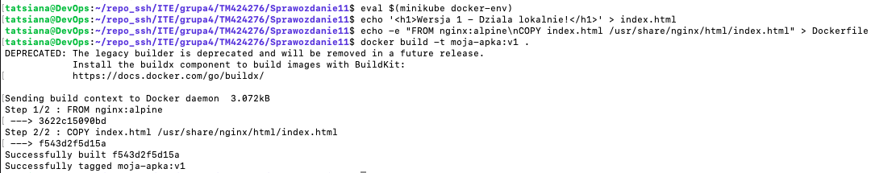

2. **Wersja 2 (Zaktualizowana):**
   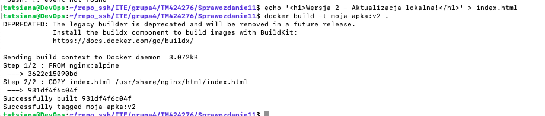

3. **Wersja 3 (Wadliwa):** Zbudowano celowo uszkodzony obraz z błędną komendą startową (`CMD ["nginx", "-g", "zla_komenda;"]`), aby przetestować mechanizmy ratunkowe klastra.
   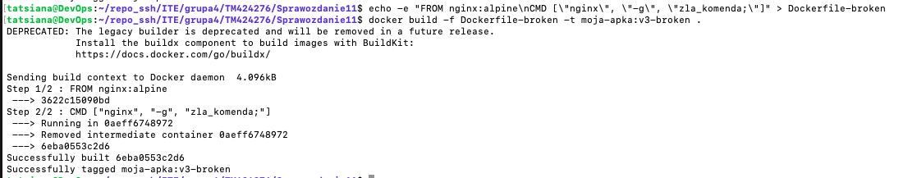

---

## 2. Inicjalizacja wdrożenia i skalowanie (Deployment)

Zdefiniowano plik `deployment.yml`, określając etykiety (`app: lab11-app`) oraz dodając klucz `imagePullPolicy: Never`, wymuszający korzystanie z obrazów zbudowanych lokalnie.

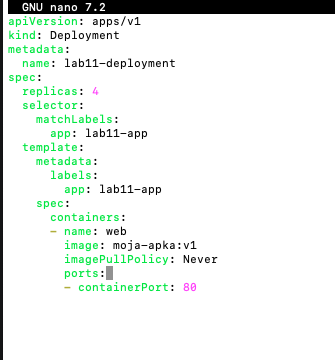

Pomyślnie wdrożono aplikację z 4 replikami:
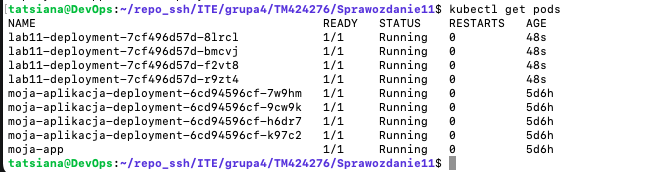

**Testy elastyczności klastra (Skalowanie):**
W ramach weryfikacji mechanizmów orkiestracji przetestowano różne stany pożądane (Desired State) poprzez modyfikację parametru `replicas` w pliku YAML:

* Zwiększenie do 8 replik:
  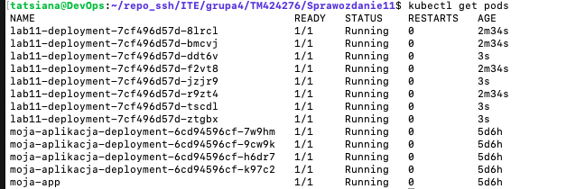
* Zmniejszenie do 1 repliki:
  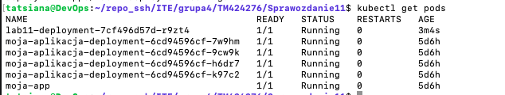
* Całkowite wygaszenie podów (0 replik):
  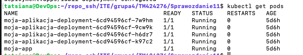

Po testach przywrócono stan stabilny (4 repliki).

---

## 3. Aktualizacje, awarie i kontrola wdrożenia (Rollbacks)

Kolejnym etapem była aktualizacja obrazu aplikacji (Rolling Update) do wersji `v2`. Wdrożenie przeszło pomyślnie bez przerw w dostępie:
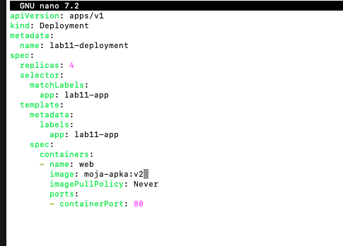

Zweryfikowano wpisy w historii wdrożeń (`kubectl rollout history`):
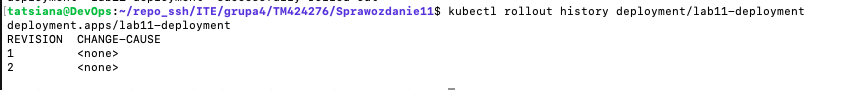

**Symulacja awarii i przywracanie działania:**
Zaktualizowano Deployment, wskazując wadliwy obraz `v3-broken`. Zgodnie z przewidywaniami, nowo powstające pody zgłaszały status `Error` oraz `CrashLoopBackOff`, jednak dzięki działaniu domyślnej strategii, starsze (działające) pody wciąż obsługiwały ruch.
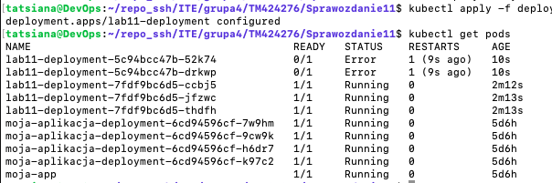

Wykonano komendę ratunkową `kubectl rollout undo deployment/lab11-deployment`, która pomyślnie zabiła wadliwe kontenery i przywróciła stabilną wersję `v2`.
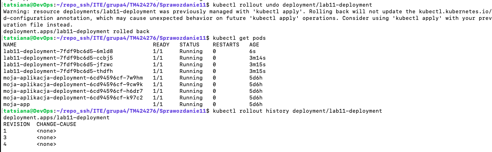

### Skrypt automatycznej weryfikacji wdrożenia
Aby zautomatyzować proces wdrażania (gotowość do wpięcia w pipeline CI/CD, np. Jenkins), utworzono skrypt `check.sh`, weryfikujący poprawność wdrożenia z 60-sekundowym timeoutem:
```bash
#!/bin/bash
echo "Sprawdzam status wdrozenia..."
if kubectl rollout status deployment/lab11-deployment --timeout=60s; then
    echo "Sukces: Wdrozenie zakonczone pomyslnie przed uplywem 60 sekund."
    exit 0
else
    echo "Blad: Wdrozenie nie zdazylo sie wykonac (timeout) lub napotkalo problem."
    exit 1
fi
```
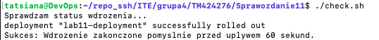

## 4. Strategie wdrożenia i zastosowanie serwisów

W ramach laboratorium przygotowano, przetestowano i zaobserwowano różnice w działaniu trzech różnych strategii aktualizacji aplikacji. Wykorzystano w tym celu system etykiet (labels) oraz obiekty typu Service.

**1. Strategia Recreate (Odtworzenie)**
Zdefiniowano w pliku YAML strategię `type: Recreate`. 
* **Obserwacja:** Po zaaplikowaniu tej strategii i zmianie wersji obrazu, Kubernetes natychmiastowo wysyła sygnał przerwania (SIGTERM) do wszystkich działających podów jednocześnie. Dopiero gdy wszystkie stare kontenery zostaną usunięte, powoływane są nowe.
* **Różnica:** Strategia ta jako jedyna powoduje całkowitą przerwę w dostępie do aplikacji (downtime), ale gwarantuje, że w żadnym momencie nie działają obok siebie dwie różne wersje systemu.
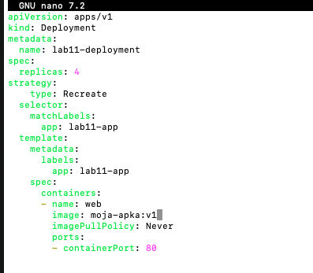

**2. Strategia Rolling Update (Płynna aktualizacja)**
To domyślna strategia Kubernetesa, którą zaimplementowano z niestandardowymi parametrami: `maxSurge: 20%` oraz `maxUnavailable: 1`.
* **Obserwacja:** Proces aktualizacji przebiega stopniowo. Kubernetes uruchamia nowe pody i usuwa stare jeden po drugim.
* **Różnica:** Dzięki parametrowi `maxSurge` klaster mógł tymczasowo przekroczyć pożądaną liczbę 4 replik w trakcie aktualizacji, a `maxUnavailable` gwarantował, że maksymalnie tylko 1 pod mógł być w danym momencie niedostępny. Zapewnia to zerowy czas przestoju (Zero Downtime Deployment).

**3. Strategia Canary Deployment (Kanarek)**
Zastosowano zaawansowaną technikę bezpiecznego wdrażania nowej wersji do produkcji na małej próbce ruchu. Spełniono w ten sposób wymóg użycia serwisu dla wdrożeń z wieloma replikami.
* **Implementacja:** Utworzono dwa oddzielne obiekty Deployment w jednym pliku `canary.yml`:
  * `lab11-main`: 3 repliki na stabilnym obrazie `v1` (etykiety: `app: lab11-app`, `track: stable`).
  * `lab11-canary`: 1 replika na nowym obrazie `v2` (etykiety: `app: lab11-app`, `track: canary`).
* **Rozdzielanie ruchu (Service):** Utworzono obiekt Service typu `NodePort`. Zdefiniowano w nim wspólny selektor obejmujący oba wdrożenia (`app: lab11-app`). 
* **Obserwacja i różnice:** Serwis działający jako Load Balancer automatycznie zaczął rozdzielać ruch na wszystkie 4 pody. Dzięki takiej konfiguracji etykiet, dokładnie 75% ruchu trafiało na wersję stabilną, a 25% żądań trafiało do nowej wersji ("kanarka"). Pozwala to na wczesne wykrycie błędów bez ryzyka dla wszystkich użytkowników.
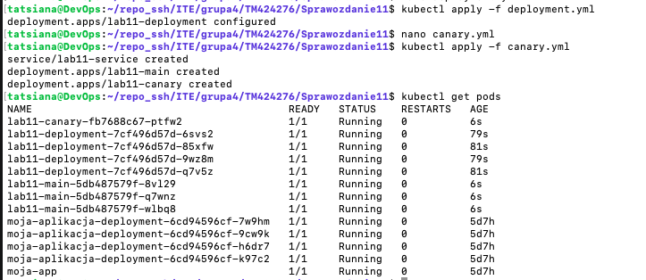

## 5. Wnioski 

Laboratorium potwierdziło wysoką elastyczność i deklaratywność systemu Kubernetes. Skalowanie replik odbywa się natychmiastowo i bezbłędnie. Zastosowanie domyślnej strategii Rolling Update skutecznie ochroniło aplikację przed całkowitą awarią podczas próby wdrożenia wadliwego obrazu. W takich sytuacjach kryzysowych mechanizm rollback działa błyskawicznie, natychmiast przywracając stabilną konfigurację. Autorski skrypt weryfikujący udowodnił z kolei możliwość łatwej automatyzacji tych działań w procesach CI/CD. Przeprowadzone testy różnych strategii pokazały wyraźne różnice w ich biznesowym zastosowaniu. Opcja Recreate wymusza chwilową niedostępność usługi, podczas gdy Rolling Update gwarantuje jej pełną ciągłość. Z kolei Canary Deployment, dzięki odpowiedniemu użyciu serwisów i etykiet, stanowi najbezpieczniejszą metodę testowania zmian na ograniczonej grupie użytkowników.