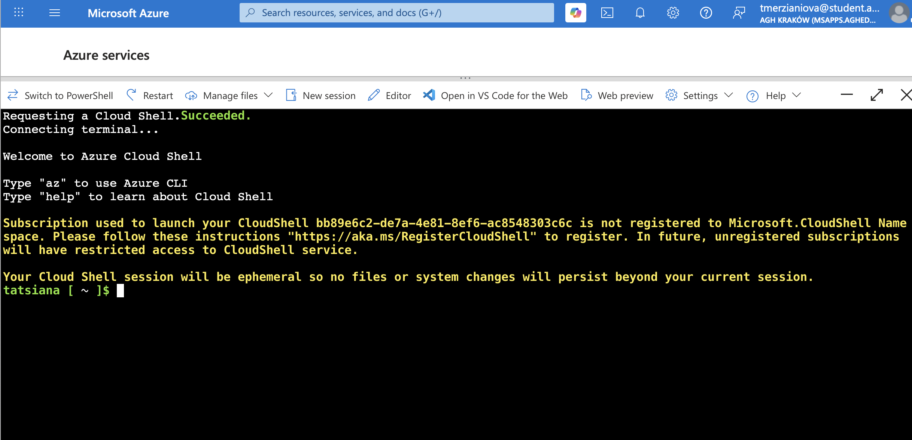
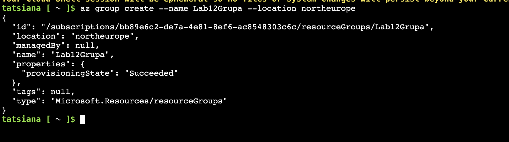
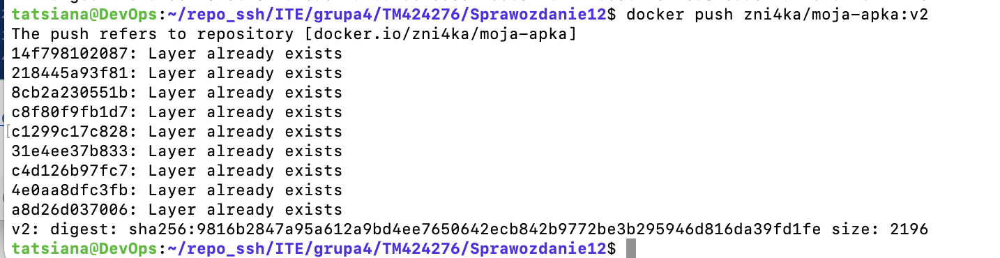
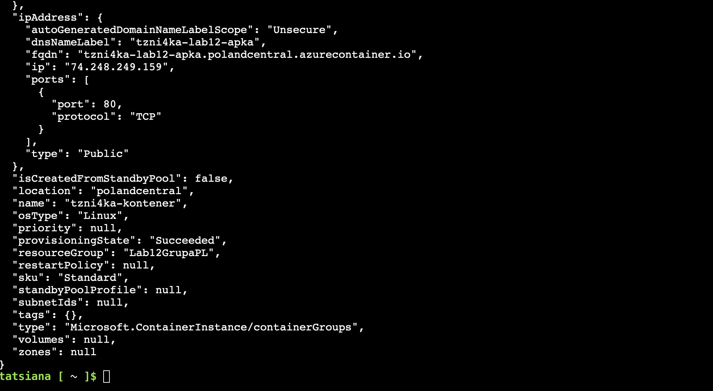
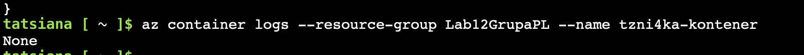
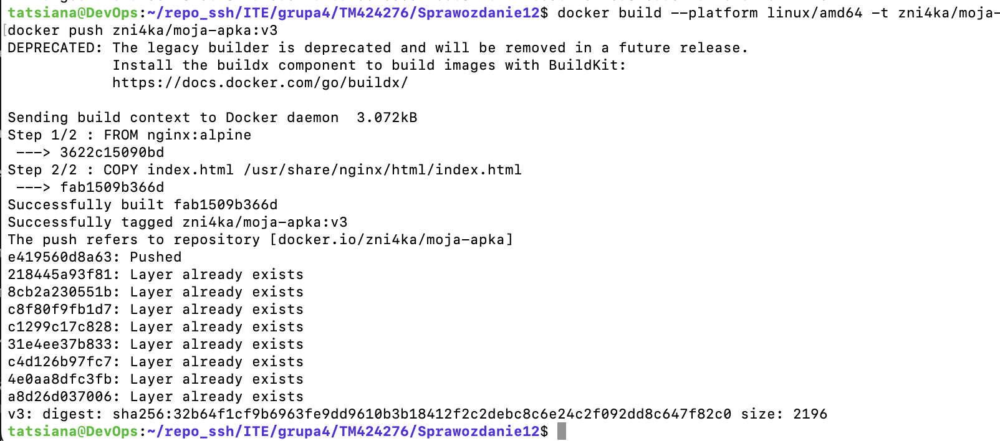
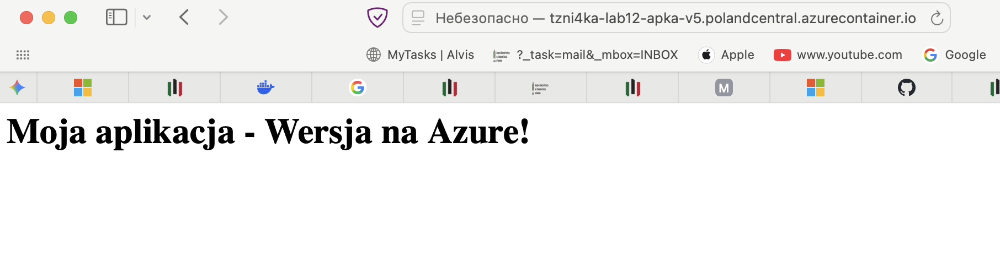
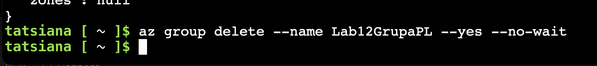

# Sprawozdanie z Laboratorium 12: Usługi Kontenerowe w Microsoft Azure (Azure Container Instances)

**Cel laboratorium:** Praktyczne zapoznanie się z usługą Azure Container Instances (ACI) poprzez wdrożenie własnej, skonteneryzowanej aplikacji internetowej w chmurze publicznej Microsoft Azure oraz diagnozowanie ewentualnych błędów konfiguracyjnych i środowiskowych.

## 1. Przygotowanie środowiska i tworzenie grupy zasobów
Pracę rozpoczęto od zalogowania się do portalu Microsoft Azure przy użyciu konta studenckiego i uruchomienia konsoli Azure Cloud Shell (Bash). 

Następnie utworzono logiczną przestrzeń na zasoby, czyli Resource Group. Ze względu na restrykcje polityk bezpieczeństwa (Policies) nałożone na darmowe subskrypcje edukacyjne, domyślne regiony często odrzucały prośby o wdrożenie. Po kilku testach, grupę zasobów o nazwie `Lab12GrupaPL` z sukcesem utworzono w polskim centrum danych (`polandcentral`).

## 2. Przygotowanie obrazu w lokalnym środowisku (Docker)
W lokalnym środowisku serwerowym przygotowano prosty plik `index.html` z tekstem "Moja aplikacja - Wersja na Azure!" oraz plik `Dockerfile` bazujący na oficjalnym obrazie serwera Nginx. Obraz zbudowano i pomyślnie wysłano do publicznego repozytorium Docker Hub.

## 3. Rozwiązywanie problemów konfiguracyjnych w Azure (Troubleshooting)
Podczas próby wdrożenia obrazu z Docker Huba do usługi Azure Container Instances wystąpiła seria błędów, które wymagały zdiagnozowania:

1. **MissingSubscriptionRegistration:** Konieczna była ręczna rejestracja dostawcy zasobów (Resource Provider) dla modułu `Microsoft.ContainerInstance` na subskrypcji edukacyjnej komendą `az provider register`.
2. **ResourceRequestsNotSpecified:** Region `polandcentral` wymagał jawnego zadeklarowania przydziału zasobów sprzętowych. Do komendy dodano parametry `--cpu 1` oraz `--memory 1`.
3. **InvalidOsType:** Dodano niezbędny parametr `--os-type Linux`.

Po uzupełnieniu tych braków chmura pomyślnie alokowała zasoby i zwróciła status sukcesu (`provisioningState: Succeeded`).

## 4. Problem niezgodności architektur (ARM64 vs AMD64)
Mimo przydzielenia publicznego adresu IP i uruchomienia serwera, kontener natychmiast kończył działanie błędem `CrashLoopBackOff` i statusem `ExitCode 1`. Próba pobrania logów aplikacji poleceniem `az container logs` zwróciła pusty wynik (`None`).

Brak jakichkolwiek logów z poziomu aplikacji (Nginx nie zdążył wystartować) sugerował błąd na najniższym poziomie systemu operacyjnego (tzw. `exec format error`). Zdiagnozowano, że serwer użyty do budowania obrazu działał na procesorze w architekturze **ARM64**, podczas gdy serwery ACI domyślnie oczekują binariów **AMD64** (x86_64).

Próba wymuszenia architektury przy budowaniu za pomocą flagi `--platform linux/amd64` (obraz `v3`) nie przyniosła rezultatu z powodu wykorzystywania przez serwer przestarzałego silnika `legacy builder`, który zignorował tę dyrektywę.

## 5. Zastosowanie obejścia inżynierskiego (Workaround) i sukces
Z powodu niemożności natywnego skompilowania obrazu dla innej platformy na serwerze dostępowym, zastosowano autorską metodę obejścia (wersja `v5`):
1. Ręcznie pobrano prawidłowy, zgodny z chmurą obraz bazowy: `docker pull --platform linux/amd64 nginx:alpine`.
2. Utworzono "pusty" kontener roboczy (`docker create`).
3. Wstrzyknięto plik konfiguracyjny do wewnątrz za pomocą komendy `docker cp`.
4. "Zamrożono" stan kontenera z powrotem do obrazu używając `docker commit` i wysłano go do Docker Hub.

Dzięki temu całkowicie pominięto problematyczny proces `docker build`. Zmodyfikowany w ten sposób obraz wdrożono poleceniem:
`az container create --resource-group Lab12GrupaPL --name tzni4ka-kontener-v5 --image zni4ka/moja-apka:v5 --dns-name-label tzni4ka-lab12-apka-v5 --ports 80 --location polandcentral --os-type Linux --cpu 1 --memory 1`

Aplikacja uruchomiła się poprawnie i była dostępna pod dedykowanym, publicznym adresem FQDN przydzielonym przez platformę Azure.

## 6. Czyszczenie środowiska
Zgodnie z dobrymi praktykami korzystania z chmury obliczeniowej, po zakończeniu pracy i potwierdzeniu poprawnego działania aplikacji, wszystkie zasoby powiązane z laboratorium zostały usunięte w celu uniknięcia niepotrzebnego zużycia budżetu przypisanego do subskrypcji. Użyto do tego polecenia `az group delete`.

**Wnioski:**
Laboratorium udowodniło, że wdrażanie aplikacji kontenerowych w modelu Serverless (ACI) jest szybkie, jednak wymaga ścisłej kontroli nad zgodnością architektur sprzętowych pomiędzy środowiskiem budowania (Host) a środowiskiem uruchomieniowym (Azure). Udowodniono również konieczność uważnej analizy błędów i logów podczas pracy w ograniczonych środowiskach subskrypcji edukacyjnych.