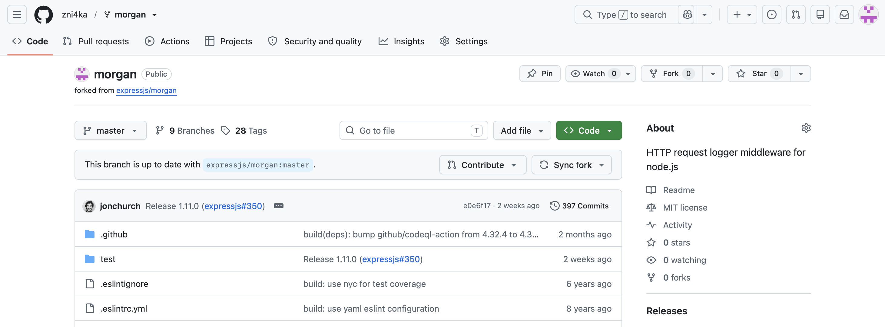
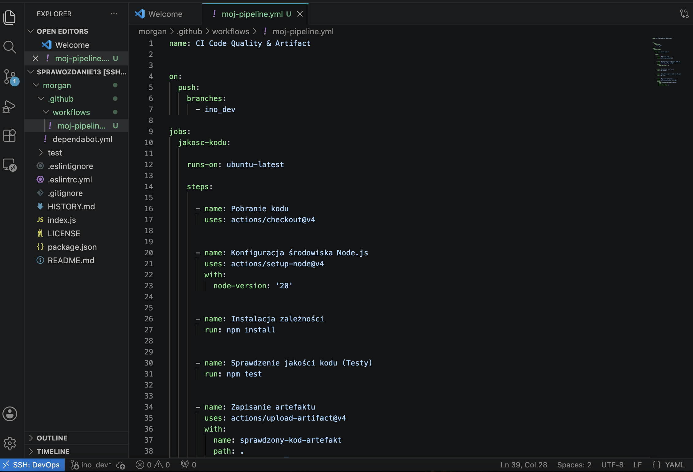
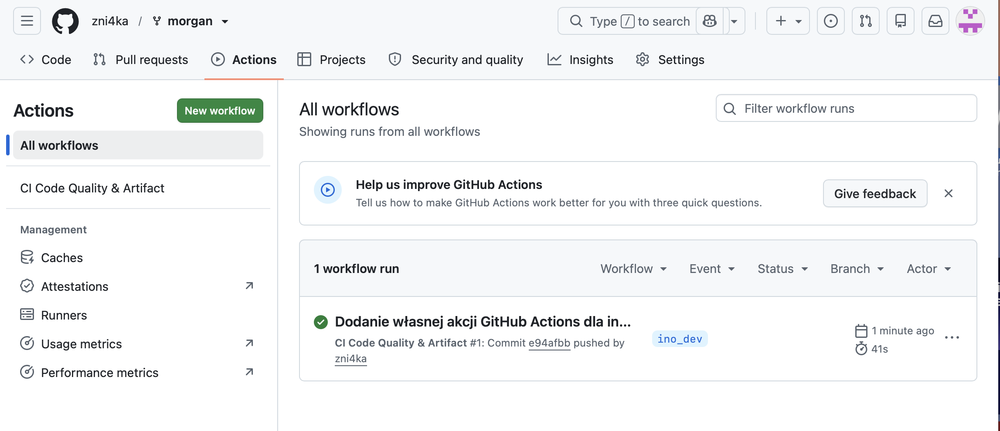
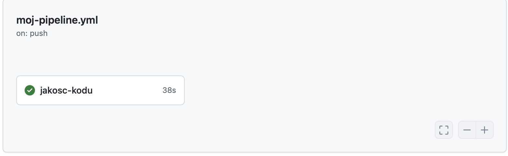
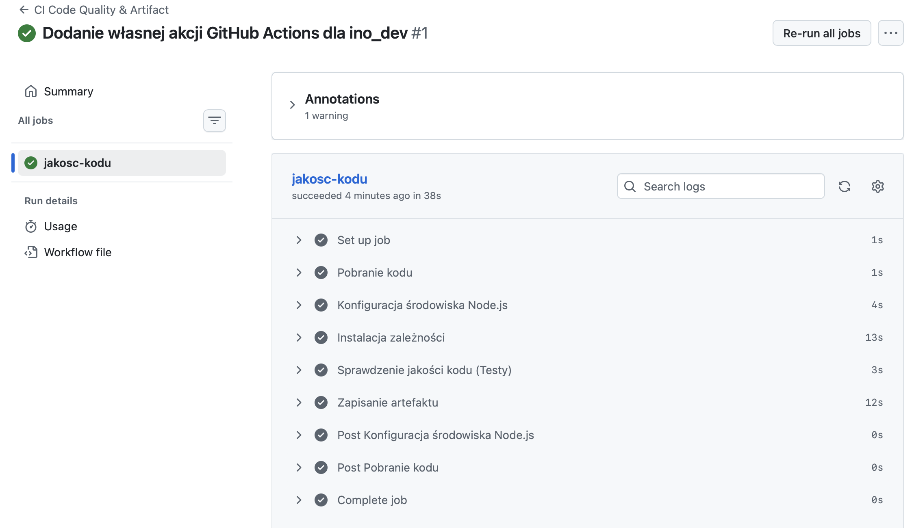
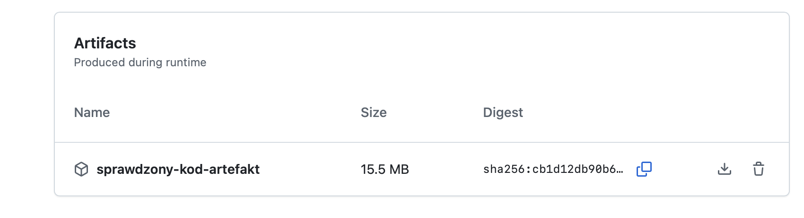

# Sprawozdanie 13 - Shift-left: GitHub Actions

## 1. Cel zadania
Celem laboratorium było zapoznanie się z koncepcją "Shift-left" z wykorzystaniem GitHub Actions. Narzędzie to pozwala na definiowanie potoków CI/CD bezpośrednio w systemie kontroli wersji, blisko kodu źródłowego, bez konieczności stawiania, konfigurowania i utrzymywania zewnętrznych serwerów automatyzacji (jak np. Jenkins).

## 2. Przygotowanie repozytorium (Fork)
Zgodnie z wymogami, wybrano lekki projekt otwartoźródłowy w środowisku Node.js (`expressjs/morgan`), a następnie skopiowano go na własne konto (Fork). 
Aby spełnić założenia laboratoryjne i uniknąć konfliktów z głównym projektem, utworzono dedykowaną gałąź o nazwie `ino_dev` oraz usunięto z projektu wszystkie istniejące, oryginalne pliki potoków.

*Rys 1. Sforkowane repozytorium na własnym koncie GitHub.*

## 3. Konfiguracja własnej Akcji (Pipeline as Code)
W lokalnym środowisku programistycznym (VS Code) utworzono własny plik deklaratywny `.github/workflows/moj-pipeline.yml`. 

**Trigger (Wyzwalacz):** Skonfigurowano go w taki sposób, aby potok uruchamiał się **wyłącznie** po wypchnięciu zmian (push) na konkretną gałąź (`ino_dev`).
Zdefiniowano niezbędne kroki: pobranie kodu, instalację Node.js (v20), instalację zależności (`npm install`), wykonanie testów (`npm test`) oraz na samym końcu akcję pakującą artefakt.

*Rys 2. Definicja potoku w pliku YAML z widoczną aktywną gałęzią ino_dev.*

## 4. Uruchomienie i wizualizacja potoku
Po wysłaniu kodu na platformę GitHub, zdefiniowany wyzwalacz zadziałał poprawnie. Środowisko automatycznie przydzieliło darmową maszynę wirtualną typu runner (`ubuntu-latest`) i uruchomiło proces.

*Rys 3. Poprawnie wyzwolony potok na gałęzi ino_dev widoczny w zakładce Actions.*

*Rys 4. Graficzna reprezentacja wykonanego zadania (Job) "jakosc-kodu".*

## 5. Logi z wykonania (Code Quality)
Zweryfikowano szczegóły wykonania na maszynie wirtualnej GitHuba. Ponieważ aplikacja jest mała i nie wymaga skomplikowanego etapu budowania, wykonano zdefiniowane w projekcie testy jednostkowe, spełniając tym samym narzucony warunek weryfikacji jakości kodu (*code quality*). 

*Rys 5. Logi potwierdzające sukces poszczególnych kroków zdefiniowanych w pliku YAML.*

## 6. Obsługa artefaktów
Zgodnie z ostatnim punktem wymagań, po pomyślnym sprawdzeniu kodu, wynik prac został spakowany za pomocą wbudowanej akcji `actions/upload-artifact@v4`. Wygenerowany plik `sprawdzony-kod-artefakt` został dołączony do podsumowania zadania i udostępniony do pobrania. 

*Rys 6. Gotowy do pobrania artefakt o rozmiarze 15.5 MB.*

## 7. Wnioski
Laboratorium udowodniło efektywność podejścia Shift-left. GitHub Actions pozwala deweloperom na szybką implementację potoków CI/CD bez nakładów na infrastrukturę (model SaaS). Przechowywanie definicji potoków jako kodu (IaC) bezpośrednio w repozytorium gwarantuje ich wersjonowanie. Zastosowanie dedykowanych wyzwalaczy (np. ograniczonych do jednej gałęzi) pozwala na bezpieczne eksperymentowanie bez ryzyka wpłynięcia na główny strumień kodu produkcyjnego.