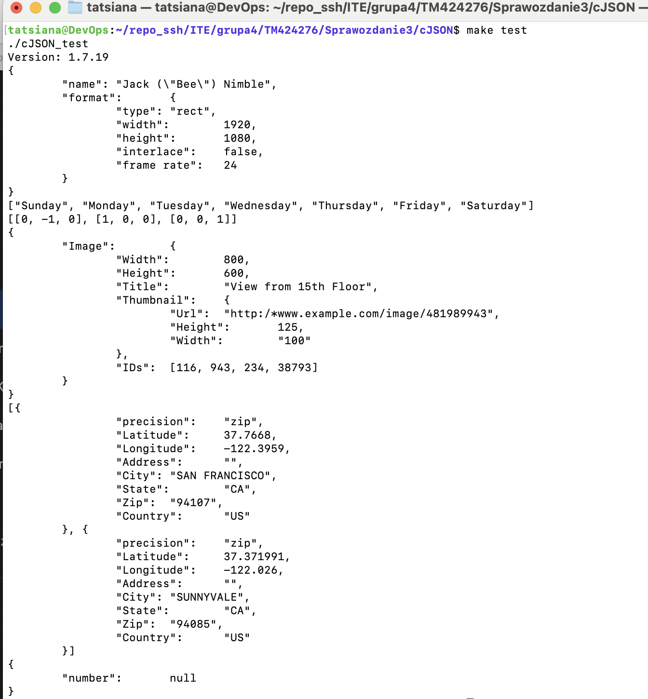
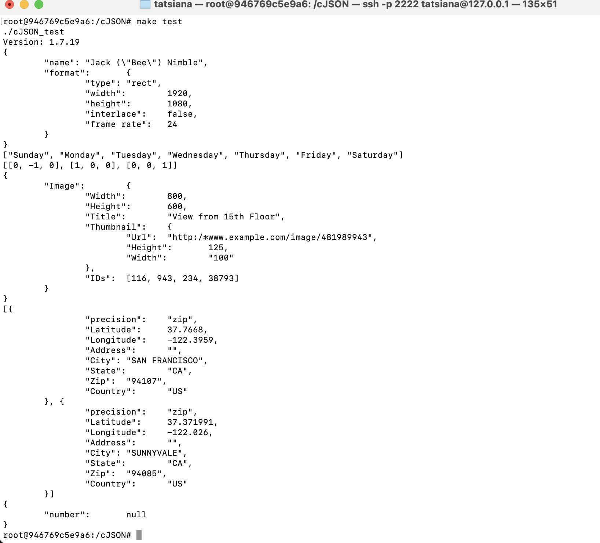
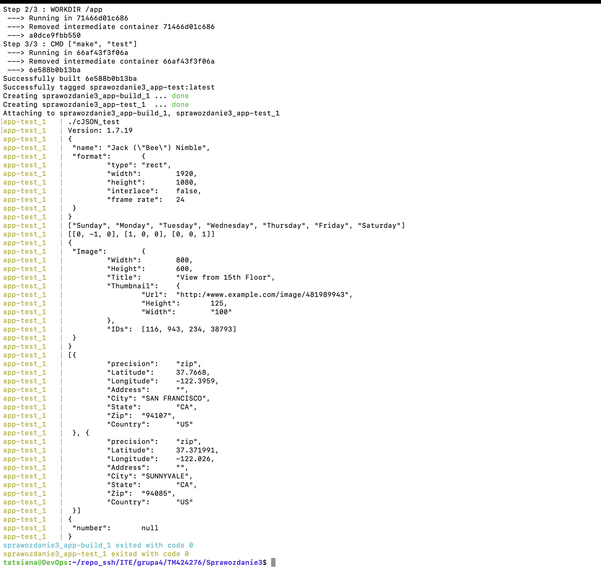

# Sprawozdanie 3 - CI i konteneryzacja procesu budowania

## 1. Wybór aplikacji
Jako oprogramowanie do analizy w ramach niniejszego laboratorium wybrano bibliotekę **cJSON** (autor: Dave Gamble). Jest to lekki parser formatu JSON napisany w języku C. Wybór podyktowany był otwartą licencją (MIT) oraz spełnieniem wszystkich wymagań specyfikacji zadania: projekt posiada zdefiniowany plik `Makefile`. Dzięki temu kompilacja sprowadza się do wywołania polecenia `make`, a testy jednostkowe uruchamiane są za pomocą celu `make test`, dostarczając jednoznaczny wynik na standardowe wyjście.

---

## 2. Build i testy lokalnie (weryfikacja)
Przed przystąpieniem do konteneryzacji procesu, zweryfikowano poprawność kompilacji i testowania bezpośrednio w środowisku maszyny wirtualnej z systemem Ubuntu. Wymagało to doinstalowania niezbędnych narzędzi programistycznych (m.in. kompilatora `gcc` oraz narzędzia `git`).

```bash
sudo apt update
sudo apt install -y build-essential git
git clone [https://github.com/DaveGamble/cJSON.git](https://github.com/DaveGamble/cJSON.git)
cd cJSON
make
make test
```

Proces zakończył się sukcesem – biblioteka została poprawnie zbudowana, a uruchomione testy jednostkowe zwróciły oczekiwane wyniki (sparsowane struktury) na ekran, co potwierdza poprawność kodu.



---

## 3. Izolacja: build interaktywny w kontenerze
W celu wykazania powtarzalności i możliwości pełnej izolacji środowiska, analogiczne kroki zostały wykonane wewnątrz interaktywnego, czystego kontenera bazującego na obrazie Ubuntu.

```bash
docker run -it --name cjson_test_interaktywny ubuntu /bin/bash

# Operacje wykonywane wewnątrz powłoki kontenera:
apt-get update && apt-get install -y build-essential git
git clone [https://github.com/DaveGamble/cJSON.git](https://github.com/DaveGamble/cJSON.git)
cd cJSON
make
make test
exit
```

Konieczność pobrania pakietów i narzędzi od zera oraz poprawne przejście testów w nowym, odizolowanym środowisku potwierdza przenośność procesu kompilacji niezależnie od konfiguracji maszyny hosta.



---

## 4. Automatyzacja za pomocą Dockerfile
Zgodnie z wytycznymi, ręczny proces budowania został zautomatyzowany i podzielony na dwa zhermetyzowane etapy z użyciem plików Dockerfile.

**Plik 1: Dockerfile.build**
Obraz ten odpowiada wyłącznie za przygotowanie środowiska instalacyjnego, sklonowanie repozytorium i zbudowanie aplikacji. W celu uniknięcia blokowania procesu przez interaktywne monity konfiguracyjne (np. przy instalacji stref czasowych), zastosowano flagę `DEBIAN_FRONTEND=noninteractive`.

```dockerfile
FROM ubuntu:latest
ENV DEBIAN_FRONTEND=noninteractive
RUN apt-get update && apt-get install -y build-essential git
WORKDIR /app
RUN git clone [https://github.com/DaveGamble/cJSON.git](https://github.com/DaveGamble/cJSON.git) .
RUN make
```

**Plik 2: Dockerfile.test**
Drugi obraz bazuje na wygenerowanym wcześniej obrazie budującym. Jego jedynym celem jest uruchomienie testów, co pozwala na wyraźne oddzielenie etapu kompilacji od etapu weryfikacji oprogramowania.

```dockerfile
FROM cjson-build:latest
WORKDIR /app
CMD ["make", "test"]
```

---

## 5. Docker Compose (Zadanie dodatkowe)
Zamiast manualnego uruchamiania poleceń `docker build` dla poszczególnych etapów, proces ujęto w kompozycję za pomocą pliku `docker-compose.yml`.

```yaml
version: '3.8'
services:
  app-build:
    build:
      context: .
      dockerfile: Dockerfile.build
    image: cjson-build:latest

  app-test:
    build:
      context: .
      dockerfile: Dockerfile.test
    depends_on:
      - app-build
```

Automatyzację całego przebiegu uruchomiono jednym poleceniem:
```bash
docker-compose up --build
```
Mechanizm Compose automatycznie zbudował obraz bazowy aplikacji (wykorzystując warstwy pamięci podręcznej z poprzednich operacji), a następnie powołał i uruchomił kontener testowy. Zakończenie procesu kodem wyjścia 0 (exit code 0) udowadnia bezbłędną integrację obu środowisk.



---

## 6. Różnica między obrazem a kontenerem
Na podstawie zrealizowanych kroków operacyjnych można wykazać następujące różnice w architekturze narzędzia Docker:
* **Obraz** (np. wygenerowany `cjson-build:latest`) stanowi statyczny, niemutowalny szablon systemu plików i konfiguracji. W analizowanym przypadku zawiera spakowany system operacyjny, narzędzia developerskie oraz skompilowany przed chwilą kod.
* **Kontener** to uruchomiony, aktywny proces instancji danego obrazu. Przykładowo, kontener `app-test` posiadał określony cykl życia – wykonał zadanie sprecyzowane w dyrektywie `CMD` (testy jednostkowe), przesłał wyniki na strumień wyjściowy i natychmiast uległ zatrzymaniu.

---

## 7. Dyskusja: Wdrażanie oprogramowania (Deploy)

**Czy program nadaje się do publikowania jako kontener?**
Biblioteka `cJSON` to współdzielona biblioteka języka C, nie stanowiąca samodzielnej usługi sieciowej czy demona działającego w tle. Wdrażanie jej w formie stale funkcjonującego kontenera mija się z celem aplikacyjnym. Środowisko kontenerowe pełni tu wyłącznie funkcję potoku CI (Continuous Integration), pozwalającego na powtarzalną kompilację i weryfikację bezpieczeństwa kodu.

**Przygotowanie finalnego artefaktu i forma dystrybucji**
Publikacja "surowego" obrazu pozyskanego po buildzie nie jest odpowiednia dla środowisk produkcyjnych. Obraz taki zawiera historię zmian, kody źródłowe oraz pakiety pokroju `gcc`, które znacząco zwiększają objętość obrazu i stanowią wektor ataku (podatność na wykonanie niepożądanego kodu). 

Przygotowanie właściwego wdrożenia powinno przebiegać z użyciem architektury wieloetapowej (*Multi-stage build*). Wymagałoby to zastosowania np. "trzeciego kontenera", którego zadaniem byłoby wyekstrahowanie wyłącznie gotowych plików wyjściowych (artefakty `.so` oraz `.a`) i umieszczenie ich w minimalnym kontenerze środowiskowym (deploy) lub dystrybucja bez użycia Dockera. Dla bibliotek C powszechnym i zalecanym standardem oprogramowania na platformach Linux jest pakietyzacja archiwów. Dedykowany kontener wdrożeniowy mógłby za pomocą narzędzi pokroju `dpkg-deb` spakować skompilowaną bibliotekę w gotowy dystrybucyjny format `.deb` i wypchnąć pakiet do centralnego repozytorium logistyki oprogramowania.