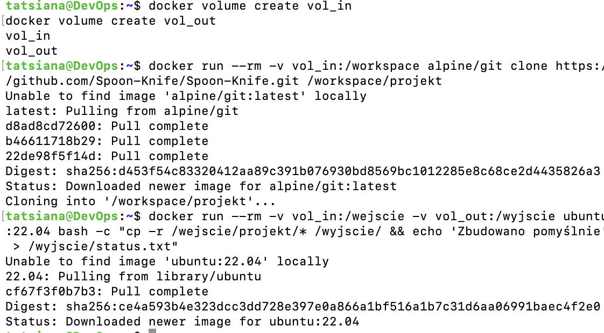
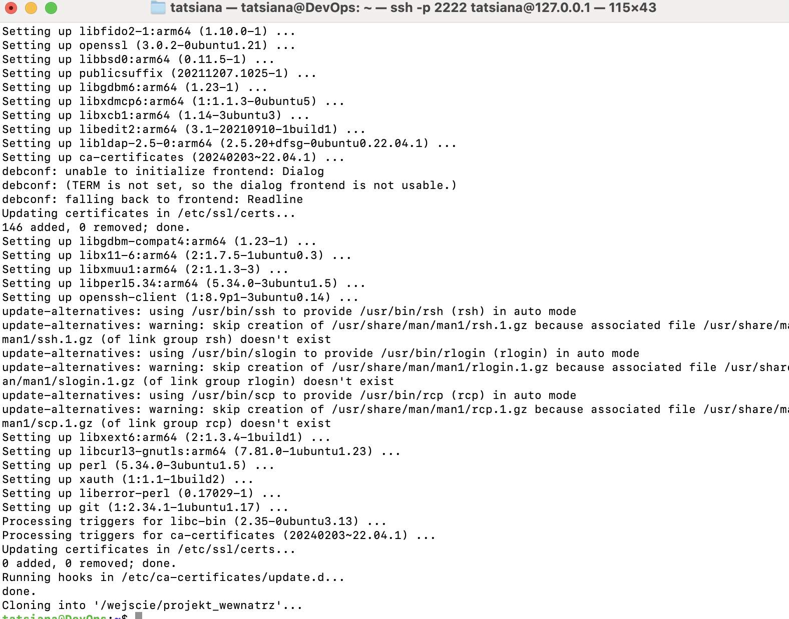
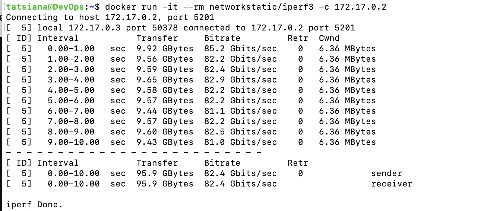
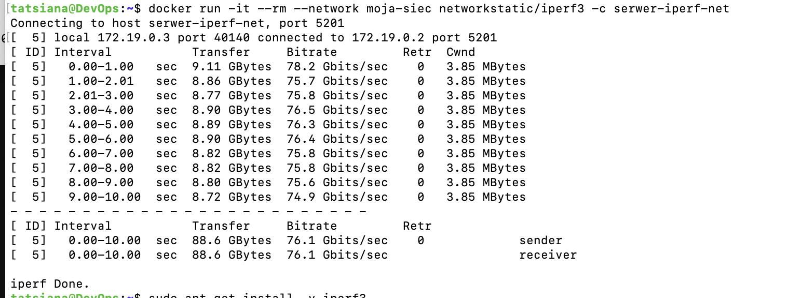
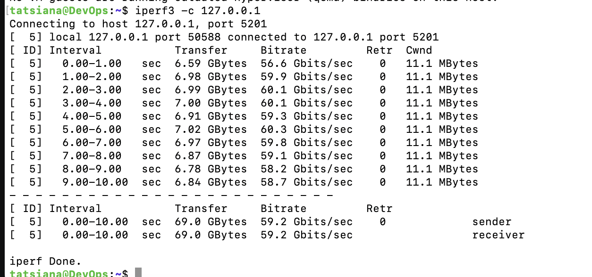
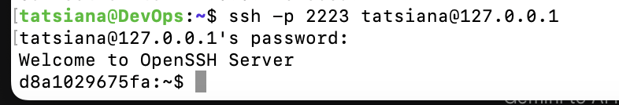
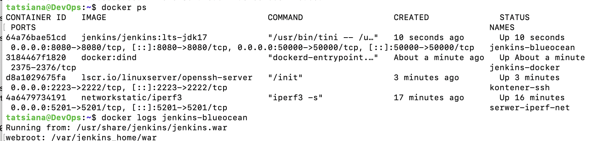
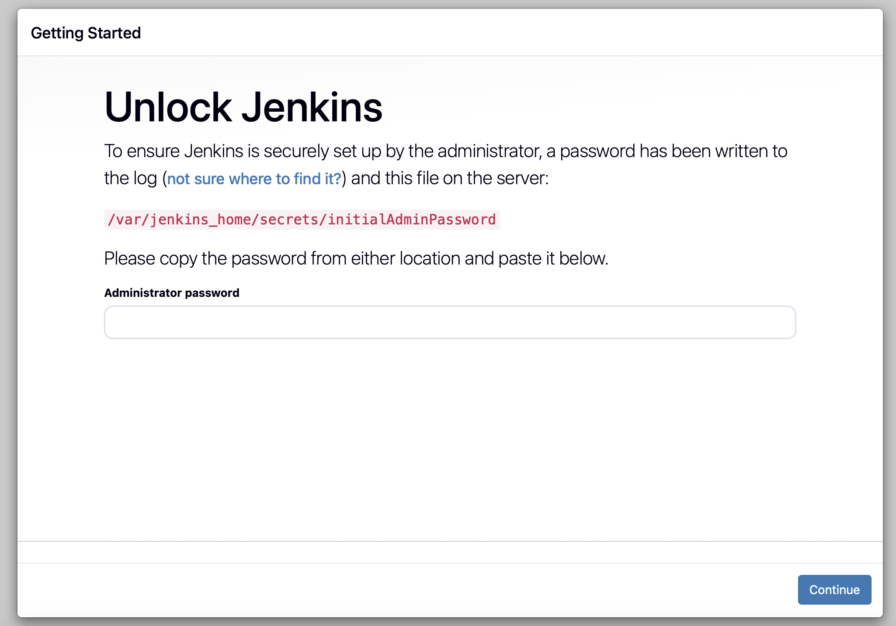

# Sprawozdanie 4 - Dodatkowa terminologia w konteneryzacji, instancja Jenkins

## 1. Zachowywanie stanu między kontenerami (Woluminy)

**Opis realizacji:**
Utworzono dwa woluminy: `vol_in` (wejściowy) oraz `vol_out` (wyjściowy).
Aby pobrać kod źródłowy na wolumin wejściowy bez instalowania programu Git w kontenerze bazowym, wykorzystano jednorazowy **kontener pomocniczy** (*helper container*) oparty na obrazie `alpine/git`. 

**Dlaczego wybrano to podejście?**
Zgodnie z dobrymi praktykami, kontener bazowy (uruchomieniowy/budujący) powinien zawierać wyłącznie narzędzia niezbędne do jego głównego zadania. Instalowanie w nim Gita niepotrzebnie powiększyłoby rozmiar finalnego obrazu oraz stworzyło potencjalną lukę w bezpieczeństwie. Kontener pomocniczy pobrał repozytorium na wolumin i natychmiast uległ zniszczeniu, zostawiając czysty kod gotowy dla docelowego kontenera bazowego (Ubuntu).

**Dowody wykonania:**

**Wykorzystanie `RUN --mount` w pliku Dockerfile:**
Alternatywnym podejściem jest użycie instrukcji `RUN --mount=type=bind` podczas budowania obrazu. Pozwala to na zamontowanie kodu źródłowego z hosta tylko na czas trwania konkretnego kroku kompilacji. Zbudowane pliki są następnie kopiowane do finalnego obrazu, a sam kod źródłowy nie zostaje na stałe wbudowany w warstwy, co znacząco optymalizuje wielkość obrazu.

---

## 2. Eksponowanie portu i łączność między kontenerami (IPerf)

**Opis realizacji:**
Przeprowadzono pomiary przepustowości sieciowej za pomocą narzędzia IPerf w trzech scenariuszach:
1. **Domyślna sieć Dockera:** Połączenie z serwerem iperf3 z użyciem jego wewnętrznego adresu IP.
2. **Własna sieć mostkowa (Bridge):** Połączenie z wykorzystaniem mechanizmu rozwiązywania nazw (DNS Dockera). Zamiast adresu IP użyto nazwy kontenera: `serwer-iperf-net`.
3. **Z poziomu hosta:** Dzięki wyeksponowaniu portu (`-p 5201:5201`) połączono się z serwerem IPerf bezpośrednio z lokalnego systemu hosta (127.0.0.1).

**Wyniki i wnioski:**
Uzyskano bardzo wysokie transfery. Wynika to z faktu, że kontenery komunikują się ze sobą wewnątrz pamięci hosta, z pominięciem fizycznych kart sieciowych (używają wirtualnego interfejsu). 

**Dowody wykonania:**

---

## 3. Usługi w rozumieniu systemu i kontenera (SSHD)

**Opis realizacji:**
Uruchomiono kontener z usługą OpenSSH, a następnie nawiązano z nim pomyślne połączenie z poziomu hosta z wykorzystaniem wyeksponowanego portu 2223.

**Dowód wykonania:**

**Analiza - Zalety i wady SSH w kontenerze:**
* **Zalety (Przypadki użycia):**
  * Ułatwia migrację starych, monolitycznych aplikacji typu "lift-and-shift" do chmury, symulując zachowanie klasycznej maszyny wirtualnej.
  * Wykorzystywane przez niektóre zdalne środowiska deweloperskie do nawiązywania bezpośredniego połączenia z przestrzenią roboczą programisty.
* **Wady (Antywzorzec w DevOps):**
  * Łamie kluczową zasadę Dockera: "jeden kontener = jeden proces".
  * Demon SSHD działający w tle zużywa zasoby i znacząco powiększa bazowy obraz.
  * Otwarty port SSH stanowi niepotrzebny wektor ataku (ryzyko bezpieczeństwa).
  * Do klasycznego debugowania powinno się używać natywnej komendy silnika: `docker exec -it <nazwa_kontenera> /bin/bash`.

---

## 4. Przygotowanie do uruchomienia serwera Jenkins (DinD)

**Opis realizacji:**
Utworzono dedykowaną sieć i uruchomiono skonteneryzowaną instancję serwera CI Jenkins współpracującą z pomocniczym kontenerem Docker-in-Docker (DinD). Konfiguracja ta pozwala Jenkinsowi na bezpieczne i izolowane uruchamianie własnych kontenerów w trakcie procesów budowania.

Proces zakończono pełną inicjalizacją środowiska i odblokowaniem serwera za pomocą wygenerowanego hasła administratora.

**Dowody wykonania:**

