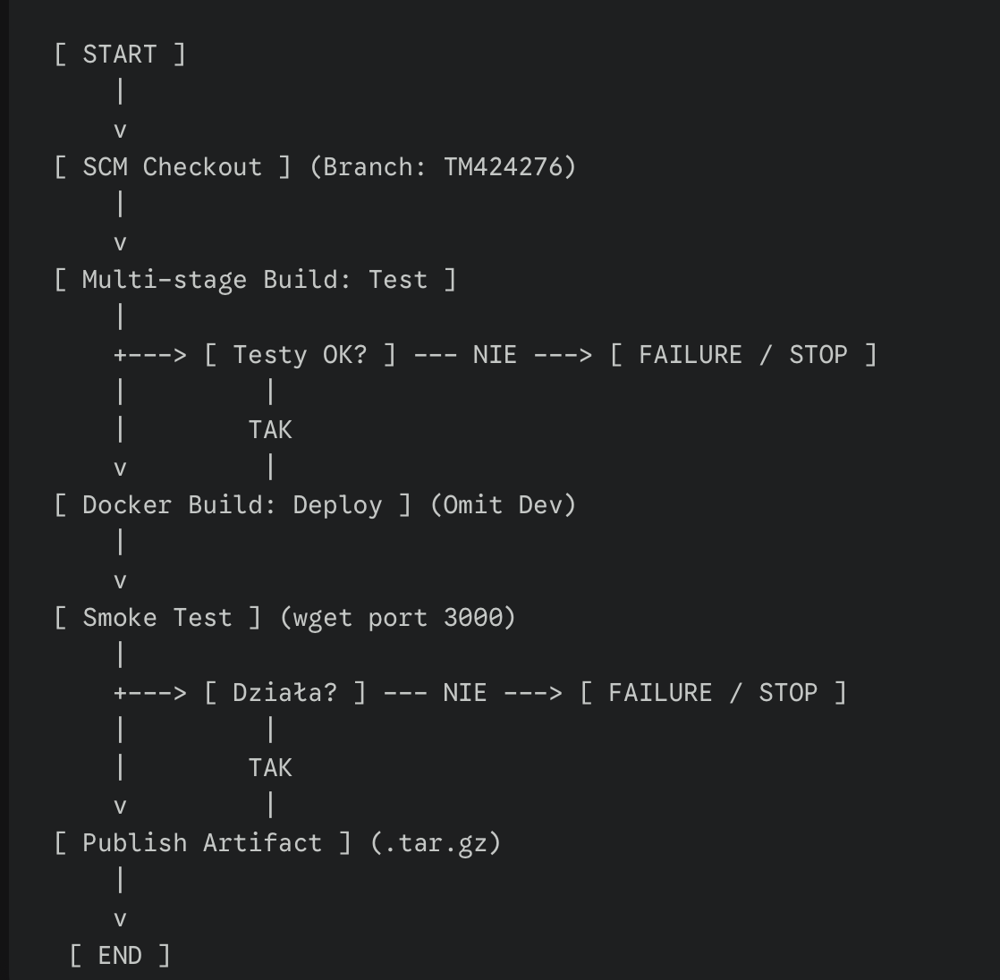
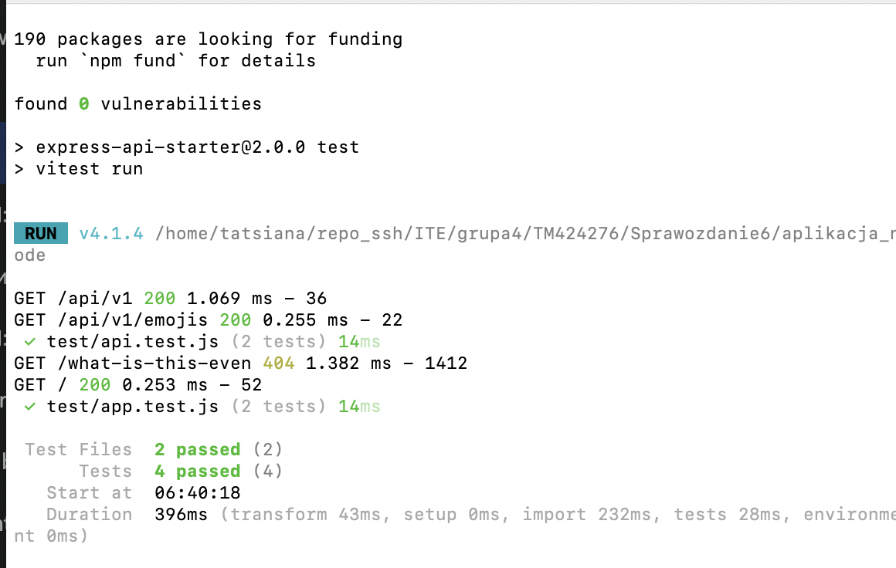
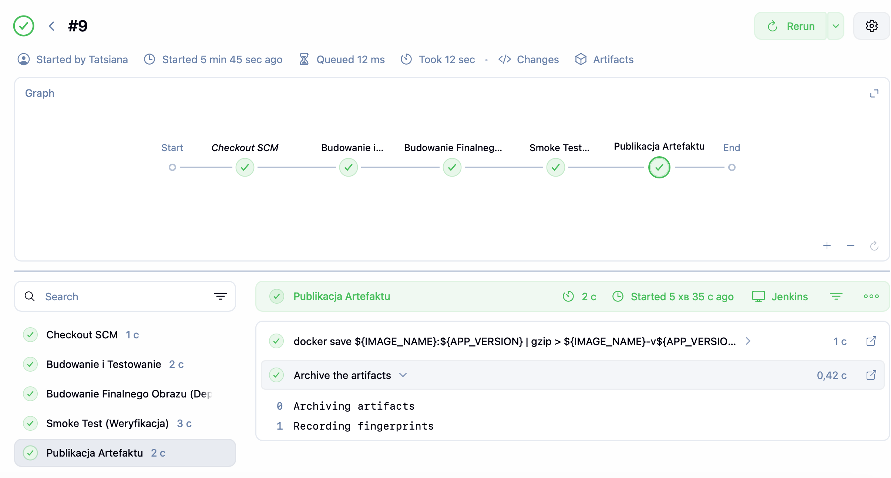
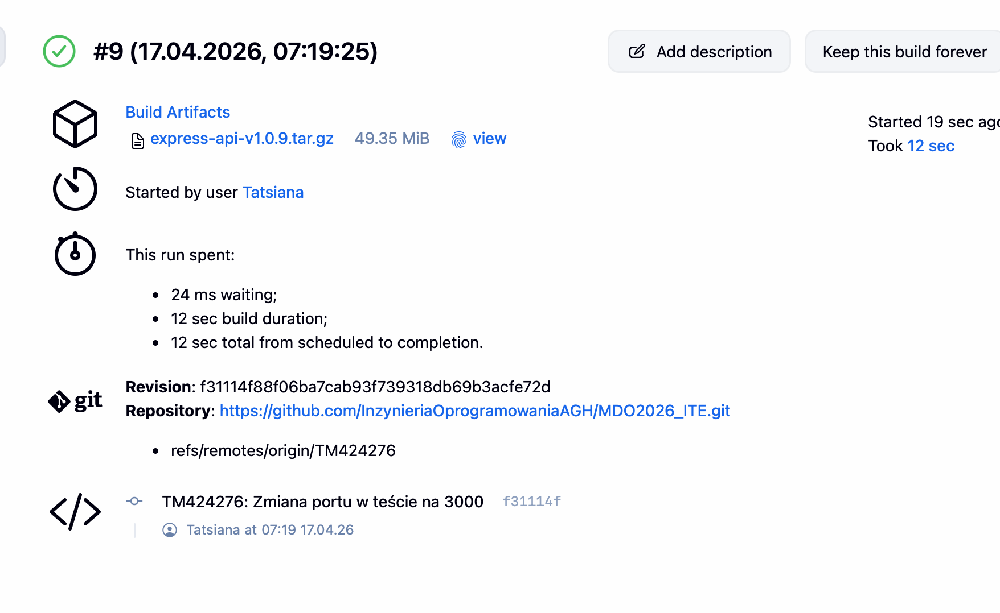
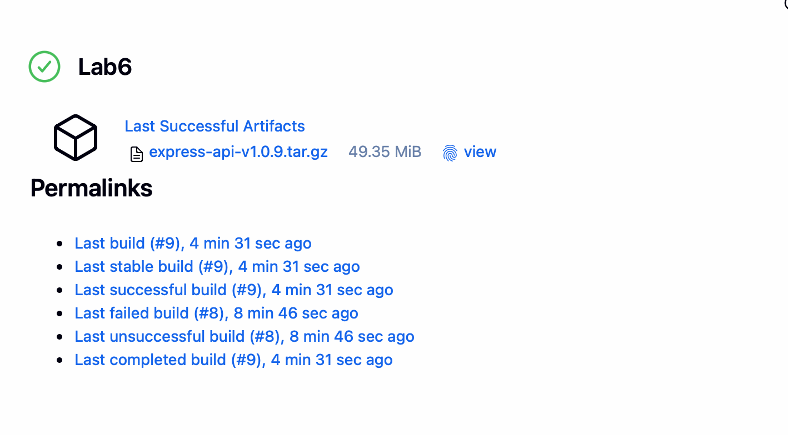

# Sprawozdanie z Laboratorium nr 06
**Autor:** Tatsiana  
**Temat:** Implementacja pełnego potoku CI/CD z wykorzystaniem Jenkins i Docker dla aplikacji Node.js.

---

## 1. Wybór aplikacji i analiza wstępna
* **Aplikacja:** `express-api-starter` (Node.js/Express).
* **Licencja:** MIT – licencja open-source pozwalająca na swobodne użycie i dystrybucję kodu.
* **Repozytorium:** Wykorzystano dedykowany branch `TM424276` w głównym repozytorium grupy. Zdecydowano się na pracę wewnątrz brancha zamiast forka, aby zapewnić pełną integrację z instancją Jenkinsa.
* **Weryfikacja lokalna:** Program pomyślnie przechodzi budowanie i dołączone testy jednostkowe.

---

## 2. Plan procesu CI/CD (Diagram UML)

Poniższy diagram aktywności (UML Activity Diagram) przedstawia zaplanowany i zaimplementowany przepływ pracy w potoku CI/CD. Schemat ilustruje przejście od pobrania kodu, przez wieloetapowe budowanie i testowanie w kontenerach, aż po końcową publikację artefaktu.


**Logika procesu (Workflow):**

1.  **SCM Checkout:** Jenkins pobiera aktualną wersję kodu z gałęzi `TM424276` repozytorium GitHub.
2.  **Multi-stage Docker Build (Test stage):** Budowany jest obraz tymczasowy, w którym automatycznie uruchamiane są testy jednostkowe. Niepowodzenie testów skutkuje natychmiastowym przerwaniem potoku.
3.  **Deploy Image Creation:** Po pomyślnym zaliczeniu testów budowany jest docelowy, zoptymalizowany obraz produkcyjny (pozbawiony zależności deweloperskich).
4.  **Smoke Test:** Kontener produkcyjny jest uruchamiany tymczasowo, a skrypt weryfikuje dostępność aplikacji na porcie 3000 za pomocą narzędzia `wget`.
5.  **Artifact Archiving:** Pozytywnie zweryfikowany obraz zostaje wyeksportowany do pliku `.tar.gz`, opatrzony numerem wersji (`1.0.${BUILD_ID}`) i zarchiwizowany jako artefakt Jenkinsa.

---

## 3. Realizacja ścieżki krytycznej

### 3.1. Konteneryzacja (Dockerfile)
Wybrano kontener bazowy `node:20-alpine` ze względu na jego lekkość i bezpieczeństwo. Zastosowano mechanizm **Multi-stage build**, dzieląc proces na trzy etapy: budowanie zależności, testowanie oraz przygotowanie obrazu produkcyjnego.

**Uzasadnienie:** Kontener budujący (`build`) posiada pełne środowisko deweloperskie potrzebne do kompilacji i testów. Kontener produkcyjny (`deploy`) jest zoptymalizowany – zawiera tylko niezbędne pliki źródłowe i zależności produkcyjne (`--omit=dev`).

```dockerfile
# ETAP 1: Build & Dependencies
FROM node:20-alpine AS build
WORKDIR /app
COPY package*.json ./
RUN npm install
COPY . .

# ETAP 2: Testy (Oparty o etap build)
FROM build AS test
RUN npm test > test_results.txt || (cat test_results.txt && exit 1)

# ETAP 3: Deploy (Obraz finalny)
FROM node:20-alpine AS deploy
WORKDIR /app
COPY package*.json ./
RUN npm install --omit=dev
COPY src ./src
COPY .env.sample .env
EXPOSE 3000
CMD ["npm", "start"]
```

### 3.2. Definicja Pipeline (Jenkinsfile)

Proces jest w pełni zautomatyzowany. Każdy krok potoku jest monitorowany, a logi są przypisane do numeru buildu.

```Groovy
pipeline {
    agent any
    environment {
        APP_VERSION = "1.0.${env.BUILD_ID}"
        IMAGE_NAME = "express-api"
        WORK_DIR = "grupa4/TM424276/Sprawozdanie6/aplikacja_node"
    }
    stages {
        stage('Budowanie i Testowanie') {
            steps {
                dir("${WORK_DIR}") {
                    sh 'docker build --target test -t ${IMAGE_NAME}-test .'
                }
            }
        }
        stage('Budowanie Obrazu Deploy') {
            steps {
                dir("${WORK_DIR}") {
                    sh 'docker build --target deploy -t ${IMAGE_NAME}:${APP_VERSION} .'
                }
            }
        }
        stage('Smoke Test (Weryfikacja)') {
            steps {
                dir("${WORK_DIR}") {
                    sh 'docker run -d --name smoke-test-app ${IMAGE_NAME}:${APP_VERSION}'
                    sleep 5
                    sh 'docker exec smoke-test-app wget -qO- http://localhost:3000/ || exit 1'
                }
            }
            post {
                always { sh 'docker rm -f smoke-test-app' }
            }
        }
        stage('Publikacja Artefaktu') {
            steps {
                dir("${WORK_DIR}") {
                    sh 'docker save ${IMAGE_NAME}:${APP_VERSION} | gzip > ${IMAGE_NAME}-v${APP_VERSION}.tar.gz'
                    archiveArtifacts artifacts: '*.tar.gz', fingerprint: true
                }
            }
        }
    }
}
```
## 4. Weryfikacja i Wyniki
### 4.1. Skuteczność testów

Budowanie i testowanie odbywa się wewnątrz kontenera, co gwarantuje spójność środowiskową.



### 4.2. Smoke Test (Weryfikacja integracyjna)

Poprawność pracy aplikacji weryfikowana jest przez uruchomienie kontenera deploy i sprawdzenie dostępności usługi na porcie 3000.



### 4.3. Publikacja i Wersjonowanie

Artefakt: Archiwum tar.gz zawierające obraz Docker.

Uzasadnienie wyboru: Wybrano obraz kontenera, ponieważ zapewnia on najwyższą przenośność (kod, środowisko uruchomieniowe i zależności w jednym pliku).

Wersjonowanie: Zastosowano system 1.0.ID_BUILDU. Pozwala to na pełną identyfikowalność artefaktu w relacji do historii budowania w Jenkinsie.





## 5. Podsumowanie
Zrealizowano pełną ścieżkę CI/CD dla aplikacji Node.js. Proces obejmuje automatyczne testy, konteneryzację oraz weryfikację integracyjną. Finalny artefakt jest wersjonowany i gotowy do wdrożenia.