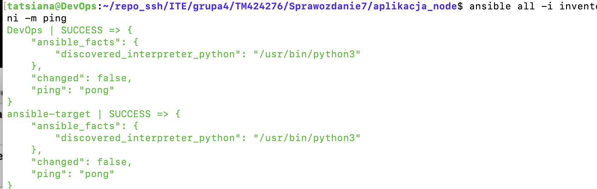
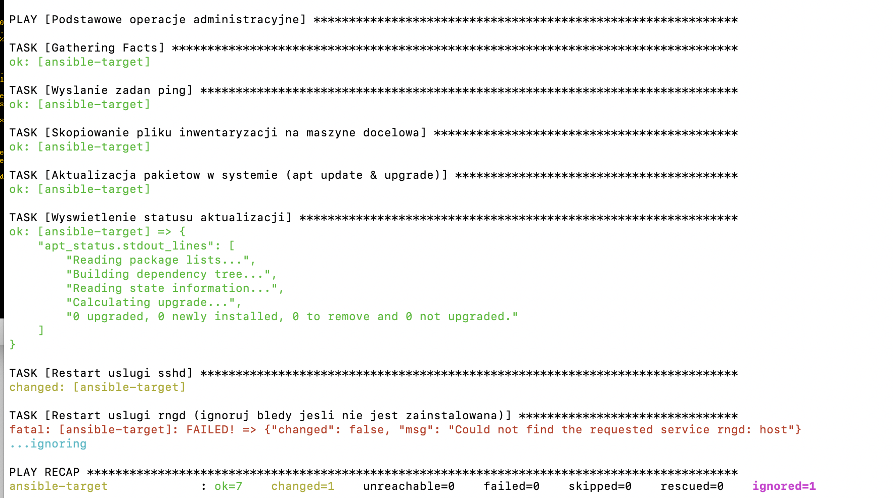
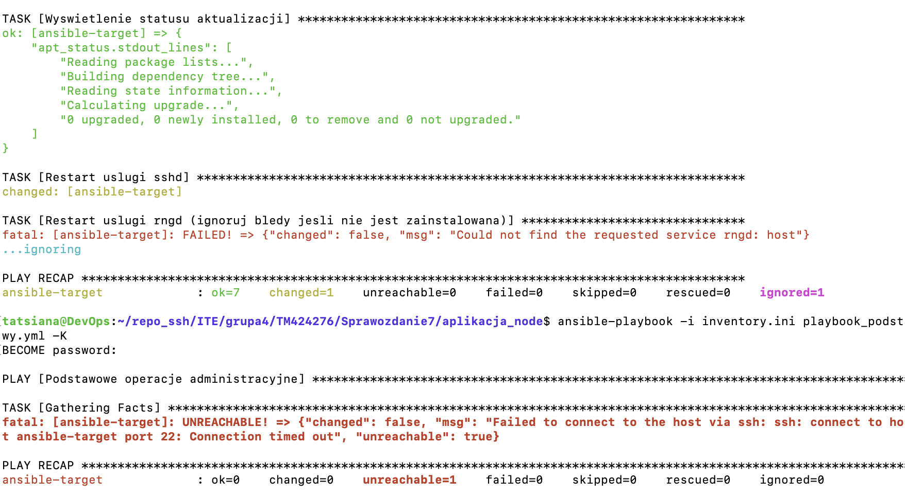
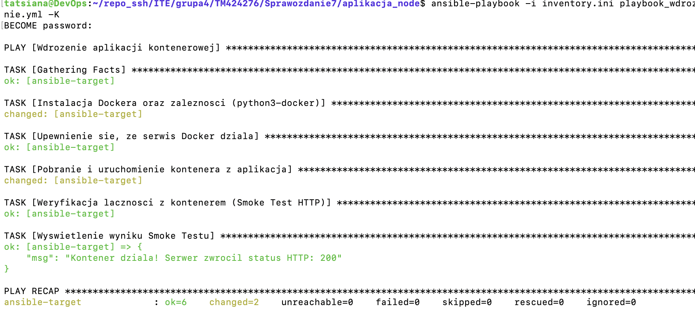
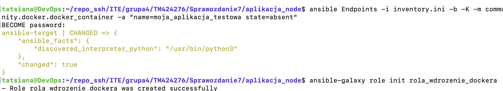

# Sprawozdanie 08 - Automatyzacja za pomocą Ansible

---

## 1. Przygotowanie środowiska i instalacja Ansible

W ramach zadania przygotowano drugą maszynę wirtualną o minimalnej konfiguracji:
* **Nazwa (hostname):** `ansible-target`
* **Użytkownik:** `ansible`
* **Parametry:** 1 GB RAM, system Ubuntu Server (ARM64), karta sieciowa w trybie mostka (Bridged).

Na głównej maszynie zainstalowano oprogramowanie Ansible. Następnie wygenerowano klucze SSH i przesłano je na maszynę docelową za pomocą polecenia `ssh-copy-id`, co umożliwiło logowanie bezhasłowe (testowane komendą `ssh ansible@ansible-target`).

### Inwentaryzacja i weryfikacja łączności
Stworzono plik `inventory.ini`, dzieląc maszyny na sekcje `Orchestrators` oraz `Endpoints`. Pierwszym krokiem było sprawdzenie komunikacji za pomocą modułu `ping` (polecenie ad-hoc).

*Rys 1. Pomyślny test ping (pong) dla obu zdefiniowanych maszyn.*

---

## 2. Zdalne wywoływanie procedur (Playbook podstawowy)

Przygotowano playbook `playbook_podstawy.yml`, który realizował następujące zadania:
* Wysyłanie żądania `ping`.
* Kopiowanie pliku inwentaryzacji na maszynę docelową (`/tmp/inventory_backup.ini`).
* Aktualizacja pakietów systemowych (`apt update & upgrade`).
* Restart usług systemowych (`ssh` oraz ignorowanie błędu dla brakującej usługi `rngd`).

*Rys 2. Logi z wykonania podstawowych operacji administracyjnych.*

### Test odporności na awarie (odpięta karta sieciowa)
Zgodnie z wymaganiami, przeprowadzono test przy odłączonym kablu sieciowym w ustawieniach VirtualBox dla maszyny `ansible-target`. 

*Rys 3. Ansible poprawnie raportuje błąd UNREACHABLE w przypadku braku łączności sieciowej.*

---

## 3. Zarządzanie artefaktem (Docker)

Głównym celem było pełne wdrożenie kontenera na maszynie docelowej. Playbook `playbook_wdrozenie.yml` automatycznie:
1. Zainstalował silnik **Docker** oraz bibliotekę `python3-docker`.
2. Upewnił się, że usługa Docker jest uruchomiona.
3. Uruchomił kontener z obrazem `nginx:alpine` (mapowanie portów 8080:80).
4. Wykonał *smoke test* (moduł `uri`), aby upewnić się, że aplikacja odpowiada poprawnie.

*Rys 4. Pomyślne wdrożenie aplikacji kontenerowej – widoczny status HTTP 200.*

---

## 4. Sprzątanie i struktura ról

Po zakończeniu testów środowisko docelowe zostało oczyszczone z kontenera przy użyciu modułu `community.docker.docker_container` z parametrem `state: absent`. 

Ostatnim etapem było przekształcenie playbooka w profesjonalną strukturę roli Ansible za pomocą narzędzia `ansible-galaxy`.

*Rys 5. Usunięcie kontenera oraz inicjalizacja struktury roli za pomocą ansible-galaxy.*

---

## 5. Wnioski

1. **Efektywność automatyzacji:** Ansible znacząco skraca czas konfiguracji nowych węzłów. Ręczna instalacja Dockera i konfiguracja kontenera zajęłaby znacznie więcej czasu niż wykonanie gotowego skryptu (playbooka).
2. **Bezpieczeństwo i idempotentność:** Dzięki wykorzystaniu kluczy SSH oraz mechanizmów Ansible, operacje są powtarzalne i bezpieczne. System dąży do zadanego stanu (idempotentność), co oznacza, że ponowne uruchomienie skryptu nie spowoduje błędów, jeśli zadania są już wykonane.
3. **Zarządzanie infrastrukturą jako kod (IaC):** Przechowywanie konfiguracji w formie ról i playbooków ułatwia wersjonowanie infrastruktury oraz współpracę w zespole DevOps.
4. **Odporność na błędy:** Narzędzie poprawnie wykrywa problemy z łącznością (test z odpiętym kablem) oraz pozwala na elastyczne zarządzanie błędami (np. ignorowanie braku niekrytycznych usług jak `rngd`).

---
