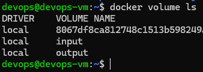
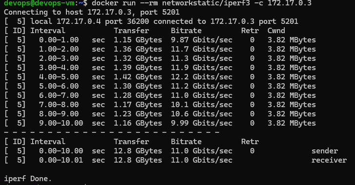
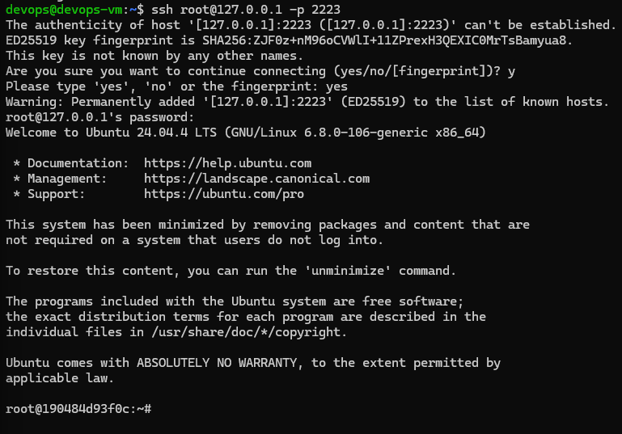
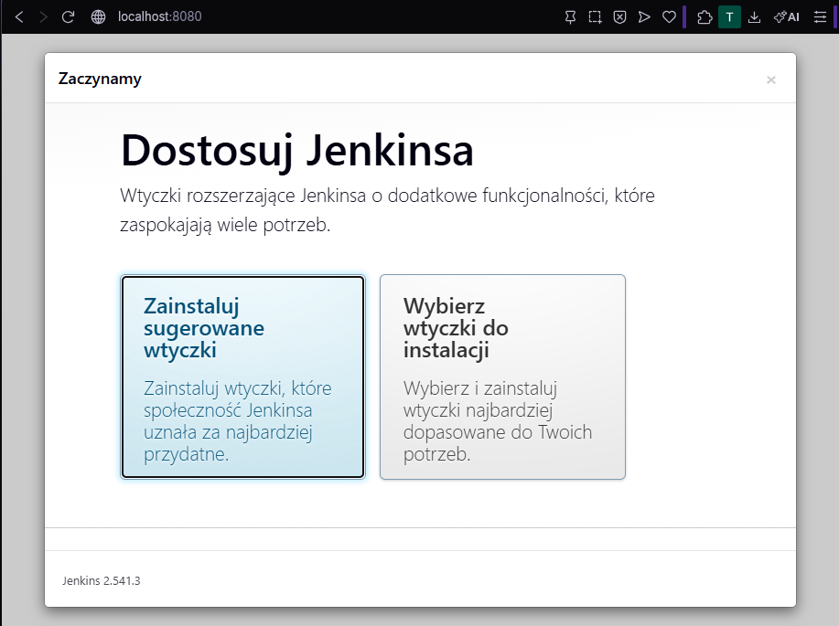

# Sprawozdanie zbiorcze — Zajęcia 1 - 4

## 1. Git, SSH i przygotowanie środowiska

W pierwszym etapie skonfigurowano środowisko pracy:

- zainstalowano Git oraz SSH,
- wygenerowano klucze SSH i skonfigurowano dostęp do GitHub,
- sklonowano repozytorium zarówno przez HTTPS, jak i SSH,
- utworzono własną gałąź roboczą i strukturę katalogów,
- przygotowano hook Git wymuszający odpowiedni format komunikatów commitów.

Weryfikacja obejmowała:
- logowanie przez SSH,
- transfer plików,
- integrację z Visual Studio Code.

---

## 2. Docker — podstawy konteneryzacji

W drugim etapie skonfigurowano środowisko Docker:

- zainstalowano Docker,
- uruchomiono podstawowe obrazy (`hello-world`, `ubuntu`, `busybox`),
- wykonano analizę działania kontenerów i ich izolacji,
- uruchomiono kontener interaktywny i sprawdzono jego środowisko,
- przygotowano własny `Dockerfile` budujący środowisko z repozytorium.

Zweryfikowano:
- działanie kontenerów,
- różnice między obrazem a kontenerem,
- proces buildowania obrazu.

---

## 3. Budowanie aplikacji w kontenerze

W trzecim etapie skupiono się na powtarzalności środowiska:

- wybrano projekt Node.js,
- wykonano build i testy lokalnie,
- powtórzono proces w kontenerze,
- przygotowano wieloetapowy Dockerfile (build + test),
- zweryfikowano działanie aplikacji w izolowanym środowisku.

Dodatkowo przeprowadzono analizę procesu wdrażania:

- kontener jako artefakt vs narzędzie buildowe,
- możliwość publikacji jako pakiet (np. npm),
- separacja etapu build i runtime.

---

## 4. Woluminy, sieć i Jenkins

W ostatnim etapie rozszerzono wiedzę o zaawansowane mechanizmy Dockera.

### Woluminy

- utworzono woluminy wejściowy i wyjściowy,
- wykorzystano kontener pomocniczy do klonowania repozytorium,
- wykonano build w kontenerze bazowym,
- potwierdzono trwałość danych po zakończeniu pracy kontenera.

### Sieć

- przetestowano komunikację między kontenerami przy użyciu iperf3,
- porównano komunikację po adresie IP oraz nazwie kontenera,
- utworzono własną sieć mostkową,
- wystawiono port i przetestowano dostęp z hosta.

### Usługi

- uruchomiono serwer SSH w kontenerze,
- wykonano połączenie z hosta,
- przeanalizowano zastosowanie SSH w kontenerach.

### Jenkins

- uruchomiono instancję Jenkins w kontenerze,
- skonfigurowano Docker-in-Docker,
- uzyskano dostęp do panelu webowego,
- potwierdzono działanie środowiska CI.

---

## Podsumowanie

Podczas zajęć zdobyto praktyczne umiejętności:

- pracy z systemem kontroli wersji Git,
- zarządzania dostępem przez SSH,
- budowania i uruchamiania kontenerów Docker,
- tworzenia powtarzalnych środowisk buildowych,
- komunikacji sieciowej między kontenerami,
- uruchamiania systemu CI/CD w postaci Jenkins.

Zrealizowane zadania pozwoliły zrozumieć podstawowe koncepcje DevOps oraz ich zastosowanie w praktyce.

