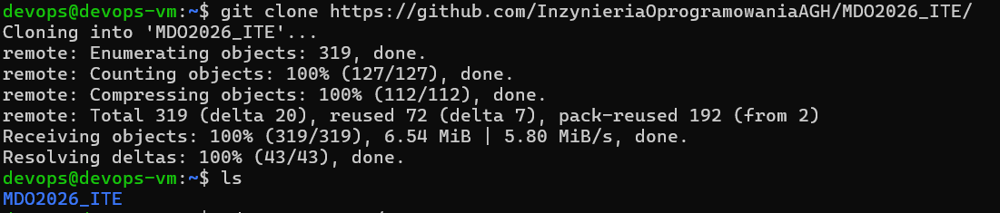
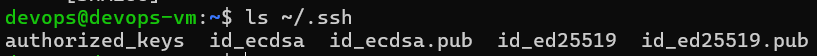
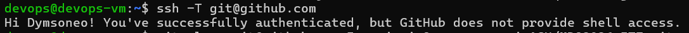
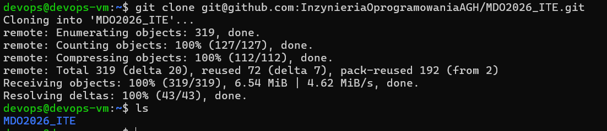
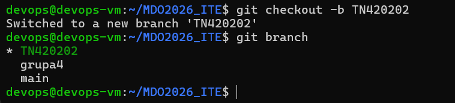
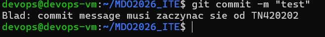

# Sprawozdanie 1 

## Środowisko

Host:
- Windows 11
- PowerShell

Maszyna wirtualna:
- Ubuntu Server
- dostęp przez SSH

Narzędzia
- Git
- OpenSSH
- GitHub
- Visual Studio Code + Remote SSH
- FileZilla

## 1. Przygotowanie środowiska i połączenia SSH

Na początku skonfigurowano maszynę wirtualną z systemem Ubuntu Server oraz połączenie SSH z hosta do maszyny wirtualnej. Dzięki temu dalsze kroki mogły być wykonywane zgodnie z wymaganiami zadania, czyli z poziomu połączenia SSH, a nie z konsoli maszyny wirtualnej.

## 2. Instalacja i weryfikacja klienta Git

W środowisku wirtualnym sprawdzono dostępność programu Git. W razie potrzeby pakiet został zainstalowany z repozytorium systemowego.

## 3. Klonowanie repozytorium przez HTTPS

Repozytorium przedmiotowe zostało sklonowane z użyciem protokołu HTTPS.



## 4. Generowanie kluczy SSH

Wygenerowano dwa klucze SSH inne niż RSA:
- klucz `ed25519` - bez hasła,
- klucz `ecdsa` - zabezbieczony hasłem.



## 5. Konfiguracja klucza SSH w GitHub

Publiczny klucz SSH został dodany do konta GitHub w sekcji **Settings → SSH and GPG keys**. Następnie poprawność konfiguracji została sprawdzona poleceniem testowym.



## 6. Klonowanie repozytorium przez SSH

Po skonfigurowaniu klucza SSH repozytorium zostało sklonowane z wykorzystaniem protokołu SSH. To repozytorium zostało następnie wykorzystane do dalszej pracy.



## 7. Przełączenie na odpowiednią gałąź i utworzenie własnej gałęzi

Najpierw sprawdzono dostępne gałęzie zdalne, następnie przełączono się na gałąź `main`, potem na gałąź grupową `grupa4`, a następnie utworzono własną gałąź roboczą `TN420202`, wywiedzioną z gałęzi grupowej.



## 8. Przygotowanie git hooka

Przygotowano hook typu `commit-msg`, którego zadaniem jest weryfikacja, czy każda wiadomość commita rozpoczyna się od wymaganego prefiksu `TN420202`.

Treść hooka:

```bash
#!/bin/bash

PREFIX="TN420202"
COMMIT_MSG_FILE="$1"
COMMIT_MSG="$(cat "$COMMIT_MSG_FILE")"

if [[ ! "$COMMIT_MSG" =~ ^$PREFIX ]]; then
    echo "Blad: commit message musi zaczynac sie od $PREFIX"
    exit 1
fi
```

Działanie hooka zostało sprawdzone.

