# Sprawozdanie 10

## Instalacja środowiska Kubernetes
### Instalacja kubectl

Dodano repozytorium Kubernetes oraz zainstalowano narzędzie *kubectl*.

### Instalacja

```bash
sudo apt update
sudo apt install -y curl apt-transport-https

curl -fsSL https://pkgs.k8s.io/core:/stable:/v1.30/deb/Release.key | \
sudo gpg --dearmor -o /etc/apt/keyrings/kubernetes-apt-keyring.gpg

echo 'deb [signed-by=/etc/apt/keyrings/kubernetes-apt-keyring.gpg] https://pkgs.k8s.io/core:/stable:/v1.30/deb/ /' | \
sudo tee /etc/apt/sources.list.d/kubernetes.list

sudo apt update
sudo apt install -y kubectl
```

### Weryfikacja

```bash
kubectl version --client
```

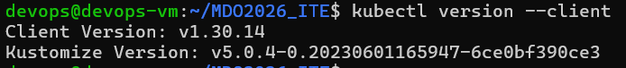

---

## Instalacja minikube

### Pobranie i instalacja

```bash
curl -LO https://storage.googleapis.com/minikube/releases/latest/minikube-linux-amd64

sudo install minikube-linux-amd64 /usr/local/bin/minikube
```

### Weryfikacja
```bash
minikube version
```

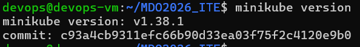

---

## Uruchomienie klastra Kubernetes

Klaster został uruchomiony przy użyciu sterownika Docker.

```bash
minikube start --driver=docker
```


Po uruchomieniu sprawdzono poprawność działania klastra:

```bash
kubectl get nodes
```

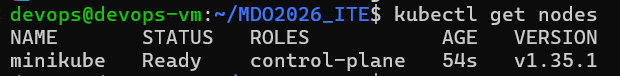

Wynik potwierdził poprawne działanie node minikube w stanie Ready.

---

## Dashboard Kubernetes

Uruchomiono dashboard Kubernetes:

```bash
minikube dashboard
```

Dashboard umożliwił podgląd:

- node,
- podów,
- deploymentów,
- service.


## Uruchomienie aplikacji kontenerowej

### Utworzenie poda nginx

Uruchomiono przykładowy kontener nginx:

```bash
kubectl run nginx-deploy \
--image=nginx \
--port=80 \
--labels app=nginx-deploy
```

### Sprawdzenie podów

```bash
kubectl get pods
```

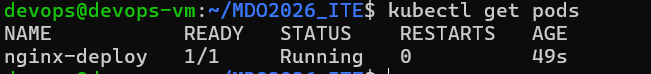

Pod został poprawnie uruchomiony w stanie Running.

### Szczegóły poda

```bash
kubectl describe pod nginx-deploy
```

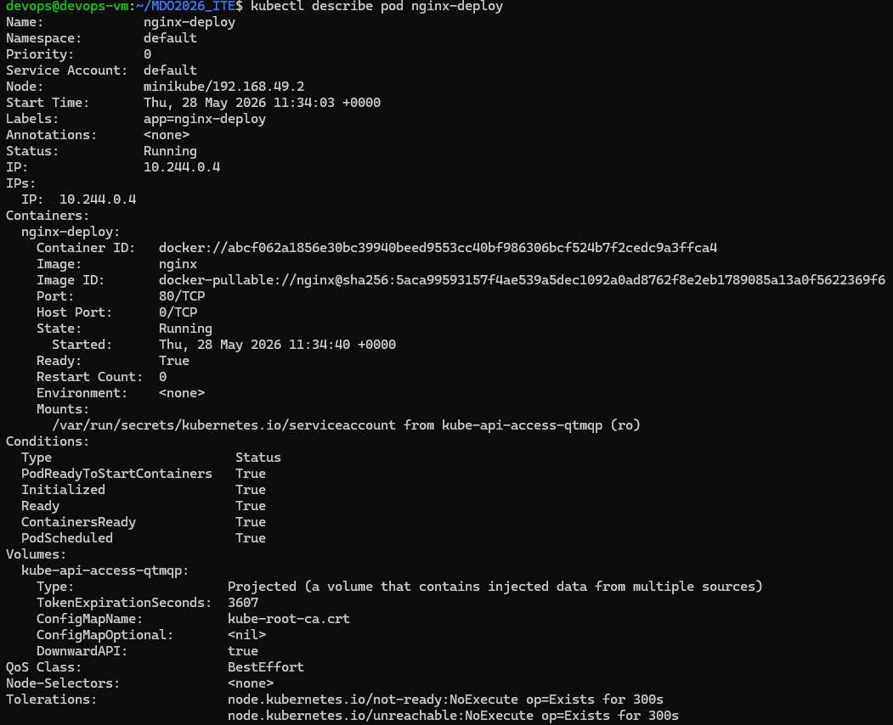

Polecenie umożliwiło sprawdzenie:

- obrazu Dockera,
- adresu IP poda,
- statusu,
- mapowania portów.

---

## Port forwarding

W celu udostępnienia aplikacji wykonano przekierowanie portów:


```bash
kubectl port-forward pod/nginx-deploy 8082:80
```

Następnie sprawdzono działanie aplikacji w przeglądarce:

```bash
http://localhost:8082
```

Pojawiła się strona:

**Welcome to nginx!**

co potwierdziło poprawne działanie kontenera.

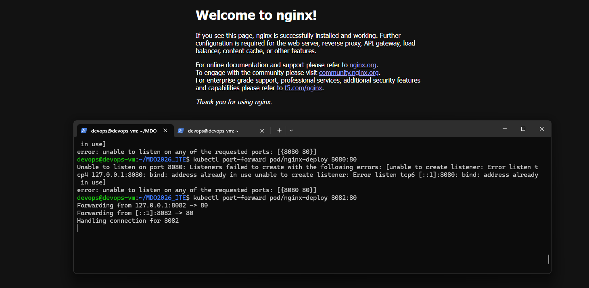

---

## Deployment w postaci YAML

### Utworzenie pliku deployment

Utworzono katalog:

```bash
mkdir -p k8s
cd k8s
```

Następnie utworzono plik:

*nano nginx-deployment.yml*

### Zawartość pliku

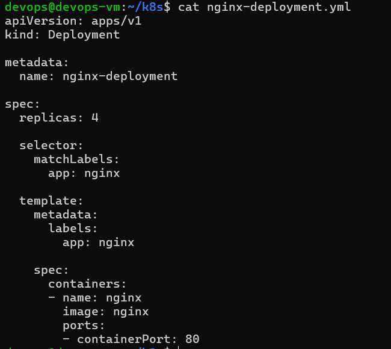

---

## Wdrożenie deploymentu

Deployment został wdrożony poleceniem:

```bash
kubectl apply -f nginx-deployment.yml
```

### Sprawdzenie deploymentów

```bash
kubectl get deployments
```

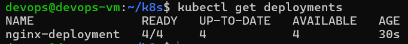

Deployment został poprawnie utworzony z 4 replikami.

### Sprawdzenie podów

```bash
kubectl get pods
```

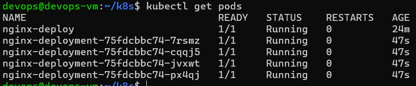

Widoczne były 4 działające pody nginx.

### Status rollout

```bash
kubectl rollout status deployment/nginx-deployment
```

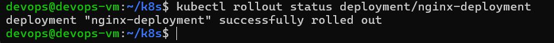

Rollout zakończył się poprawnie.

---

## Utworzenie Service
### Plik YAML service

Utworzono plik:

*nano nginx-service.yml*

### Zawartość

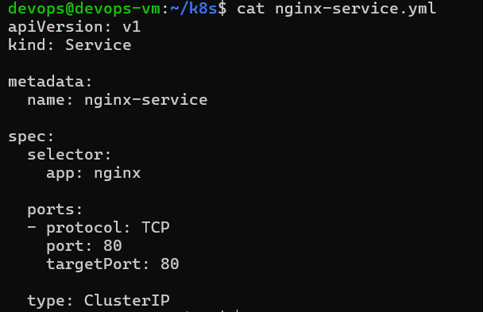

---

## Wdrożenie service

Service został wdrożony poleceniem:

```bash
kubectl apply -f nginx-service.yml
```

### Sprawdzenie service

```bash
kubectl get services
```

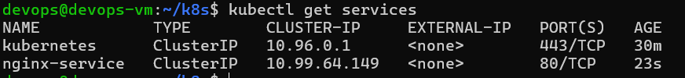

Widoczny był service nginx-service.

---

## Port forwarding service

W celu udostępnienia service wykonano:

```bash
kubectl port-forward service/nginx-service 8083:80
```

Następnie sprawdzono działanie aplikacji:

```bash
http://localhost:8083
```

Strona nginx została poprawnie wyświetlona.

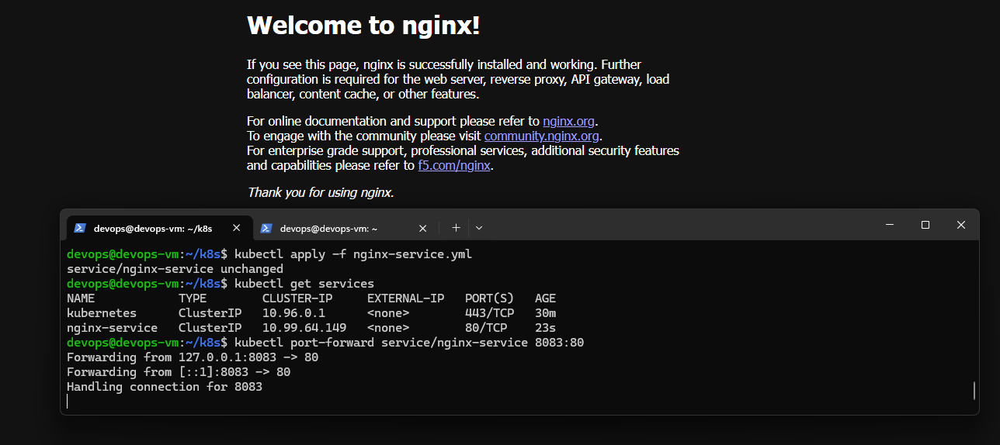