# Sprawozdanie 11


# 1. Przygotowanie środowiska

Wykorzystano wcześniej skonfigurowany klaster Kubernetes uruchomiony za pomocą Minikube.

Sprawdzenie stanu deploymentu oraz działających podów:

```bash
kubectl get deployment
kubectl get pods
```


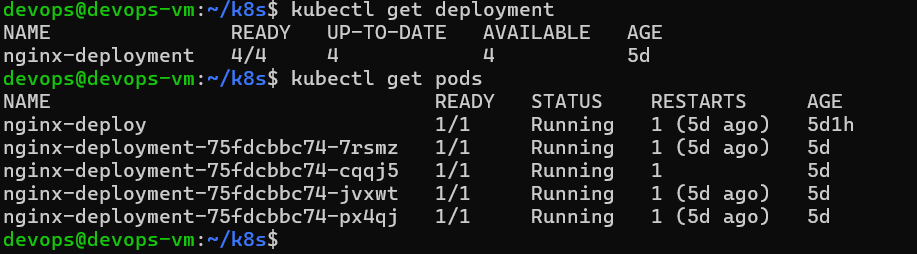

---

# 2. Skalowanie deploymentu do 8 replik

Zmodyfikowano parametr `replicas` w pliku deploymentu:

```yaml
replicas: 8
```

Następnie zastosowano zmiany:

```bash
kubectl apply -f nginx-deployment.yml
```

Weryfikacja:

```bash
kubectl get deployment
kubectl get pods
```

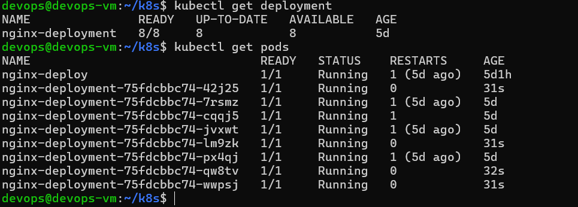

---

# 3. Skalowanie deploymentu do 1 repliki

Zmiana liczby replik:

```yaml
replicas: 1
```

Zastosowanie zmian:

```bash
kubectl apply -f nginx-deployment.yml
```

Weryfikacja:

```bash
kubectl get deployment
kubectl get pods
```

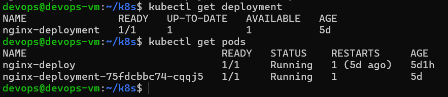

---

# 4. Skalowanie deploymentu do 0 replik

Zmiana liczby replik:

```yaml
replicas: 0
```

Zastosowanie:

```bash
kubectl apply -f nginx-deployment.yml
```

Sprawdzenie stanu:

```bash
kubectl get deployment
kubectl get pods
```

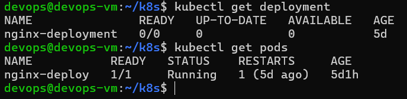

---

# 5. Powrót do 4 replik

Przywrócono początkową liczbę replik:

```yaml
replicas: 4
```

Zastosowanie zmian:

```bash
kubectl apply -f nginx-deployment.yml
```

Weryfikacja:

```bash
kubectl get deployment
kubectl get pods
```

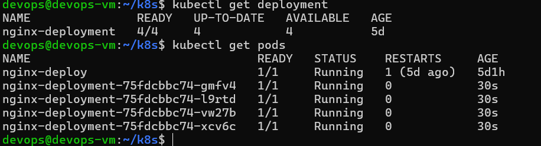

---

# 6. Aktualizacja obrazu kontenera

Początkowo deployment wykorzystywał obraz:

```yaml
image: nginx:1.27
```

Po wdrożeniu sprawdzono poprawność rolloutu:

```bash
kubectl rollout status deployment/nginx-deployment
kubectl get deployment
kubectl get pods
```

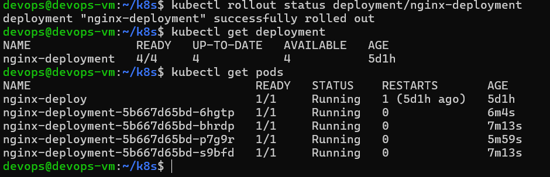

---

# 7. Wdrożenie nowej wersji obrazu

Zmiana obrazu:

```yaml
image: nginx:1.28
```

Zastosowanie zmian:

```bash
kubectl apply -f nginx-deployment.yml
```

Sprawdzenie statusu:

```bash
kubectl rollout status deployment/nginx-deployment
```

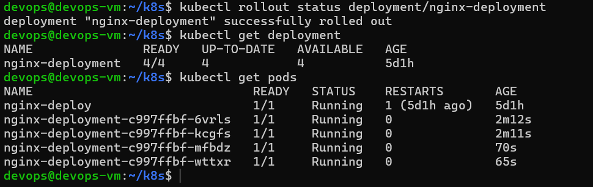

---

# 8. Historia wdrożeń

Sprawdzenie historii rolloutów:

```bash
kubectl rollout history deployment/nginx-deployment
```

Pozwala to na identyfikację kolejnych rewizji deploymentu.

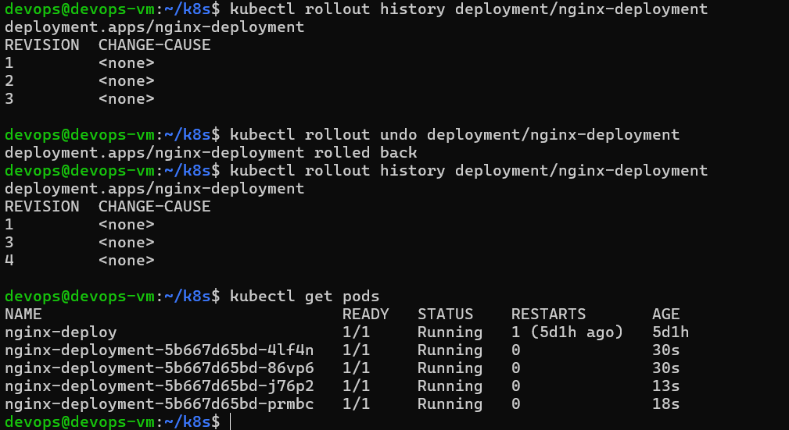

---

# 9. Przywracanie poprzedniej wersji

Wykonano rollback do poprzedniej wersji:

```bash
kubectl rollout undo deployment/nginx-deployment
```

Weryfikacja:

```bash
kubectl rollout history deployment/nginx-deployment
kubectl get pods
```

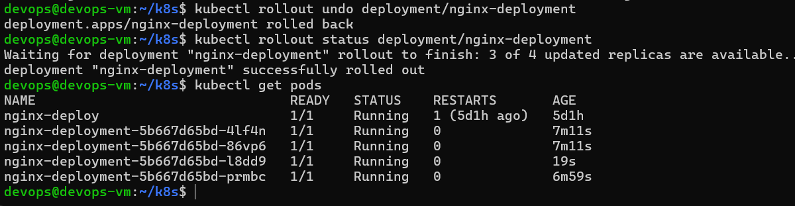

---

# 10. Wdrożenie wadliwego obrazu

Celowo ustawiono nieistniejący obraz:

```yaml
image: nginx:nie-istnieje
```

Po wdrożeniu pojawiły się błędy:

- ErrImagePull
- ImagePullBackOff

Sprawdzenie szczegółów:

```bash
kubectl describe pod <nazwa-poda>
```

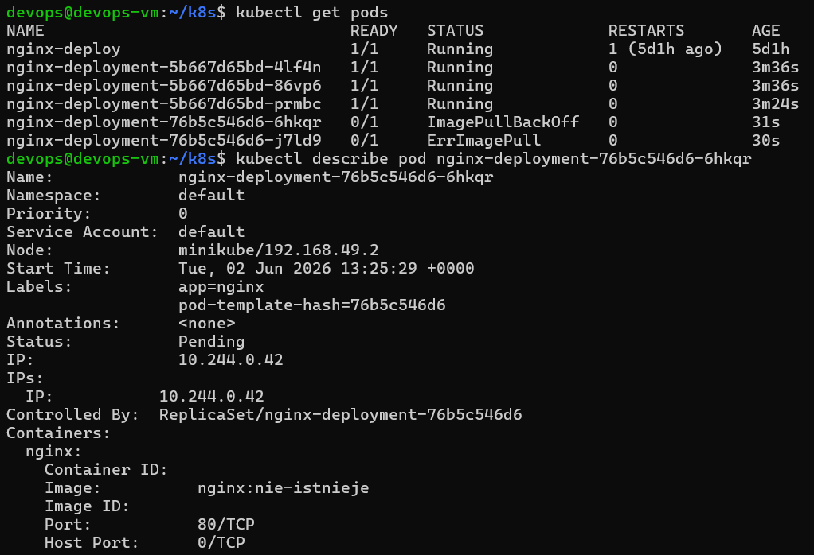


---

# 11. Przywrócenie działającej wersji

Przywrócono ostatnią poprawną wersję deploymentu:

```bash
kubectl rollout undo deployment/nginx-deployment
```

Weryfikacja:

```bash
kubectl rollout status deployment/nginx-deployment
kubectl get pods
```


---

# 12. Skrypt kontroli wdrożenia

Utworzono skrypt sprawdzający, czy deployment zakończył się sukcesem w czasie do 60 sekund.

```bash
#!/bin/bash

DEPLOYMENT=nginx-deployment
TIMEOUT=60

echo "Sprawdzanie deploymentu: $DEPLOYMENT"

if kubectl rollout status deployment/$DEPLOYMENT --timeout=${TIMEOUT}s
then
    echo "WDROZENIE ZAKONCZONE SUKCESEM"
    exit 0
else
    echo "WDROZENIE NIE POWIODLO SIE"
    exit 1
fi
```

Uruchomienie:

```bash
./check_deployment.sh
```

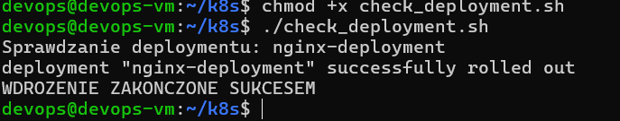

---

# 13. Strategia Recreate

Utworzono deployment wykorzystujący strategię:

```yaml
strategy:
  type: Recreate
```

W tej strategii stare pody są usuwane przed uruchomieniem nowych.

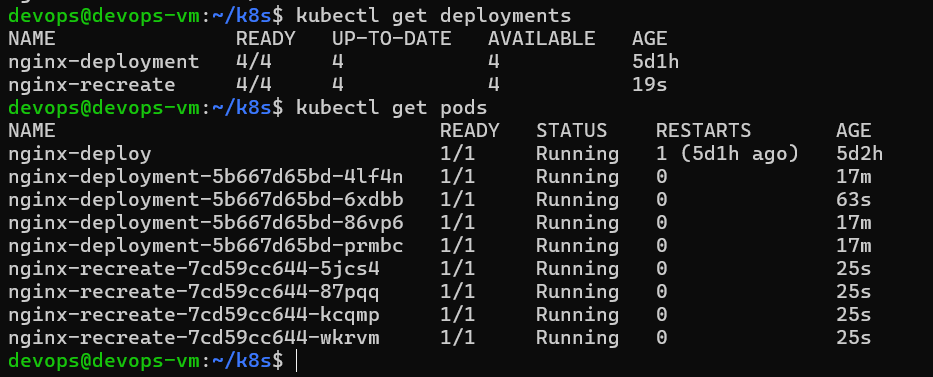

---

# 14. Strategia RollingUpdate

Utworzono deployment wykorzystujący strategię:

```yaml
strategy:
  type: RollingUpdate
  rollingUpdate:
    maxUnavailable: 2
    maxSurge: 2
```

Wdrożenie odbywa się stopniowo bez całkowitego zatrzymywania usługi.

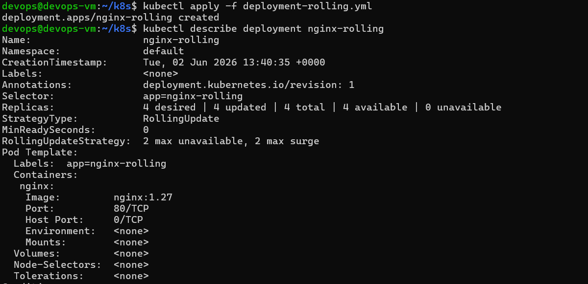

---

# 15. Strategia Canary

Utworzono dodatkowy deployment testowy:

```yaml
replicas: 1
image: nginx:1.28
```

Pozwala to na uruchomienie nowej wersji aplikacji równolegle z wersją produkcyjną.

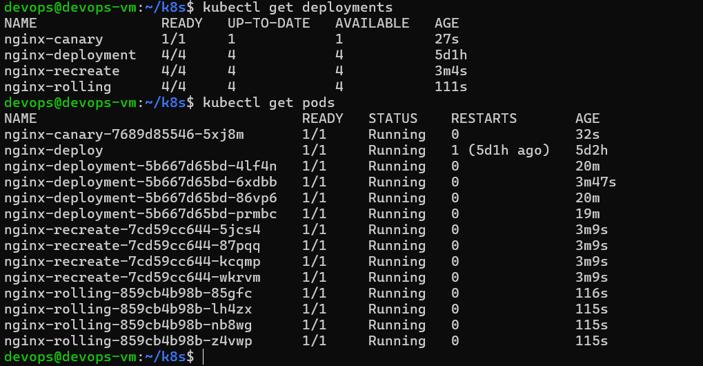

---
