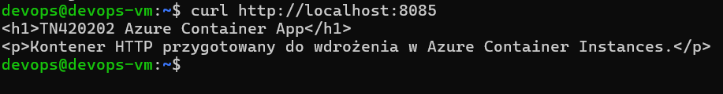
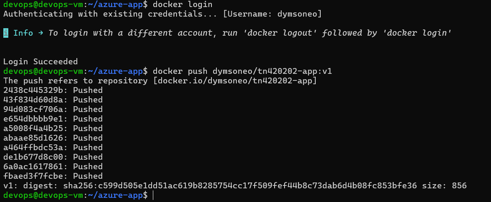
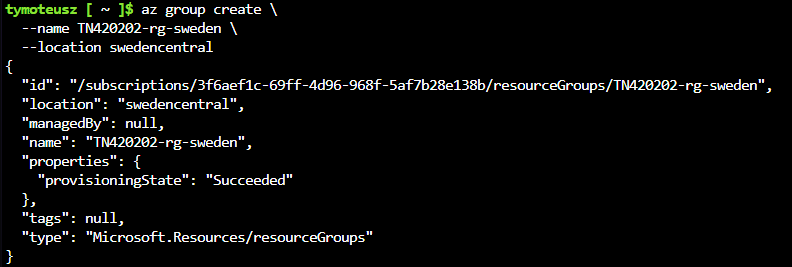
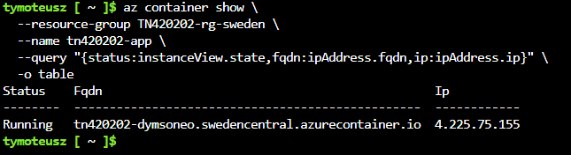
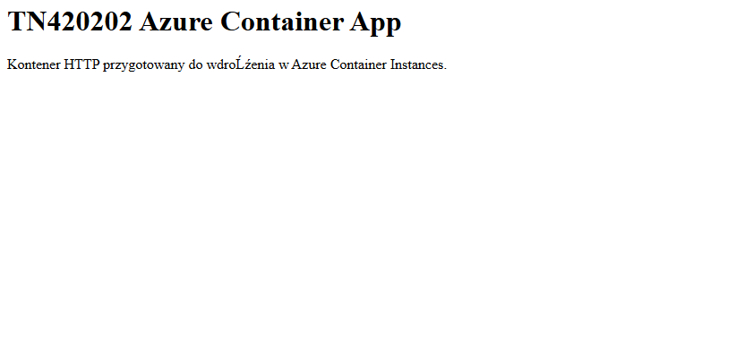
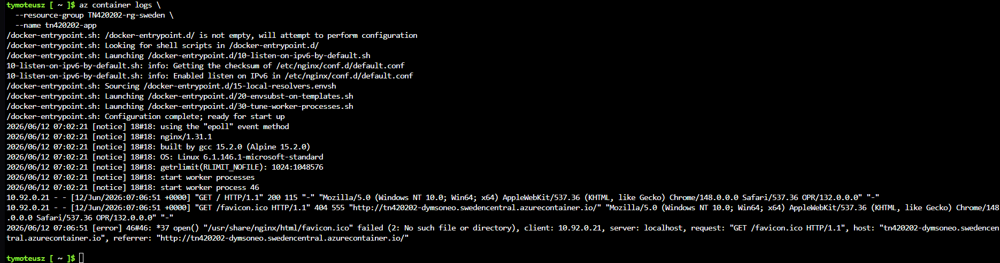
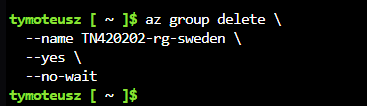

# Sprawozdanie 12

# 1. Przygotowanie obrazu Docker

Utworzono prostą aplikację HTTP opartą o serwer Nginx.

Plik `index.html`:

```html
<h1>TN420202 Azure Container App</h1>
<p>Kontener HTTP przygotowany do wdrożenia w Azure Container Instances.</p>
```

Plik `Dockerfile`:

```dockerfile
FROM nginx:alpine
COPY index.html /usr/share/nginx/html/index.html
```

Następnie zbudowano obraz:

```bash
docker build -t dymsoneo/tn420202-app:v1 .
```

Zweryfikowano lokalne działanie kontenera:

```bash
docker run --rm -p 8085:80 dymsoneo/tn420202-app:v1
```

W drugim terminalu sprawdzono działanie



---

# 2. Publikacja obrazu w Docker Hub

Zalogowano się do Docker Hub:

```bash
docker login
```

Następnie wysłano obraz:

```bash
docker push dymsoneo/tn420202-app:v1
```

Operacja zakończyła się sukcesem.



---

# 3. Utworzenie Resource Group

Utworzono grupę zasobów w dozwolonym regionie:

```bash
az group create \
    --name TN420202-rg-sweden \
    --location swedencentral
```



---

# 4. Wdrożenie kontenera

Kontener wdrożono za pomocą polecenia:

```bash
az container create \
    --resource-group TN420202-rg-sweden \
    --name tn420202-app \
    --image dymsoneo/tn420202-app:v1 \
    --dns-name-label tn420202-dymsoneo \
    --ports 80 \
    --os-type Linux \
    --cpu 1 \
    --memory 1
```

Podczas pierwszej próby Azure wymagał jawnego określenia ilości CPU i pamięci RAM, dlatego dodano parametry:

```text
--cpu 1
--memory 1
```

Po poprawieniu polecenia wdrożenie zakończyło się sukcesem.

Sprawdzono status wdrożenia:

```bash
az container show \
    --resource-group TN420202-rg-sweden \
    --name tn420202-app \
    --query "{status:instanceView.state,fqdn:ipAddress.fqdn,ip:ipAddress.ip}" \
    -o table
```

Wynik:

```text
Status : Running
```

Publiczny adres:

```text
tn420202-dymsoneo.swedencentral.azurecontainer.io
```




---


# 5. Test działania aplikacji HTTP

Po wejściu na adres:

```text
http://tn420202-dymsoneo.swedencentral.azurecontainer.io
```

wyświetlona została strona przygotowana w pliku `index.html`.



---

# 6. Analiza logów kontenera

Pobrano logi uruchomionego kontenera:

```bash
az container logs \
    --resource-group TN420202-rg-sweden \
    --name tn420202-app
```

W logach widoczne było poprawne uruchomienie serwera Nginx oraz obsługa żądań HTTP.



---

# 7. Usunięcie zasobów

Po zakończeniu ćwiczenia usunięto grupę zasobów:

```bash
az group delete \
    --name TN420202-rg-sweden \
    --yes \
    --no-wait
```

Pozwoliło to uniknąć dalszego wykorzystania zasobów Azure oraz naliczania kosztów.



---