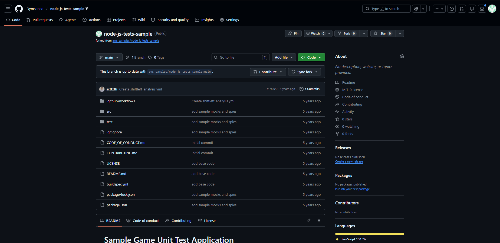
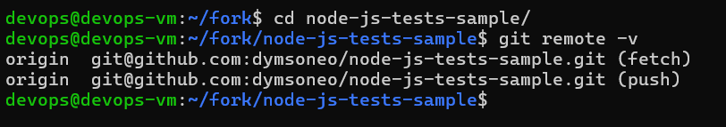
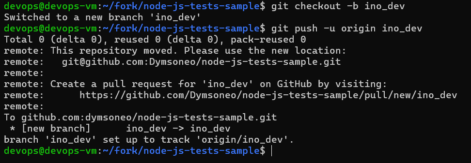
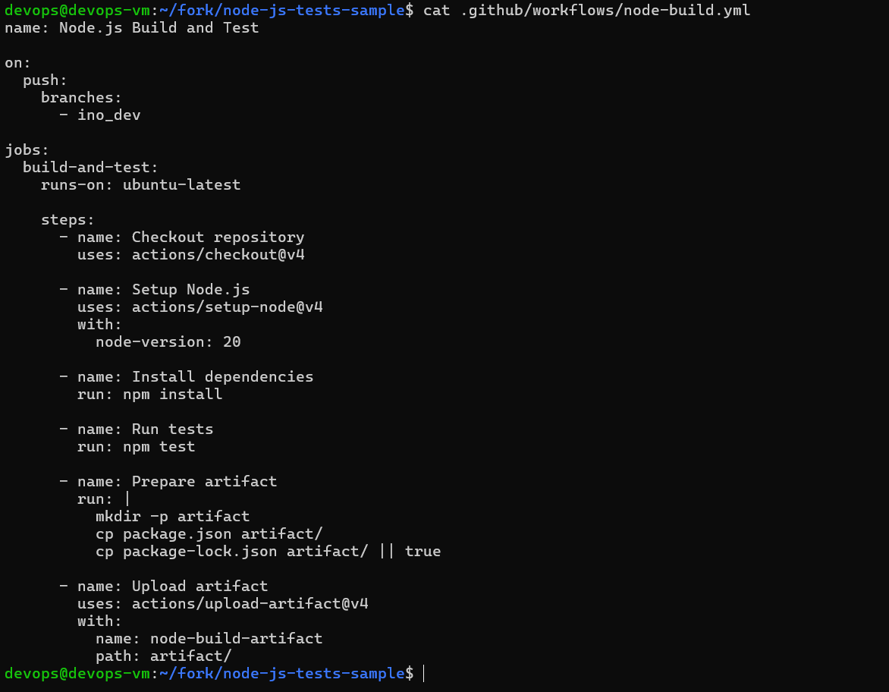
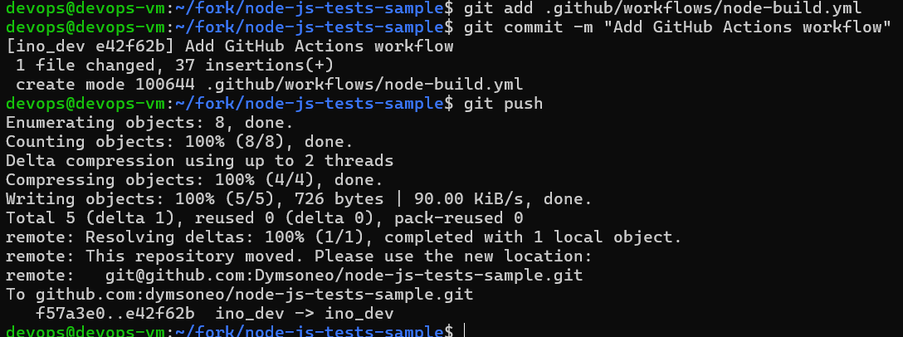
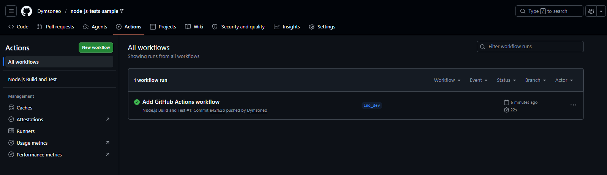
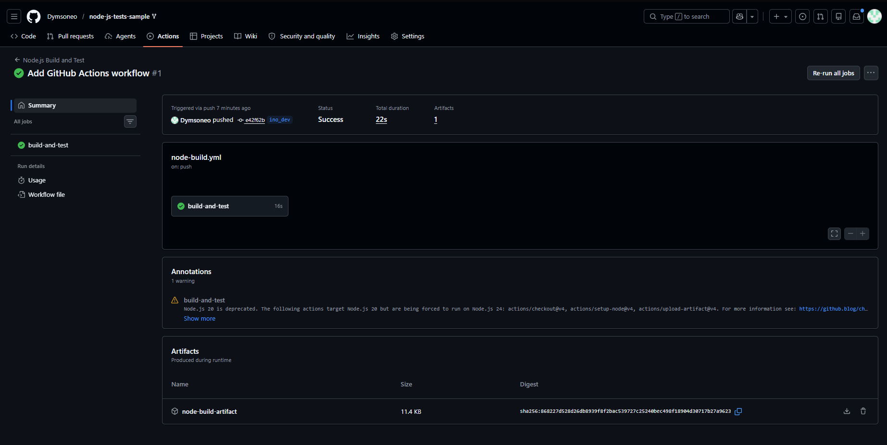

# Sprawozdanie 13

# 1. Wykorzystane repozytorium

Do realizacji ćwiczenia wykorzystano repozytorium:

`aws-samples/node-js-tests-sample`

Repozytorium zostało sforkowane do własnego konta GitHub.



---

# 2. Konfiguracja repozytorium lokalnego

Po sklonowaniu własnego forka zweryfikowano adres zdalnego repozytorium.

```bash
git remote -v
```



---

# 3. Utworzenie dedykowanej gałęzi

Zgodnie z poleceniem utworzono osobną gałąź przeznaczoną do prac związanych z GitHub Actions.

```bash
git checkout -b ino_dev
git push -u origin ino_dev
```



---

# 4. Utworzenie workflow GitHub Actions

W repozytorium utworzono katalog:

```text
.github/workflows
```

oraz plik:

```text
node-build.yml
```

Workflow został skonfigurowany tak, aby uruchamiał się po wykonaniu push do gałęzi `ino_dev`.

Zawartość workflow:



---

# 5. Commit oraz uruchomienie workflow

Po zapisaniu konfiguracji wykonano commit oraz push do gałęzi `ino_dev`.

```bash
git add .github/workflows/node-build.yml
git commit -m "Add GitHub Actions workflow"
git push
```



---

# 6. Weryfikacja działania GitHub Actions

Po wykonaniu push GitHub automatycznie uruchomił workflow.

Workflow wykonał:

1. Pobranie kodu źródłowego.
2. Instalację zależności npm.
3. Uruchomienie testów jednostkowych.
4. Utworzenie artefaktu.
5. Publikację artefaktu w GitHub Actions.





Workflow zakończył się sukcesem.

Parametry wykonania:

- Status: **Success**
- Branch: **ino_dev**
- Czas wykonania: **22 s**
- Artefakty: **1**

Workflow został rozszerzony o etap publikacji artefaktu.

Artefakt o nazwie:

```text
node-build-artifact
```

został wygenerowany i zapisany w GitHub Actions.



---

