# Sprawozdanie 1 

## 1. Instalacja Dockera

W celu przyspieszenia procesu instalacji Dockera zostało wykorzystane AI.

Treść zapytania:

"Pomóż mi zainstalować dockera na Ubuntu zgodnie z dokumentacją"

```bash
sudo apt remove docker.io docker-compose docker-compose-v2 docker-doc podman-docker containerd runc -y

sudo apt update
sudo apt install ca-certificates curl gnupg -y

sudo install -m 0755 -d /etc/apt/keyrings

curl -fsSL https://download.docker.com/linux/ubuntu/gpg | sudo gpg --dearmor -o /etc/apt/keyrings/docker.gpg

sudo chmod a+r /etc/apt/keyrings/docker.gpg

echo \
  "deb [arch=$(dpkg --print-architecture) signed-by=/etc/apt/keyrings/docker.gpg] https://download.docker.com/linux/ubuntu \
  $(. /etc/os-release && echo "$VERSION_CODENAME") stable" | \
  sudo tee /etc/apt/sources.list.d/docker.list > /dev/null

sudo apt update

sudo apt install docker-ce docker-ce-cli containerd.io docker-buildx-plugin docker-compose-plugin -y
```

Weryfikacja odpowiedzi:
```bash
sudo systemctl status docker
docker --version
```
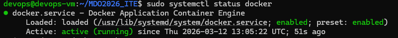

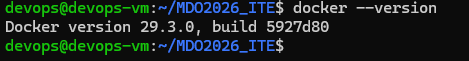

## 2. Docker Hub

```bash
docker login
```
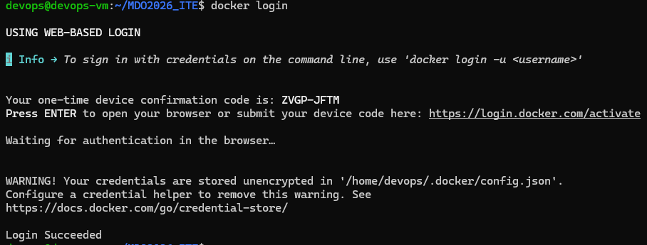

## 3. Obrazy

Pobrano obraz hello-world i sprawdzono działanie.

```bash
docker pull hello-world
docker run hello-world
```

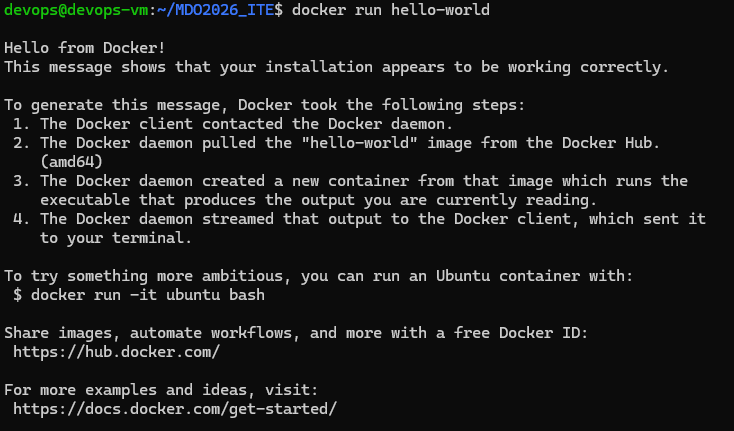

Następnie pobrano resztę obrazów.

```bash
docker pull busybox
docker pull ubuntu
docker pull mariadb
docker pull mcr.microsoft.com/dotnet/runtime:8.0
docker pull mcr.microsoft.com/dotnet/aspnet:8.0
docker pull mcr.microsoft.com/dotnet/sdk:8.0
```

Sprawdzono ich rozmiary.

```bash
docker images
```

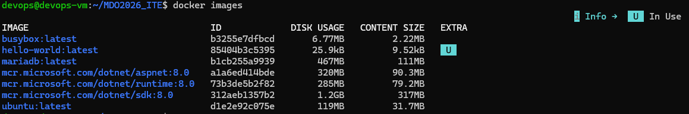

## 4. Busybox

```bash
docker run busybox
```

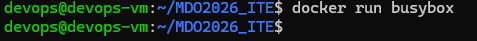

```bash
docker run -it busybox sh
```

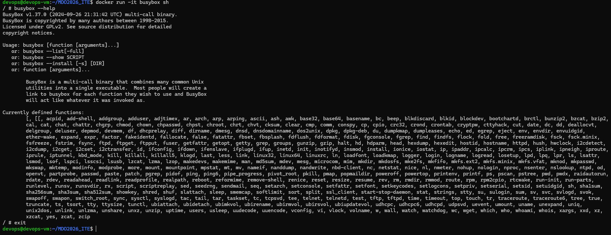

## 5. System w kontenerze

```bash
docker run -it ubuntu bash
```

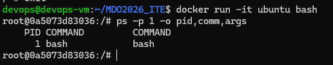

```bash
docker ps
docker top <container_id>
```

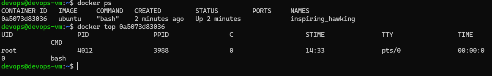

```bash
apt update
apt upgrade -y
exit
```

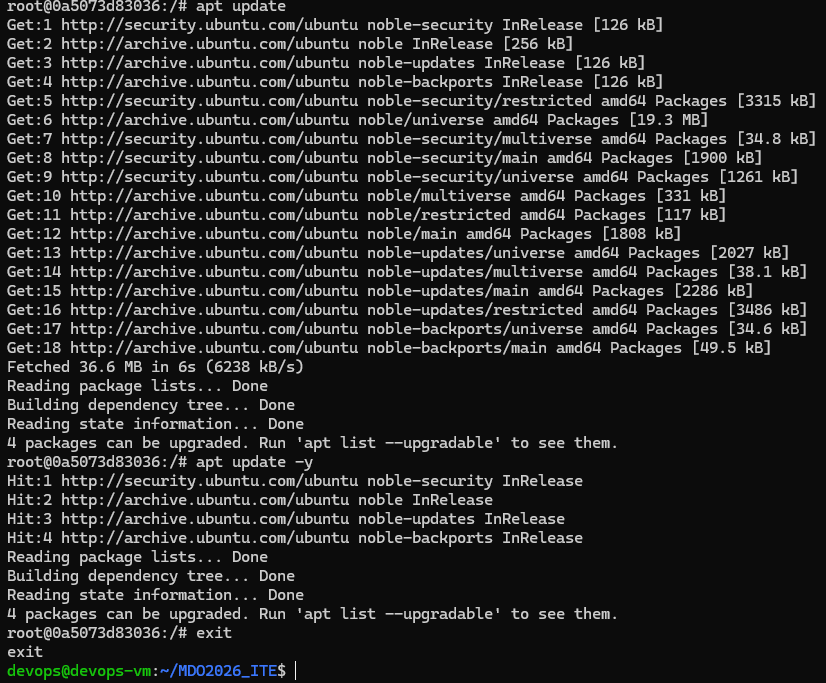

## 6. Własny Dockerfile

```dockerfile
FROM ubuntu:24.04

ENV DEBIAN_FRONTEND=noninteractive

RUN apt update && \
    apt install -y git ca-certificates && \
    rm -rf /var/lib/apt/lists/*

WORKDIR /workspace

RUN git clone https://github.com/InzynieriaOprogramowaniaAGH/MDO2026_ITE.git

CMD ["/bin/bash"]
```

```bash
docker build -t tn420202-sprawozdanie2 .
```

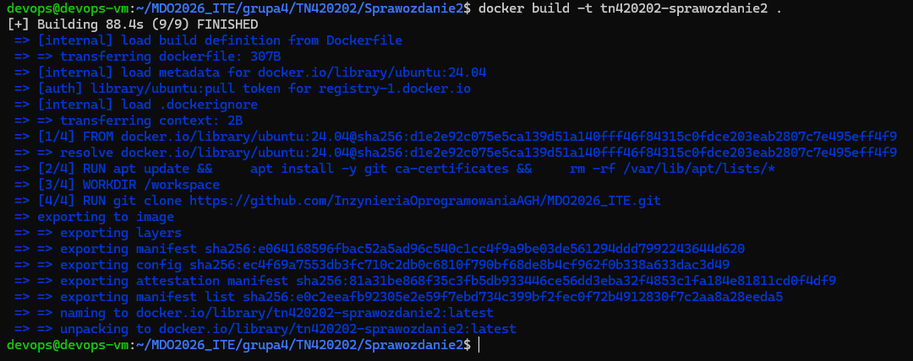

```bash
docker run -it --name tn420202-repo tn420202-sprawozdanie2
```

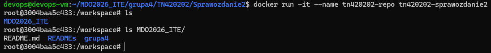

## 7. Pokazanie kontenerów

```bash
docker ps -a
``` 

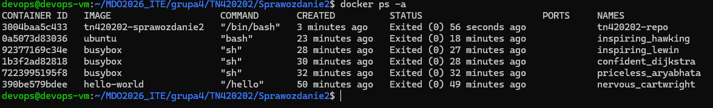

## 8. Czyszczenie obrazów

```bash
docker container prune -f
docker image prune -a -f
docker ps -a
docker images
```
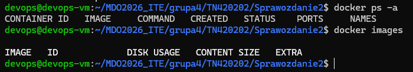