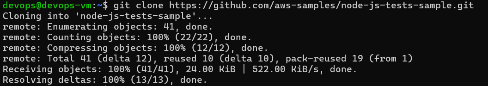
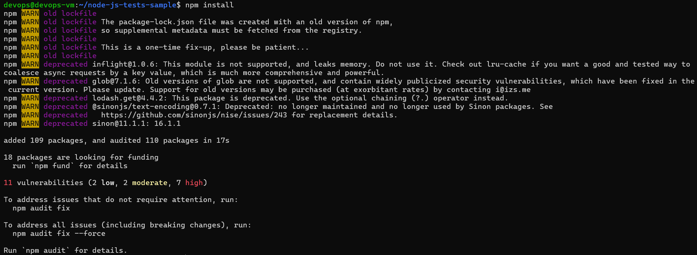
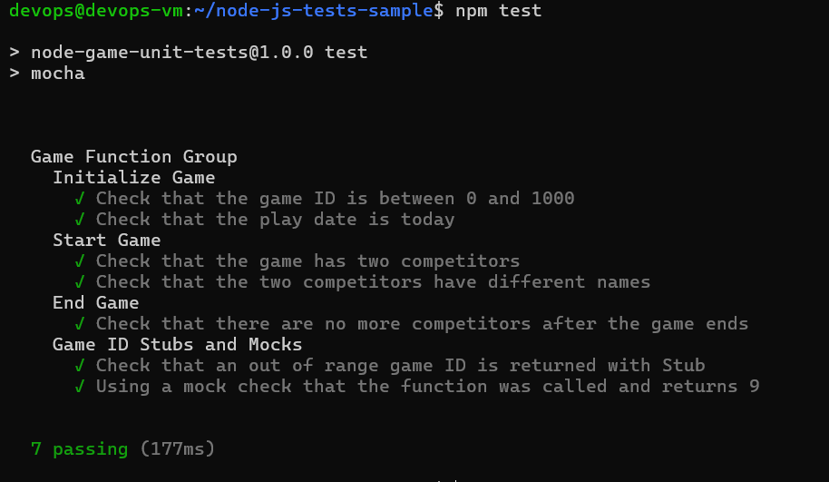
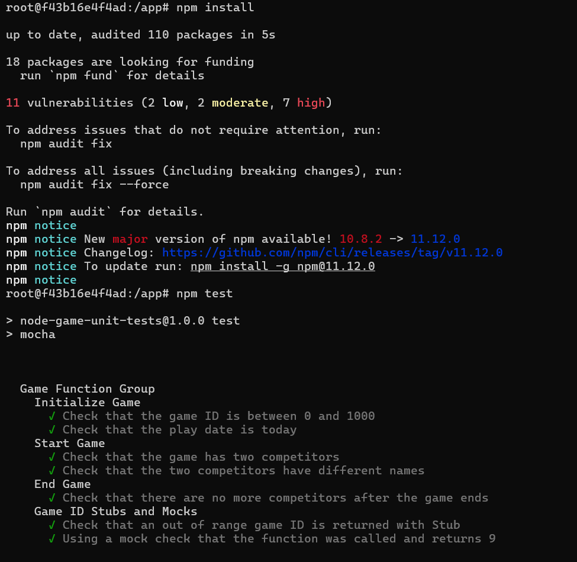
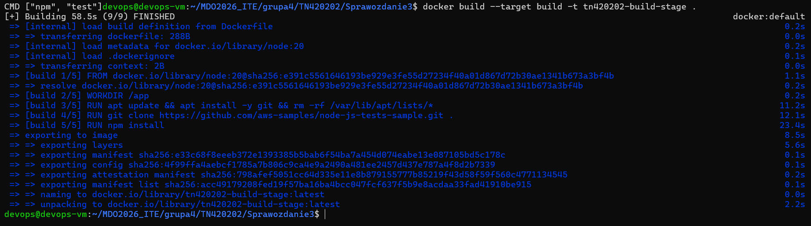
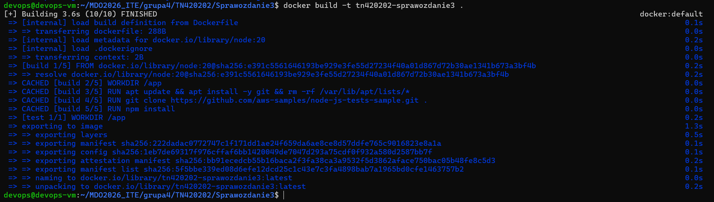
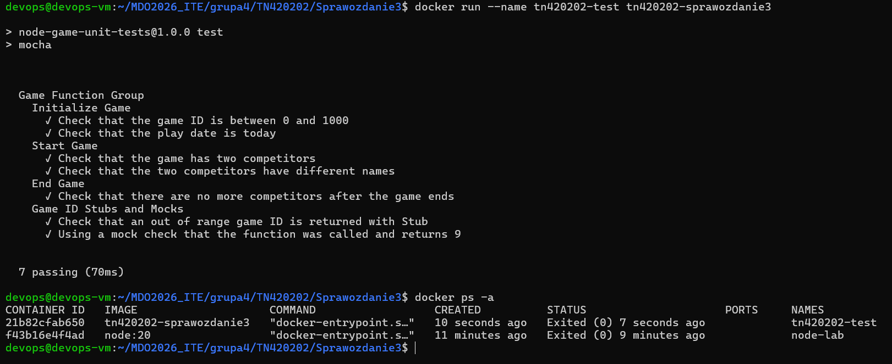
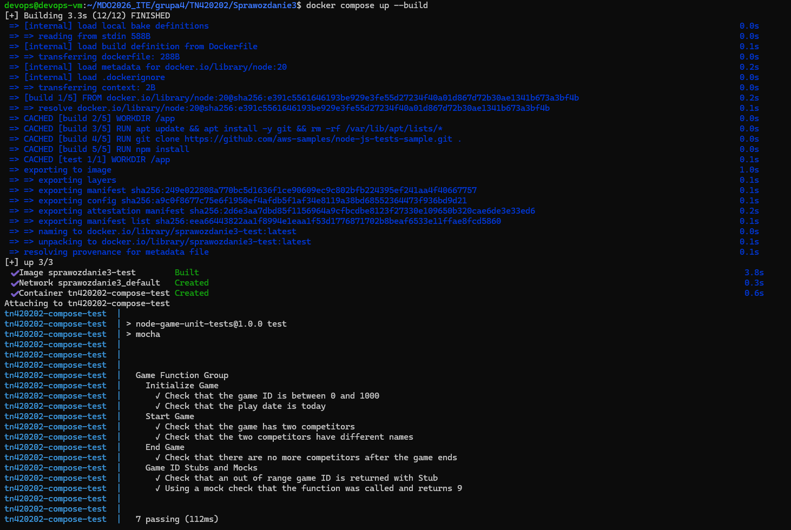

# Sprawozdanie 3

## 1. Wybór oprogramowania 

Wybrano repozytorium `aws-samples/node-js-tests-sample`, ponieważ zawiera otwartą licencję oraz przewiduje instalację zależności przez `npm install` i uruchamianie testów przez `npm test`.

```bash
git clone https://github.com/aws-samples/node-js-tests-sample.git
cd node-js-tests-sample
```



## 2. Build i test poza kontenerem

W środowisku maszyny wirtualnej zainstalowano zależności oraz uruchomiono testy.

```bash 
npm install
npm test
```





## 3. Build i test interaktywnie w kontenerze

Uruchomiono kontener bazowy z obrazem Node.js i zamontowano katalog projektu.

```bash
docker run -it --name node-lab -v "$PWD":/app -w /app node:20 bash
```

W kontenerze wykonano:

```bash
node --version
npm --version
npm install
npm test
```



## 4. Dockerfile

Przygotowano dwustopniowy plik `Dockerfile`.

```dockerfile
FROM node:20 AS build

WORKDIR /app

RUN apt update && apt install -y git && rm -rf /var/lib/apt/lists/*

RUN git clone https://github.com/aws-samples/node-js-tests-sample.git .

RUN npm install


FROM build AS test

WORKDIR /app

CMD ["npm", "test"]
```

## 5. Budowanie obrazu

Zbudowano etap `build` oraz obraz końcowy.

```bash
docker build --target build -t tn420202-build-stage .
docker build -t tn420202-sprawozdanie3 .
```





## 6. Uruchomienie kontenera testowego

Uruchomiono kontener wykonujący testy:

```bash
docker run --name tn420202-test tn420202-sprawozdanie3
```

Następnie sprawdzono listę kontenerów:

```bash
docker ps -a
```



## 7. Co pracuje w kontenerze?

W kontenerze nie działa pełny system operacyjny w klasycznym sensie, lecz główny proces kontenera.  
W tym zadaniu procesem tym było polecenie:

```text
npm test
```

Oznacza to, że kontener pełni rolę powtarzalnego etapu pipeline'u: uruchamia testy i kończy działanie po ich wykonaniu.

## 8. Docker Compose

Przygotowano prosty plik `compose.yaml` uruchamiający etap testowy.

```yaml
services:
  test:
    build:
      context: .
      target: test
    container_name: tn420202-compose-test
```

Uruchomienie wykonano poleceniem:

```bash
docker compose up --build
```




## 9. Dyskusja o wdrożeniu

W analizowanym przypadku aplikacja może zostać uruchomiona w kontenerze, jednak zaprezentowany sposób budowania i testowania wskazuje, że kontener pełni przede wszystkim rolę etapu pipeline’u CI (Continuous Integration), a niekoniecznie finalnego artefaktu wdrożeniowego.

### Czy program nadaje się do wdrożenia jako kontener?

Tak, aplikacja Node.js może być uruchamiana w kontenerze, jednak przygotowany obraz zawiera pełne środowisko developerskie (narzędzia buildowe, zależności testowe), co nie jest optymalne dla środowiska produkcyjnego. W obecnej formie kontener lepiej nadaje się do budowania i testowania niż do wdrożenia.

### Przygotowanie finalnego artefaktu

W przypadku wdrożenia produkcyjnego należałoby:
- ograniczyć rozmiar obrazu poprzez usunięcie zależności developerskich,
- wykorzystać osobny etap runtime (np. osobny Dockerfile lub etap multi-stage),
- skopiować jedynie niezbędne pliki aplikacji (np. katalog `dist` lub wynik builda),
- wyeliminować narzędzia takie jak `git`, `npm install` w runtime.

Dobrym podejściem byłoby zastosowanie trzech etapów:
1. **build** – instalacja zależności i przygotowanie aplikacji,
2. **test** – uruchomienie testów,
3. **runtime** – minimalny obraz uruchamiający aplikację.

### Czy potrzebny jest osobny deploy/publish?

Tak, w praktyce często stosuje się osobny etap `deploy` lub `publish`, który:
- buduje finalny obraz produkcyjny,
- publikuje go do rejestru (np. Docker Hub),
- lub przygotowuje artefakt do dystrybucji.

### Alternatywa: dystrybucja jako pakiet

Zamiast kontenera możliwa jest dystrybucja aplikacji jako:
- paczka npm,
- archiwum aplikacji,
- artefakt builda.

Kontener jest jednak wygodniejszy, ponieważ zapewnia spójne środowisko uruchomieniowe niezależne od systemu docelowego.

### Jak zapewnić odpowiedni format artefaktu?

Najlepszym podejściem jest użycie wieloetapowego Dockerfile lub dodatkowego kroku pipeline’u (np. trzeciego kontenera), który:
- pobiera wynik builda,
- przygotowuje minimalny obraz runtime,
- lub tworzy finalny pakiet do dystrybucji.

### Podsumowanie

Kontener w tym zadaniu pełni rolę powtarzalnego etapu pipeline’u CI, zapewniającego spójność środowiska build i test. W środowisku produkcyjnym należałoby jednak przygotować osobny, zoptymalizowany artefakt wdrożeniowy.