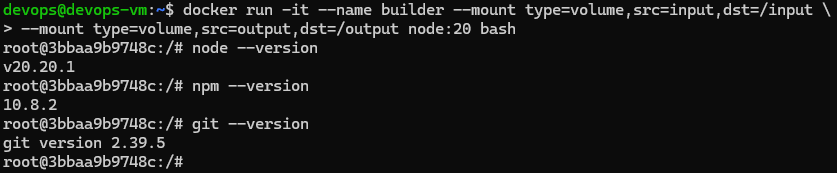
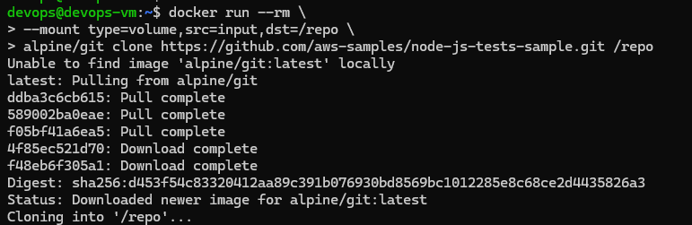
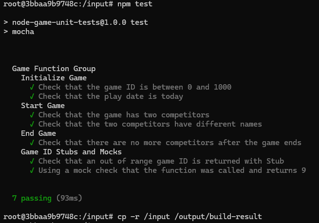
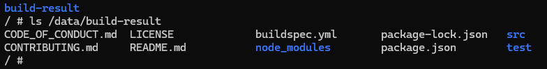
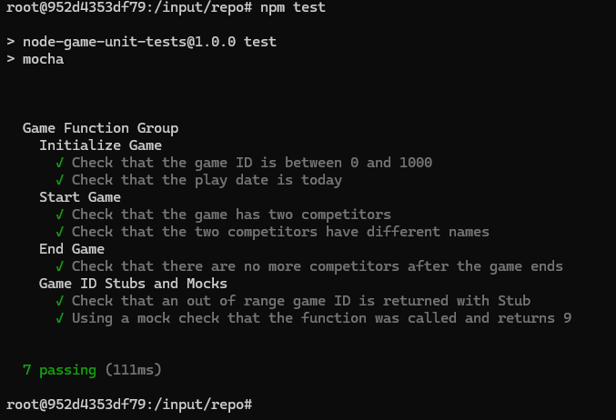
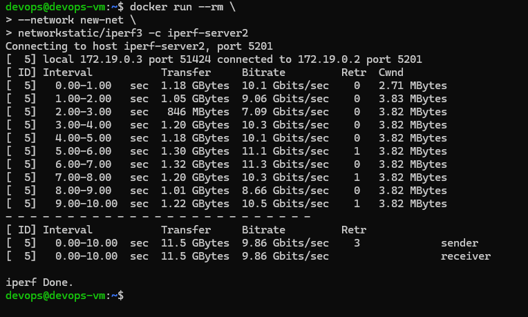
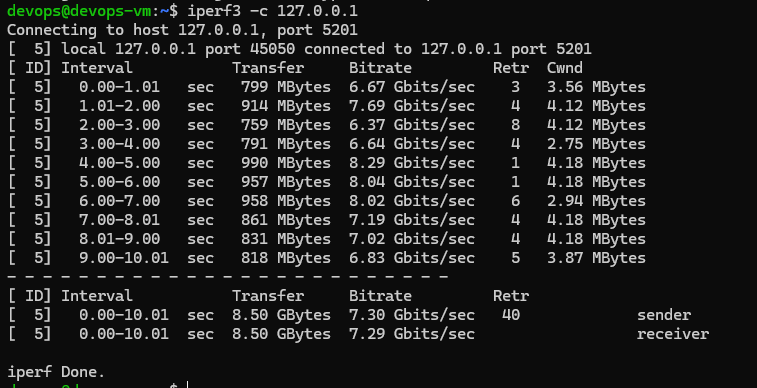
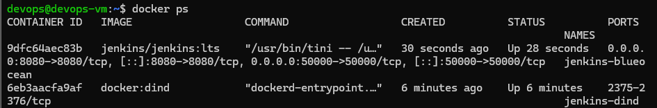
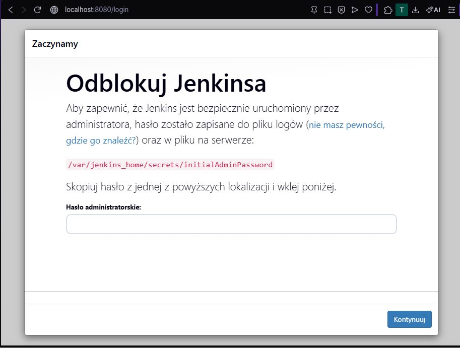

# Sprawozdanie 4


# 1. Zachowywanie stanu między kontenerami

## 1.1 Utworzenie woluminów

```bash
docker volume create input
docker volume create output
docker volume ls
```


---

## 1.2 Uruchomienie kontenera bazowego

```bash
docker run -it --name builder \
  --mount type=volume,src=input,dst=/input \
  --mount type=volume,src=output,dst=/output \
  node:20 bash
```

Sprawdzono dostępność narzędzi:

```bash
node --version
npm --version
git --version
```

Podczas weryfikacji środowiska zauważono, że obraz `node:20` zawiera narzędzie git. Zgodnie z wymaganiami zadania nie korzystano z niego w kontenerze buildowym.




---

## 1.3 Klonowanie repozytorium na wolumin wejściowy

Repozytorium zostało sklonowane przy użyciu kontenera pomocniczego:

```bash
docker run --rm \
  --mount type=volume,src=input,dst=/repo \
  alpine/git clone https://github.com/aws-samples/node-js-tests-sample.git /repo
```

### Uzasadnienie

Zastosowano kontener pomocniczy, aby:
- uniknąć instalacji Gita w kontenerze buildowym,
- zachować separację odpowiedzialności,
- wykorzystać wolumin jako współdzielone źródło danych.



---

## 1.4 Build w kontenerze

```bash
cd /input
npm install
npm test
cp -r /input /output/build-result
```



---

## 1.5 Weryfikacja trwałości danych

```bash
docker run --rm \
  --mount type=volume,src=output,dst=/data \
  busybox ls -R /data
```



---

## 1.6 Klonowanie repo wewnątrz kontenera

```bash
apt update
apt install -y git
git clone https://github.com/aws-samples/node-js-tests-sample.git /input/repo
cd /input/repo
npm install
npm test
```



---

## 1.7 Dyskusja

- użycie kontenera pomocniczego zapewnia czystsze środowisko buildowe  
- instalacja Gita w kontenerze upraszcza proces, ale zwiększa zależności  
- bind mount mógłby być alternatywą, jednak woluminy zapewniają lepszą izolację  

---

# 2. Sieć i komunikacja między kontenerami (iperf3)

## 2.1 Uruchomienie serwera

```bash
docker run -d --name iperf-server networkstatic/iperf3 -s
```

## 2.2 Uruchomienie klienta

```bash
docker run  --rm networkstatic/iperf3 -c <IP>
```


---

## 2.3 Dedykowana sieć

```bash
docker network create new-net

docker run -d --name iperf-server2 \
  --network new-net networkstatic/iperf3 -s

docker run --rm \
  --network new-net networkstatic/iperf3 -c iperf-server2
```

Połączenie:




---

## 2.4 Połączenie z hosta

```bash
docker run -d --name iperf-server2 \
  --network new-net -p 5201:5201 networkstatic/iperf3 -s

iperf3 -c 127.0.0.1
```



---

# 3. Usługa SSH w kontenerze

## 3.1 Instalacja SSH

```bash
docker run -it -d --name ssh-lab -p 2223:22 ubuntu bash
```

```bash
apt update
apt install -y openssh-server
mkdir /var/run/sshd
echo 'root:rootpass' | chpasswd
/usr/sbin/sshd -D
```

## 3.2 Połączenie

```bash
ssh root@<IP_kontenera>
```


---

## 3.3 Dyskusja

**Zalety:**
- łatwy dostęp do kontenera  
- wygodne debugowanie  

**Wady:**
- niezgodne z ideą jednego procesu w kontenerze  
- zwiększa powierzchnię ataku  
- zbędne w środowisku produkcyjnym  

---

# 4. Jenkins + Docker-in-Docker (DIND)

## 4.1 Sieć i woluminy

```bash
docker network create jenkins
docker volume create jenkins_home
docker volume create jenkins_docker_certs
```

---

## 4.2 Kontener DIND

```bash
docker run --name jenkins-dind -d \
  --privileged \
  --network jenkins \
  --network-alias docker \
  --env DOCKER_TLS_CERTDIR=/certs \
  --volume jenkins_docker_certs:/certs/client \
  --volume jenkins_home:/var/jenkins_home \
  docker:dind
```

---

## 4.3 Jenkins

```bash
docker run --name jenkins-blueocean -d \
  --network jenkins \
  --env DOCKER_HOST=tcp://docker:2376 \
  --env DOCKER_CERT_PATH=/certs/client \
  --env DOCKER_TLS_VERIFY=1 \
  -p 8080:8080 \
  -p 50000:50000 \
  --volume jenkins_home:/var/jenkins_home \
  --volume jenkins_docker_certs:/certs/client:ro \
  jenkins/jenkins:lts
```

---

## 4.4 Sprawdzenie kontenerów

```bash
docker ps
```



---

## 4.5 Hasło inicjalne

```bash
docker exec jenkins-blueocean \
  cat /var/jenkins_home/secrets/initialAdminPassword
```

---

## 4.6 Panel Jenkins

Dostęp:

```
http://localhost:8080

```



---

# 5. Podsumowanie

- woluminy umożliwiają trwałe przechowywanie danych  
- dedykowana sieć umożliwia komunikację po nazwach kontenerów  
- kontenery uruchamiają pojedyncze procesy  
- Jenkins może być uruchomiony w pełni w środowisku kontenerowym  

---

 