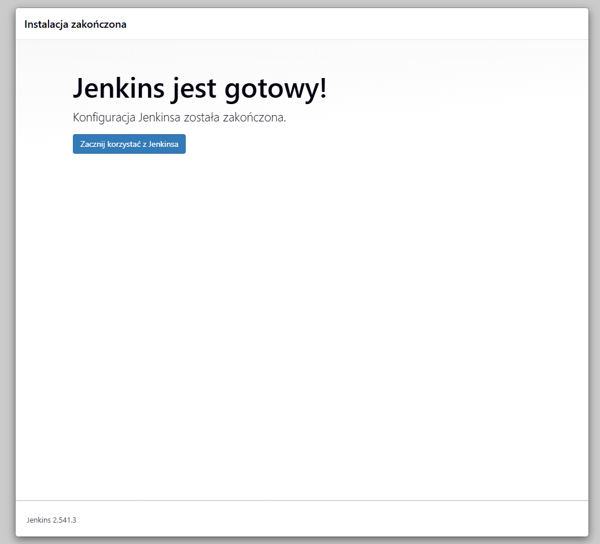
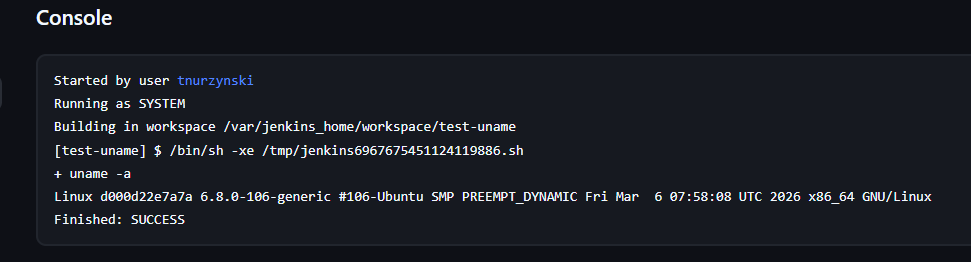
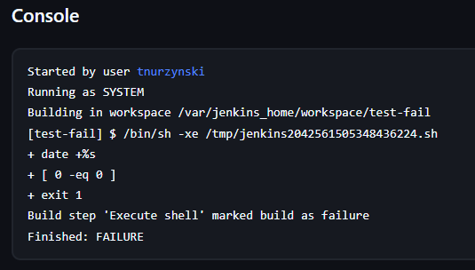
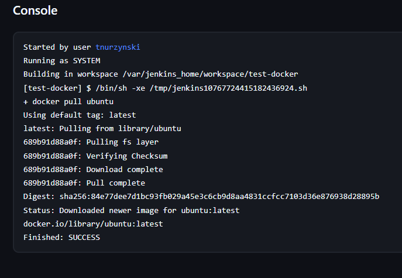
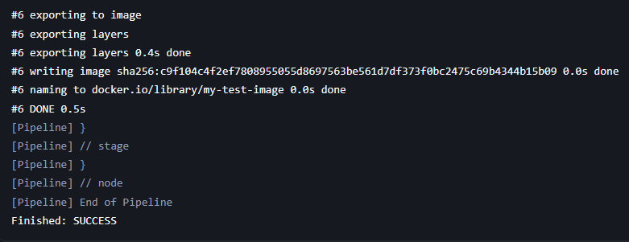
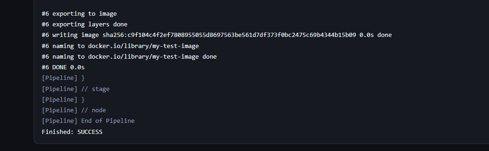

# Sprawozdanie 5

## 1. Przygotowanie środowiska

Uruchomiono instancję Jenkins w kontenerze Docker wraz z kontenerem Docker-in-Docker (DIND). Następnie skonfigurowano dostęp do panelu webowego oraz utworzono użytkownika administracyjnego.



---

## 2. Zadania typu Freestyle

### 2.1 Zadanie testowe (uname)

Utworzono zadanie wykonujące polecenie systemowe:

```bash
uname -a
```

Pozwoliło to zweryfikować poprawność działania środowiska Jenkins.



---

### 2.2 Zadanie generujące błąd

Utworzono zadanie, które w zależności od warunku kończy się błędem:

```bash
if [ $(( $(date +%s) % 2 )) -eq 0 ]; then
  exit 1
fi
```

Pozwoliło to sprawdzić mechanizm obsługi błędów oraz oznaczania buildów jako nieudanych.



---

### 2.3 Zadanie z wykorzystaniem Dockera

W zadaniu wykorzystano polecenie:

```bash
docker pull ubuntu
```

Operacja zakończyła się sukcesem, co potwierdziło poprawną integrację Jenkins z Dockerem.



---

## 3. Pipeline

### 3.1 Utworzenie pipeline

Utworzono obiekt typu pipeline i zdefiniowano jego działanie bezpośrednio w Jenkinsie.

Pipeline składał się z następujących etapów:
- wykonanie polecenia systemowego,
- klonowanie repozytorium,
- utworzenie pliku Dockerfile,
- budowa obrazu kontenera.

---

### 3.2 Klonowanie repozytorium

Pipeline pobierał repozytorium przedmiotowe z gałęzi użytkownika.

---

### 3.3 Budowa obrazu Docker

W pipeline utworzono plik Dockerfile oraz zbudowano obraz kontenera:

```bash
docker build -t my-test-image .
```

Proces zakończył się sukcesem.



---

### 3.4 Ponowne uruchomienie pipeline

Pipeline został uruchomiony ponownie w celu weryfikacji poprawności działania.



---

