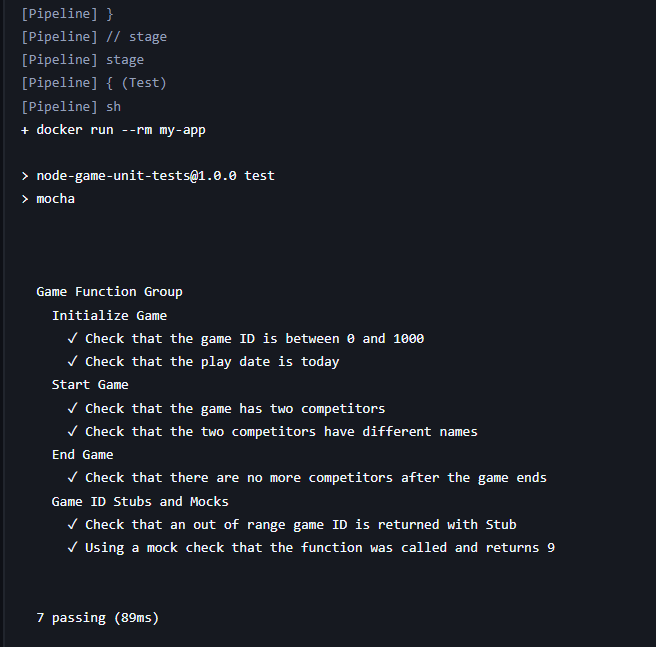
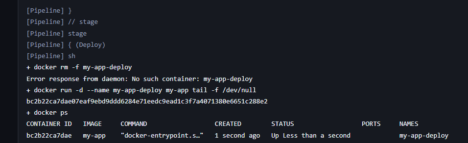
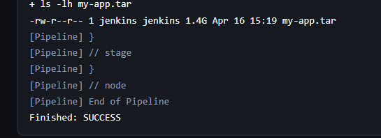
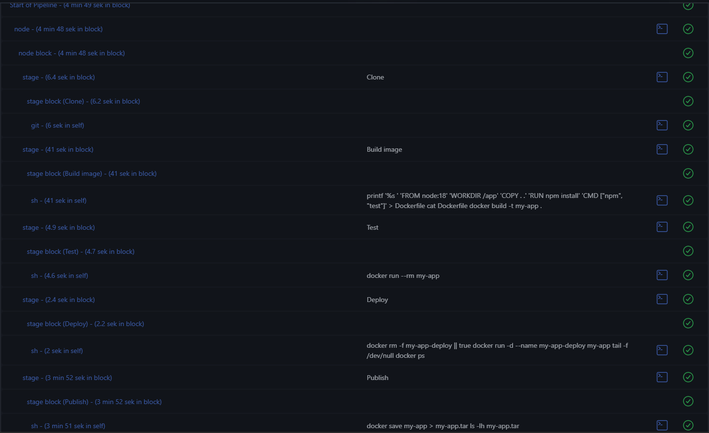

# Sprawozdanie 6

## Opis pipeline

Zaimplementowany pipeline w Jenkinsie składa się z następujących etapów:

### 1. Clone

Repozytorium aplikacji (**node-js-test-sample**) jest pobierane z GitHub:

```bash
git branch: 'main', url: 'https://github.com/aws-samples/node-js-tests-sample.git'
```

### 2. Build

W etapie tworzony jest obraz Docker zawierający aplikację:

```bash
FROM node:18
WORKDIR /app
COPY . .
RUN npm install
CMD ["npm", "test"]
```

Budowanie obrazu:

```bash
docker build -t my-app .
```

### 3. Test

Testy wykonane są przez uruchomienie kontenera:

```bash
docker run --rm my-app
```

Wynik:

- wszystkie testy zakończone sukcesem (7 passing)



### 4. Deploy

Kontener uruchamiany jest w trybie działającym:

```bash
docker run -d --name my-app-deploy my-app tail -f /dev/null
```

Nastpęnie weryfikowany przez:

```bash
docker ps
```



### 5. Publish
Obraz Docker zapisywany jest jako artefakt:

```bash 
docker save my-app > my-app.tar
```



## Realizacja ścieżki krytycznej

Pipeline realizuje pełną ścieżkę krytyczną:

- clone
- build
- test
- deploy
- publish

Działanie zostało potwierdzone poprzez poprawne wykonanie pipeline (status SUCCESS).



## Decyzje projektowe

### Wybór środowiska

Zastosowano obraz **node:18**, który zawiera wszystkie wymagane zależności do budowy i testowania aplikacji Node.js

### Izolacja etapów

- Build i test wykonywane są w kontenerze Docker
- Jenkins pełni rolę orkiestratora pipeline
- Docker zapewnia powtarzalność środowiska

### Deploy

Etap deploy ma charakter demonstracyjny:

- kontener nie uruchamia aplikacji użytkowej, lecz utrzymywany jest przy użyciu (**tail -f /dev/null**)
- pozwala to zweryfikować poprawność uruchomienia kontenera

### Publish

Artefaktem pipeline jest obraz Docker zapisywany jako plik:

```bash
my-app.tar
```

Pozwala to na:

- przenoszenie obrazu między środowiskami 
- dalszą dystrybucję 

## Wnioski

- Pipeline poprawnie automatyzuje proces build i test
- Kontenery zapewniają powtarzalność środowiska
- Etapy deploy i publish wymagają doprecyzowania w zależności od typu aplikacji
- Obecna implementacja stanowi podstawę do dalszego rozwoju