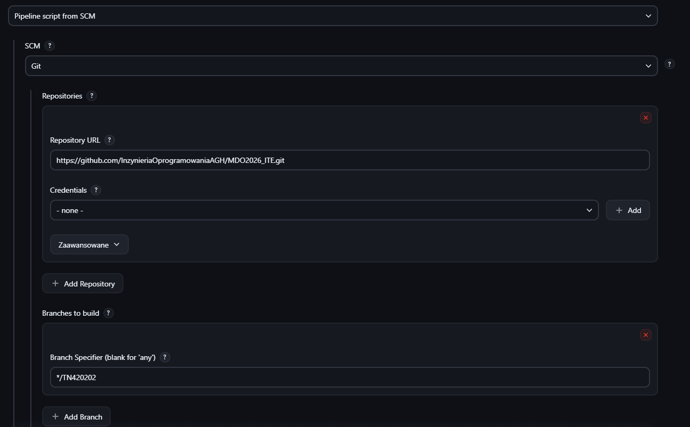
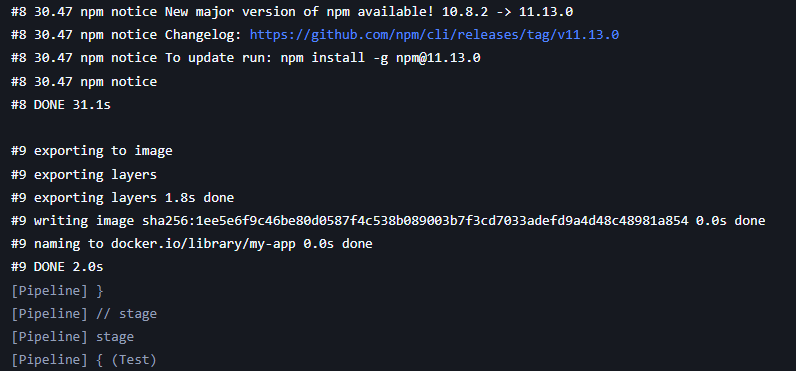
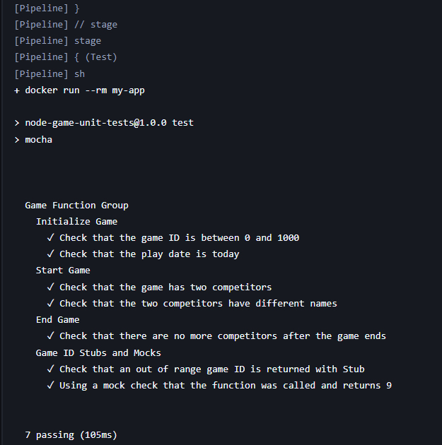
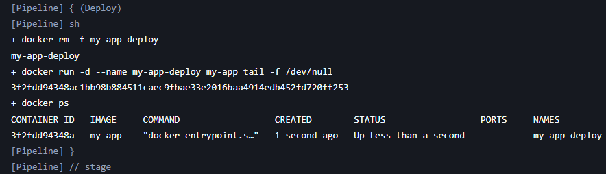
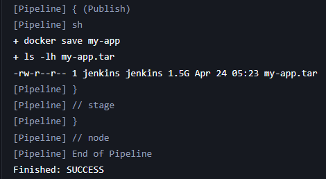
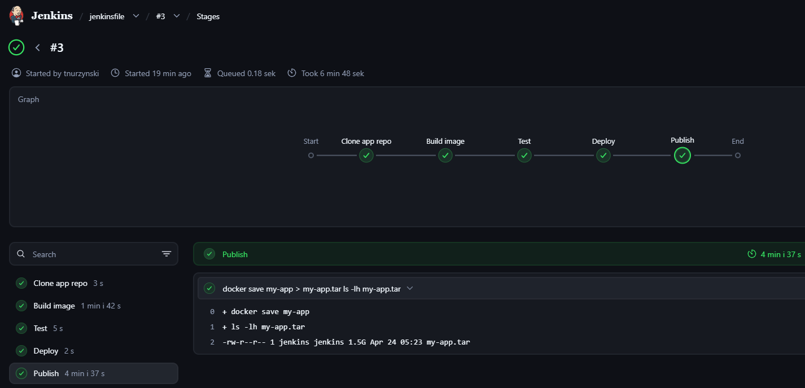

# Sprawozdanie 7

## Konfiguracja Jenkins

Pipeline został skonfigurowany jako:

- Pipeline script form SCM
- repozytorium przedmiotowe
- branch: TN420202



## Opis pipeline
Pipeline został zapisany w pliku Jenkinsfile i składa się z etapów:

1. **Clone app repo** - pobranie repozytorium aplikacji
```bash
git branch: 'main', url: 'https://github.com/aws-samples/node-js-tests-sample.git'
```

2. **Build** - budowa obrazu Docker
```bash
docker build -t my-app .
```


3. **Test** - uruchomenie testów
```bash
docker run --rm my-app
```


4. **Deploy** - uruchomienie kontenera
```bash
docker run -d --name my-app-deploy my-app tail -f /dev/null
```
Weryfikacja
```bash
docker ps
```


5. **Publish** - zapis obrazu Docker jako artefakt
```bash
docker save my-app > my-app.tar
```


## Realizacja ścieżki krytycznej
Pipeline realizuje pełną ścieżkę:

- clone
- build
- test
- deploy
- publish



## Problemy
Podczas realizacji napotkano na problem z pobieraniem repozytorium (timeout).
Rozwiązanie było:

- użycie *skipDefaultCheckout(true)*
- ograniczenie liczby operacji checkout

## Wnioski
- Pipeline z Jenkinsfile umożliwia automatyczne budowanie procesu CI/CD
- Integracja z SCM pozwala na wersjonowanie pipeline
- Docker zapewnia powtarzalność środkowiska