# Sprawozdanie 8 


# 1. Przygotowanie środowiska

## 1.1 Utworzenie maszyny `ansible-target`

Przygotowano drugą maszynę wirtualną Ubuntu Server o minimalnej konfiguracji systemu.  
Podczas konfiguracji:

- nadano hostname `ansible-target`,
- utworzono użytkownika `ansible`,
- zainstalowano usługę OpenSSH (`sshd`),
- skonfigurowano sieć Host-Only Adapter w VirtualBox.

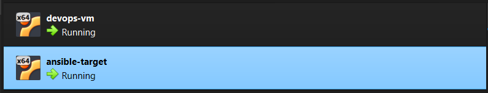

---

## 1.2 Instalacja Ansible

Na głównej maszynie `devops-vm` zainstalowano Ansible:

```bash
sudo apt install ansible
```

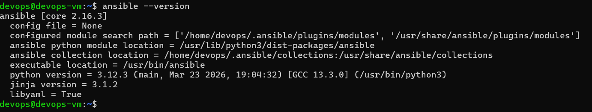

---

## 1.3 Konfiguracja komunikacji SSH

Wygenerowano nowy klucz SSH:

```bash
ssh-keygen
```

Następnie skopiowano klucz publiczny na maszynę docelową:

```bash
ssh-copy-id ansible@192.168.56.101
```

Zweryfikowano możliwość logowania bez podawania hasła:

```bash
ssh ansible@192.168.56.101
```

---

# 2. Konfiguracja inventory

Utworzono plik `inventory.ini`:

```ini
[orchestrators]
devops-vm ansible_connection=local

[endpoints]
ansible-target ansible_host=192.168.56.101 ansible_user=ansible
```

Inventory definiuje:
- lokalną maszynę zarządzającą,
- zdalny endpoint zarządzany przez Ansible.

---

# 3. Weryfikacja połączenia

Zweryfikowano poprawność komunikacji:

```bash
ansible all -i inventory.ini -m ping
```

Wynik:

```text
pong
```

Potwierdziło to poprawną konfigurację:
- SSH,
- inventory,
- działania Ansible.

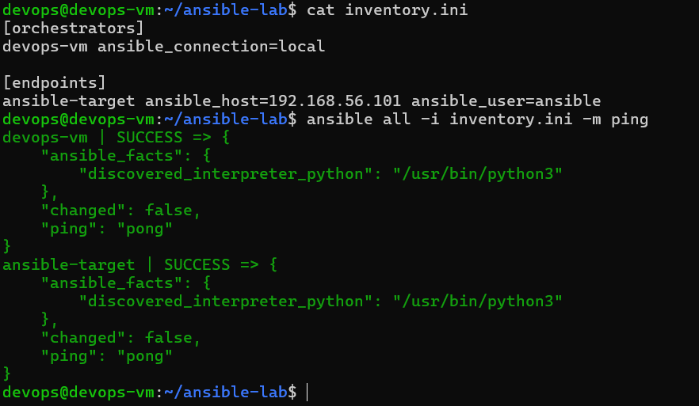

---

# 4. Playbook — ping wszystkich maszyn

Utworzono playbook `ping.yml`:

```yaml
---
- hosts: all

  tasks:
    - name: Ping all machines
      ping:
```

Uruchomienie:

```bash
ansible-playbook -i inventory.ini ping.yml
```

Playbook poprawnie wykonał moduł `ping` na wszystkich hostach.

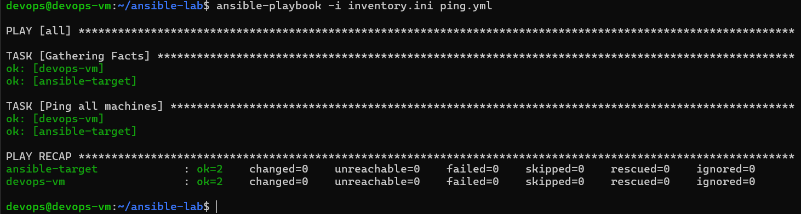

---

# 5. Kopiowanie plików na endpoint

Utworzono plik testowy:

```bash
echo "Ansible działa poprawnie" > test.txt
```

Playbook `copy.yml`:

```yaml
---
- hosts: endpoints

  tasks:
    - name: Copy test file to endpoint
      copy:
        src: test.txt
        dest: /home/ansible/test.txt
```

Uruchomienie:

```bash
ansible-playbook -i inventory.ini copy.yml
```

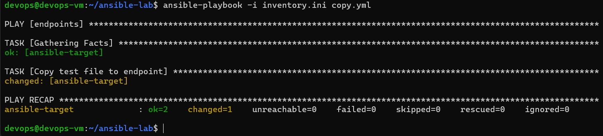

Zweryfikowano obecność pliku na maszynie docelowej:

```bash
cat ~/test.txt
```


---

# 6. Aktualizacja pakietów systemowych

Playbook `update.yml`:

```yaml
---
- hosts: endpoints
  become: yes

  tasks:
    - name: Update apt cache
      apt:
        update_cache: yes
```

Uruchomienie:

```bash
ansible-playbook -i inventory.ini update.yml --ask-become-pass
```

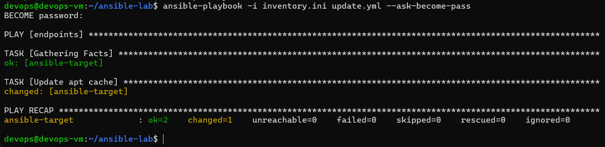

---

# 7. Restart usługi SSH

Playbook `restart_ssh.yml`:

```yaml
---
- hosts: endpoints
  become: yes

  tasks:
    - name: Restart SSH service
      service:
        name: ssh
        state: restarted
```

Uruchomienie:

```bash
ansible-playbook -i inventory.ini restart_ssh.yml --ask-become-pass
```

Playbook poprawnie zrestartował usługę SSH na zdalnym hoście.

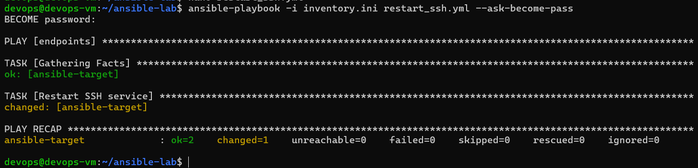

---

# 8. Symulacja awarii usługi SSH

Na maszynie `ansible-target` zatrzymano usługi:

```bash
sudo systemctl stop ssh
sudo systemctl stop ssh.socket
```

Następnie uruchomiono:

```bash
ansible-playbook -i inventory.ini ping.yml
```

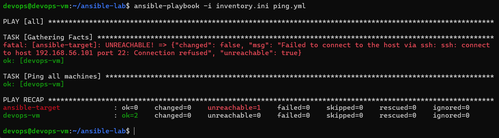

Potwierdziło to poprawne wykrywanie niedostępności endpointu.

Po przywróceniu usług:

```bash
sudo systemctl start ssh.socket
sudo systemctl start ssh
```

łączność została odzyskana.

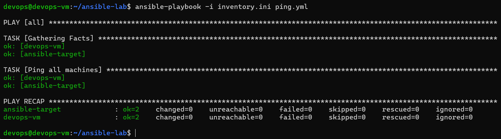

---

# 9. Zarządzanie artefaktem z pipeline Jenkins

W poprzednich zajęciach przygotowano pipeline Jenkins realizujący etapy:

```text
clone -> build -> test -> deploy -> publish
```

Artefaktem pipeline był obraz Docker aplikacji `my-app`.

W ramach zajęć 08 wykorzystano Ansible do automatyzacji wdrożenia aplikacji kontenerowej.

---

# 10. Instalacja Dockera przez Ansible

Zainstalowano kolekcję:

```bash
ansible-galaxy collection install community.docker
```

Playbook `docker_install.yml`:

```yaml
---
- hosts: endpoints
  become: yes

  tasks:
    - name: Install Docker
      apt:
        name: docker.io
        state: present
        update_cache: yes

    - name: Start Docker service
      service:
        name: docker
        state: started
        enabled: yes
```

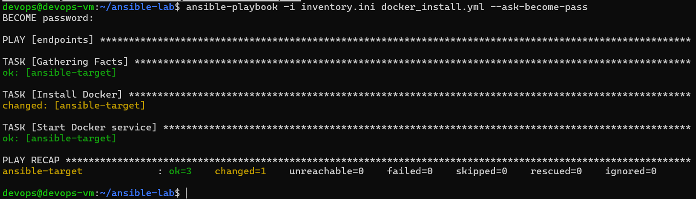

---

# 11. Uruchomienie kontenera przez Ansible

Playbook `run_container.yml`:

```yaml
---
- hosts: endpoints
  become: yes

  tasks:
    - name: Run nginx container
      community.docker.docker_container:
        name: nginx-test
        image: nginx
        state: started
        ports:
          - "8080:80"
```

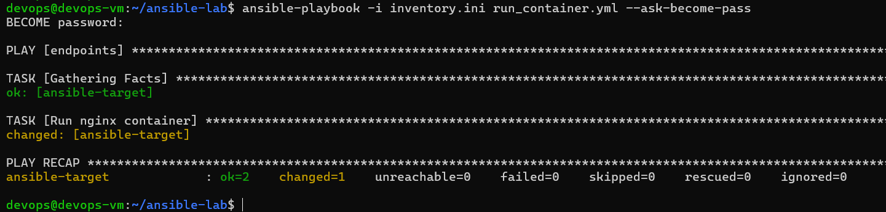


Po wykonaniu:
- uruchomiono kontener nginx,
- zweryfikowano działanie przez przeglądarkę:

```text
http://192.168.56.101:8080
```

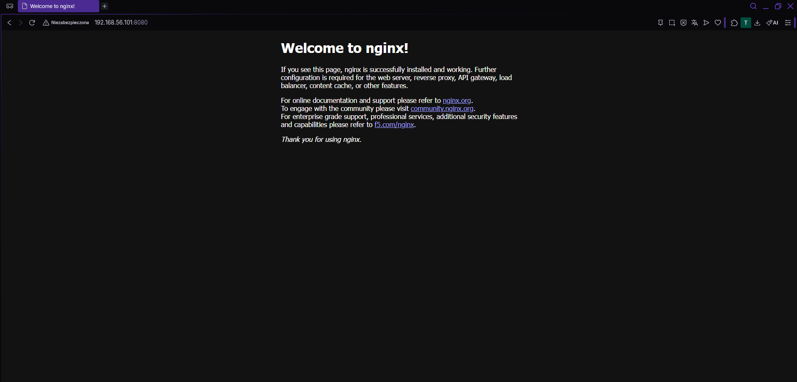

---

# 12. Czyszczenie środowiska

Playbook `cleanup.yml`:

```yaml
---
- hosts: endpoints
  become: yes

  tasks:
    - name: Remove nginx container
      community.docker.docker_container:
        name: nginx-test
        state: absent
```

Playbook usunął kontener testowy.

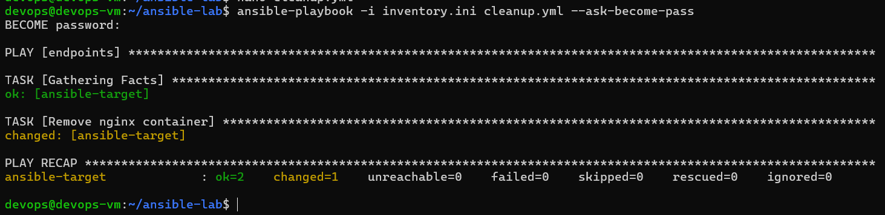

---

