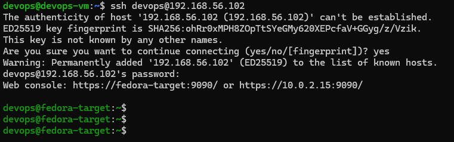
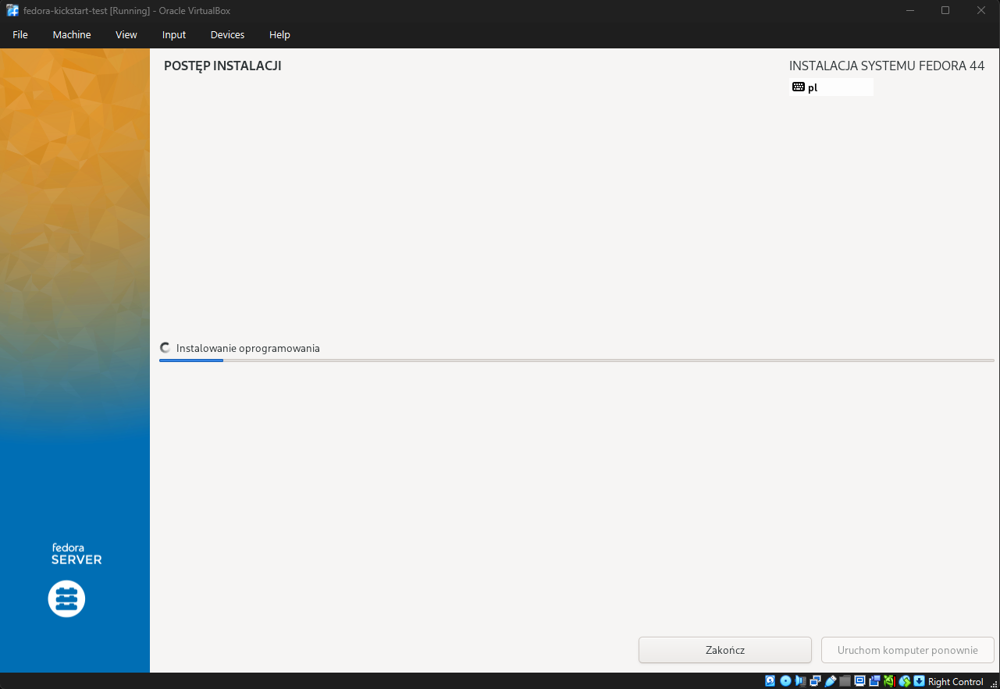
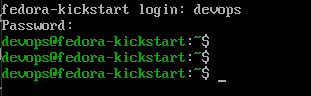

# Sprawozdanie 9

## Przygotowanie środowiska

W celu realizacji zadania wykorzystano:

- maszynę zarządzającą Ubuntu Server (`devops-vm`),
- nową maszynę wirtualną Fedora Server,
- serwer HTTP udostępniający plik Kickstart.

Pobrano obraz instalacyjny Fedora Server 44:

```text
Fedora-Server-dvd-x86_64-44-1.7.iso
```

Następnie utworzono nową maszynę wirtualną i przeprowadzono standardową instalację systemu Fedora Server.



---

## Pobranie i analiza pliku Kickstart

Po zakończeniu instalacji pobrano automatycznie wygenerowany przez instalator plik Kickstart:

```bash
sudo cat /root/anaconda-ks.cfg
```

Plik zawierał konfigurację wykonaną podczas ręcznej instalacji systemu.

Przeanalizowano jego strukturę oraz poszczególne sekcje odpowiedzialne za:

- konfigurację języka,
- konfigurację klawiatury,
- konfigurację sieci,
- konfigurację użytkowników,
- partycjonowanie dysku,
- wybór pakietów instalacyjnych,
- wykonywanie skryptów po instalacji.

---

## Modyfikacja pliku Kickstart

Na podstawie wygenerowanego pliku przygotowano własną wersję pliku odpowiedzi.

Wprowadzono następujące zmiany:

### Konfiguracja sieci

Ustawiono własną nazwę hosta:

```cfg
network --bootproto=dhcp --device=link --activate --hostname=fedora-kickstart
```

### Konfiguracja użytkownika

Pozostawiono automatyczne tworzenie użytkownika:

```cfg
user --groups=wheel --name=devops ...
```

### Automatyczne partycjonowanie dysku

Zastosowano pełne czyszczenie dysku podczas instalacji:

```cfg
clearpart --all --initlabel
autopart
```

### Instalowane pakiety

Wybrano środowisko Fedora Server wraz z obsługą kontenerów:

```cfg
%packages
@^server-product-environment
@container-management
@guest-agents
openssh-server
podman
%end
```

### Automatyczne uruchamianie SSH

Dodano konfigurację usługi SSH:

```cfg
services --enabled=sshd
```

### Skrypt wykonywany po instalacji

Dodano sekcję `%post`:

```cfg
%post --log=/root/ks-post.log
systemctl enable sshd

mkdir -p /opt/myapp
echo "Kickstart post-install completed" > /root/kickstart_done.txt
echo "System prepared for container-based application deployment" > /opt/myapp/README.txt
%end
```

---

## Udostępnienie pliku Kickstart

Przygotowany plik został umieszczony w repozytorium projektu.

Na maszynie Ubuntu uruchomiono serwer HTTP:

```bash
python3 -m http.server 8000
```

Plik został udostępniony pod adresem:

```text
http://192.168.56.103:8000/anaconda-ks.cfg
```

Poprawność działania serwera zweryfikowano poleceniem:

```bash
curl http://192.168.56.103:8000/anaconda-ks.cfg
```

wykonanym z poziomu maszyny Fedora.

---

## Instalacja nienadzorowana

W celu weryfikacji przygotowanego pliku utworzono nową maszynę wirtualną:

```text
fedora-kickstart-test
```

Podczas uruchamiania instalatora Fedora Server zmodyfikowano parametry startowe systemu.

Do parametrów jądra dodano:

```text
inst.ks=http://192.168.56.103:8000/anaconda-ks.cfg
```

Po uruchomieniu instalator automatycznie pobrał plik Kickstart i rozpoczął instalację bez konieczności wykonywania jakichkolwiek czynności przez użytkownika.

W trakcie testów wystąpił błąd związany z pierwotną wersją pliku Kickstart. Po analizie problemu zmodyfikowano listę pakietów oraz konfigurację usług, po czym instalacja została przeprowadzona ponownie.

Druga próba zakończyła się powodzeniem.



---

## Weryfikacja instalacji

Po zakończeniu instalacji system uruchomił się automatycznie.

