# Sprawozdanie 01 - Wprowadzenie, Git, Gałęzie, SSH

**Jan Wojsznis 422049**

---

## 0. Środowisko

Ćwiczenie wykonano w środowisku *Ubuntu Server* uruchomionym na maszynie wirtualnej. Połączenie z maszyną realizowano przez *SSH*, a repozytorium obsługiwano z poziomu terminala oraz *Visual Studio Code*.

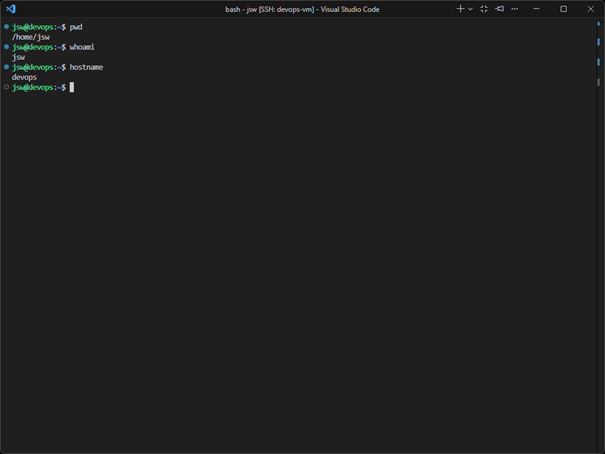

---

## 1. Git

W środowisku linuksowym sprawdzono dostępność klienta `git` oraz skonfigurowano dane użytkownika.

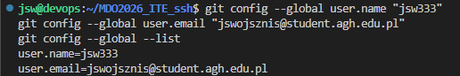

Repozytorium przedmiotowe sklonowano z użyciem protokołu *HTTPS* oraz *personal access token*.

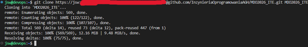

---

## 2. SSH

Utworzono dwa klucze *SSH* inne niż *RSA*: `ed25519` oraz `ecdsa 521`. Jeden z kluczy został zabezpieczony hasłem.

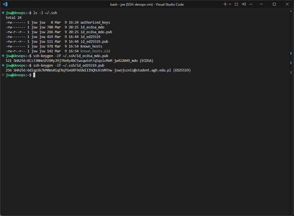

Uruchomiono *ssh-agent* i dodano do niego oba klucze.

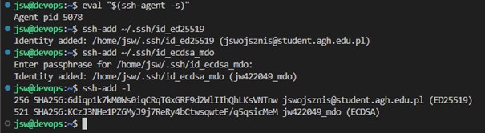

Klucz publiczny został dodany do konta *GitHub*, a następnie wykonano test połączenia z użyciem `ssh -T git@github.com`.

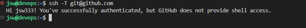

Repozytorium sklonowano również z wykorzystaniem protokołu *SSH*.

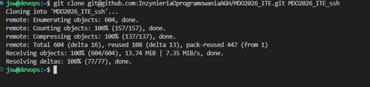

Na koncie *GitHub* włączono uwierzytelnianie dwuskładnikowe.

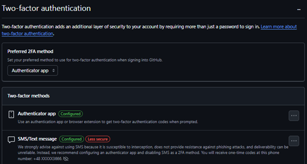

---

## 3. Narzędzia

Skonfigurowano dostęp do maszyny i repozytorium w *Visual Studio Code* z użyciem *Remote SSH*.

Skonfigurowano również wymianę plików z użyciem *FileZilla* przez *SFTP*.

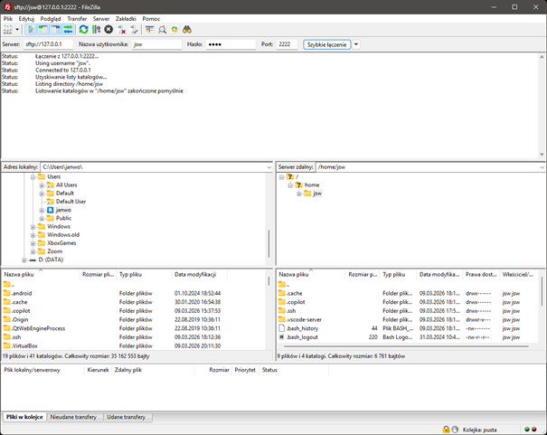

---

## 4. Gałąź

Przełączono się na gałąź `main`, a następnie na gałąź grupową `grupa6`.

Na podstawie gałęzi grupowej utworzono własną gałąź `JW422049`.

W katalogu właściwym dla grupy utworzono katalog `grupa6/JW422049`.

Przygotowano skrypt `commit-msg`, który sprawdza, czy każdy komunikat commita zaczyna się od `JW422049`. Skrypt zapisano w katalogu `grupa6/JW422049`, a następnie skopiowano do `.git/hooks/commit-msg`, aby był uruchamiany przy każdym commicie.

```sh
#!/bin/sh

PREFIX="JW422049"
MSG_FILE="$1"
FIRST_LINE=$(head -n 1 "$MSG_FILE")

case "$FIRST_LINE" in
  "$PREFIX"*)
    exit 0
    ;;
  *)
    echo "Blad: commit message musi zaczynac sie od $PREFIX"
    exit 1
    ;;
esac
```

Działanie hooka sprawdzono na dwóch przykładach. W pierwszej próbie wykonano commit z niepoprawnym komunikatem, który nie zawierał wymaganego prefiksu. Skrypt poprawnie zablokował operację.

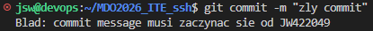

W drugiej próbie zastosowano poprawny komunikat rozpoczynający się od `JW422049`, dzięki czemu commit został zaakceptowany.

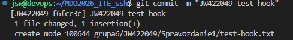

Po wykonaniu zmian własna gałąź `JW422049` została wysłana do zdalnego repozytorium.

Następnie utworzono *pull request* z gałęzi `JW422049` do gałęzi grupowej `grupa6`.

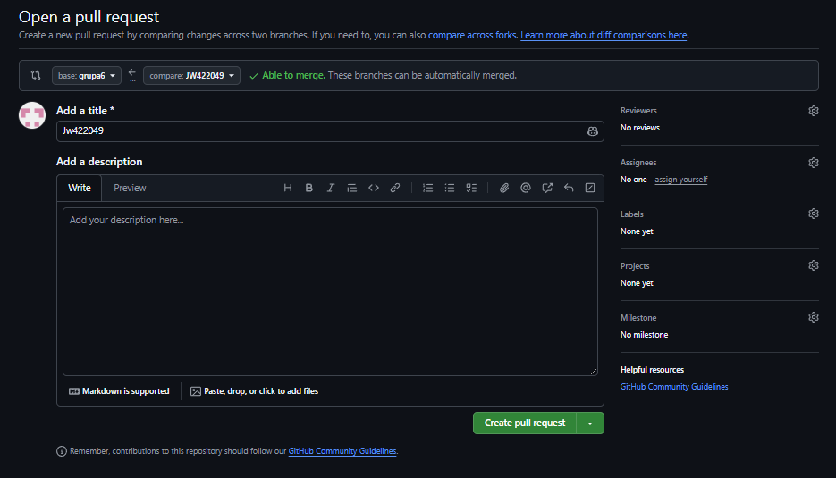

Po utworzeniu *pull request* zweryfikowano jego status i brak konfliktów z gałęzią bazową.

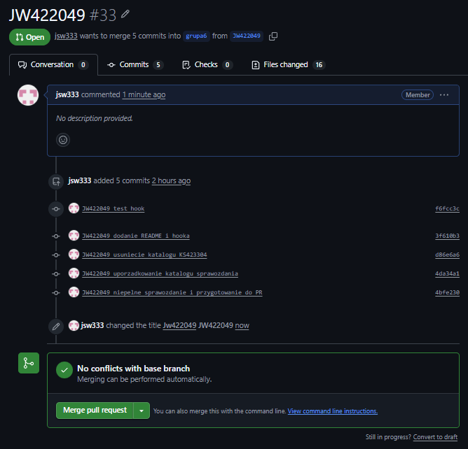