# Sprawozdanie 03 - Dockerfile i testowanie aplikacji

**Jan Wojsznis 422049**

---

## 1. Wybór repozytorium i uruchomienie lokalne

Do wykonania zadania wybrane zostało repozytorium aplikacji *Node.js*. Repozytorium zostało sklonowane lokalnie do katalogu roboczego, a następnie sprawdzono jego zawartość.

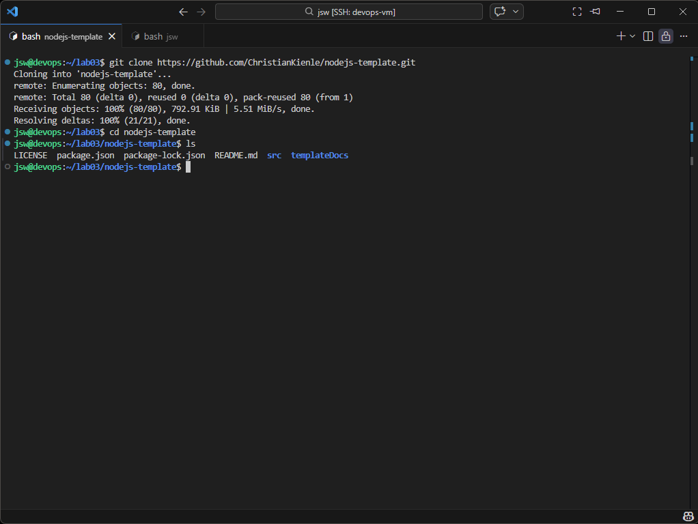

Po sklonowaniu repozytorium zainstalowano zależności projektu przy użyciu `npm`.

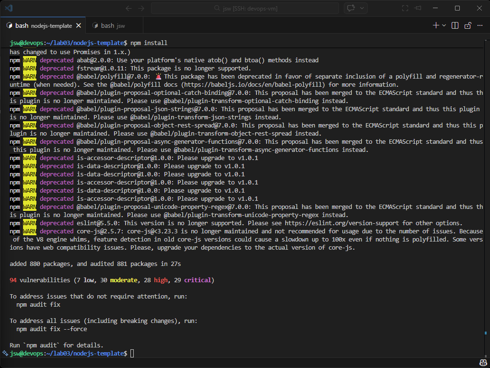

Następnie uruchomiono testy aplikacji lokalnie i sprawdzono, czy projekt działa poprawnie poza kontenerem.

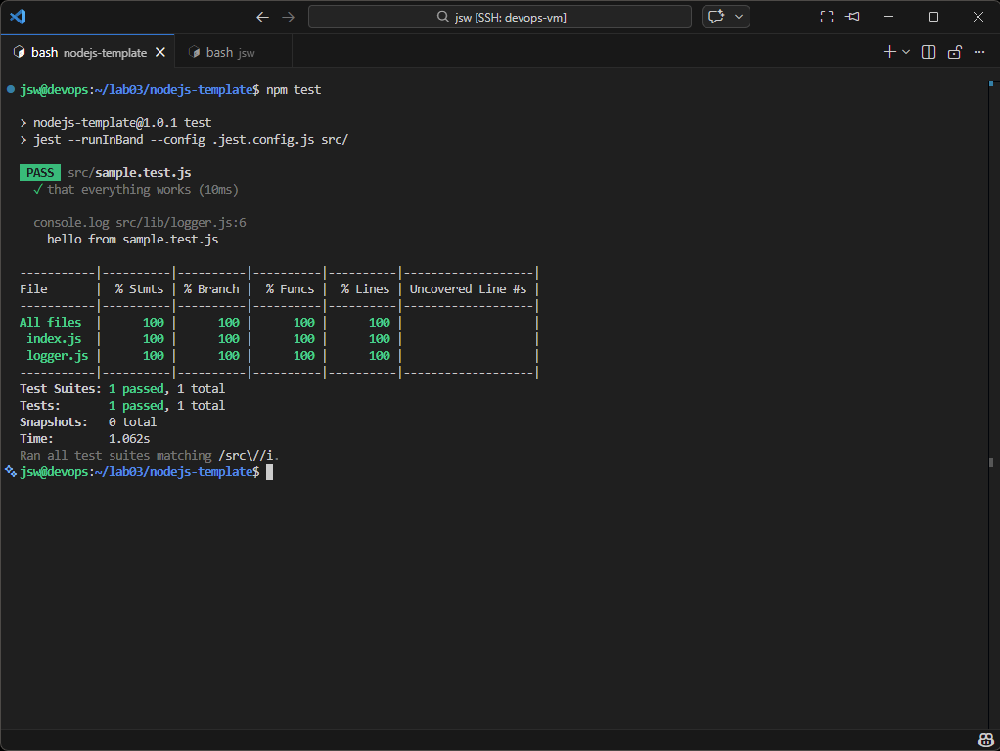

---

## 2. Uruchomienie aplikacji w kontenerze interaktywnym

W kolejnym kroku uruchomiono kontener na bazie obrazu z *Node.js* w trybie interaktywnym.

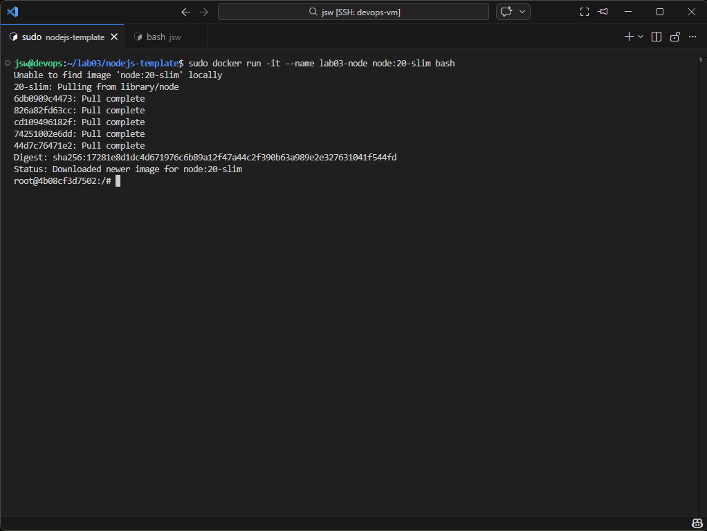

Wewnątrz kontenera doinstalowano wymagane narzędzia, a następnie ponownie sklonowano repozytorium.

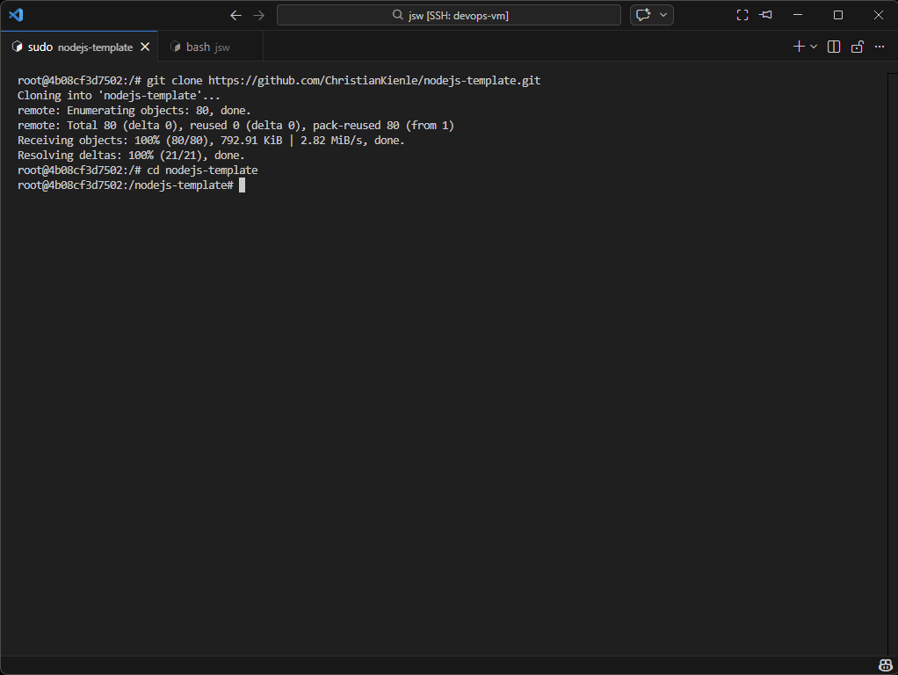

Po sklonowaniu repozytorium w kontenerze wykonano instalację zależności, build oraz testy aplikacji. Pozwoliło to sprawdzić, czy projekt działa poprawnie również w środowisku kontenerowym.

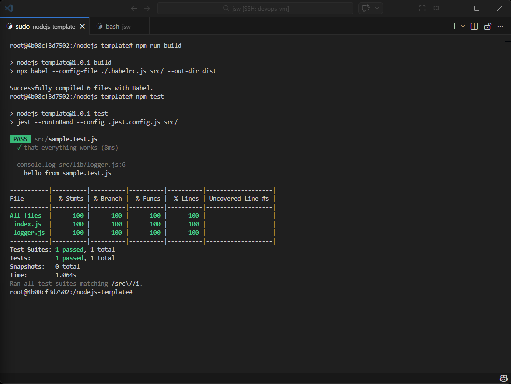

---

## 3. Przygotowanie plików Dockerfile

Następnie przygotowano własne pliki `Dockerfile`, zgodnie z treścią zadania.  
Pierwszy plik służy do zbudowania środowiska aplikacji i wykonania procesu build.  
Drugi plik bazuje na pierwszym obrazie i uruchamia testy aplikacji.

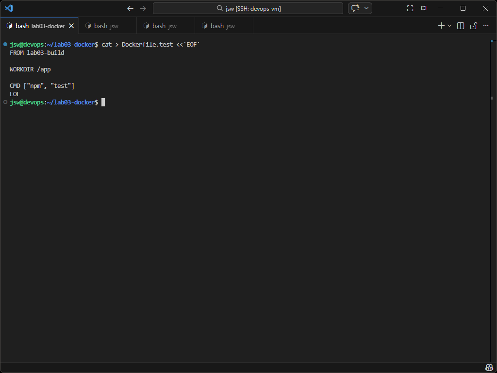

---

## 4. Budowanie obrazów

Na podstawie przygotowanego `Dockerfile` zbudowano pierwszy obraz Dockera.

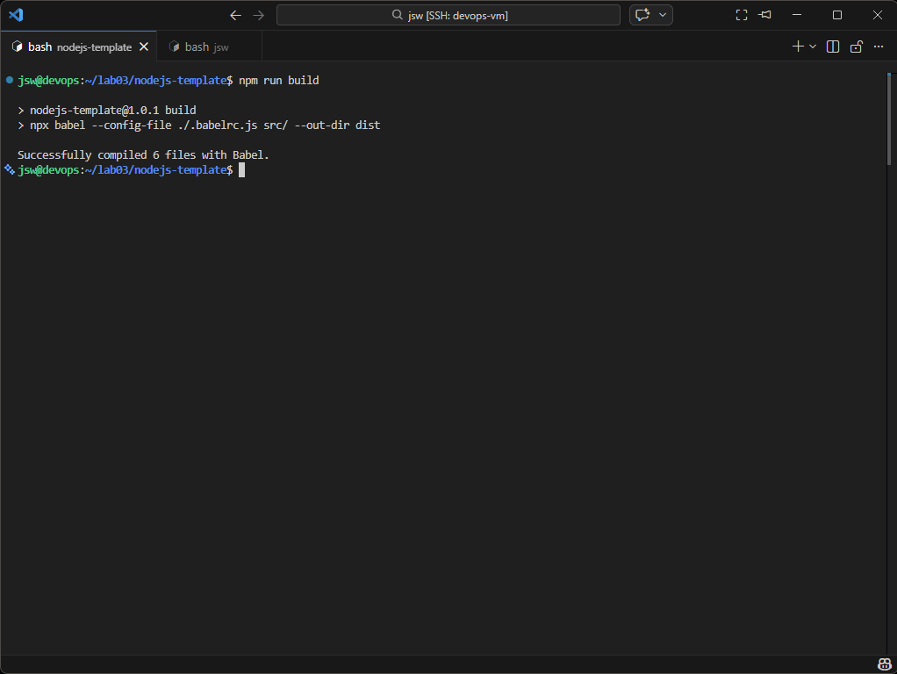

Po zakończeniu budowania sprawdzono lokalnie utworzony obraz.

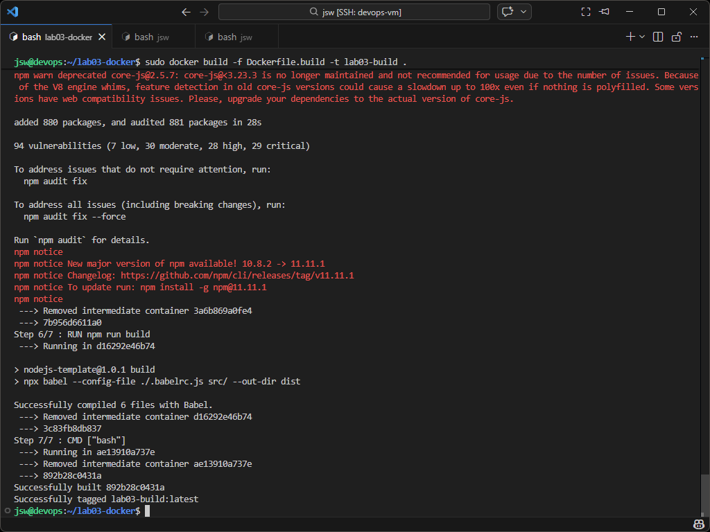

Następnie zbudowano drugi obraz, który bazował na pierwszym i był wykorzystywany do uruchamiania testów.

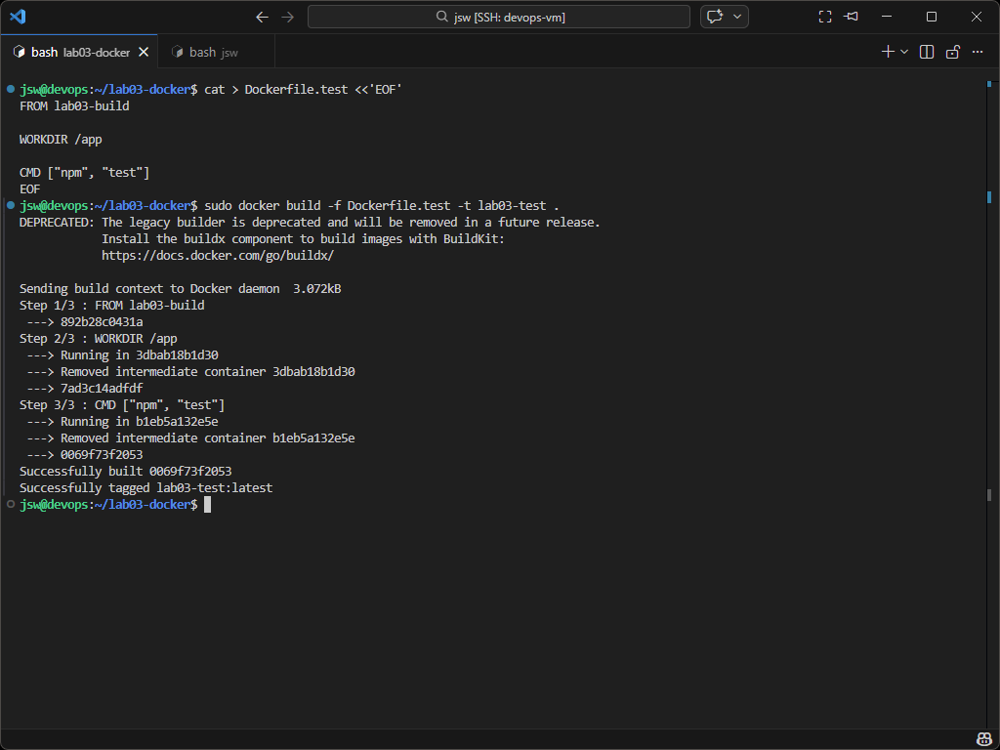

---

## 5. Uruchomienie testów z drugiego obrazu

W ostatnim kroku uruchomiono kontener z drugiego obrazu. Kontener wykonał testy aplikacji, bez potrzeby ponownego budowania środowiska od podstaw. Dzięki temu pokazano, że drugi obraz korzysta z pierwszego i realizuje tylko etap testowania.

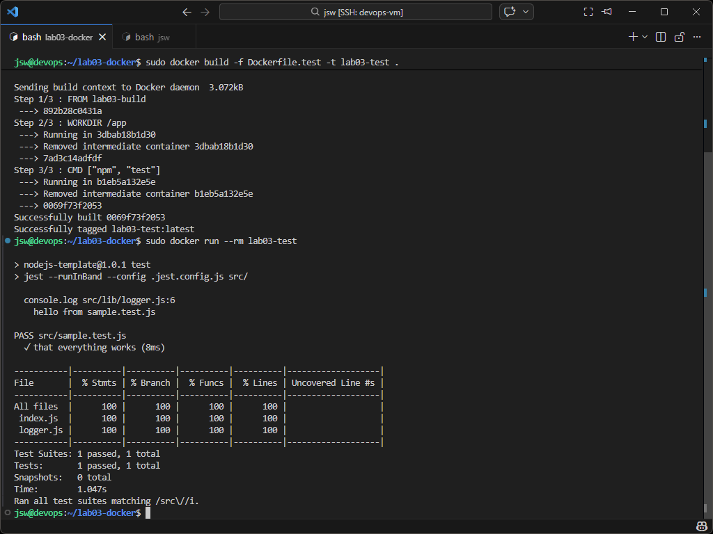