# Sprawozdanie 05 - Jenkins, zadania wstępne i pipeline

**Jan Wojsznis 422049**

---

## 1. Przygotowanie

Na początku sprawdzono lokalne obrazy i kontenery Dockera pozostałe po poprzednich zajęciach. Potwierdzono obecność obrazów `lab03-build` i `lab03-test`, które były potrzebne jako wcześniejsze kontenery budujące i testujące. Następnie usunięto stare, zatrzymane kontenery związane z Jenkinsem i przygotowano nową sieć Dockera przeznaczoną dla środowiska CI.

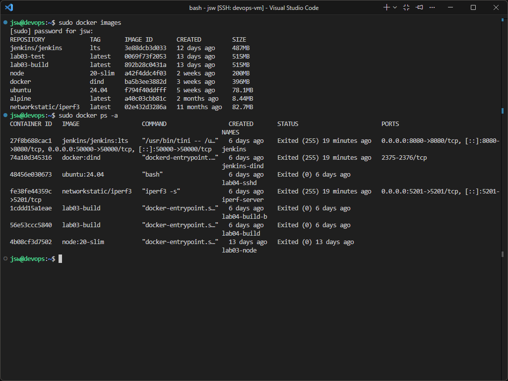

W kolejnym kroku uruchomiono kontener `jenkins-dind`, czyli środowisko Docker-in-Docker, w którym Jenkins może korzystać z Dockera podczas wykonywania zadań.

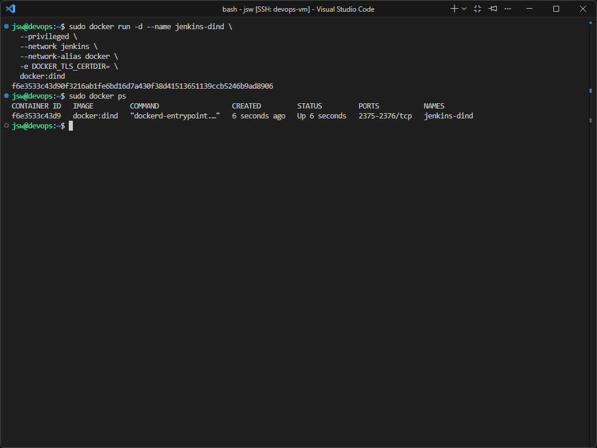

Następnie przygotowano i uruchomiono kontener Jenkins z wtyczkami Blue Ocean oraz Docker Workflow. Kontener został podłączony do tej samej sieci co `jenkins-dind`, a zmienna `DOCKER_HOST` została ustawiona tak, aby Jenkins komunikował się z usługą Dockera działającą w kontenerze DIND.

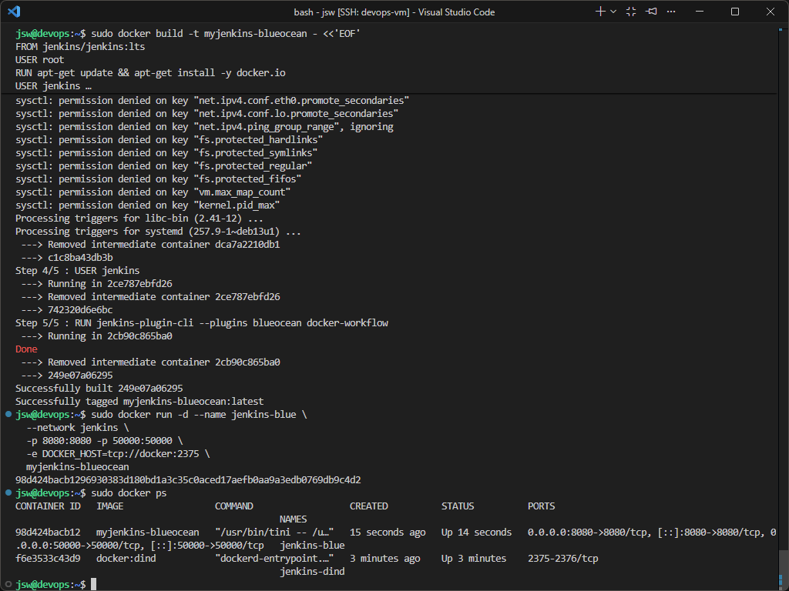

Po uruchomieniu kontenera pobrano hasło startowe Jenkinsa, zalogowano się do interfejsu WWW i wykonano podstawową konfigurację, w tym instalację sugerowanych wtyczek oraz utworzenie konta administratora.

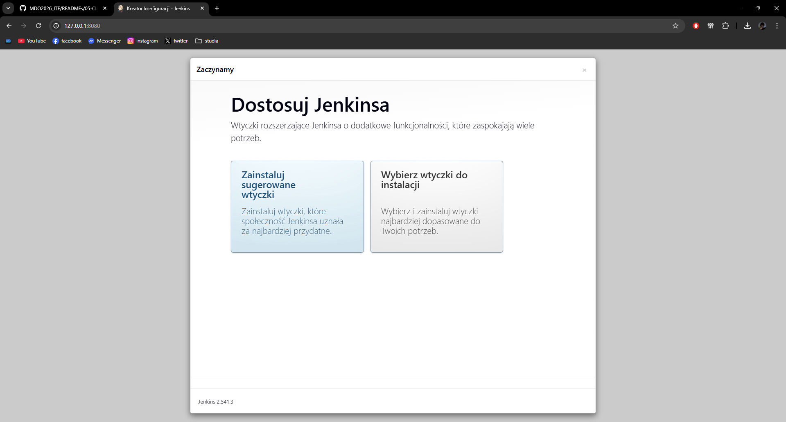

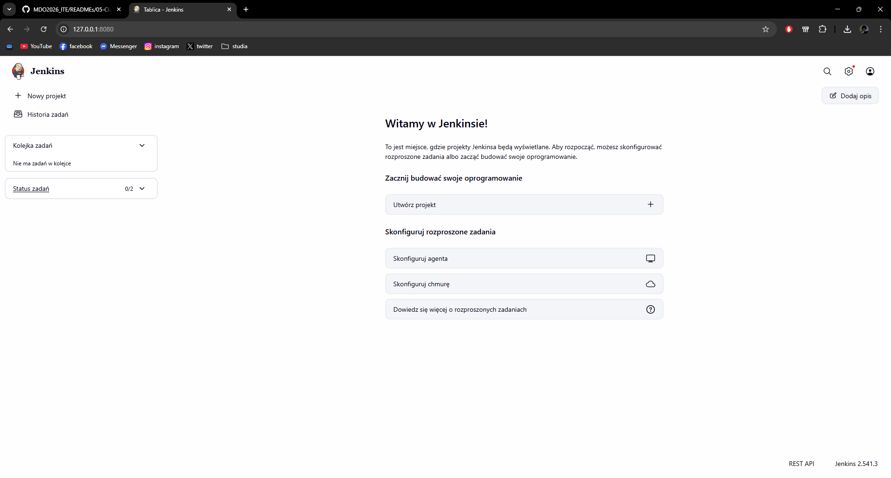

---

## 2. Zadanie wstępne: uruchomienie

W pierwszym zadaniu wstępnym utworzono prosty projekt typu freestyle, którego celem było wyświetlenie informacji o systemie za pomocą polecenia `uname -a`. Projekt został uruchomiony, a wynik sprawdzono w wyjściu konsoli.

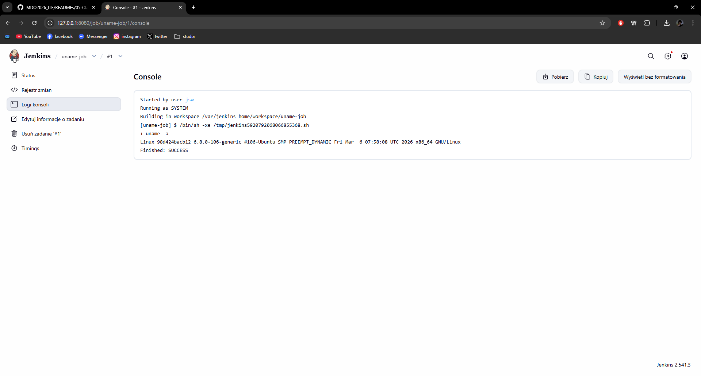

Następnie utworzono drugi projekt, który zwracał błąd w sytuacji, gdy aktualna godzina była nieparzysta. W logice zadania wykorzystano polecenie `date +%H`, a następnie prosty warunek sprawdzający parzystość godziny. Dzięki temu uzyskano przykład zadania, które kończy się sukcesem lub błędem zależnie od czasu uruchomienia.

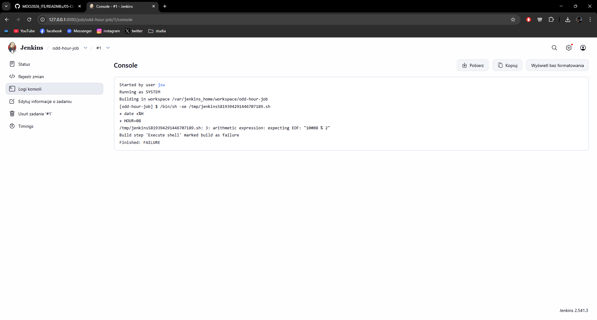

W trzecim projekcie wykonano polecenie `docker pull ubuntu`, aby sprawdzić możliwość pobierania obrazów Dockera bezpośrednio z poziomu zadania uruchamianego przez Jenkins.

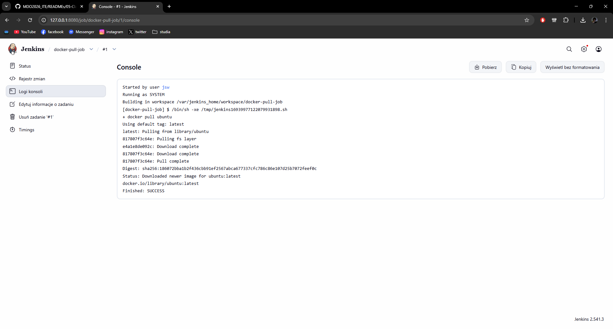

---

## 3. Zadanie wstępne: obiekt typu pipeline

W dalszej części utworzono nowy obiekt typu `pipeline`. Treść pipeline’u została wpisana bezpośrednio do obiektu w Jenkinsie, bez korzystania z SCM. Pipeline składał się z trzech etapów:
- klonowanie repozytorium przedmiotowego `MDO2026_ITE`,
- przejście na osobistą gałąź `JW422049`,
- budowanie pliku `Dockerfile` właściwego dla buildera używanego we wcześniejszych zadaniach.

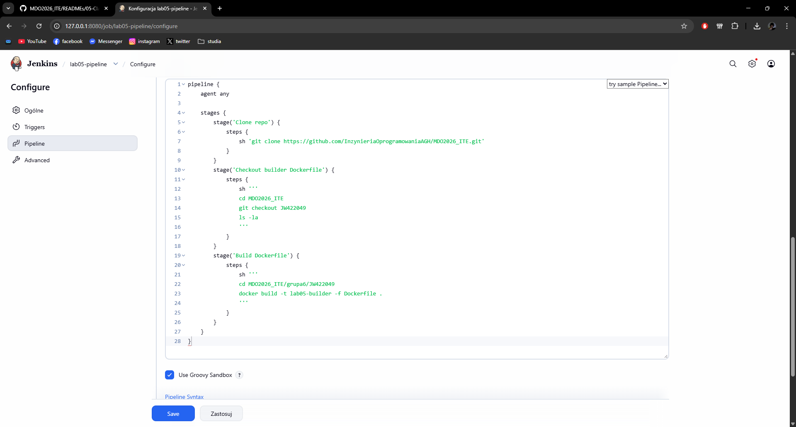

Podczas pierwszego uruchomienia pipeline wykonał próbę klonowania repozytorium, przejścia do odpowiedniej gałęzi oraz budowania obrazu Dockera. Pozwoliło to sprawdzić podstawową logikę działania pipeline’u i sposób wykonywania etapów wewnątrz Jenkinsa.

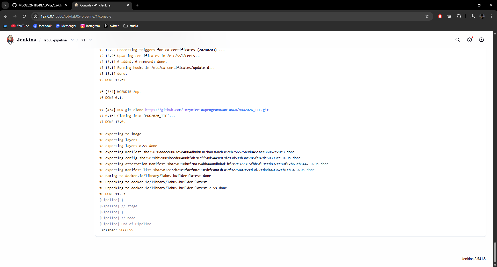

Zgodnie z poleceniem pipeline został następnie uruchomiony drugi raz. W drugim przebiegu pojawił się błąd wynikający z istnienia katalogu `MDO2026_ITE` w przestrzeni roboczej, co zostało pokazane w logach. Był to rzeczywisty efekt ponownego uruchomienia tego samego pipeline’u bez czyszczenia workspace, dzięki czemu udało się zaobserwować zachowanie procesu przy kolejnym przebiegu.

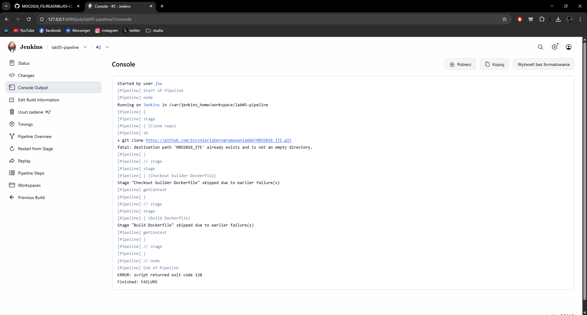

---

## 4. Podsumowanie

W ramach wykonanej części zadania uruchomiono i skonfigurowano środowisko Jenkins oparte o Docker-in-Docker i Blue Ocean, a następnie przygotowano trzy proste zadania freestyle oraz jeden obiekt typu pipeline. Dzięki temu zweryfikowano podstawową pracę Jenkinsa z poleceniami systemowymi, z zadaniami warunkowymi, z pobieraniem obrazów Dockera oraz z wykonywaniem etapów pipeline’u związanych z repozytorium i budowaniem obrazu.