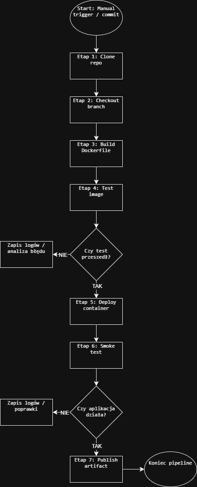
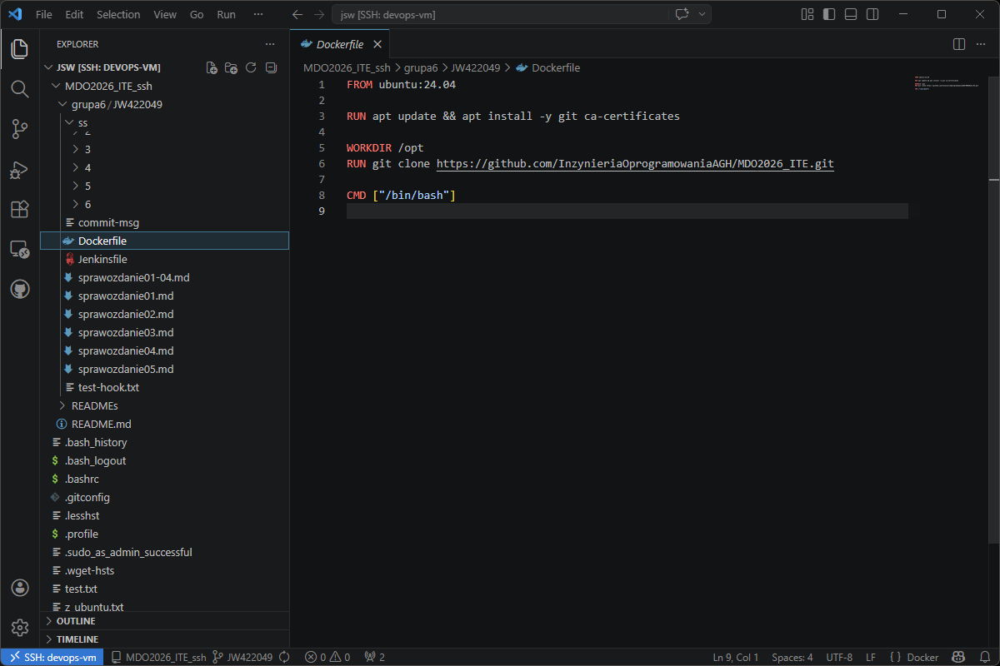
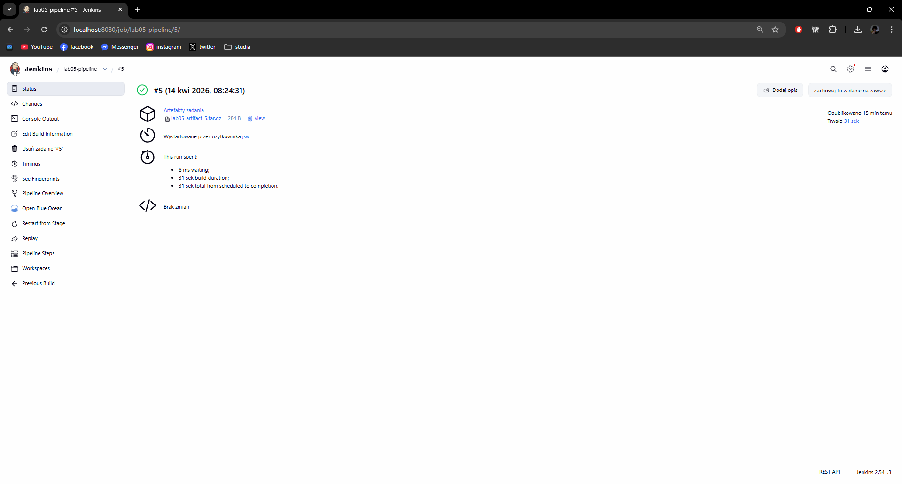
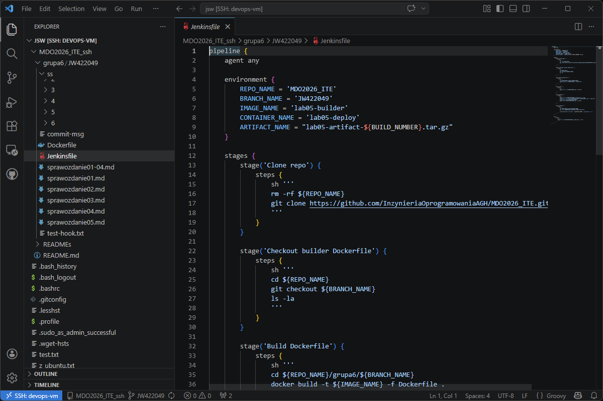
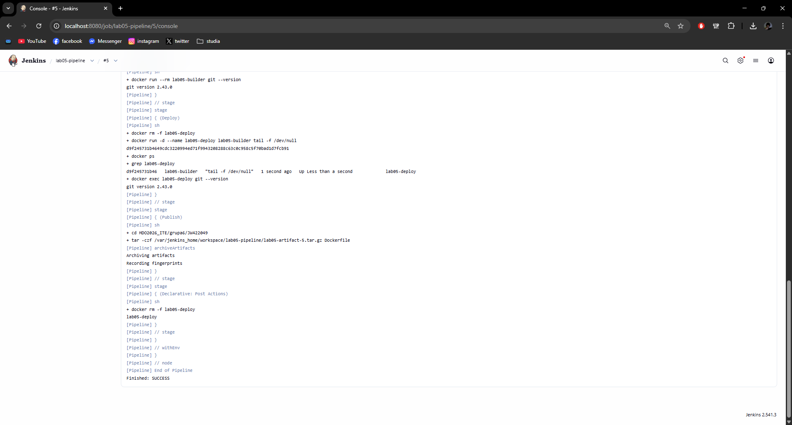
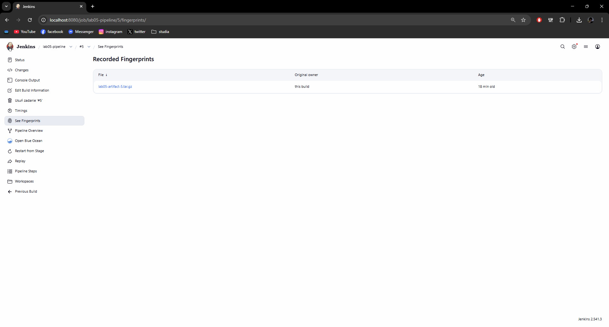

# Sprawozdanie 06 - Pipeline: lista kontrolna

**Jan Wojsznis 422049**

---

## 1. Wybór projektu

Aplikacja została wybrana ✅

Do realizacji zadania wykorzystano repozytorium przedmiotowe `MDO2026_ITE`. Prace były prowadzone na własnej gałęzi `JW422049`, co pozwoliło na bezpieczne wprowadzanie zmian bez ingerencji w główną wersję repozytorium.

Zdecydowano, czy jest potrzebna własna kopia repozytorium ✅  
W tym przypadku wykorzystano własną gałąź roboczą, dlatego nie było konieczne wykonywanie osobnego forka.

---

## 2. Diagram UML

Stworzono diagram UML zawierający planowany pomysł na proces CI/CD ✅

Diagram przedstawia kolejne etapy działania pipeline:
- manual trigger / commit
- clone repo
- checkout branch
- build Dockerfile
- test
- deploy
- smoke test
- publish artifact

---

## 3. Dockerfile

Wybrano kontener bazowy lub stworzono odpowiedni kontener wstępny ✅  
Build został wykonany wewnątrz kontenera ✅

Do budowy obrazu wykorzystano przygotowany wcześniej `Dockerfile` oparty o `ubuntu:24.04`. Obraz ten pełnił rolę prostego kontenera buildera i testera. Wybrany tag był określony jawnie, a nie przez `latest`.

Plik `Dockerfile` jest dostępny w repozytorium jako osobny plik.

---

## 4. Jenkins i pipeline

Zdefiniowano obiekt typu pipeline w Jenkinsie ✅  
Plik `Jenkinsfile` dostępny jest w repozytorium ✅

Pipeline został uruchomiony ręcznie z poziomu Jenkinsa. W jego działaniu zrealizowano pełną ścieżkę krytyczną:
- manual trigger
- clone
- build
- test
- deploy
- publish

W trakcie prac pojawiły się problemy z workspace oraz z dostępnością Built-In Node, ale po wyczyszczeniu przestrzeni roboczej i ponownym uruchomieniu środowiska pipeline działał poprawnie.

---

## 5. Realizacja etapów pipeline

Wybrany program buduje się ✅  
Przechodzą dołączone do niego testy ✅  
Testy zostały wykonane wewnątrz kontenera ✅  
Kontener testowy jest oparty o kontener build ✅

W etapie `build` tworzony był obraz Docker na podstawie pliku `Dockerfile` z katalogu `grupa6/JW422049`.

W etapie `test` uruchamiano zbudowany obraz i sprawdzano poprawność jego działania. Test miał postać prostego sprawdzenia działania narzędzi obecnych w obrazie.

Zdefiniowano kontener typu deploy ✅  
Wersjonowany kontener deploy został wdrożony na instancję Dockera ✅  
Następuje weryfikacja, że aplikacja pracuje poprawnie (smoke test) ✅

W etapie `deploy` uruchamiano kontener na podstawie obrazu zbudowanego wcześniej. Następnie wykonywano prosty smoke test potwierdzający, że kontener działa poprawnie.

---

## 6. Publish i artefakt

Zdefiniowano, jaki element ma być publikowany jako artefakt ✅  
Dostępność artefaktu jako rezultat builda w Jenkinsie ✅  
Przedstawiono sposób identyfikacji pochodzenia artefaktu ✅

W etapie `publish` przygotowywany był artefakt w formacie `tar.gz`, którego nazwa zawierała numer builda. Dzięki temu można było łatwo określić, z którego wykonania pipeline pochodzi dany plik.

Artefakt został zapisany jako rezultat builda w Jenkinsie i był dostępny do pobrania z poziomu interfejsu WWW.

---

## 7. Podsumowanie

W ramach zajęć 06 udało się przygotować i uruchomić pipeline obejmujący wszystkie podstawowe kroki ścieżki krytycznej. Pipeline wykonywał klonowanie repozytorium, budowę obrazu, test, uruchomienie kontenera deploy oraz publikację artefaktu.

Dodatkowo przygotowano diagram UML procesu CI/CD oraz potwierdzono obecność plików `Dockerfile` i `Jenkinsfile` w repozytorium. Otrzymany efekt jest zgodny z planem pipeline i stanowi dobrą podstawę do dalszego rozwijania rozwiązania w kolejnych zajęciach.