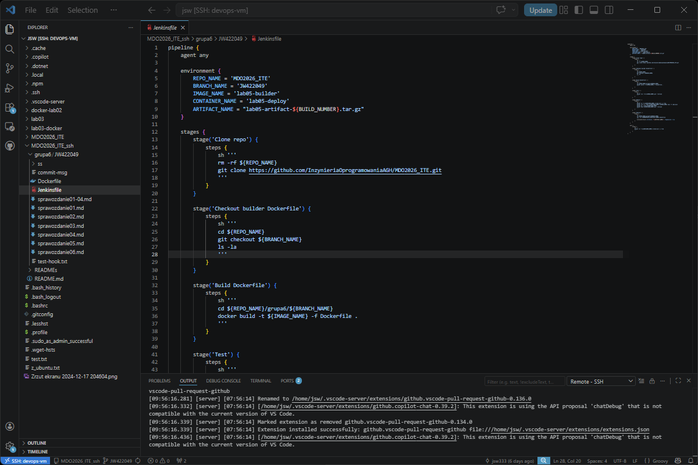
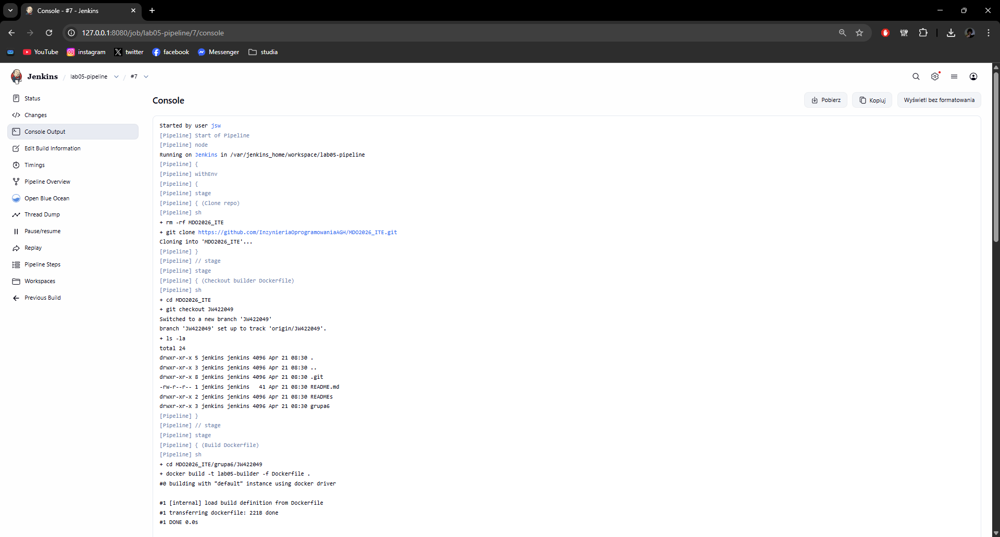
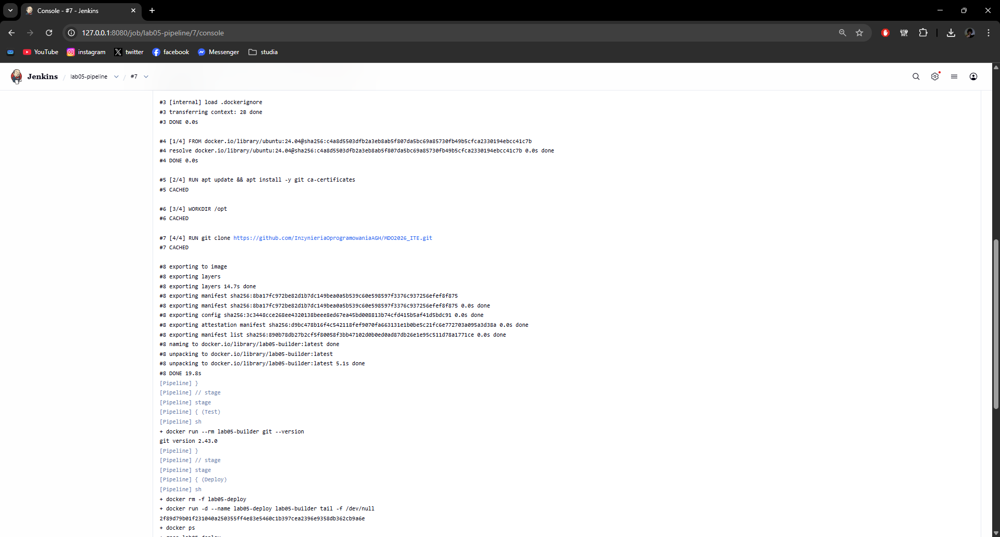
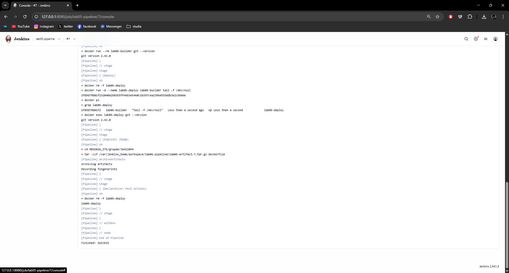
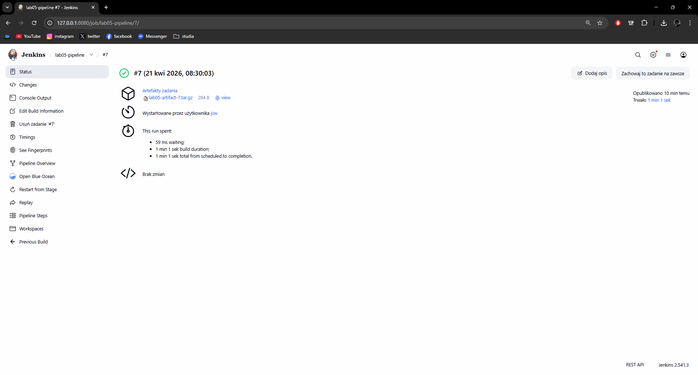
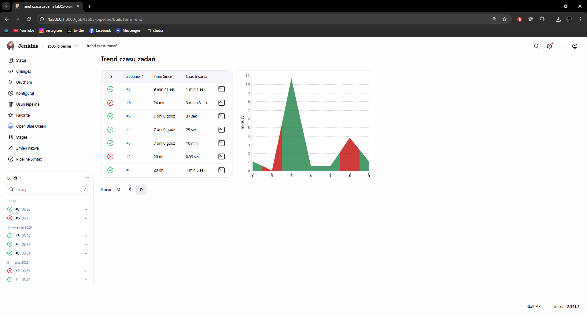

# Sprawozdanie 07 - Jenkinsfile: lista kontrolna

**Jan Wojsznis 422049**

---

## 1. Jenkinsfile w repozytorium

W ramach zajęć sprawdzono, czy przygotowany pipeline nie znajduje się wyłącznie w ustawieniach obiektu Jenkins, ale został również zapisany jako plik `Jenkinsfile` w repozytorium. Dzięki temu definicja procesu budowania stała się częścią kodu projektu i może być rozwijana razem z pozostałymi plikami.

Na screenie pokazano plik `Jenkinsfile` znajdujący się w katalogu projektu `grupa6/JW422049`. W pliku widoczne były kolejne etapy pipeline, w tym `Clone repo`, `Checkout builder Dockerfile`, `Build Dockerfile`, `Test`, `Deploy` oraz `Publish`.

---

## 2. Ponowne uruchomienie pipeline i praca na świeżym kodzie

Następnie uruchomiono pipeline ponownie z poziomu Jenkinsa. W logach potwierdzono, że przed nowym przebiegiem czyszczony był katalog roboczy, a następnie wykonywane były `git clone` oraz `git checkout` właściwej gałęzi `JW422049`. Dzięki temu pipeline pracował na aktualnym kodzie, a nie na danych pozostawionych po poprzednim uruchomieniu.

Na tym etapie widoczne było również przejście do etapu budowania obrazu Docker.

---

## 3. Etap Build

W etapie `Build` pipeline miał dostęp do repozytorium oraz pliku `Dockerfile` znajdującego się w katalogu `grupa6/JW422049`. Następnie tworzony był obraz buildowy `lab05-builder`.

Oznacza to, że etap budowania miał dostęp do wymaganych plików i poprawnie wykonywał polecenie budowy obrazu Docker. Był to właściwy obraz wykorzystywany później w kolejnych etapach pipeline.

---

## 4. Etap Test i etap Deploy

W etapie `Test` uruchamiano wcześniej zbudowany obraz i wykonywano prosty test działania, polegający na sprawdzeniu poprawności działania narzędzia `git` wewnątrz obrazu. Dzięki temu potwierdzono, że obraz został poprawnie zbudowany i może zostać użyty dalej.

W etapie `Deploy` przygotowywano kontener `lab05-deploy` na podstawie obrazu `lab05-builder`. Następnie kontener był uruchamiany, sprawdzano jego obecność na liście aktywnych kontenerów oraz wykonywano wewnątrz niego polecenie testowe. Oznacza to, że etap `Deploy` zarówno przygotowywał obraz pod wdrożenie, jak i przeprowadzał samo wdrożenie w środowisku kontenerowym.

---

## 5. Etap Publish

W etapie `Publish` przygotowywany był artefakt w postaci archiwum `tar.gz`, a następnie dodawany do historii builda w Jenkinsie. Dzięki temu rezultat konkretnego uruchomienia pipeline mógł zostać zapisany i udostępniony do pobrania z poziomu interfejsu WWW.

Artefakt był oznaczony numerem builda, co pozwalało łatwo ustalić jego pochodzenie.

---

## 6. Kolejne poprawne uruchomienie pipeline

Po ponownym uruchomieniu pipeline zakończył się on statusem `SUCCESS`. Na stronie builda widoczny był numer wykonania `#7`, status sukcesu oraz opublikowany artefakt. Potwierdza to, że pipeline działa poprawnie nie tylko przy jednym przebiegu, ale również przy kolejnym uruchomieniu.

---

## 7. Podsumowanie

W ramach zajęć 07 zweryfikowano pipeline zapisany w pliku `Jenkinsfile` w repozytorium. Potwierdzono, że pipeline:
- jest zapisany w repozytorium jako część projektu,
- czyści środowisko robocze przed kolejnym uruchomieniem,
- klonuje repozytorium i przechodzi na właściwą gałąź,
- buduje obraz Docker,
- przeprowadza test,
- uruchamia etap deploy,
- publikuje artefakt do historii builda,
- działa poprawnie przy więcej niż jednym uruchomieniu.

Dodatkowo sprawdzono historię uruchomień pipeline. Widok trendu czasu zadań potwierdził, że proces był uruchamiany wielokrotnie, a ostatni przebieg zakończył się sukcesem. Dzięki temu można uznać, że przygotowany `Jenkinsfile` pokrywa wymaganą ścieżkę krytyczną i działa poprawnie w praktyce.

