# Sprawozdanie podsumowujące - Ansible, wdrożenia nienadzorowane, Kubernetes i Azure

**Jan Wojsznis 422049**

---

## 1. Wprowadzenie

W ramach laboratoriów 08-12 kontynuowano pracę z narzędziami wykorzystywanymi w automatyzacji administracji systemami, wdrażaniu aplikacji oraz zarządzaniu kontenerami. Zakres ćwiczeń obejmował Ansible, instalacje nienadzorowane systemu Fedora z użyciem Kickstart, lokalny klaster Kubernetes uruchomiony przez minikube, strategie aktualizacji aplikacji w Kubernetesie oraz wdrożenie kontenera w chmurze Microsoft Azure.

Wszystkie zadania wykonywano w środowisku opartym o maszynę `devops`, połączenie SSH oraz Visual Studio Code. W kolejnych częściach przygotowywano konfiguracje, playbooki, manifesty YAML, obrazy Docker oraz zasoby chmurowe. Efekty pracy były zapisywane w repozytorium na gałęzi `JW422049`.

---

## 2. Automatyzacja konfiguracji z użyciem Ansible

Pierwszym etapem było przygotowanie środowiska Ansible. Składało się ono z maszyny głównej `devops` oraz maszyny docelowej `ansible-target`. Na maszynie głównej utworzono plik `inventory.ini`, w którym zdefiniowano grupy hostów. Maszyna `devops` pełniła rolę lokalnego orchestratora, natomiast `ansible-target` była endpointem zarządzanym przez SSH.

Po przygotowaniu inventory wykonano test połączenia za pomocą modułu `ping`. Obie maszyny odpowiedziały poprawnie statusem `SUCCESS`, co potwierdziło prawidłową konfigurację połączeń oraz gotowość środowiska do dalszej pracy z Ansible.

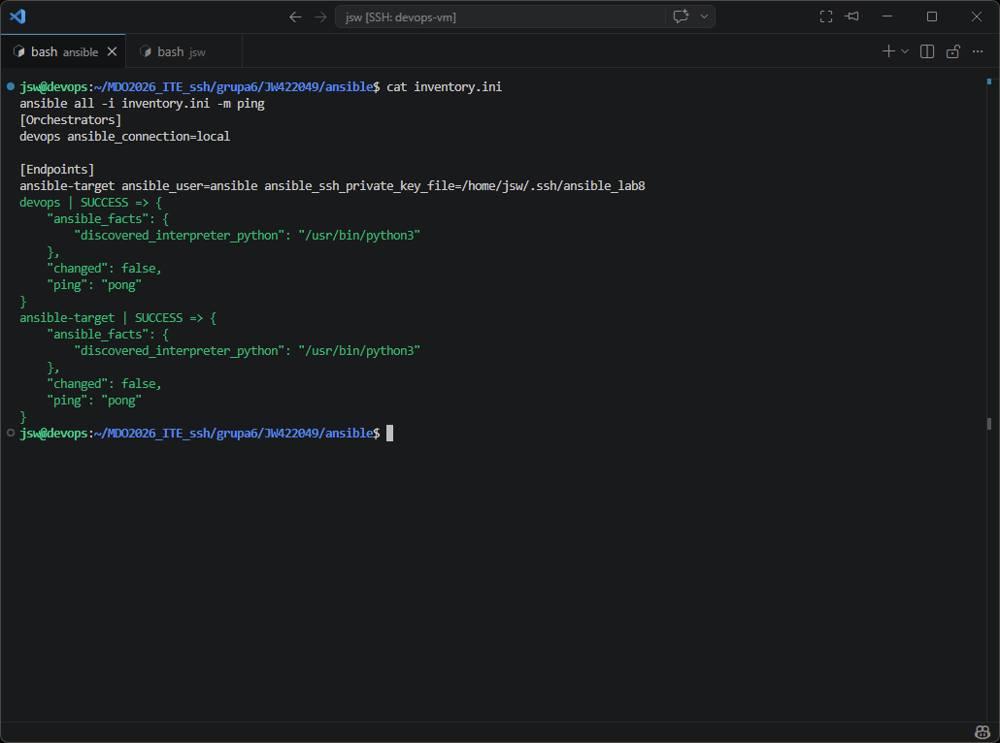

Następnie przygotowano prosty playbook `ping.yml`, którego zadaniem było sprawdzenie dostępności wszystkich hostów zdefiniowanych w inventory. Playbook korzystał z modułu `ansible.builtin.ping`. Po jego uruchomieniu zarówno `devops`, jak i `ansible-target` zakończyły zadanie poprawnie.

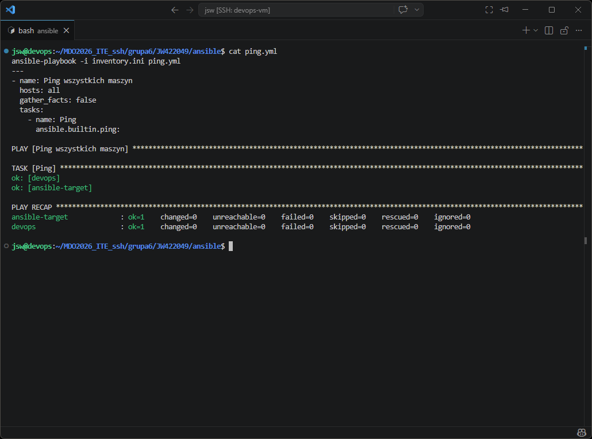

Kolejnym zadaniem było przygotowanie playbooka `copy-inventory.yml`, który kopiował plik `inventory.ini` na maszynę docelową. Playbook uruchomiono dwa razy. Przy pierwszym uruchomieniu plik został skopiowany i Ansible zwrócił informację o zmianie. Przy drugim uruchomieniu plik był już obecny, dlatego wynik wskazał brak zmian. Pokazało to idempotentne działanie Ansible, czyli doprowadzanie systemu do oczekiwanego stanu bez wykonywania niepotrzebnych operacji.

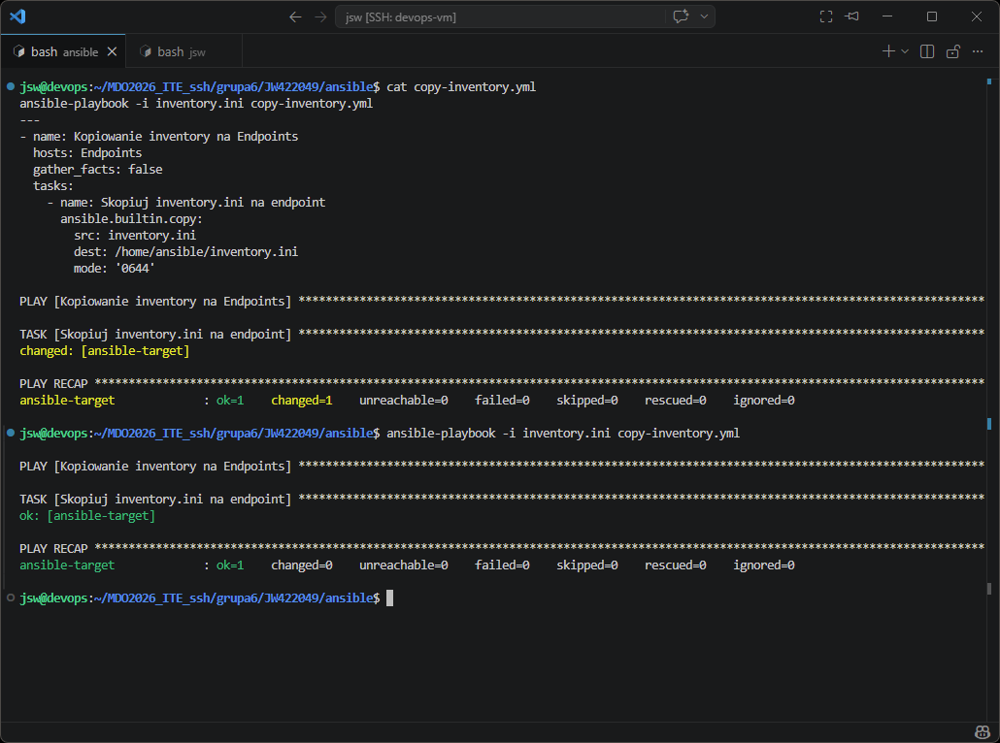

W dalszej części wykonano playbook `update-services.yml`. Odpowiadał on za aktualizację cache pakietów, upgrade pakietów oraz restart wybranych usług na maszynie `ansible-target`. Restart usługi SSH zakończył się poprawnie. Próba restartu `rng-tools` zwróciła komunikat o braku takiej usługi, ale błąd został zignorowany, dlatego cały playbook zakończył się poprawnie.

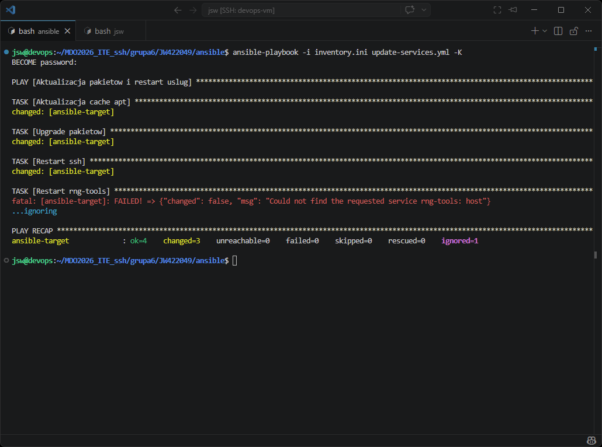

---

## 3. Reakcja Ansible na niedostępny host

W celu sprawdzenia zachowania Ansible przy niedostępnej maszynie zatrzymano usługę SSH na hoście `ansible-target`. Następnie ponownie wykonano test połączenia.

Maszyna lokalna `devops` odpowiedziała poprawnie, natomiast `ansible-target` została oznaczona jako `UNREACHABLE`. W komunikacie pojawiła się informacja o odmowie połączenia na porcie 22. Potwierdziło to, że Ansible prawidłowo wykrywa brak dostępności hosta zarządzanego przez SSH.

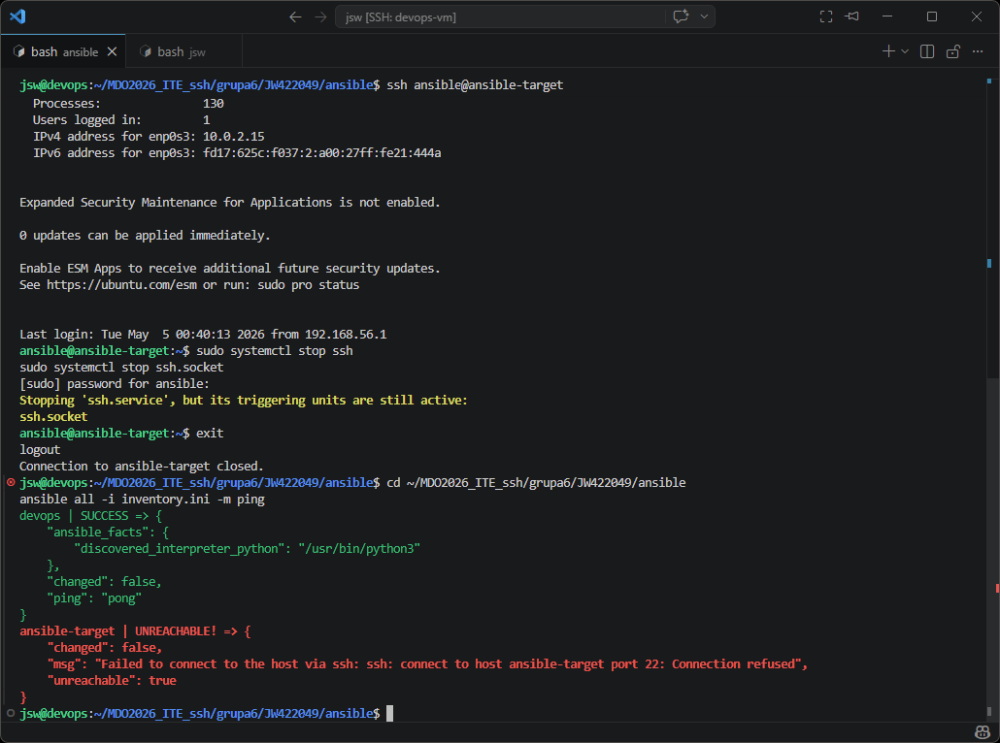

Po ponownym uruchomieniu usługi SSH wykonano kolejny test połączenia. Tym razem oba hosty odpowiedziały poprawnie, co potwierdziło przywrócenie komunikacji z maszyną docelową.

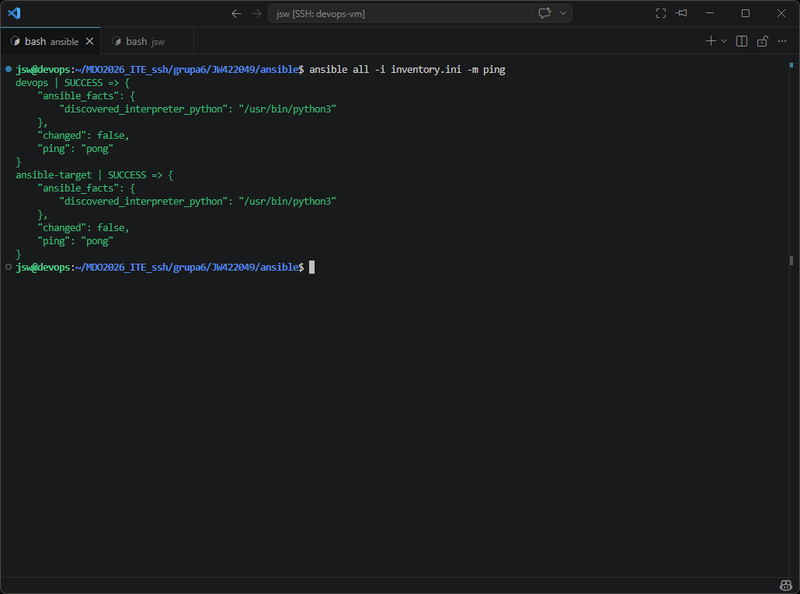

---

## 4. Instalacja Dockera i wdrożenie kontenera przez Ansible

Następnym etapem była instalacja Dockera na maszynie `ansible-target` z użyciem Ansible. Przygotowany playbook `install-docker.yml` instalował pakiet `docker.io`, uruchamiał usługę Docker, dodawał użytkownika `ansible` do grupy `docker` oraz sprawdzał wersję zainstalowanego Dockera.

Po wykonaniu playbooka Docker był dostępny na maszynie docelowej, a wynik polecenia sprawdzającego wersję potwierdził poprawną instalację.

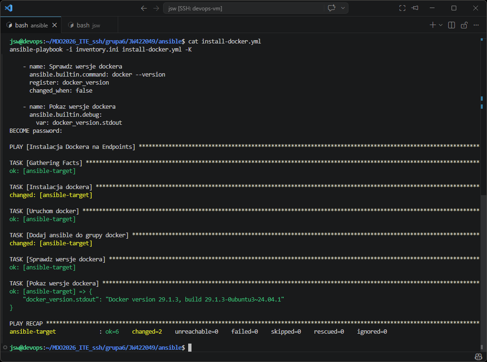

Po zainstalowaniu Dockera przygotowano playbook `deploy-nginx.yml`. Jego zadaniem było pobranie obrazu `nginx:stable-alpine`, usunięcie ewentualnego starego kontenera oraz uruchomienie nowego kontenera `lab8-nginx`. Kontener został uruchomiony na maszynie `ansible-target`, a port `80` kontenera wystawiono na porcie `8081` hosta.

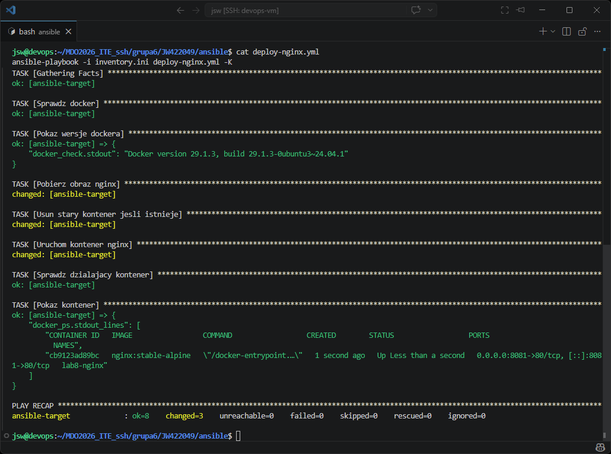

Poprawność wdrożenia sprawdzono z maszyny głównej przez zapytanie HTTP. Odpowiedź zawierała stronę powitalną nginx, co potwierdziło, że kontener został poprawnie uruchomiony przez Ansible i był dostępny przez sieć.

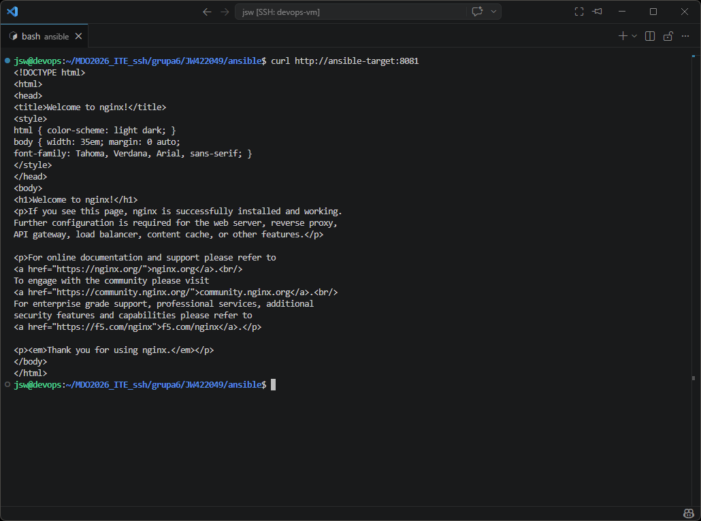

Po zakończeniu testu wykonano playbook `cleanup-nginx.yml`, który usuwał kontener `lab8-nginx`. Po wykonaniu playbooka sprawdzono listę kontenerów. W wyniku widoczny był jedynie nagłówek tabeli, co oznaczało, że kontener został usunięty.

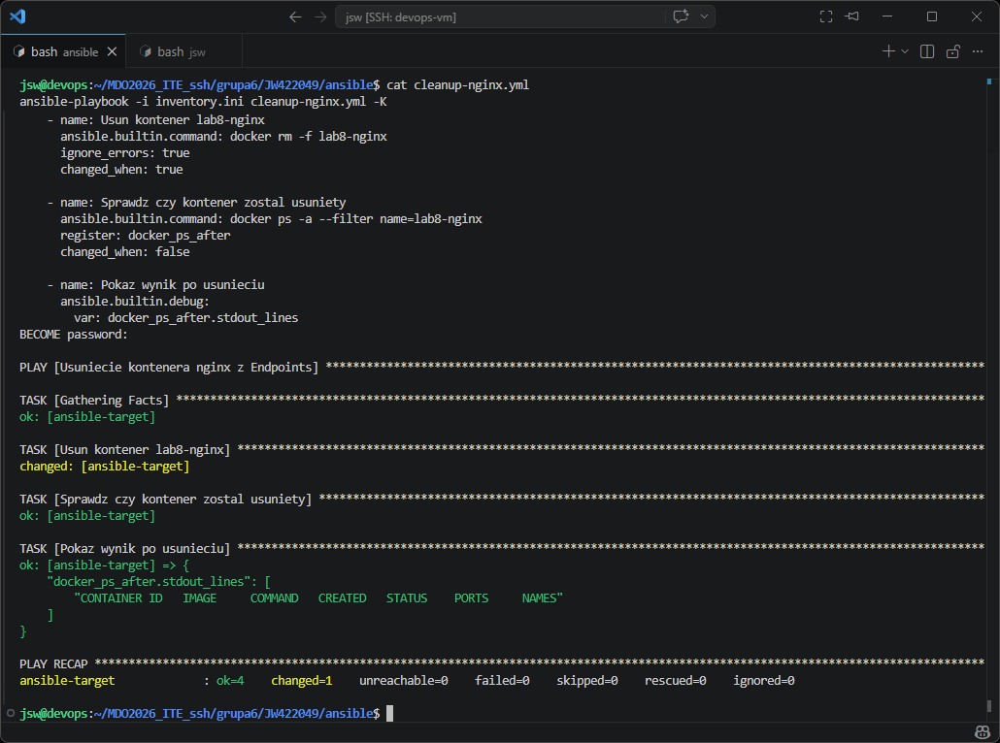

Ostatnim elementem tej części było przygotowanie roli Ansible `nginx_container`. Rola realizowała podobne zadania jak wcześniejszy playbook wdrażający nginx, ale w bardziej uporządkowanej strukturze katalogów. Sprawdzała Dockera, pobierała obraz nginx, usuwała poprzedni kontener i uruchamiała nowy kontener `lab8-role-nginx` na porcie `8082`.

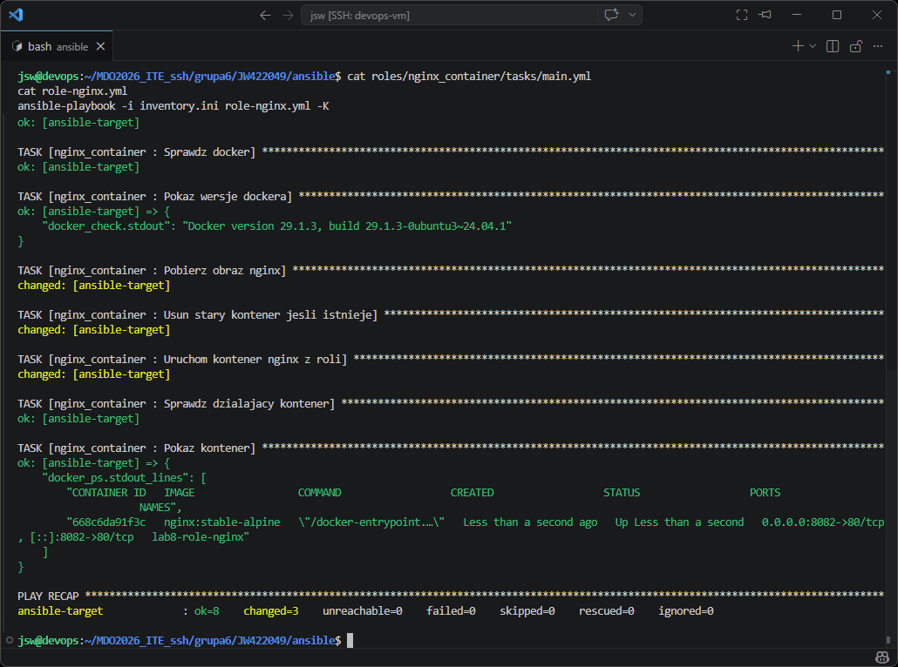

Działanie kontenera uruchomionego przez rolę sprawdzono przez zapytanie HTTP. Odpowiedź zawierała stronę powitalną nginx, co potwierdziło poprawne działanie roli.

---

## 5. Nienadzorowana instalacja Fedory z użyciem Kickstart

Kolejne laboratorium dotyczyło przygotowania nienadzorowanej instalacji systemu Fedora. Do tego celu wykorzystano plik Kickstart `fedora-lab09.ks`. Celem było przygotowanie takiej konfiguracji, aby system po instalacji automatycznie uruchamiał przygotowane oprogramowanie. W tym przypadku był to kontener Docker z serwerem nginx.

Na maszynie `devops` przygotowano katalog `kickstart` oraz plik odpowiedzi. Plik zawierał konfigurację języka, klawiatury, strefy czasowej, sieci, użytkowników, repozytoriów, partycjonowania oraz pakietów. Ustawiono również nazwę hosta `fedora-jw422049`.

W sekcji postinstalacyjnej przygotowano skrypt uruchamiający kontener nginx oraz usługę systemd `lab09-nginx.service`. Dzięki temu kontener nie był uruchamiany bezpośrednio w instalatorze, tylko dopiero po pierwszym normalnym starcie zainstalowanego systemu.

Plik Kickstart został udostępniony z maszyny `devops` przez prosty serwer HTTP uruchomiony na porcie `8000`. Maszyna `devops` posiadała adres w sieci host-only, dzięki czemu instalator Fedory mógł pobrać plik odpowiedzi przez HTTP. Adres pliku został później przekazany instalatorowi przez parametr `inst.ks`.

---

## 6. Instalacja Fedory i automatyczne uruchomienie kontenera

W VirtualBox utworzono maszynę wirtualną `fedora-jw422049`. Do instalacji użyto obrazu Fedora Everything netinst. Podczas startu instalatora dopisano parametr wskazujący lokalizację pliku Kickstart. Instalator pobrał plik odpowiedzi, wykonał instalację w trybie nienadzorowanym, skonfigurował system i wykonał restart.

Po odpięciu obrazu ISO system uruchomił się już z dysku maszyny wirtualnej. Możliwe było zalogowanie się na użytkownika `janek`.

Po zalogowaniu sprawdzono hostname oraz informacje o systemie. Wynik potwierdził, że system został zainstalowany jako Fedora Linux 44, a hostname został ustawiony na `fedora-jw422049`.

Następnie sprawdzono działanie usługi Docker oraz usługi `lab09-nginx.service`, utworzonej w sekcji postinstalacyjnej. Docker był aktywny, a usługa `lab09-nginx` została poprawnie wykonana. Polecenie `docker ps` potwierdziło, że działa kontener `lab09-nginx`, uruchomiony z obrazu `nginx:stable-alpine` i wystawiony na porcie `8080`.

Działanie aplikacji sprawdzono lokalnie z poziomu systemu Fedora. Odpowiedź zawierała stronę powitalną nginx, co potwierdziło, że kontener został poprawnie uruchomiony po instalacji systemu.

Na końcu sprawdzono log z sekcji postinstalacyjnej zapisany w pliku `/root/ks-post.log`. W logu widoczne były komunikaty rozpoczęcia i zakończenia sekcji oraz informacja o utworzeniu dowiązania dla usługi `lab09-nginx.service`. Potwierdziło to, że część postinstalacyjna wykonała się poprawnie.

---

## 7. Uruchomienie lokalnego klastra Kubernetes

Kolejny etap obejmował rozpoczęcie pracy z Kubernetesem. Celem było uruchomienie lokalnego klastra z użyciem narzędzia `minikube`, przygotowanie aplikacji kontenerowej, uruchomienie jej jako pod oraz przeniesienie konfiguracji do plików YAML.

Na początku zainstalowano `minikube` i przygotowano alias `minikubectl`, który upraszczał korzystanie z polecenia `kubectl` dostarczanego przez minikube. Klaster uruchomiono z wykorzystaniem sterownika Docker. Podczas startu pojawiło się ostrzeżenie o małej ilości miejsca dostępnej dla Dockera, ale klaster został uruchomiony poprawnie.

Po starcie sprawdzono stan klastra. Node `minikube` uzyskał status `Ready`, a podstawowe pody systemowe w przestrzeni nazw `kube-system` działały poprawnie.

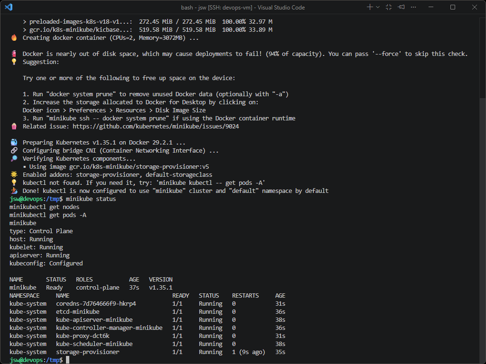

Następnie sprawdzono aktualny kontekst Kubernetes, konfigurację dostępu do klastra oraz uprawnienia użytkownika. Kontekst wskazywał na lokalny klaster `minikube`, a sprawdzenie uprawnień potwierdziło możliwość pobierania podów i tworzenia deploymentów.

Uruchomiono również Kubernetes Dashboard. Początkowo w przestrzeni nazw `default` nie było jeszcze żadnych własnych workloadów, dlatego Dashboard pokazywał pusty widok.

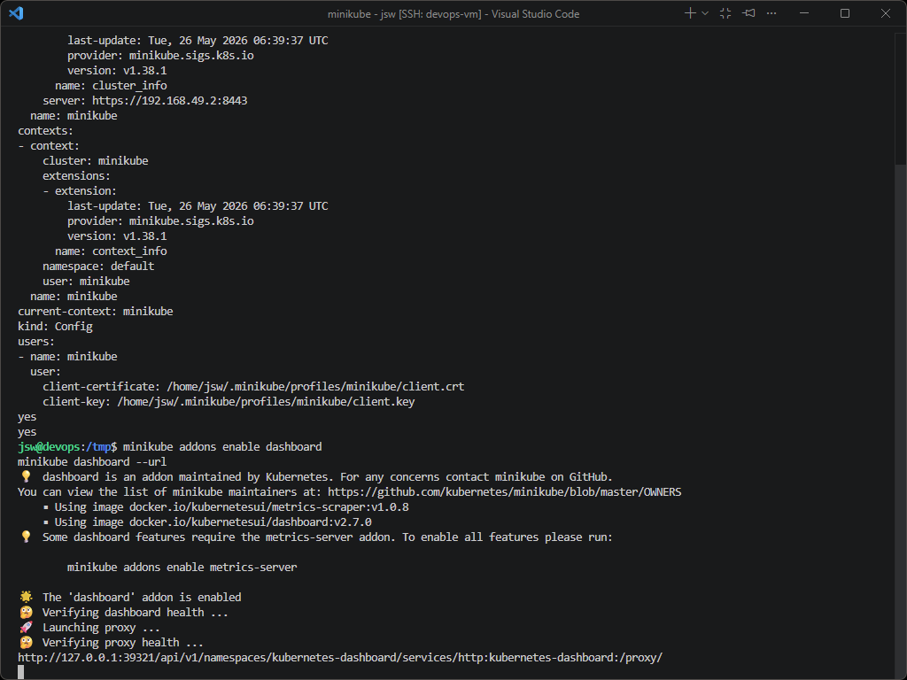

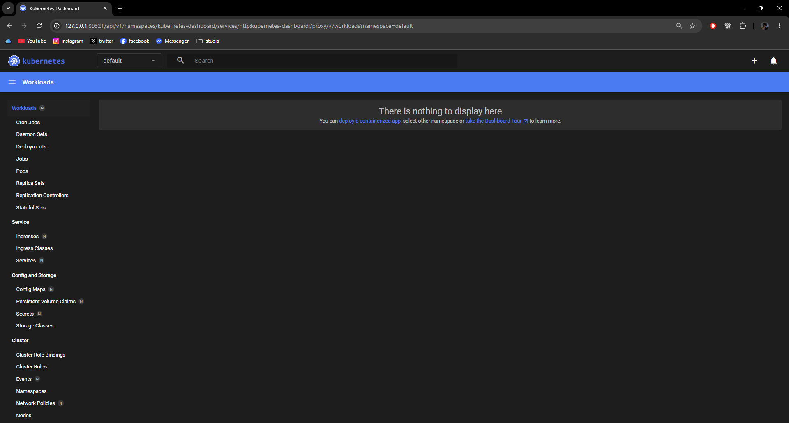

---

## 8. Obraz aplikacji i uruchomienie poda

Jako aplikację wybrano nginx z własną stroną HTML. W katalogu `k8s/app` przygotowano plik `index.html` zawierający prostą stronę z tekstem `JW422049 - Kubernetes`. Następnie przygotowano plik `Dockerfile` oparty o obraz `nginx:alpine`.

Obraz został zbudowany w środowisku Dockera wykorzystywanym przez minikube, dzięki czemu był dostępny bezpośrednio dla lokalnego klastra. Obraz otrzymał tag `jw422049-nginx-k8s:1.0`.

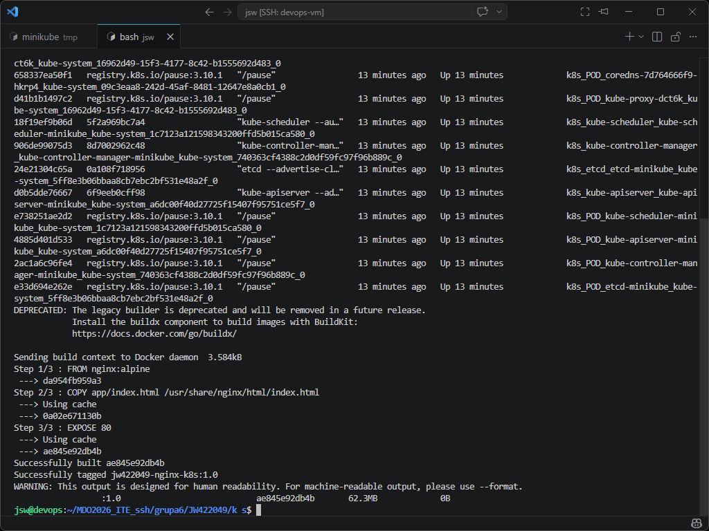

Aplikację uruchomiono ręcznie jako pojedynczy pod `jw422049-nginx-pod`. Ponieważ obraz był lokalny, ustawiono politykę pobierania obrazu tak, aby Kubernetes nie próbował pobierać go z zewnętrznego rejestru.

Po chwili pod osiągnął stan `Running`. Następnie wykonano przekierowanie portu z poda na lokalny port `8081`.

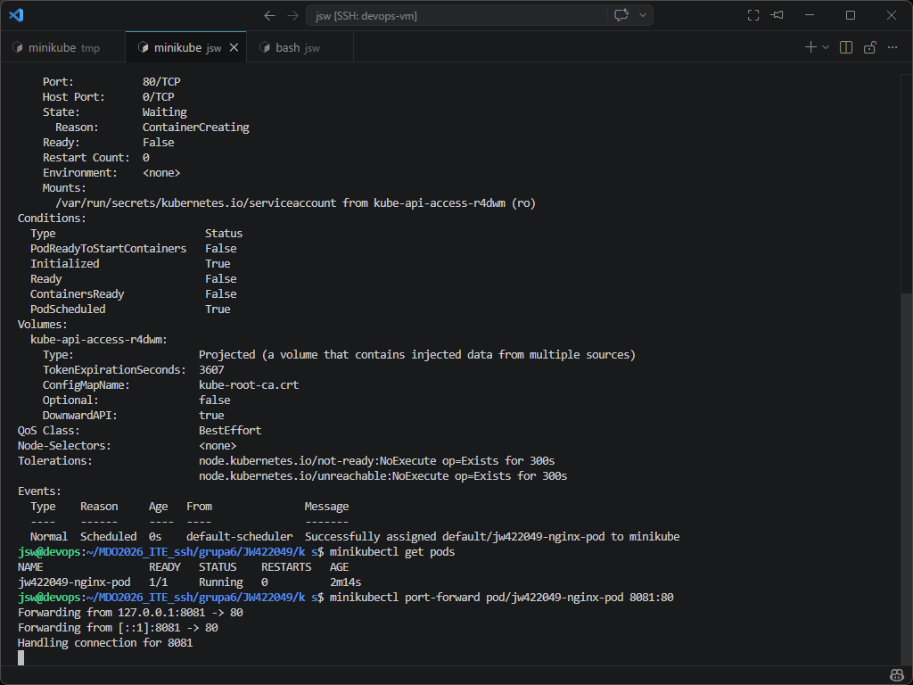

Działanie aplikacji sprawdzono przez zapytanie HTTP do lokalnego portu. Odpowiedź zawierała własną stronę HTML z komunikatem `JW422049 - Kubernetes`, co potwierdziło poprawne działanie poda.

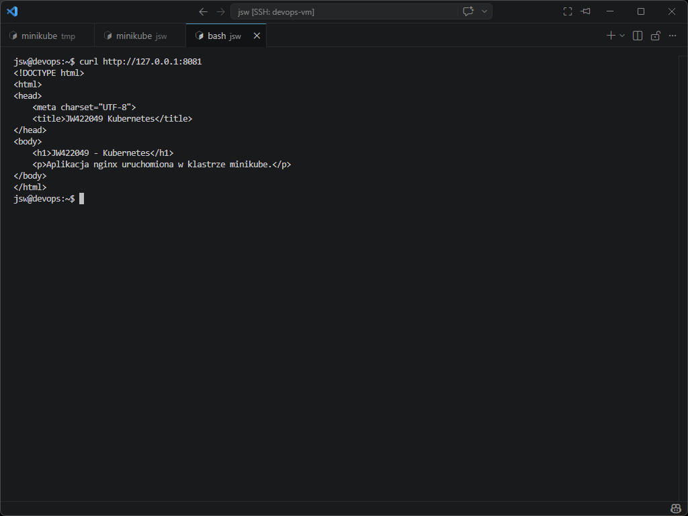

---

## 9. Deployment i Service w Kubernetes

Po ręcznym sprawdzeniu działania aplikacji przygotowano deklaratywne wdrożenie w pliku `deployment.yml`. Plik definiował obiekt typu `Deployment`, który korzystał z obrazu `jw422049-nginx-k8s:1.0` i uruchamiał cztery repliki aplikacji.

Deployment wdrożono w klastrze i sprawdzono status rollout. Wszystkie cztery repliki osiągnęły stan `Running`, co potwierdziło poprawne działanie deploymentu.

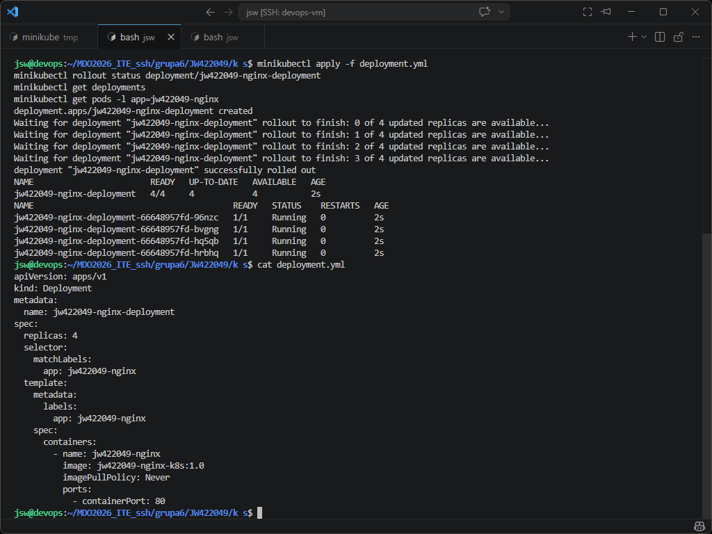

Aby zapewnić stabilny punkt dostępu do replik aplikacji, przygotowano plik `service.yml`. Service wybierał pody po etykiecie aplikacji i kierował ruch na port `80`. Miał typ `ClusterIP`, czyli działał jako wewnętrzny punkt dostępu w klastrze.

Po wdrożeniu serwisu sprawdzono jego opis. Widoczne endpointy potwierdziły, że Service został poprawnie powiązany z podami utworzonymi przez deployment.

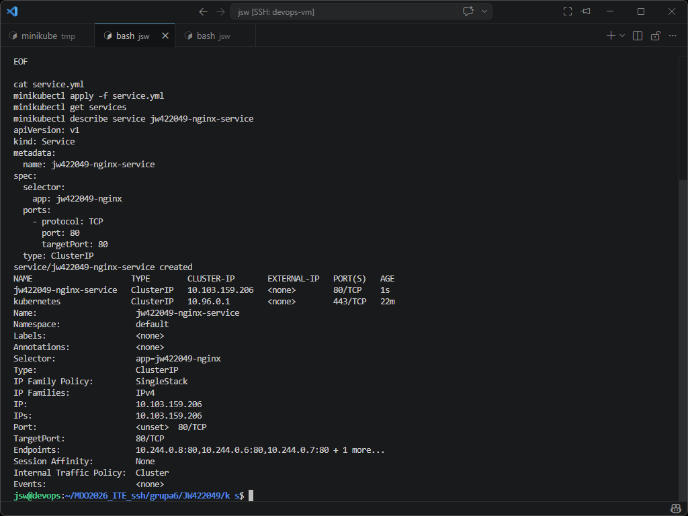

Działanie aplikacji przez Service sprawdzono za pomocą przekierowania portu lokalnego `8091` do portu `80` serwisu.

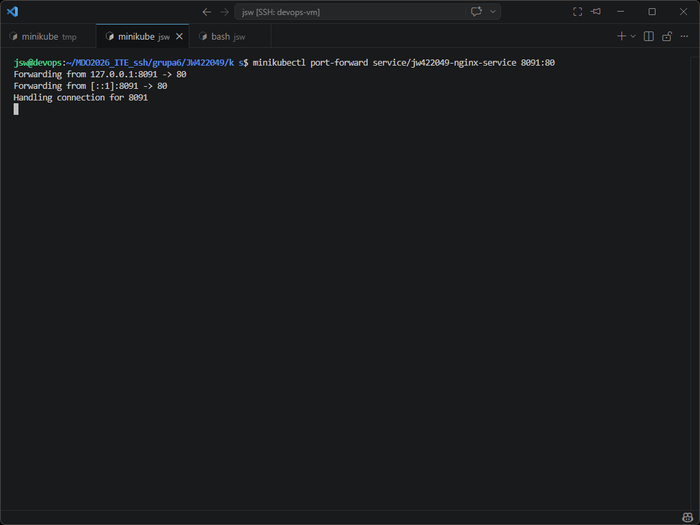

Następnie wykonano zapytanie HTTP na adres lokalny. Odpowiedź zawierała stronę HTML przygotowaną w obrazie Docker, co potwierdziło, że ruch przechodzi przez Service do jednego z podów deploymentu.

Aplikację sprawdzono również w przeglądarce. Strona z tekstem `JW422049 - Kubernetes` była dostępna przez przekierowany port.

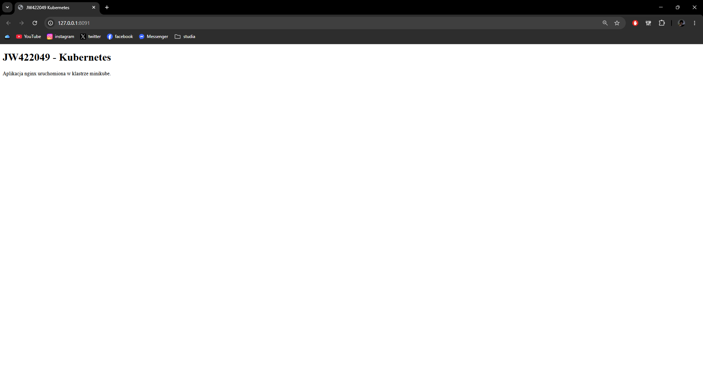

Po wykonaniu deploymentu i utworzeniu serwisu odświeżono Kubernetes Dashboard. W widoku workloadów widoczny był deployment `jw422049-nginx-deployment`, cztery działające pody oraz ReplicaSet utrzymujący wymaganą liczbę replik. Wszystkie zasoby były w stanie `Running`.

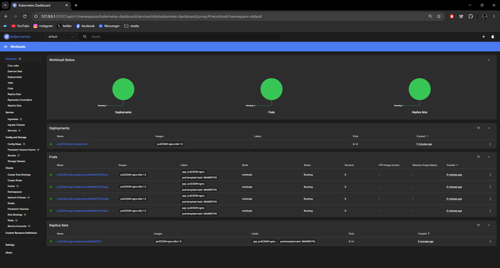

Na końcu sprawdzono stan zasobów Kubernetes oraz pliki przygotowane w katalogu `k8s`. W klastrze widoczny był deployment, cztery pody, ReplicaSet oraz Service. W katalogu roboczym znajdowały się pliki `Dockerfile`, `deployment.yml`, `service.yml` oraz katalog `app` z plikiem `index.html`.

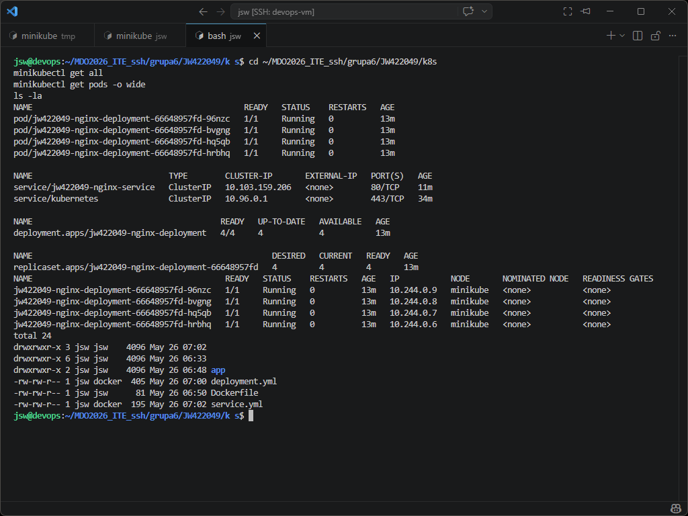

---

## 10. Aktualizacje aplikacji i rollback w Kubernetes

Kolejne laboratorium było kontynuacją pracy z Kubernetesem. Tym razem celem było sprawdzenie, jak Kubernetes zachowuje się podczas aktualizacji aplikacji, skalowania deploymentu, błędnego wdrożenia oraz cofania zmian. Prace wykonano w lokalnym klastrze minikube, a wszystkie pliki zapisano w katalogu `k8s11`.

Na początku przygotowano trzy wersje obrazu aplikacji nginx. Wersje `v1` i `v2` były poprawnymi wersjami aplikacji, różniącymi się zawartością strony HTML. Dodatkowo przygotowano obraz `bad`, który celowo kończył działanie błędem. Dzięki temu można było przetestować reakcję Kubernetes na wadliwy obraz i mechanizm rollbacku.

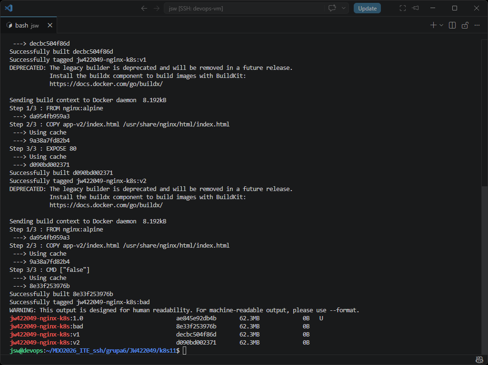

Następnie przygotowano bazowy deployment `jw422049-nginx-lab11`. Wykorzystywał on obraz `jw422049-nginx-k8s:v1` i uruchamiał cztery repliki aplikacji. Po wdrożeniu sprawdzono status rollout, deployment oraz listę podów. Wynik potwierdził, że wszystkie cztery repliki zostały poprawnie uruchomione i działały w stanie `Running`.

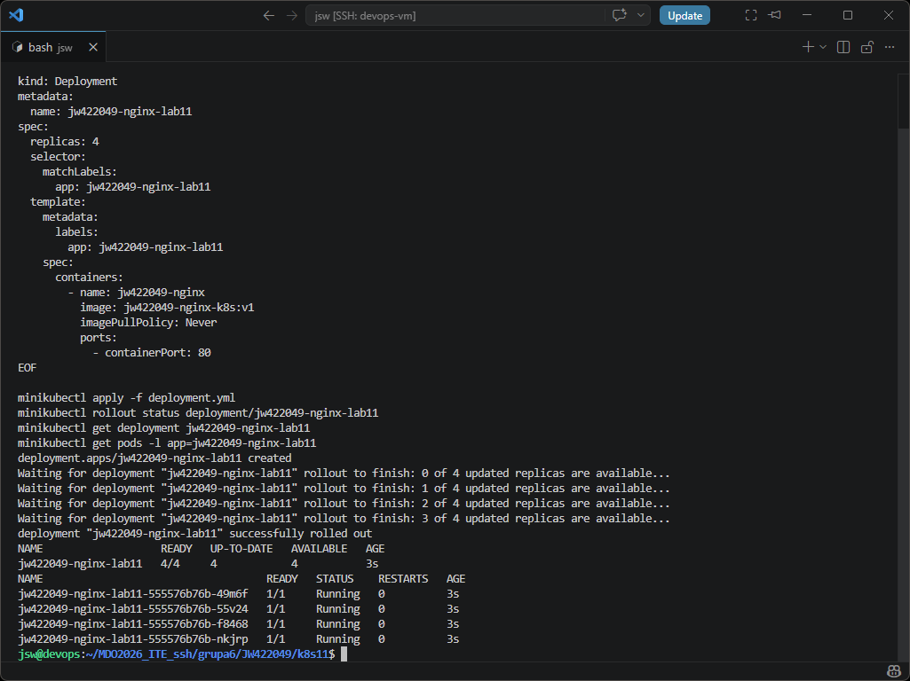

Kolejnym krokiem było sprawdzenie skalowania deploymentu. Liczbę replik zmieniano kolejno do 8, 1, 0 oraz ponownie do 4. Kubernetes automatycznie tworzył lub usuwał pody, aby doprowadzić rzeczywisty stan klastra do liczby replik zapisanej w konfiguracji deploymentu. Stan końcowy ponownie wynosił `4/4`, a wszystkie pody były uruchomione poprawnie.

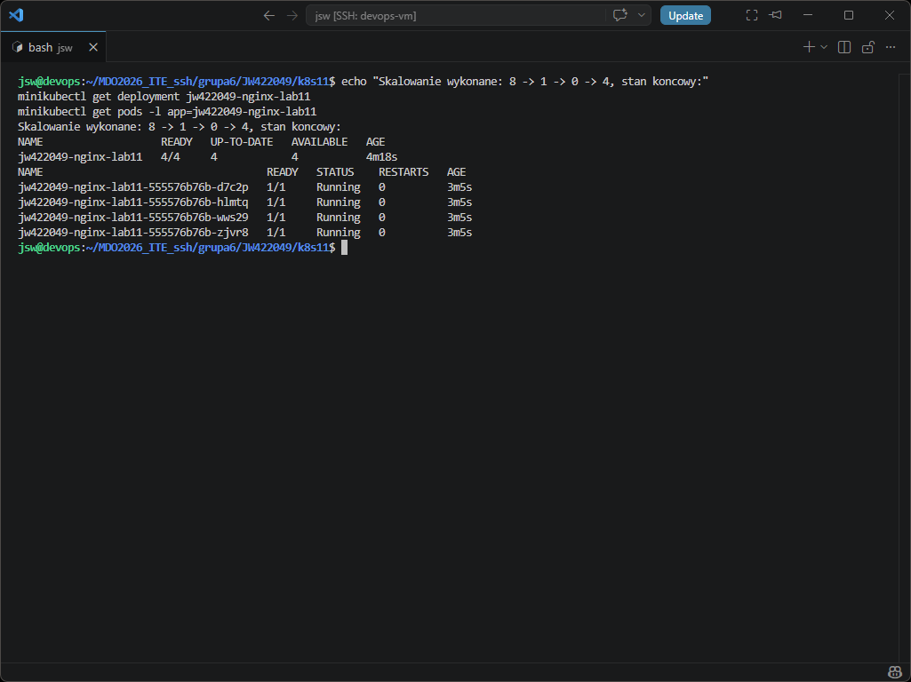

Po sprawdzeniu skalowania wykonano aktualizację obrazu w działającym deploymencie. Najpierw wdrożono wersję `v2`, a następnie przywrócono wersję `v1`. Po każdej zmianie sprawdzano status wdrożenia i listę podów. Rollout zakończył się poprawnie, a historia deploymentu zawierała kolejne rewizje odpowiadające zmianom obrazu.

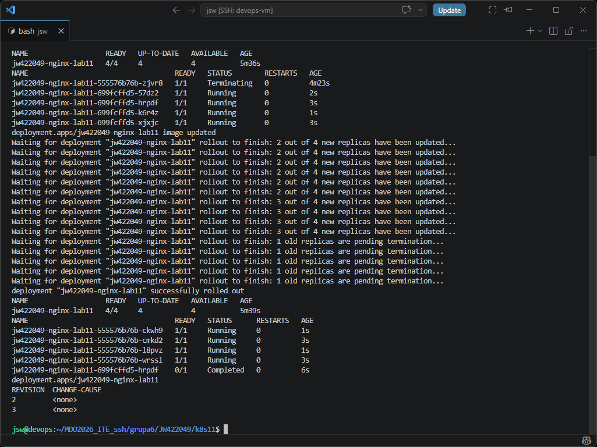

W dalszej części wdrożono obraz `bad`, który był celowo uszkodzony. Kontenery uruchamiane z tego obrazu kończyły pracę od razu po starcie, przez co nowe pody przechodziły w stan `Error`. Rollout nie zakończył się poprawnie w wyznaczonym czasie. Następnie sprawdzono historię wdrożeń i wykonano rollback do poprzedniej działającej wersji. Po cofnięciu zmian deployment wrócił do poprawnego stanu, a pody ponownie działały jako `Running`.

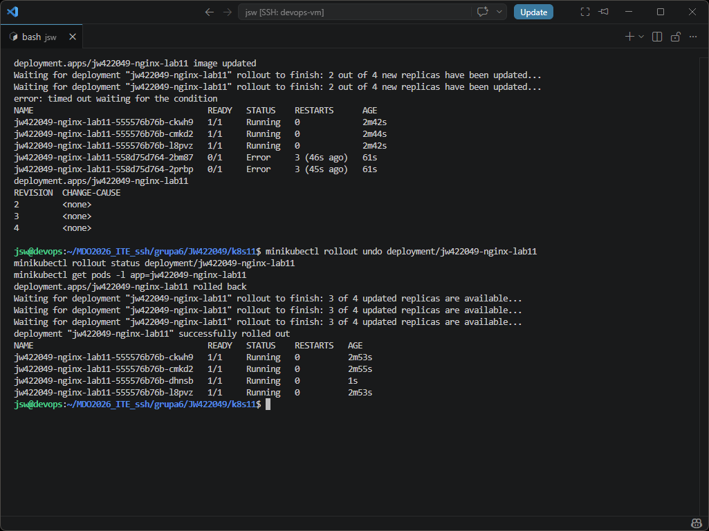

---

## 11. Automatyczna kontrola wdrożenia

W ramach laboratorium przygotowano również skrypt `check-rollout.sh`, którego zadaniem było sprawdzenie, czy wskazany deployment zakończy wdrożenie w czasie nie dłuższym niż 60 sekund. Skrypt przyjmował nazwę deploymentu jako argument, uruchamiał sprawdzenie rollout status i zwracał komunikat o powodzeniu lub niepowodzeniu.

Skrypt przetestowano na deploymencie `jw422049-nginx-lab11`. Wynik potwierdził, że wdrożenie zakończyło się sukcesem w czasie krótszym lub równym 60 sekund. Dzięki temu uzyskano prosty mechanizm kontroli poprawności wdrożenia, który można wykorzystać w automatyzacji.

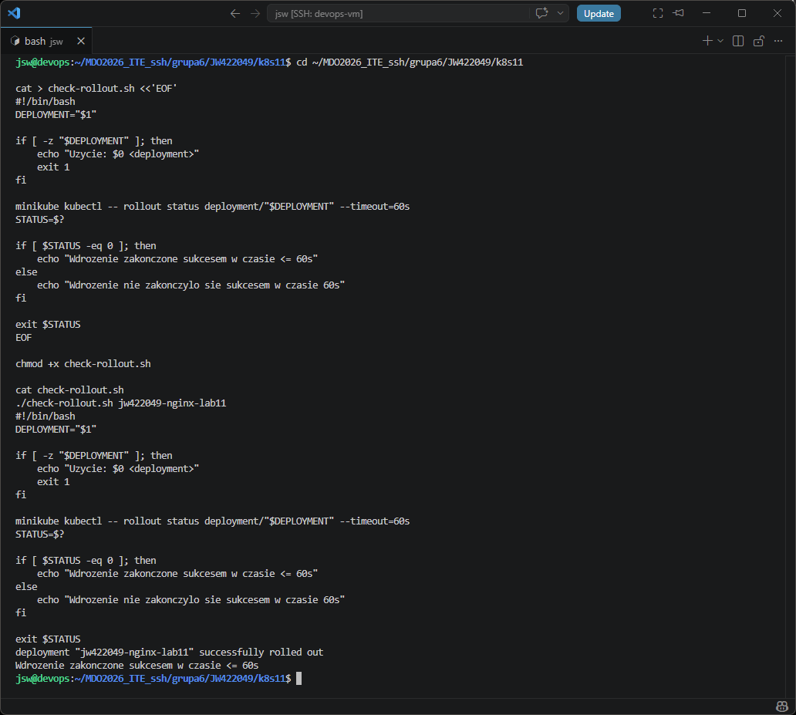

---

## 12. Strategie wdrażania w Kubernetes

Następnie sprawdzono różne strategie aktualizacji aplikacji w Kubernetesie. Pierwszą z nich była strategia `Recreate`. W tym wariancie Kubernetes najpierw usuwa stare pody, a dopiero później uruchamia nowe. Strategia jest prosta, ale może powodować chwilową przerwę w dostępności aplikacji.

Przygotowano osobny deployment `jw422049-nginx-recreate`, który korzystał ze strategii `Recreate`. Po jego wdrożeniu zmieniono obraz aplikacji na nowszą wersję. Aktualizacja zakończyła się powodzeniem, a deployment wrócił do stanu `4/4`.

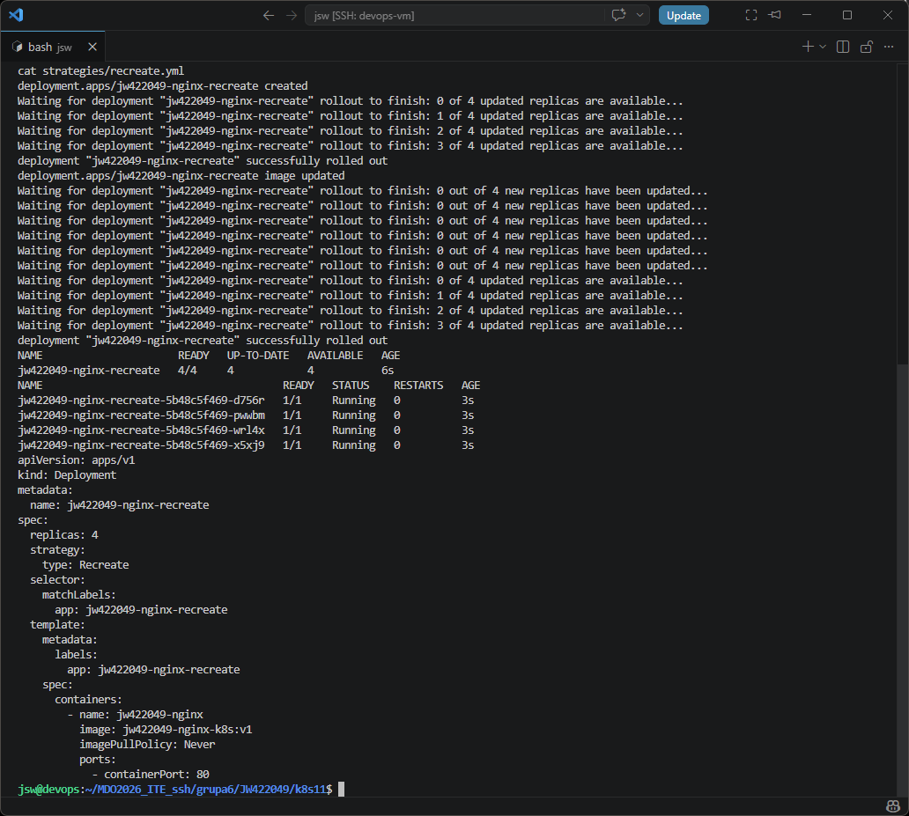

Drugą przetestowaną strategią była `RollingUpdate`. W tym przypadku Kubernetes stopniowo wymienia stare pody na nowe, dzięki czemu aplikacja może pozostać dostępna podczas aktualizacji. W konfiguracji ustawiono `maxUnavailable` na wartość większą niż 1 oraz `maxSurge` na wartość procentową większą niż 20%.

Po wdrożeniu deploymentu `jw422049-nginx-rolling` wykonano zmianę obrazu. W trakcie aktualizacji widoczne było stopniowe zastępowanie podów. Część starych replik była kończona, a nowe pody pojawiały się bez pełnego zatrzymania całego deploymentu.

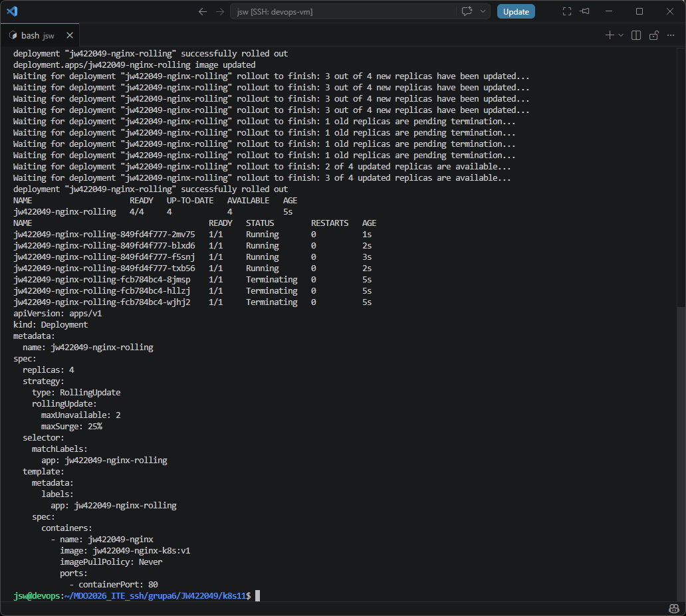

Ostatnią przetestowaną strategią była strategia `Canary`. Została ona wykonana przez równoległe uruchomienie dwóch deploymentów: stabilnego i testowego. Deployment stabilny `jw422049-nginx-stable` korzystał z obrazu `v1` i miał trzy repliki. Deployment testowy `jw422049-nginx-canary` korzystał z obrazu `v2` i miał jedną replikę.

Oba deploymenty miały wspólną etykietę aplikacji, a różniły się etykietą określającą ścieżkę `stable` albo `canary`. Dzięki temu Service mógł kierować ruch do całej aplikacji, a jednocześnie możliwe było rozróżnienie wersji stabilnej i testowej. Wynik pokazał trzy pody stabilne oraz jeden pod canary, co odpowiada klasycznemu wdrożeniu testowemu na ograniczonej części replik.

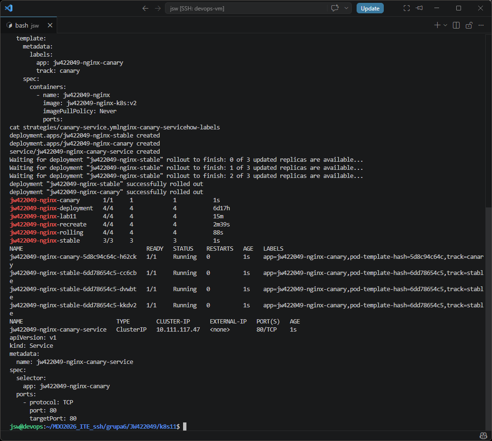

Na końcu sprawdzono końcowy stan plików i zasobów. W katalogu `k8s11` widoczne były pliki Dockerfile dla wersji `v1`, `v2` i `bad`, bazowy deployment, skrypt sprawdzający rollout oraz manifesty strategii `Recreate`, `RollingUpdate` i `Canary`. W klastrze widoczne były działające deploymenty, pody oraz serwisy utworzone w ramach testów.

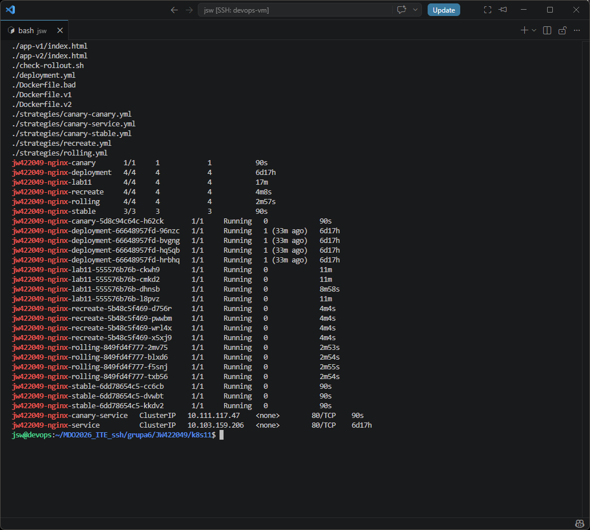

---

## 13. Wdrożenie kontenera w Microsoft Azure

Ostatnie laboratorium dotyczyło uruchomienia aplikacji kontenerowej w chmurze Microsoft Azure. Do wykonania zadania wykorzystano usługę Azure Container Instances, subskrypcję `Azure for Students`, Azure Cloud Shell oraz obraz opublikowany w Docker Hub.

Na początku przygotowano własny obraz kontenera HTTP oparty o `httpd:alpine`. Obraz zawierał prostą stronę `index.html`, dzięki czemu po wdrożeniu można było łatwo sprawdzić działanie aplikacji przez HTTP. Przygotowano dwie wersje obrazu, oznaczone tagami `v1` oraz `v2`. Przed publikacją wykonano lokalny test kontenera, który potwierdził, że aplikacja zwraca stronę HTML i działa poprawnie.

Następnie obrazy zostały wypchnięte do Docker Hub na konto `jsw333`. W lokalnym terminalu potwierdzono obecność obrazów `jsw333/jw422049-azure-httpd:v1` oraz `jsw333/jw422049-azure-httpd:v2`.

Po publikacji sprawdzono repozytorium w Docker Hub. Widoczne były dwa tagi obrazu: `v1` oraz `v2`. Do wdrożenia w Azure wykorzystano wersję `v2`, czyli `jsw333/jw422049-azure-httpd:v2`.

---

## 14. Przygotowanie Azure Cloud Shell i resource group

Część chmurową wykonano w Azure Cloud Shell w trybie Bash. Na początku ustawiono aktywną subskrypcję `Azure for Students`, sprawdzono dane konta oraz zarejestrowano provider `Microsoft.ContainerInstance`, wymagany do tworzenia zasobów Azure Container Instances.

Początkowo rejestracja providera była w stanie `Registering`, dlatego po chwili wykonano ponowne sprawdzenie. Ostatecznie provider osiągnął stan `Registered`, co pozwoliło przejść do tworzenia zasobów w Azure.

Następnie utworzono resource group `jw422049-rg` w regionie `swedencentral`. Azure zwrócił informację o poprawnym utworzeniu grupy zasobów, a stan `provisioningState` miał wartość `Succeeded`.

---

## 15. Azure Container Instances i weryfikacja działania

Po przygotowaniu resource group wdrożono kontener w usłudze Azure Container Instances. Do wdrożenia wykorzystano obraz `jsw333/jw422049-azure-httpd:v2` znajdujący się w Docker Hub. Kontener otrzymał nazwę `jw422049-httpd-aci`, publiczny adres IP oraz nazwę FQDN `jw422049-httpd-aci-422049.swedencentral.azurecontainer.io`.

Po utworzeniu instancji sprawdzono jej stan. Wynik pokazał, że kontener działał jako `Running`, a Azure przypisał mu publiczny adres IP i nazwę DNS.

Działanie aplikacji sprawdzono z poziomu Azure Cloud Shell przez zapytanie HTTP do publicznego FQDN. Odpowiedź zawierała stronę HTML przygotowaną w obrazie kontenera, między innymi tekst `JW422049 Azure ACI v2`. Następnie pobrano logi kontenera. W logach widoczne było uruchomienie serwera Apache HTTP oraz żądanie `GET / HTTP/1.1` zakończone kodem `200`, co potwierdziło poprawne działanie aplikacji.

Działanie zasobu sprawdzono również w Azure Portal. W widoku `Overview` dla zasobu `jw422049-httpd-aci` widoczny był stan `Running`, resource group `jw422049-rg`, region `Sweden Central`, publiczny adres IP, publiczny FQDN, liczba kontenerów oraz podstawowe metryki CPU, pamięci i ruchu sieciowego.

Po zakończeniu testów usunięto całą resource group, aby nie pozostawić aktywnych zasobów w Azure. Następnie sprawdzono, czy grupa nadal istnieje. Wynik `false` potwierdził, że resource group `jw422049-rg` została poprawnie usunięta razem z utworzoną instancją kontenera.

---

## 16. Podsumowanie laboratoriów 08-12

W ramach laboratoriów 08-12 wykonano pełny zestaw zadań związanych z automatyzacją administracji, instalacją systemów, konteneryzacją oraz wdrażaniem aplikacji lokalnie i w chmurze.

W części dotyczącej Ansible przygotowano inventory, przetestowano połączenia z hostami, utworzono playbooki wykonujące zadania administracyjne, sprawdzono idempotencję, reakcję na niedostępny host oraz wdrożono kontener nginx na maszynie docelowej. Dodatkowo przygotowano rolę Ansible, która porządkowała konfigurację wdrożenia kontenera.

W części dotyczącej Kickstart przygotowano nienadzorowaną instalację Fedory. Plik odpowiedzi konfigurował system, hostname, pakiety i sekcję postinstalacyjną. Po instalacji system automatycznie uruchamiał usługę systemd odpowiedzialną za start kontenera nginx. Poprawność działania potwierdzono przez status usług, działający kontener i odpowiedź HTTP.

W laboratoriach Kubernetes uruchomiono lokalny klaster minikube, przygotowano własny obraz aplikacji, uruchomiono go jako pod, a następnie wdrożono jako deployment z czterema replikami i service. W kolejnym etapie sprawdzono skalowanie, aktualizacje obrazu, historię wdrożeń, rollback po błędnym obrazie oraz strategie `Recreate`, `RollingUpdate` i `Canary`.

Ostatnia część dotyczyła wdrożenia kontenera w chmurze Microsoft Azure. Przygotowano własny obraz HTTP, opublikowano go w Docker Hub, skonfigurowano Azure Cloud Shell, utworzono resource group i uruchomiono kontener w Azure Container Instances. Działanie aplikacji potwierdzono przez `curl`, logi kontenera oraz widok w Azure Portal. Po zakończeniu pracy zasoby zostały usunięte, aby nie zużywać kredytów subskrypcji.

Całość laboratoriów pokazała przejście od automatyzacji pojedynczych maszyn przez instalacje nienadzorowane i lokalne klastry Kubernetes aż do uruchamiania kontenerów w chmurze. Dzięki temu przećwiczono kilka różnych sposobów wdrażania i utrzymywania aplikacji kontenerowych w środowiskach lokalnych oraz chmurowych.