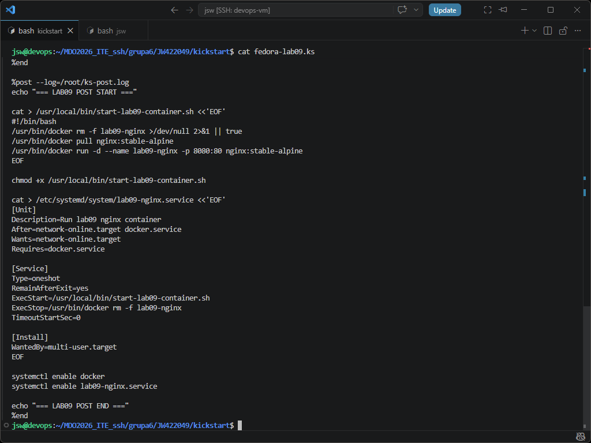
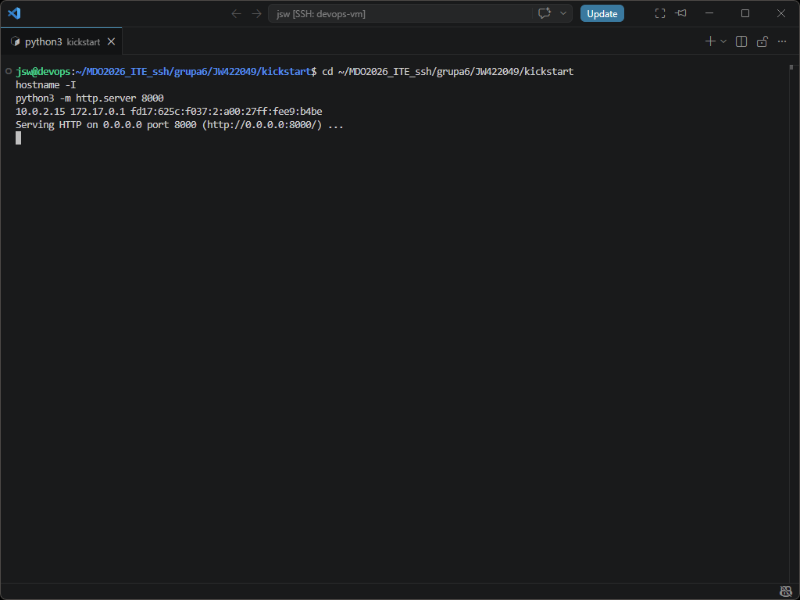
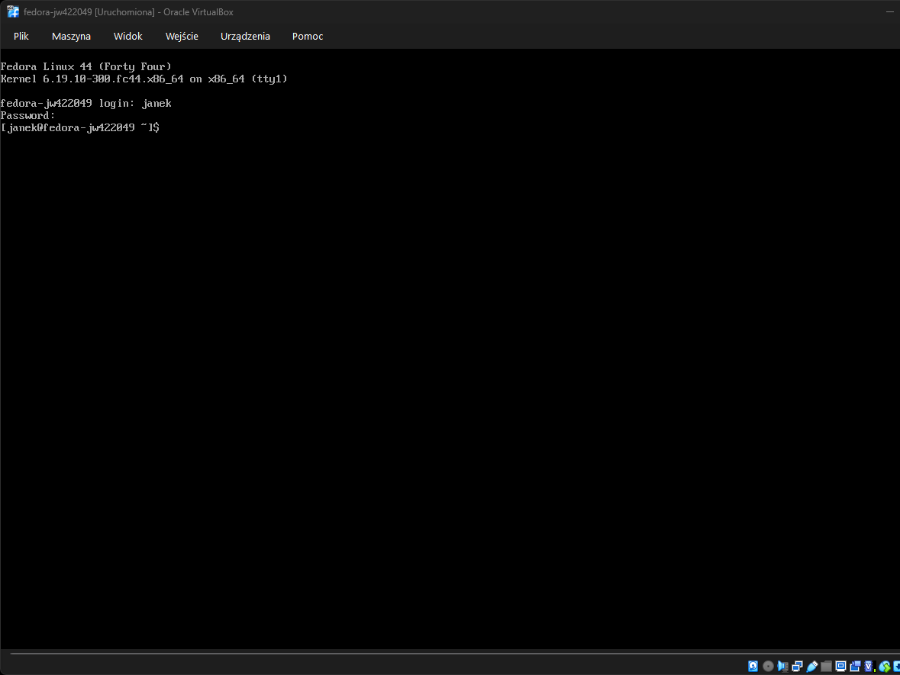
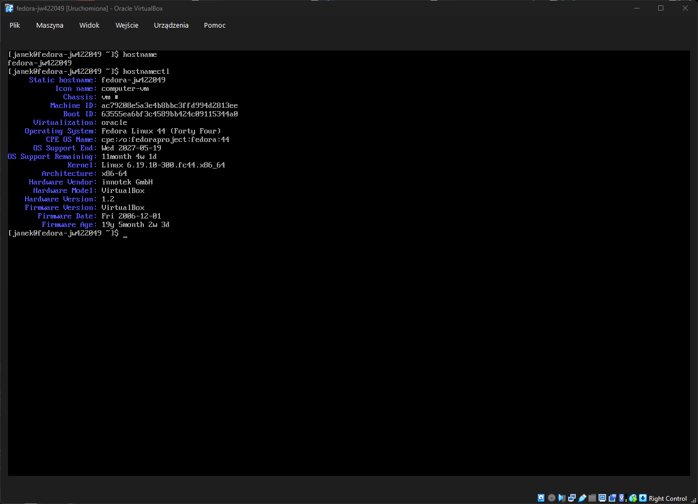
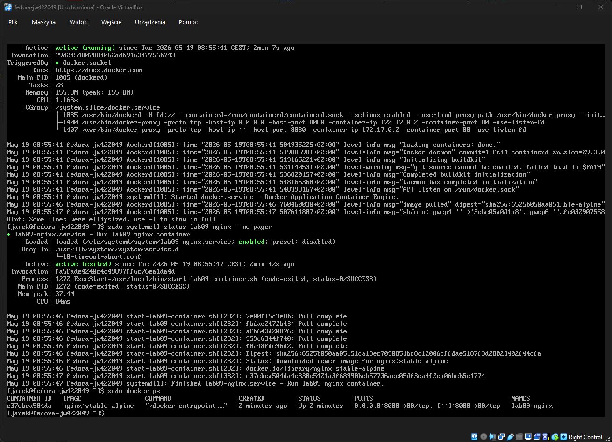
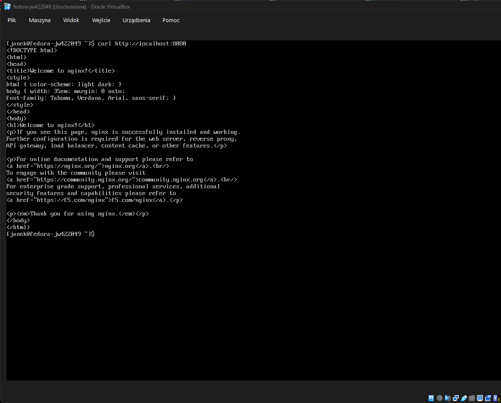
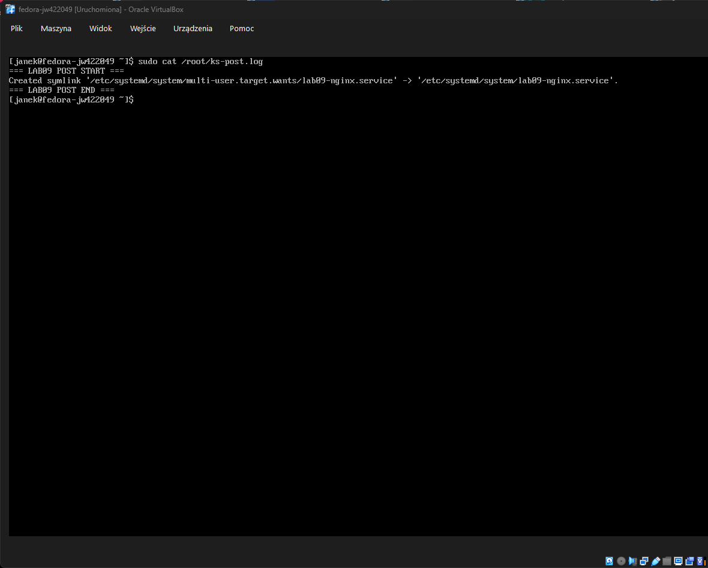

# Sprawozdanie 09 - Pliki odpowiedzi dla wdrożeń nienadzorowanych

**Jan Wojsznis 422049**

---

## 1. Cel ćwiczenia

Celem ćwiczenia było przygotowanie nienadzorowanej instalacji systemu Fedora z wykorzystaniem pliku odpowiedzi Kickstart. System po zakończeniu instalacji miał automatycznie uruchomić przygotowane oprogramowanie. W moim przypadku program został uruchomiony jako kontener Docker z serwerem nginx.

Do wykonania zadania wykorzystano maszynę wirtualną Fedora 44 uruchamianą w VirtualBox oraz plik Kickstart `fedora-lab09.ks`, który został udostępniony przez prosty serwer HTTP uruchomiony na maszynie `devops`.

---

## 2. Przygotowanie pliku Kickstart

Na maszynie `devops` przygotowano katalog `kickstart`, w którym utworzono plik `fedora-lab09.ks`. Plik zawierał konfigurację instalacji nienadzorowanej Fedory, między innymi ustawienia języka, klawiatury, strefy czasowej, sieci, użytkowników, repozytoriów oraz partycjonowania.

W pliku ustawiono nazwę hosta inną niż domyślna:

    network --bootproto=dhcp --device=link --activate --hostname=fedora-jw422049

Dodano repozytoria Fedory 44:

    url --mirrorlist=http://mirrors.fedoraproject.org/mirrorlist?repo=fedora-44&arch=x86_64
    repo --name=updates --mirrorlist=http://mirrors.fedoraproject.org/mirrorlist?repo=updates-released-f44&arch=x86_64

Zapewniono automatyczne czyszczenie i partycjonowanie dysku:

    zerombr
    clearpart --all --initlabel
    autopart

Dodano również automatyczny restart po instalacji:

    reboot

W sekcji `%packages` wskazano pakiety potrzebne do działania systemu oraz kontenera:

    %packages
    curl
    wget
    tar
    openssh-server
    docker
    %end

W sekcji `%post` przygotowano skrypt uruchamiający kontener nginx oraz usługę systemd `lab09-nginx.service`, która startuje automatycznie po uruchomieniu systemu. Dzięki temu Docker nie był uruchamiany bezpośrednio w instalatorze, tylko dopiero po pierwszym normalnym starcie systemu.

---

## 3. Udostępnienie pliku Kickstart przez HTTP

Plik `fedora-lab09.ks` został udostępniony z maszyny `devops` za pomocą prostego serwera HTTP uruchomionego poleceniem:

    python3 -m http.server 8000

Maszyna `devops` posiadała adres `192.168.56.102` w sieci host-only, dlatego plik Kickstart był dostępny pod adresem:

    http://192.168.56.102:8000/fedora-lab09.ks

Adres ten został później przekazany instalatorowi Fedory przez parametr `inst.ks`.

---

## 4. Instalacja nienadzorowana systemu Fedora

W VirtualBox utworzono nową maszynę wirtualną `fedora-jw422049`. Do instalacji użyto obrazu `Fedora-Everything-netinst-x86_64-44-1.7.iso`.

Maszyna została skonfigurowana tak, aby korzystała z sieci pozwalającej na pobranie pliku Kickstart z maszyny `devops`. Podczas startu instalatora Fedora w menu GRUB dopisano parametr:

    inst.ks=http://192.168.56.102:8000/fedora-lab09.ks

Po uruchomieniu instalator pobrał plik Kickstart, wykonał instalację w trybie tekstowym, skonfigurował system i wykonał restart. Po odpięciu obrazu ISO system uruchomił się już z dysku maszyny wirtualnej.

Po zakończonej instalacji możliwe było zalogowanie się na użytkownika `janek`.

---

## 5. Weryfikacja zainstalowanego systemu

Po zalogowaniu do systemu sprawdzono nazwę hosta oraz informacje o systemie poleceniami:

    hostname
    hostnamectl

Wynik potwierdził, że system został zainstalowany jako Fedora Linux 44, a hostname został ustawiony zgodnie z plikiem Kickstart na:

    fedora-jw422049

---

## 6. Weryfikacja Dockera i kontenera

Następnie sprawdzono działanie usługi Docker oraz usługi utworzonej w sekcji `%post`.

Wykonano polecenia:

    sudo systemctl status docker --no-pager
    sudo systemctl status lab09-nginx --no-pager
    sudo docker ps

Usługa `docker.service` była aktywna, a usługa `lab09-nginx.service` została poprawnie utworzona i uruchomiona. Polecenie `docker ps` potwierdziło, że działa kontener:

    lab09-nginx

Kontener został uruchomiony z obrazu `nginx:stable-alpine` i wystawiał port `80` kontenera na porcie `8080` systemu Fedora.

---

## 7. Sprawdzenie działania aplikacji

Działanie kontenera sprawdzono lokalnie z poziomu systemu Fedora poleceniem:

    curl http://localhost:8080

Polecenie zwróciło stronę HTML z komunikatem:

    Welcome to nginx!

Potwierdziło to, że kontener został poprawnie uruchomiony po instalacji systemu i aplikacja jest dostępna na porcie `8080`.

---

## 8. Log z sekcji postinstalacyjnej

Działanie sekcji `%post` było logowane do pliku:

    /root/ks-post.log

Po instalacji sprawdzono zawartość logu poleceniem:

    sudo cat /root/ks-post.log

W logu widoczne były komunikaty rozpoczęcia i zakończenia sekcji postinstalacyjnej oraz informacja o utworzeniu dowiązania dla usługi `lab09-nginx.service`. Potwierdza to, że sekcja `%post` wykonała się poprawnie i przygotowała usługę uruchamiającą kontener.

---

## 9. Podsumowanie

W ramach ćwiczenia przygotowano nienadzorowaną instalację systemu Fedora 44 z wykorzystaniem pliku Kickstart. Plik `fedora-lab09.ks` zawierał konfigurację repozytoriów, użytkownika, hostname, automatycznego partycjonowania dysku oraz pakietów wymaganych do działania Dockera.

Plik odpowiedzi został udostępniony z maszyny `devops` przez serwer HTTP i wskazany instalatorowi Fedory za pomocą parametru `inst.ks`. Instalator samodzielnie pobrał konfigurację, zainstalował system i wykonał restart.

W sekcji `%post` przygotowano skrypt oraz usługę systemd odpowiedzialną za uruchomienie kontenera nginx po pierwszym starcie systemu. Po zakończeniu instalacji potwierdzono działanie systemu, poprawny hostname, aktywną usługę Docker, działający kontener `lab09-nginx` oraz poprawną odpowiedź nginx na żądanie `curl`.

Ćwiczenie zakończyło się powodzeniem, a system po instalacji automatycznie hostował przygotowany kontener.