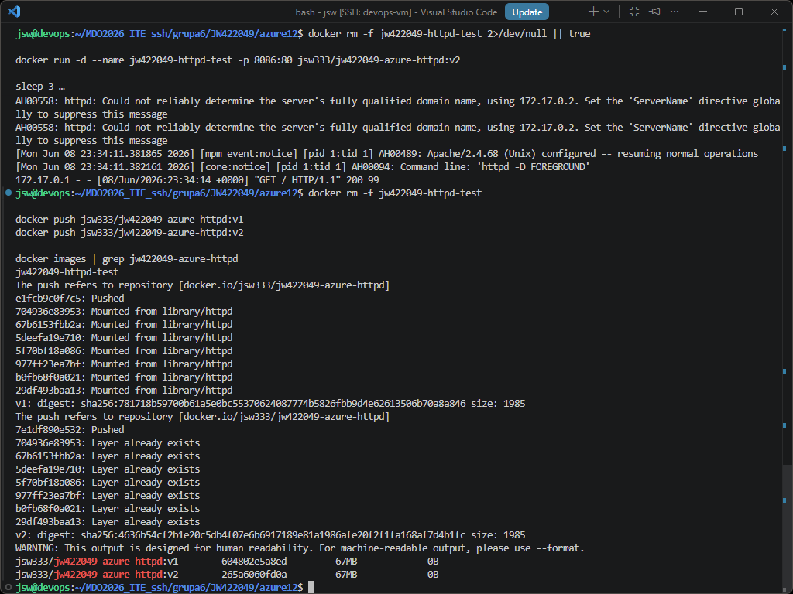
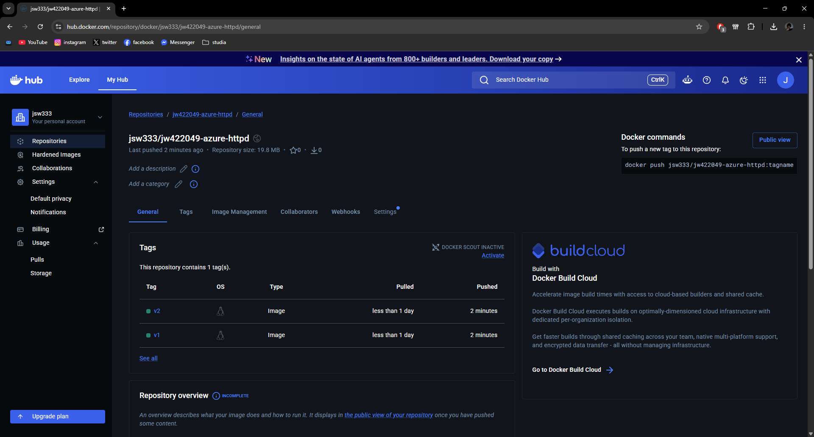
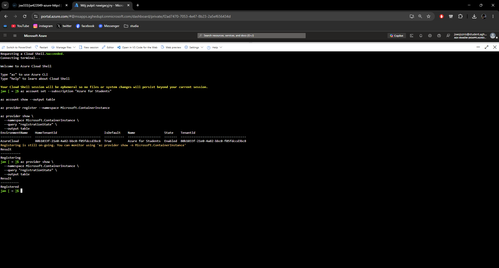
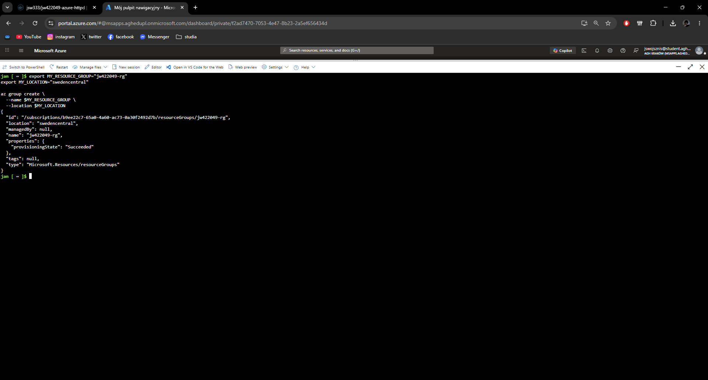
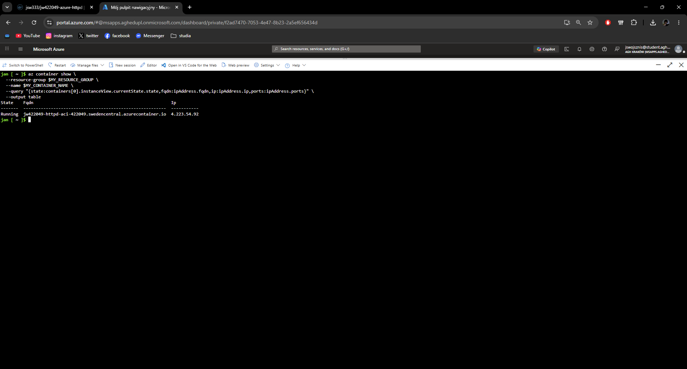
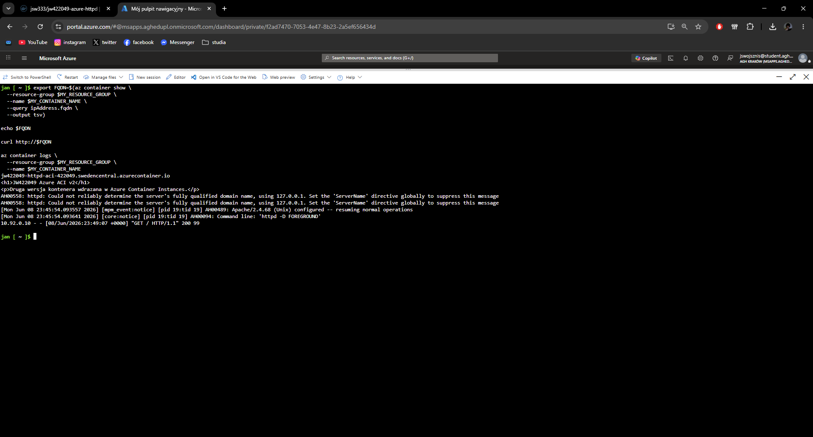
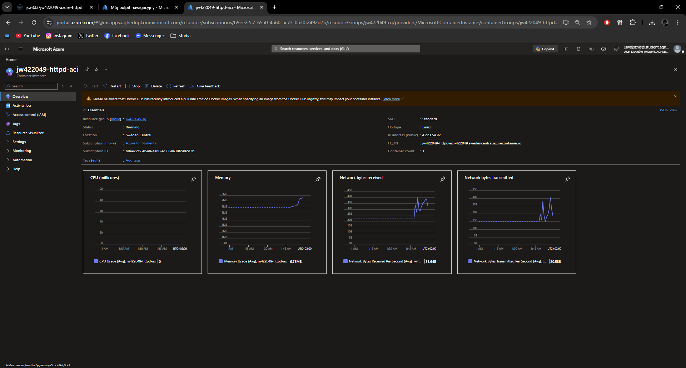
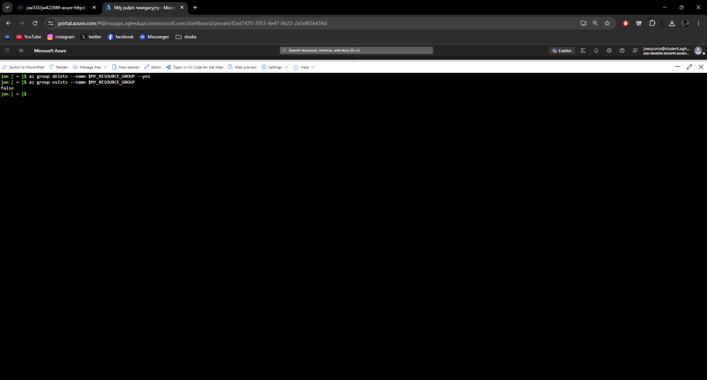

# Sprawozdanie 12 - Wdrażanie na zarządzalne kontenery w chmurze (Azure)

**Jan Wojsznis 422049**

---

## 1. Cel ćwiczenia

Celem ćwiczenia było wdrożenie aplikacji kontenerowej w chmurze Microsoft Azure z wykorzystaniem usługi *Azure Container Instances*. W ramach zadania przygotowano własny obraz kontenera, opublikowano go w Docker Hub, a następnie uruchomiono go jako pojedynczą instancję kontenera w Azure.

Do wykonania zadania wykorzystano maszynę `devops`, Docker Hub, Azure Cloud Shell oraz subskrypcję `Azure for Students`. Zgodnie z założeniami ćwiczenia nie tworzono Azure Container Registry, ponieważ obraz kontenera został pobrany bezpośrednio z Docker Huba.

---

## 2. Przygotowanie obrazu kontenera

Na potrzeby ćwiczenia przygotowano prostą aplikację HTTP opartą o obraz bazowy `httpd:alpine`. Aplikacja serwowała własny plik `index.html`, dzięki czemu po wdrożeniu można było łatwo sprawdzić, czy kontener działa poprawnie.

W katalogu roboczym utworzono katalog `azure12` oraz pliki potrzebne do zbudowania obrazu:

    cd ~/MDO2026_ITE_ssh/grupa6/JW422049
    mkdir -p azure12
    mkdir -p ss/12
    cd azure12

Przygotowano plik `Dockerfile`:

    cat > Dockerfile <<'EOF'
    FROM httpd:alpine
    COPY index.html /usr/local/apache2/htdocs/index.html
    EXPOSE 80
    EOF

Następnie przygotowano dwie wersje strony `index.html`, aby obraz posiadał wersje `v1` oraz `v2`.

Wersja `v1`:

    cat > index-v1.html <<'EOF'
    <h1>JW422049 Azure ACI v1</h1>
    
Wlasny kontener HTTP przygotowany na bazie httpd:alpine.

    EOF

Wersja `v2`:

    cat > index-v2.html <<'EOF'
    <h1>JW422049 Azure ACI v2</h1>
    
Druga wersja kontenera wdrazana w Azure Container Instances.

    EOF

Obrazy zbudowano i oznaczono tagami w repozytorium Docker Hub użytkownika `jsw333`:

    cp index-v1.html index.html
    docker build -t jsw333/jw422049-azure-httpd:v1 .

    cp index-v2.html index.html
    docker build -t jsw333/jw422049-azure-httpd:v2 .

Przed publikacją obrazu wykonano lokalny test działania kontenera:

    docker rm -f jw422049-httpd-test 2>/dev/null || true
    docker run -d --name jw422049-httpd-test -p 8086:80 jsw333/jw422049-azure-httpd:v2
    sleep 3
    curl http://127.0.0.1:8086
    docker logs jw422049-httpd-test
    docker rm -f jw422049-httpd-test

Polecenie `curl` zwróciło stronę HTML z tekstem `JW422049 Azure ACI v2`. W logach kontenera widoczny był wpis `GET / HTTP/1.1" 200`, co potwierdziło poprawne działanie lokalnego kontenera.

Następnie obrazy zostały opublikowane w Docker Hub:

    docker push jsw333/jw422049-azure-httpd:v1
    docker push jsw333/jw422049-azure-httpd:v2

Po publikacji sprawdzono lokalną listę obrazów:

    docker images | grep jw422049-azure-httpd

Wynik potwierdził obecność obrazów `v1` oraz `v2`.

---

## 3. Repozytorium w Docker Hub

Po wykonaniu poleceń `docker push` sprawdzono repozytorium w Docker Hub. Utworzone repozytorium miało nazwę:

    jsw333/jw422049-azure-httpd

W repozytorium widoczne były dwa tagi obrazu:

    v1
    v2

Do wdrożenia w Azure wykorzystano nowszą wersję obrazu, czyli:

    jsw333/jw422049-azure-httpd:v2

---

## 4. Azure Cloud Shell i rejestracja providera

Część chmurową wykonano w *Azure Cloud Shell* w trybie Bash. Na początku ustawiono aktywną subskrypcję `Azure for Students` oraz sprawdzono dane konta:

    az account set --subscription "Azure for Students"
    az account show --output table

Następnie zarejestrowano provider wymagany do tworzenia zasobów Azure Container Instances:

    az provider register --namespace Microsoft.ContainerInstance

Stan rejestracji sprawdzono poleceniem:

    az provider show \
      --namespace Microsoft.ContainerInstance \
      --query "registrationState" \
      --output table

Początkowo rejestracja była w stanie `Registering`, dlatego po chwili wykonano ponowne sprawdzenie. Ostatecznie provider `Microsoft.ContainerInstance` osiągnął stan `Registered`, co umożliwiło dalsze tworzenie kontenera w Azure.

---

## 5. Utworzenie resource group

Następnie utworzono własną grupę zasobów, w której miał zostać uruchomiony kontener. Jako region wybrano `swedencentral`.

Użyte polecenia:

    export MY_RESOURCE_GROUP="jw422049-rg"
    export MY_LOCATION="swedencentral"

    az group create \
      --name $MY_RESOURCE_GROUP \
      --location $MY_LOCATION

Azure zwrócił informację o poprawnym utworzeniu resource group. W wyniku widoczny był stan:

    provisioningState: Succeeded

Utworzona grupa zasobów miała nazwę:

    jw422049-rg

---

## 6. Wdrożenie kontenera w Azure Container Instances

Po przygotowaniu resource group wdrożono kontener w usłudze *Azure Container Instances*. Do wdrożenia użyto obrazu z Docker Hub:

    jsw333/jw422049-azure-httpd:v2

Ustawiono nazwę kontenera oraz etykietę DNS:

    export MY_CONTAINER_NAME="jw422049-httpd-aci"
    export MY_DNS_LABEL="jw422049-httpd-aci-422049"

Kontener utworzono poleceniem:

    az container create \
      --resource-group $MY_RESOURCE_GROUP \
      --name $MY_CONTAINER_NAME \
      --image jsw333/jw422049-azure-httpd:v2 \
      --ports 80 \
      --dns-name-label $MY_DNS_LABEL \
      --os-type Linux \
      --cpu 1 \
      --memory 1

Kontener został uruchomiony jako instancja systemu Linux, z publicznym portem `80`, przydzielonym adresem IP oraz nazwą FQDN.

Po wdrożeniu sprawdzono stan kontenera:

    az container show \
      --resource-group $MY_RESOURCE_GROUP \
      --name $MY_CONTAINER_NAME \
      --query "{state:containers[0].instanceView.currentState.state,fqdn:ipAddress.fqdn,ip:ipAddress.ip,ports:ipAddress.ports}" \
      --output table

Wynik potwierdził, że kontener działał poprawnie w stanie:

    Running

Azure przypisał również publiczny adres FQDN:

    jw422049-httpd-aci-422049.swedencentral.azurecontainer.io

---

## 7. Sprawdzenie działania aplikacji i logów

Działanie aplikacji sprawdzono przez publiczny adres FQDN przypisany do kontenera. Adres pobrano z konfiguracji Azure Container Instance:

    export FQDN=$(az container show \
      --resource-group $MY_RESOURCE_GROUP \
      --name $MY_CONTAINER_NAME \
      --query ipAddress.fqdn \
      --output tsv)

    echo $FQDN

Następnie wykonano zapytanie HTTP do aplikacji:

    curl http://$FQDN

Polecenie `curl` zwróciło stronę HTML przygotowaną w obrazie kontenera:

    <h1>JW422049 Azure ACI v2</h1>
    
Druga wersja kontenera wdrazana w Azure Container Instances.

Potwierdziło to, że aplikacja została poprawnie uruchomiona w Azure Container Instances i odpowiada na żądania HTTP.

Następnie pobrano logi kontenera:

    az container logs \
      --resource-group $MY_RESOURCE_GROUP \
      --name $MY_CONTAINER_NAME

W logach widoczne było uruchomienie serwera Apache HTTP oraz wpis:

    GET / HTTP/1.1" 200

Oznacza to, że kontener odebrał żądanie HTTP i zwrócił poprawną odpowiedź.

---

## 8. Widok kontenera w Azure Portal

Po sprawdzeniu działania aplikacji z poziomu Cloud Shell otwarto zasób kontenera w Azure Portal. W widoku `Overview` dla zasobu `jw422049-httpd-aci` widoczne były podstawowe informacje o instancji kontenera.

Portal pokazywał między innymi:

- status `Running`,
- resource group `jw422049-rg`,
- region `Sweden Central`,
- publiczny adres IP,
- publiczny FQDN,
- liczbę kontenerów równą `1`,
- podstawowe metryki CPU, pamięci i ruchu sieciowego.

Widok w portalu potwierdził, że kontener był aktywny i działał jako zasób Azure Container Instances.

---

## 9. Usunięcie zasobów

Po zakończeniu testów usunięto całą resource group, aby nie pozostawić aktywnych zasobów w Azure. Jest to ważne, ponieważ działające zasoby mogą zużywać kredyty subskrypcji.

Resource group usunięto poleceniem:

    az group delete --name $MY_RESOURCE_GROUP --yes

Po zakończeniu usuwania sprawdzono, czy grupa nadal istnieje:

    az group exists --name $MY_RESOURCE_GROUP

Polecenie zwróciło wynik:

    false

Oznacza to, że resource group `jw422049-rg` została usunięta poprawnie razem z utworzoną instancją kontenera.

---

## 10. Podsumowanie

W ramach ćwiczenia przygotowano własny obraz kontenera HTTP oparty o `httpd:alpine`. Obraz zawierał prostą stronę `index.html` i został opublikowany w Docker Hub w dwóch wersjach: `v1` oraz `v2`.

Następnie w Azure Cloud Shell skonfigurowano subskrypcję `Azure for Students`, zarejestrowano provider `Microsoft.ContainerInstance` oraz utworzono resource group `jw422049-rg`. W usłudze Azure Container Instances uruchomiono kontener z obrazu `jsw333/jw422049-azure-httpd:v2`.

Poprawność działania kontenera potwierdzono przez `az container show`, zapytanie `curl` do publicznego adresu FQDN oraz logi pobrane poleceniem `az container logs`. W Azure Portal sprawdzono również widok kontenera i jego stan `Running`.

Na końcu usunięto całą resource group, a wynik `false` z polecenia `az group exists` potwierdził, że zasoby zostały usunięte. Ćwiczenie zakończyło się powodzeniem, a aplikacja kontenerowa została poprawnie wdrożona i zweryfikowana w Microsoft Azure.