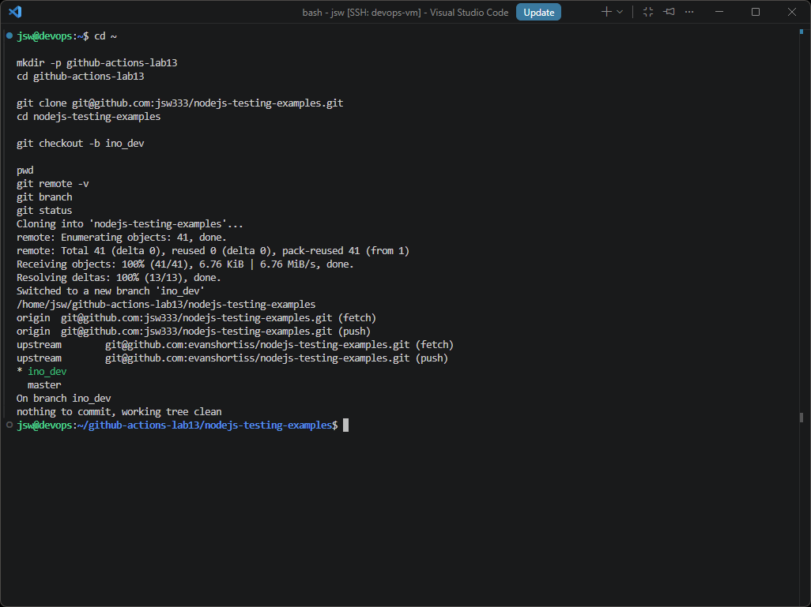
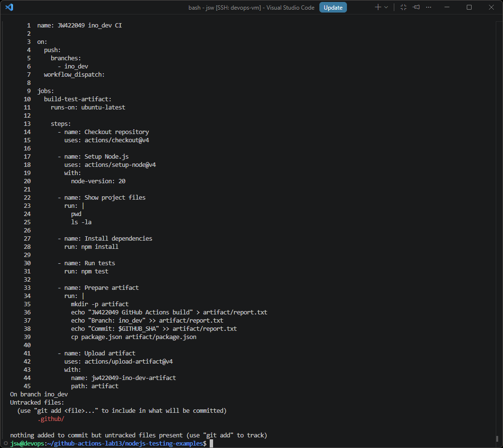
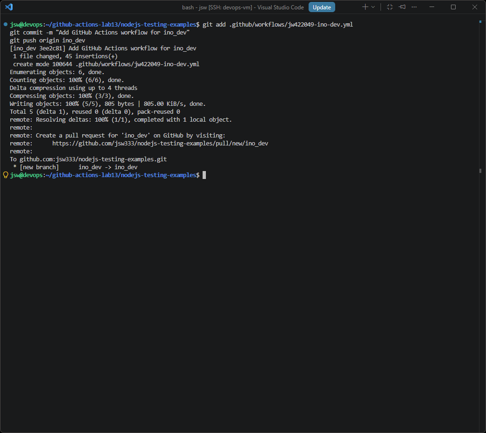
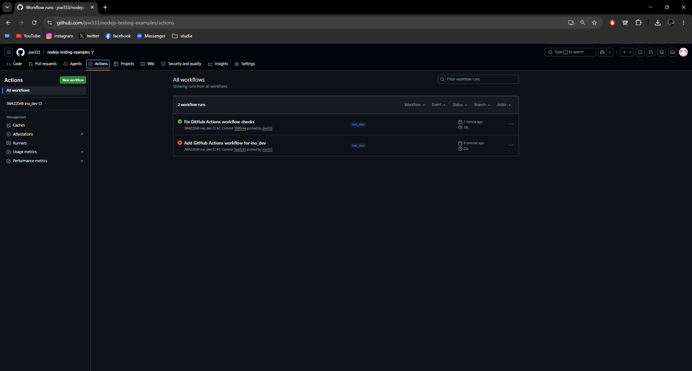
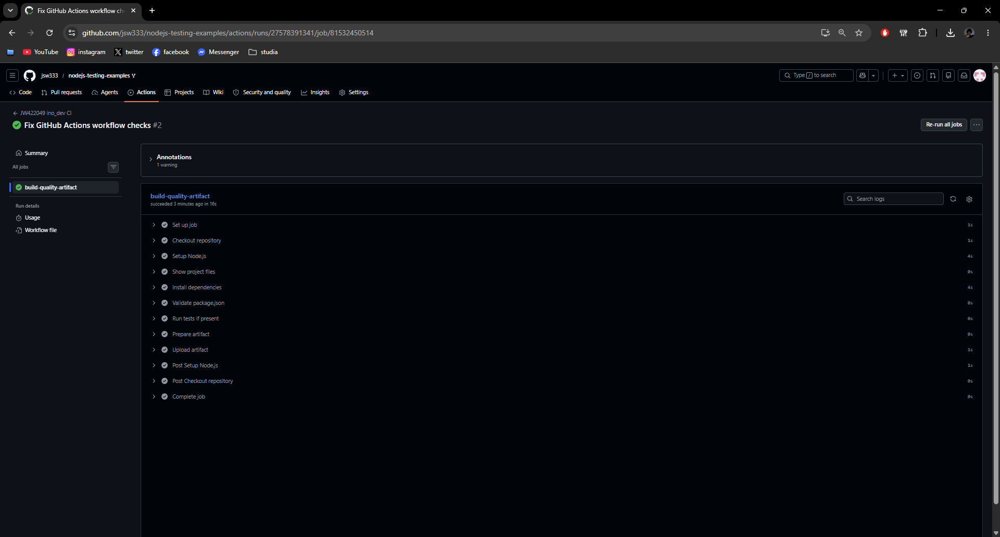
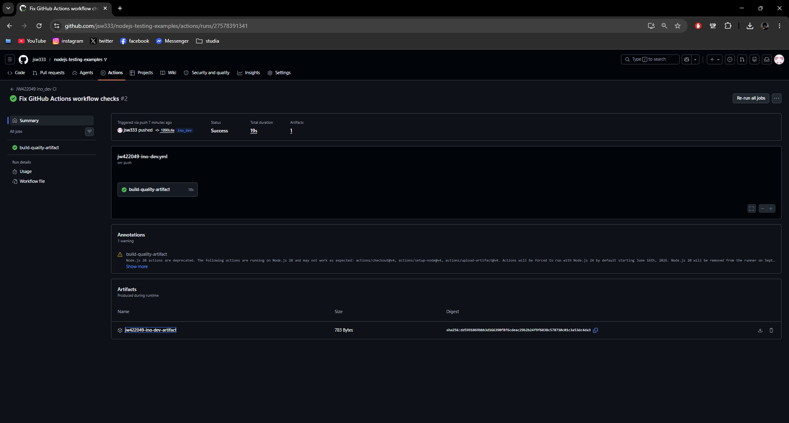
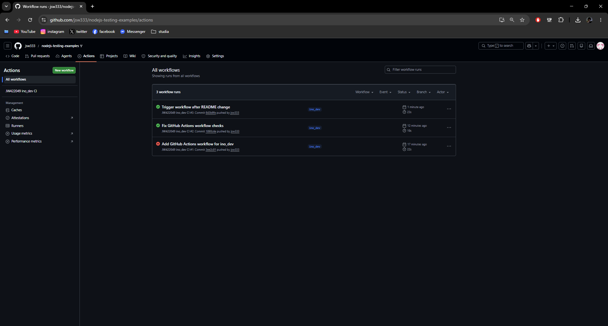

# Sprawozdanie 13 - Shift-left: GitHub Actions

**Jan Wojsznis 422049**

---

## 1. Cel ćwiczenia

Celem ćwiczenia było przygotowanie prostego procesu CI z wykorzystaniem GitHub Actions. Workflow miał zostać wykonany na osobnym forku wybranego repozytorium, działać na dedykowanej gałęzi `ino_dev`, reagować na zmiany wypychane do tej gałęzi oraz wykonywać podstawowe kroki związane ze sprawdzeniem projektu.

Do wykonania zadania wykorzystano repozytorium `nodejs-testing-examples`, które zostało sforkowane na konto GitHub `jsw333`. Dzięki temu konfiguracja GitHub Actions została przygotowana poza głównym repozytorium przedmiotowym i nie wpływała na oryginalny projekt.

---

## 2. Fork repozytorium i przygotowanie gałęzi

Na początku wykonano fork repozytorium `evanshortiss/nodejs-testing-examples` na konto `jsw333`. Następnie repozytorium zostało sklonowane na maszynę `devops` do osobnego katalogu roboczego przeznaczonego na laboratorium GitHub Actions.

Po sklonowaniu repozytorium utworzono nową gałąź `ino_dev`. Na tej gałęzi prowadzono dalsze prace związane z przygotowaniem workflow. Sprawdzono również konfigurację zdalnych repozytoriów. Remote `origin` wskazywał na fork użytkownika `jsw333`, natomiast `upstream` wskazywał na oryginalne repozytorium.

Na screenie widać, że repozytorium zostało poprawnie sklonowane, aktywna była gałąź `ino_dev`, a status repozytorium był czysty.

---

## 3. Przygotowanie workflow GitHub Actions

W kolejnym kroku przygotowano katalog `.github/workflows` oraz plik workflow `jw422049-ino-dev.yml`. Przed dodaniem własnego workflow usunięto ewentualne wcześniejsze workflowy, aby w repozytorium znajdowała się tylko konfiguracja przygotowana na potrzeby ćwiczenia.

Workflow otrzymał nazwę `JW422049 ino_dev CI`. Najważniejszym elementem konfiguracji było ustawienie wyzwalacza `push` tylko dla gałęzi `ino_dev`. Dzięki temu GitHub Actions uruchamia się automatycznie po wypchnięciu zmian do tej konkretnej gałęzi. Dodano również możliwość ręcznego uruchomienia workflow przez `workflow_dispatch`.

Workflow został uruchamiany na runnerze `ubuntu-latest`. W kolejnych krokach pobierał kod repozytorium, przygotowywał środowisko Node.js w wersji 20, pokazywał podstawowe informacje o projekcie, instalował zależności, wykonywał sprawdzenie projektu oraz przygotowywał artefakt. Artefakt był publikowany z użyciem akcji `actions/upload-artifact@v4`.

---

## 4. Commit i push workflow

Po przygotowaniu pliku workflow wykonano commit na gałęzi `ino_dev`, a następnie wypchnięto zmiany do forka na GitHubie. Commit dodał plik `.github/workflows/jw422049-ino-dev.yml`.

Push utworzył zdalną gałąź `ino_dev` w repozytorium `jsw333/nodejs-testing-examples`. Po tej operacji GitHub automatycznie wykrył nowy workflow i uruchomił pierwsze wykonanie akcji.

---

## 5. Pierwsze uruchomienie i poprawka workflow

Po pierwszym pushu workflow uruchomił się automatycznie. Pierwsze wykonanie zakończyło się błędem, ponieważ w projekcie nie było zdefiniowanego skryptu `test` w pliku `package.json`. Błąd pojawił się w kroku odpowiedzialnym za uruchomienie testów.

W związku z tym workflow został poprawiony. Zamiast wymuszać wykonanie testów, zastosowano bezpieczniejszy wariant `npm test --if-present`. Dzięki temu, jeżeli projekt posiada skrypt testowy, zostanie on wykonany, a jeżeli go nie posiada, workflow nie zakończy się błędem. Dodatkowo dodano walidację pliku `package.json`, która sprawdza poprawność struktury pliku konfiguracyjnego projektu.

Po wykonaniu poprawki utworzono kolejny commit `Fix GitHub Actions workflow checks` i ponownie wypchnięto zmiany do gałęzi `ino_dev`. Drugie uruchomienie workflow zakończyło się sukcesem, co było widoczne w zakładce Actions. Na liście workflowów widać również wcześniejsze nieudane uruchomienie, które zostało później poprawione.

---

## 6. Logi poprawnego joba

Po poprawieniu workflow sprawdzono szczegóły poprawnego uruchomienia. Job `build-quality-artifact` zakończył się sukcesem i wszystkie jego kroki zostały wykonane poprawnie.

W jobie widoczne były kroki pobrania repozytorium, przygotowania Node.js, pokazania plików projektu, instalacji zależności, walidacji pliku `package.json`, warunkowego uruchomienia testów, przygotowania artefaktu oraz wysłania artefaktu do GitHub Actions.

Poprawne zakończenie wszystkich kroków potwierdziło, że workflow działa prawidłowo na gałęzi `ino_dev`.

---

## 7. Artefakt workflow

W ramach workflow przygotowano artefakt o nazwie `jw422049-ino-dev-artifact`. Artefakt zawierał prosty raport z wykonania workflow oraz plik `package.json`. Raport zawierał informacje o wykonaniu GitHub Actions, gałęzi `ino_dev`, identyfikatorze commita oraz wersji Node.js.

W widoku Summary dla poprawnego uruchomienia workflow widoczny był status `Success` oraz jeden opublikowany artefakt. Potwierdziło to, że pipeline nie tylko wykonał kroki sprawdzające, ale również zapisał wynik działania jako artefakt.

---

## 8. Automatyczne uruchomienie po kolejnej zmianie

Na końcu sprawdzono, czy workflow uruchamia się automatycznie po kolejnej zmianie w gałęzi `ino_dev`. W tym celu wykonano prostą zmianę w pliku `README.md`, utworzono commit i wypchnięto go do zdalnej gałęzi `ino_dev`.

Po pushu GitHub Actions automatycznie uruchomił kolejny workflow run. Na liście uruchomień widoczne były trzy wykonania: pierwsze nieudane, drugie poprawione i zakończone sukcesem oraz trzecie uruchomione po zmianie w pliku `README.md`. Najnowsze uruchomienie również zakończyło się sukcesem, co potwierdziło poprawne działanie wyzwalacza `push` dla gałęzi `ino_dev`.

---

## 9. Podsumowanie

W ramach ćwiczenia przygotowano własny workflow GitHub Actions dla sforkowanego repozytorium `nodejs-testing-examples`. Prace wykonano na osobnej gałęzi `ino_dev`, zgodnie z założeniem, że konfiguracja pipeline nie powinna być dodawana bezpośrednio do głównego repozytorium przedmiotowego.

Workflow został skonfigurowany tak, aby uruchamiał się automatycznie po zmianach wypychanych do gałęzi `ino_dev`. Wykonywał przygotowanie środowiska Node.js, instalację zależności, walidację pliku `package.json`, warunkowe uruchomienie testów oraz zapisanie artefaktu.

Pierwsze uruchomienie workflow zakończyło się błędem z powodu braku skryptu testowego w projekcie. Po analizie logów workflow został poprawiony i kolejne uruchomienia zakończyły się sukcesem. Dodatkowo wykonano kolejną zmianę w `README.md`, aby potwierdzić automatyczne uruchamianie workflow po pushu do gałęzi `ino_dev`.

Ćwiczenie pokazało podstawowy proces shift-left, czyli przeniesienie kontroli jakości projektu na wcześniejszy etap pracy z kodem. Dzięki GitHub Actions możliwe było automatyczne sprawdzanie zmian już w momencie ich wypchnięcia do repozytorium.