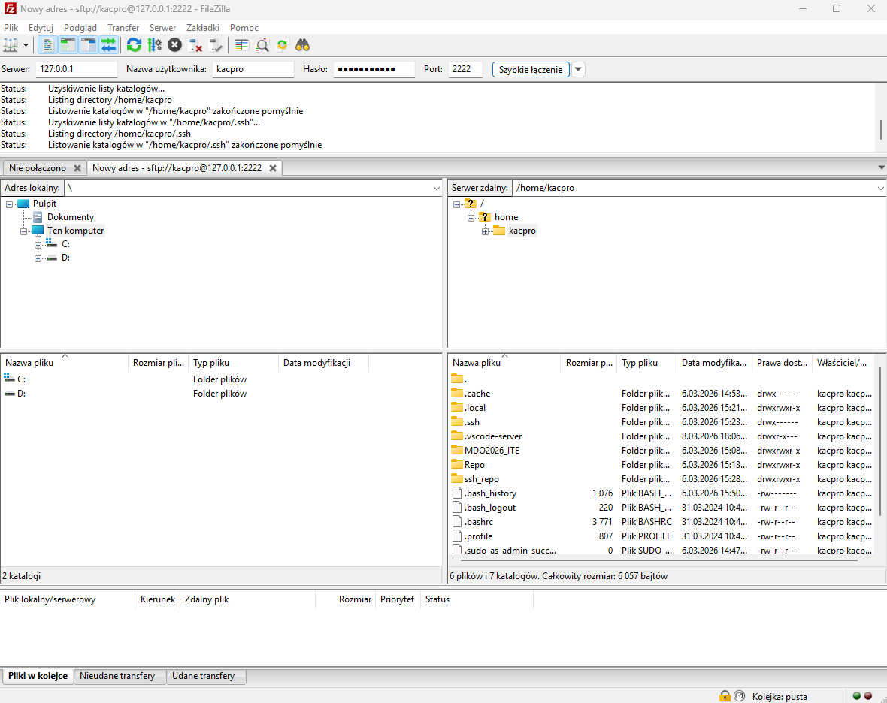
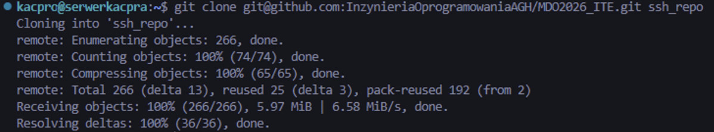
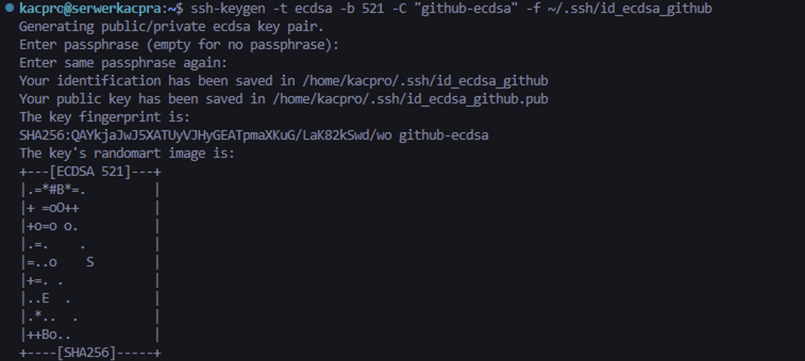
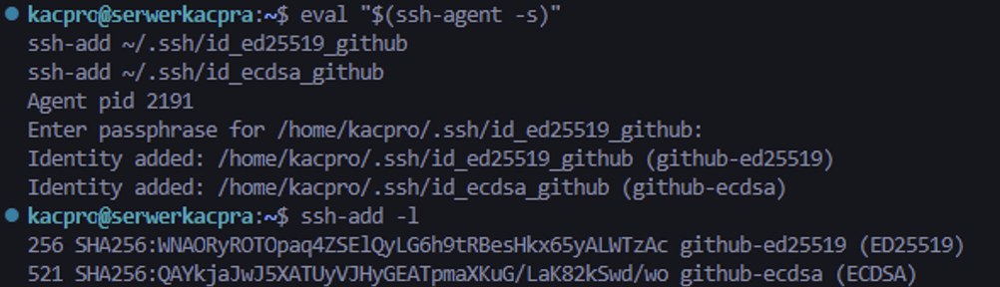
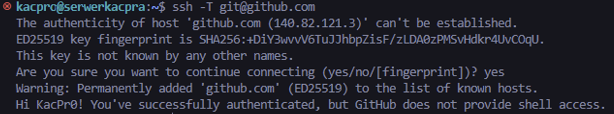
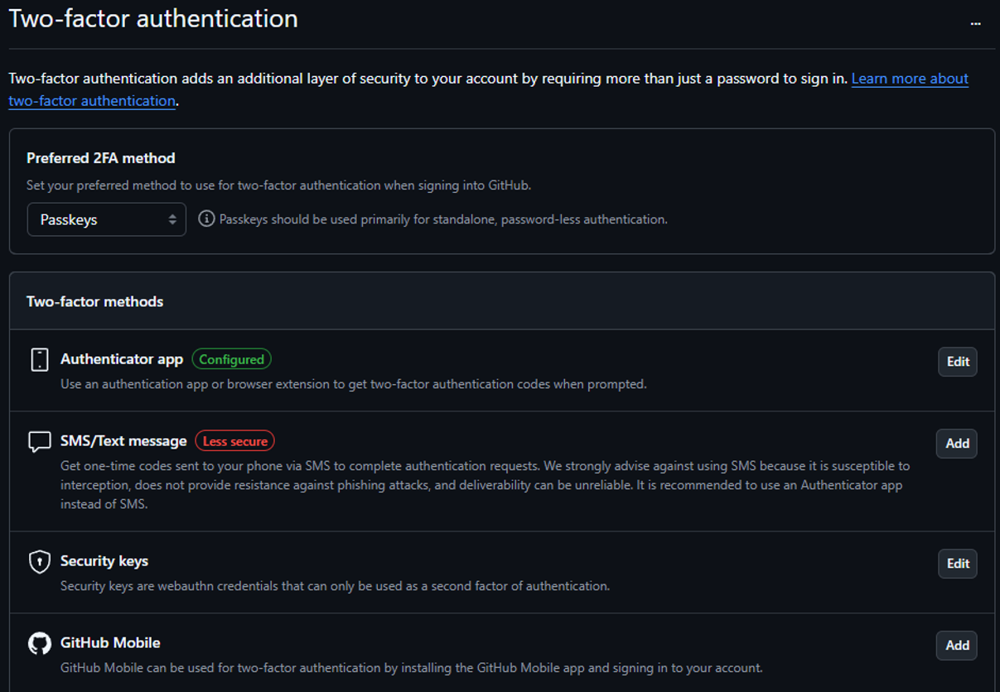
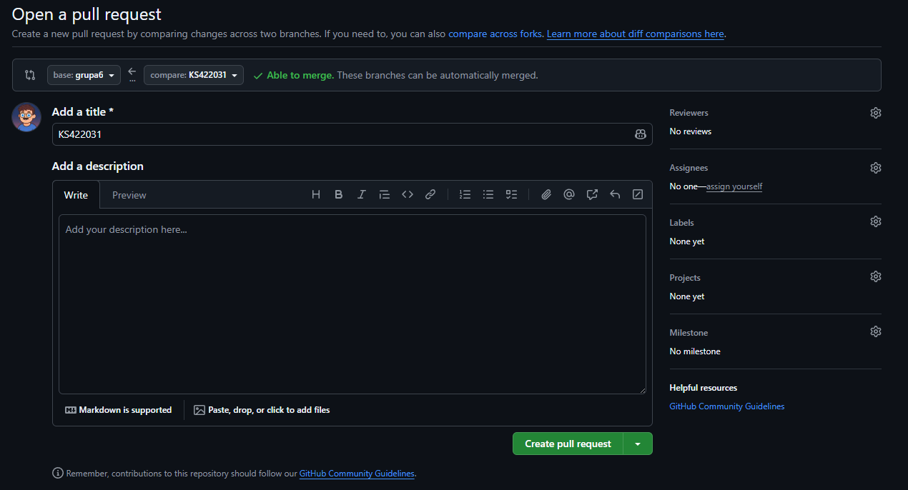
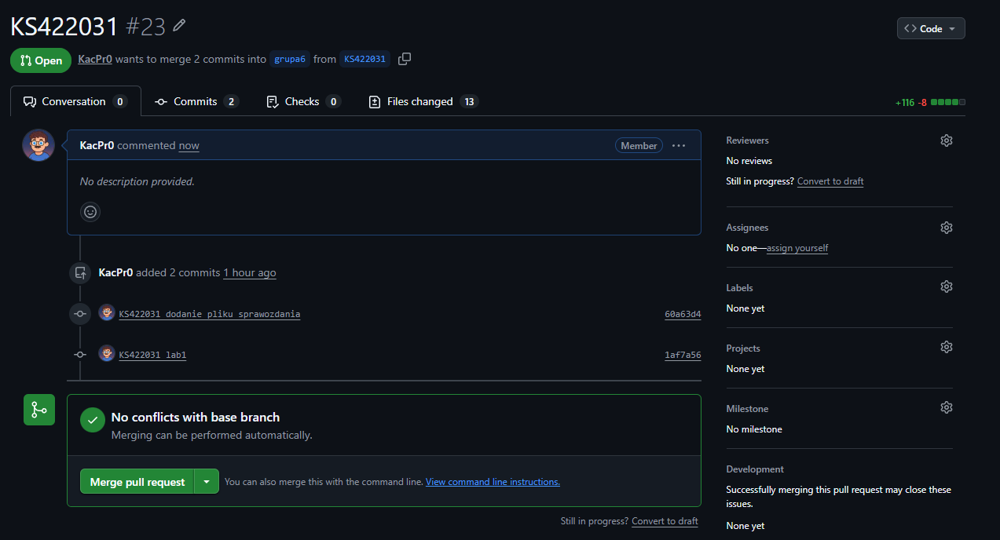

# Sprawozdanie zbiorcze — laboratoria 1–4

**Kacper Szlachta 422031**

## 1. Wstęp

W ramach czterech laboratoriów przygotowano kompletne środowisko pracy do przedmiotu oraz wykonano serię zadań związanych z obsługą repozytorium, konfiguracją bezpiecznego dostępu, konteneryzacją i automatyzacją procesu budowania. Ćwiczenia obejmowały konfigurację *Git* i *SSH*, pracę z gałęziami i *pull requestami*, instalację oraz wykorzystanie środowiska *Docker*, budowanie własnych obrazów, uruchamianie testów w kontenerach, wykorzystanie woluminów do zachowywania stanu, konfigurację komunikacji sieciowej między kontenerami oraz przygotowanie środowiska pod serwer *Jenkins*.

## 2. Zastosowane technologie i ich działanie

### a) *Git*, *SSH* i organizacja pracy z repozytorium (lab1)

W pierwszym laboratorium przygotowano środowisko pracy w *Visual Studio Code* oraz skonfigurowano komunikację z maszyną wirtualną. Do przesyłania plików wykorzystano *SFTP* w programie *FileZilla*, co pozwalało wygodnie kopiować pliki między hostem i środowiskiem linuksowym.

Następnie zainstalowano klienta *Git* oraz przygotowano dwa sposoby dostępu do repozytorium: przez *HTTPS* z użyciem *personal access token* i przez *SSH*. Klonowanie przez *HTTPS* było rozwiązaniem prostym, ale wymagającym tokenu, natomiast klonowanie przez *SSH* pozwalało na wygodniejszą i bardziej zautomatyzowaną pracę z repozytorium.

W ramach konfiguracji *SSH* utworzono dwa klucze inne niż *RSA*: *ed25519* oraz *ecdsa 521*. Następnie uruchomiono *ssh-agent* i dodano do niego przygotowane klucze. Po stronie *GitHub* dodano klucz publiczny i wykonano test połączenia, potwierdzający poprawne uwierzytelnianie.

Dodatkowo wykorzystano wcześniej skonfigurowane uwierzytelnianie dwuskładnikowe *2FA*, co zwiększa bezpieczeństwo pracy z kontem *GitHub*.

W dalszej części laboratorium wykonano operacje związane z organizacją pracy w repozytorium. Przełączono się na odpowiednią gałąź, utworzono własną gałąź roboczą `KS422031`, a następnie przygotowano katalog roboczy użytkownika. Istotnym elementem było także utworzenie lokalnego *git hooka* sprawdzającego poprawność początku komunikatu *commit message*. Hook blokował zatwierdzenie zmian, jeżeli komunikat nie zaczynał się od wymaganego prefiksu.

Przykładowy fragment skryptu:

    case "$FIRST_LINE" in
      "KS422031"*) exit 0 ;;
      *) exit 1 ;;
    esac

Działanie mechanizmu sprawdzono dla niepoprawnego i poprawnego komunikatu. W pierwszym przypadku commit został odrzucony, a w drugim zaakceptowany. Na końcu opublikowano gałąź i przygotowano *pull request* do gałęzi grupowej, po czym zweryfikowano jego poprawny status i brak konfliktów.

### b) *Docker* — obrazy, kontenery i własne środowisko uruchomieniowe (lab2)

Drugie laboratorium dotyczyło instalacji i podstawowej obsługi *Dockera*. W systemie *Ubuntu* skonfigurowano repozytorium pakietów, zainstalowano wymagane komponenty i sprawdzono działanie usługi. Następnie dodano użytkownika do grupy `docker`, dzięki czemu możliwe było wykonywanie poleceń bez użycia `sudo`.

Po przygotowaniu środowiska pobrano zestaw przykładowych obrazów: `hello-world`, `busybox`, `ubuntu`, `fedora`, `mariadb` oraz obrazy platformy *.NET*. Umożliwiło to porównanie lekkich obrazów narzędziowych, pełnych obrazów systemowych oraz gotowych środowisk uruchomieniowych.

Dodatkowo uruchomiono kontener z obrazu `busybox` w trybie interaktywnym i sprawdzono działanie programu wewnątrz kontenera. Następnie uruchomiono kontener z obrazem `ubuntu`, przeanalizowano proces `PID 1` oraz wykonano aktualizację listy pakietów. Po stronie hosta sprawdzono procesy `dockerd` i `containerd`, co pokazało zależność między środowiskiem hosta a uruchomionymi kontenerami.

Istotną częścią laboratorium było przygotowanie własnego pliku `Dockerfile`. Obraz bazował na `ubuntu`, instalował `git`, ustawiał katalog roboczy i klonował repozytorium przedmiotowe. Po zbudowaniu obrazu uruchomiono kontener interaktywnie i zweryfikowano obecność programu `git` oraz poprawne sklonowanie repozytorium.

Przykładowy schemat działania:

    FROM ubuntu
    RUN apt update && apt install -y git
    WORKDIR /opt
    RUN git clone <repozytorium>

Takie rozwiązanie pokazało, że obraz może zawierać nie tylko system bazowy, ale również gotowo przygotowane narzędzia i pliki projektu.

Na końcu wyświetlono listę kontenerów i obrazów, a następnie wykonano czyszczenie zakończonych kontenerów i niepotrzebnych obrazów. Był to ważny element utrzymania porządku w lokalnym środowisku *Docker*.

### c) Budowanie i testowanie projektu w kontenerach (lab3)

Trzecie laboratorium skupiało się na automatyzacji procesu *build/test* dla projektu w języku *C*. Jako przykład wykorzystano publiczne repozytorium `rikusalminen/makefile-for-c`, zawierające plik `Makefile`, strukturę katalogów źródłowych oraz testy jednostkowe. Najpierw sprawdzono strukturę repozytorium i obecność podstawowych plików.

Po sklonowaniu projektu lokalnie wykonano standardowy zestaw poleceń:

    make
    make test
    make clean

Pierwsze polecenie budowało program, drugie uruchamiało testy, a trzecie usuwało artefakty po kompilacji. Taki układ jest typowy dla projektów wykorzystujących *Makefile* i pozwala jednoznacznie rozdzielić etap kompilacji, testowania i sprzątania.

Następnie ten sam proces przeniesiono do kontenera opartego na `ubuntu`. Wewnątrz kontenera zainstalowano `build-essential`, `make` i `git`, a następnie ponownie sklonowano repozytorium i wykonano `make`, `make test` oraz `make clean`. Dzięki temu potwierdzono, że proces budowania może być realizowany w odizolowanym i powtarzalnym środowisku niezależnie od konfiguracji hosta.

Kolejnym krokiem było przygotowanie dwóch osobnych plików: `Dockerfile.build` oraz `Dockerfile.test`. W pierwszym z nich zdefiniowano środowisko potrzebne do pobrania repozytorium i zbudowania projektu, natomiast drugi bazował na wcześniejszym obrazie i uruchamiał testy bez ponownego kompilowania. Rozdzielenie tych etapów pozwala uprościć organizację pracy i lepiej kontrolować odpowiedzialność poszczególnych obrazów.

W dalszej części przygotowano plik `docker-compose.yml`, w którym zdefiniowano dwie usługi: `builder` i `tester`. Usługa testująca zależała od usługi budującej, dzięki czemu można było potraktować całość jako prosty pipeline wykonywany w ramach jednej kompozycji. Następnie zbudowano kompozycję i uruchomiono odpowiednie usługi.

W laboratorium bardzo wyraźnie widoczna była różnica między *obrazem* a *kontenerem*. *Obraz* stanowi statyczny opis środowiska i zawiera system bazowy, zależności oraz pliki projektu. *Kontener* jest natomiast uruchomioną instancją obrazu, w której wykonywany jest konkretny proces, np. kompilacja, test lub powłoka interaktywna.

### d) Woluminy, sieć, usługi i przygotowanie środowiska *Jenkins* (lab4)

Czwarte laboratorium rozszerzało poprzednie zagadnienia o trwałość danych, komunikację sieciową i usługi. W pierwszej części wykorzystano woluminy *Docker* do zachowywania stanu pomiędzy kontenerami. Utworzono woluminy `proj_in` i `proj_out`, które służyły odpowiednio do przechowywania kodu źródłowego i wyników budowania.

W pierwszym wariancie uruchomiono kontener pomocniczy `helper`, do którego podłączono oba woluminy. W kontenerze zainstalowano `git`, a następnie sklonowano repozytorium do katalogu `/input`, czyli na wolumin wejściowy. Potem uruchomiono osobny kontener `builder_nogit`, w którym wykonano `make`, `make test` i skopiowano plik wynikowy `foo-test` do katalogu `/output`. Takie podejście pokazało rozdzielenie etapu pobierania kodu od etapu budowania.

W drugim wariancie utworzono osobny zestaw woluminów `proj_in_git` i `proj_out_git`, a następnie wykonano cały proces wewnątrz jednego kontenera, łącznie z klonowaniem repozytorium. Po zakończeniu działania kontenera sprawdzono zawartość obu woluminów, potwierdzając, że kod źródłowy i artefakty pozostały dostępne mimo zakończenia pracy kontenera.

W kolejnej części laboratorium zbadano komunikację sieciową między kontenerami przy pomocy `iperf3`. Najpierw uruchomiono serwer i klienta w osobnych kontenerach, sprawdzono ich adresy IP i wykonano test połączenia bezpośrednio po adresie.

Następnie utworzono własną sieć mostkową `mybridge` i uruchomiono nowe kontenery w jej obrębie. W tej konfiguracji możliwe było połączenie po nazwie kontenera, np. `iperf3 -c iperf_server2`, bez potrzeby ręcznego ustalania adresu IP. To pokazuje praktyczną zaletę własnych sieci *Docker*, w których działa prosty mechanizm rozwiązywania nazw.

Dodatkowo opublikowano port usługi na hosta, co pozwoliło połączyć się z serwerem zarówno przez `127.0.0.1`, jak i przez adres maszyny wirtualnej. W ten sposób pokazano różnicę między komunikacją wewnętrzną w sieci kontenerowej a ekspozycją portu na zewnątrz.

W dalszej części uruchomiono usługę `sshd` wewnątrz kontenera `ubuntu`. Skonfigurowano logowanie użytkownika `root`, włączono uwierzytelnianie hasłem i wystawiono port `2223` na hosta. Następnie wykonano połączenie przez *SSH* z hosta do kontenera. Takie rozwiązanie może ułatwiać administrację i diagnostykę, ale jednocześnie zwiększa złożoność obrazu oraz powierzchnię ataku, dlatego nie jest standardowo wymagane w typowych kontenerach aplikacyjnych.

Ostatnia część laboratorium dotyczyła przygotowania środowiska pod serwer *Jenkins*. Utworzono dedykowaną sieć `jenkins`, następnie uruchomiono kontener `jenkins-dind` oparty o obraz `docker:dind` oraz kontener kontrolera `jenkins-blueocean` oparty o `jenkins/jenkins:lts-jdk17`. Zastosowano osobne woluminy dla danych i certyfikatów oraz skonfigurowano środowisko tak, aby *Jenkins* mógł korzystać z *Dockera* dostępnego w sąsiednim kontenerze. Po uruchomieniu otwarto interfejs WWW i potwierdzono poprawny start instancji.

## 3. Wnioski

Cztery laboratoria tworzyły logicznie powiązany ciąg ćwiczeń pokazujących współczesny sposób organizacji środowiska programistycznego. W pierwszym etapie kluczowe było poprawne przygotowanie dostępu do repozytorium i bezpiecznego uwierzytelniania przy pomocy *SSH* oraz *2FA*. Następnie przejście do *Dockera* pokazało, że środowisko uruchomieniowe może być odseparowane od hosta, łatwe do odtworzenia i wygodne w zarządzaniu.

Szczególnie istotne było przeniesienie procesu *build/test* do kontenerów, ponieważ pozwoliło to wykonywać kompilację i testy w kontrolowanym środowisku bez zależności od lokalnej konfiguracji systemu. Rozdzielenie ról pomiędzy obrazy, wykorzystanie `Dockerfile.build`, `Dockerfile.test` oraz `docker compose` pokazało podstawy automatyzacji zadań, które w praktyce są rozwijane w systemach *CI/CD*.

Wykorzystanie woluminów i sieci kontenerowych pokazało, że kontenery nie służą wyłącznie do jednorazowego uruchamiania procesów, ale mogą także współdzielić dane, komunikować się między sobą i udostępniać usługi na zewnątrz. Ostatni etap z przygotowaniem środowiska *Jenkins* stanowił naturalne domknięcie całości, ponieważ łączył wcześniejsze zagadnienia: konteneryzację, sieci, trwałe dane i automatyzację procesów budowania. Całość potwierdziła, że konteneryzacja upraszcza organizację pracy, zwiększa powtarzalność środowiska i dobrze wspiera proces tworzenia oraz testowania oprogramowania.