# Sprawozdanie - Lab 10

**Kacper Szlachta 422031**

---

## 1. Cel ćwiczenia

Celem ćwiczenia było przygotowanie lokalnego klastra *Kubernetes* z wykorzystaniem narzędzia *minikube*, uruchomienie aplikacji kontenerowej na klastrze, sprawdzenie działania poda, przygotowanie wdrożenia w postaci pliku *YAML* oraz wystawienie aplikacji przez *Service*. W ramach zadania wykorzystano obraz *nginx* z własnym plikiem `index.html`, dzięki czemu kontener udostępniał prostą funkcjonalność przez sieć.

---

## 2. Instalacja i uruchomienie klastra Kubernetes

### 2.1. Instalacja minikube

Na początku pobrano binarkę *minikube* i zainstalowano ją w systemie jako polecenie dostępne globalnie.

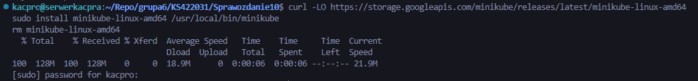

Do instalacji użyto poleceń:

```bash
curl -LO https://storage.googleapis.com/minikube/releases/latest/minikube-linux-amd64
sudo install minikube-linux-amd64 /usr/local/bin/minikube
rm minikube-linux-amd64
```

Następnie uruchomiono klaster z użyciem sterownika *Docker*. Pierwsza próba uruchomienia klastra z większą ilością pamięci nie powiodła się ze względu na ograniczenia zasobów maszyny wirtualnej. Problem rozwiązano przez zmniejszenie przydziału pamięci dla klastra do `3072 MB`. Dodatkowo rozszerzono dysk maszyny wirtualnej oraz wolumen LVM, ponieważ początkowa ilość wolnego miejsca była niewystarczająca do pracy z obrazami kontenerowymi i *minikube*.

```bash
minikube start --driver=docker --memory=3072 --cpus=2
```

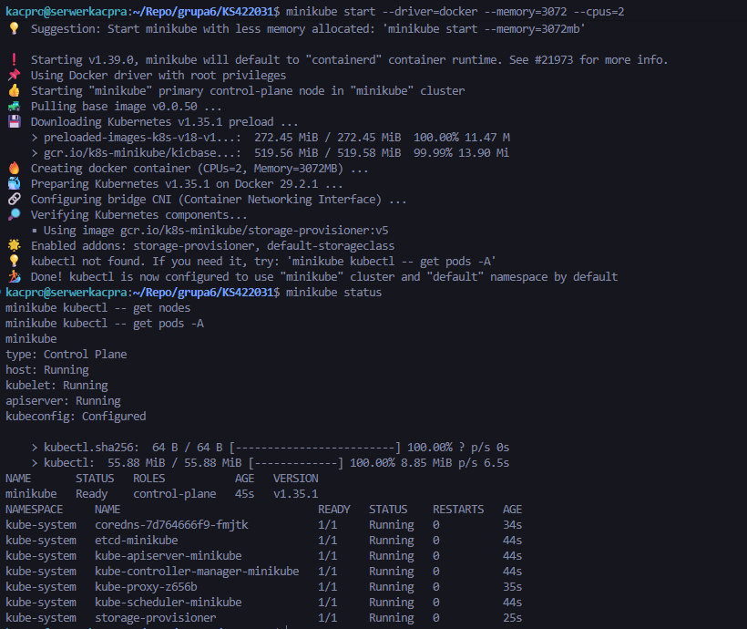

Po starcie klastra sprawdzono jego stan oraz działające komponenty systemowe.

```bash
minikube status
minikube kubectl -- get nodes
minikube kubectl -- get pods -A
```

Na ekranie widoczny był node `minikube` w stanie `Ready` oraz podstawowe komponenty klastra w przestrzeni nazw `kube-system`, między innymi `coredns`, `etcd-minikube`, `kube-apiserver-minikube`, `kube-controller-manager-minikube`, `kube-proxy`, `kube-scheduler` i `storage-provisioner`.

---

### 2.2. Alias dla kubectl w wariancie minikube

Do obsługi klastra wykorzystano polecenie `kubectl` dostarczone przez *minikube*. Dodatkowo przygotowano alias `minikubectl`, aby uprościć wykonywanie poleceń.

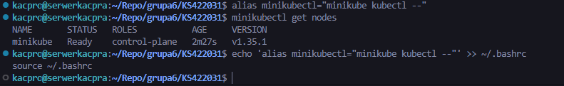

```bash
alias minikubectl="minikube kubectl --"
minikubectl get nodes
echo 'alias minikubectl="minikube kubectl --"' >> ~/.bashrc
source ~/.bashrc
```

Alias pozwala wywoływać komendy *Kubernetes* krócej, bez konieczności każdorazowego wpisywania pełnego polecenia `minikube kubectl --`.

---

### 2.3. Sprawdzenie kontekstu i poziomu bezpieczeństwa

Po uruchomieniu klastra sprawdzono aktualny kontekst *Kubernetes* oraz konfigurację dostępu do klastra. Kontekst wskazywał na lokalny klaster `minikube`.

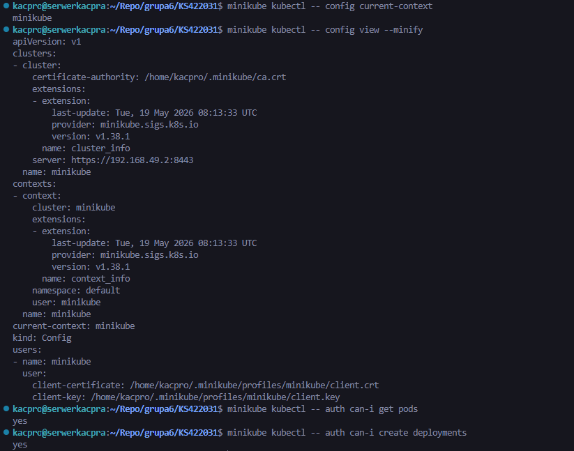

```bash
minikube kubectl -- config current-context
minikube kubectl -- config view --minify
```

Sprawdzono również uprawnienia aktualnego użytkownika względem podstawowych operacji w klastrze.

```bash
minikube kubectl -- auth can-i get pods
minikube kubectl -- auth can-i create deployments
```

Wynik `yes` dla operacji `get pods` oraz `create deployments` potwierdził, że bieżący użytkownik posiada uprawnienia wymagane do wykonania dalszej części ćwiczenia. Konfiguracja klastra opierała się na lokalnym pliku `kubeconfig` oraz certyfikatach wygenerowanych przez *minikube*. Klaster działał lokalnie, w odizolowanym środowisku maszyny wirtualnej.

---

### 2.4. Dashboard Kubernetes

Następnie uruchomiono *Kubernetes Dashboard*.

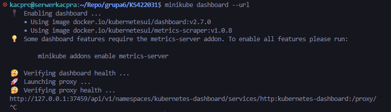

```bash
minikube dashboard --url
```

Dashboard został otwarty w przeglądarce. Widoczne były podstawowe zasoby klastra oraz status workloadów.


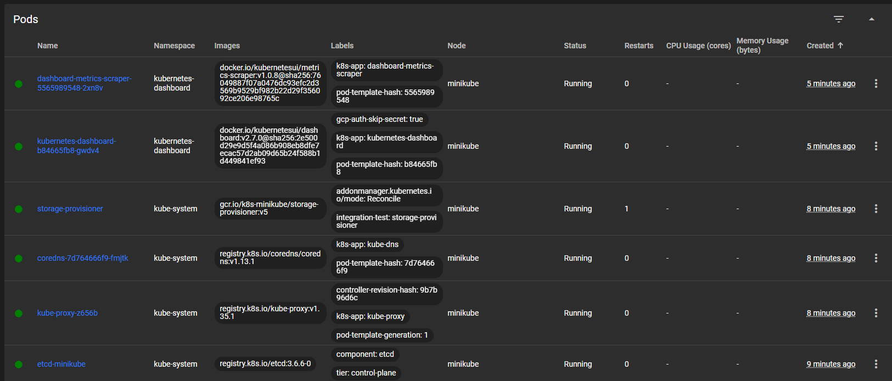

Na ekranach Dashboardu widoczne były działające pody systemowe oraz node `minikube`, co potwierdziło poprawną łączność z klastrem przez interfejs graficzny.

---

## 3. Przygotowanie obrazu Docker z aplikacją

### 3.1. Pliki aplikacji

Jako aplikację wykorzystano *nginx* z własnym plikiem `index.html`. Utworzono katalog `app` oraz plik `Dockerfile`.

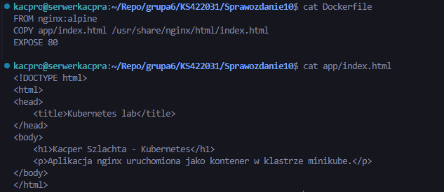

Plik `Dockerfile`:

```dockerfile
FROM nginx:alpine
COPY app/index.html /usr/share/nginx/html/index.html
EXPOSE 80
```

Plik `app/index.html`:

```html
<!DOCTYPE html>
<html>
<head>
    <title>Kubernetes lab</title>
</head>
<body>
    <h1>Kacper Szlachta - Kubernetes</h1>
    <p>Aplikacja nginx uruchomiona jako kontener w klastrze minikube.</p>
</body>
</html>
```

Zastosowanie *nginx* pozwoliło przygotować kontener, który pracuje w trybie ciągłym i udostępnia funkcjonalność przez port `80`. Dzięki temu aplikacja nadaje się do uruchomienia w klastrze *Kubernetes* oraz do testowania przez `curl` i przeglądarkę.

---

### 3.2. Budowanie obrazu w środowisku minikube

Obraz zbudowano po przełączeniu klienta *Docker* na środowisko używane przez *minikube*. Dzięki temu obraz był dostępny bezpośrednio dla klastra i nie trzeba było wypychać go do zewnętrznego rejestru.

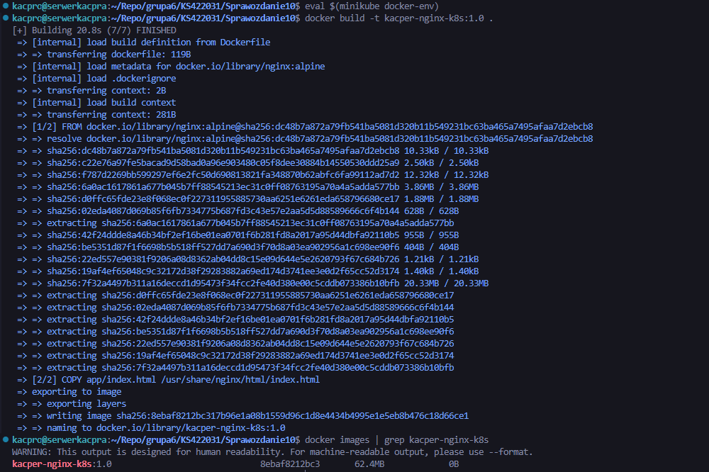

```bash
eval $(minikube docker-env)
docker build -t kacper-nginx-k8s:1.0 .
docker images | grep kacper-nginx-k8s
```

Wynik polecenia `docker images` potwierdził obecność obrazu `kacper-nginx-k8s:1.0`.

---

## 4. Ręczne uruchomienie aplikacji jako pod

Kontener uruchomiono ręcznie w klastrze *Kubernetes* za pomocą polecenia `run`. W tym wariancie Kubernetes automatycznie utworzył pojedynczy *Pod* zawierający kontener z aplikacją.

```bash
minikube kubectl -- run kacper-nginx-pod --image=kacper-nginx-k8s:1.0 --port=80 --labels app=kacper-nginx-pod --image-pull-policy=Never
```

Stan poda sprawdzono poleceniami:

```bash
minikube kubectl -- get pods
minikube kubectl -- describe pod kacper-nginx-pod
```

Następnie wykonano przekierowanie portu z poda na port lokalny `8081`.

```bash
minikube kubectl -- port-forward pod/kacper-nginx-pod 8081:80
```

Połączenie z aplikacją sprawdzono poleceniem:

```bash
curl http://127.0.0.1:8081
```

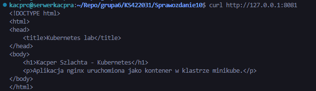

Otrzymanie kodu HTML strony potwierdziło komunikację z funkcjonalnością wystawioną przez kontener działający w *Kubernetesie*. Widoczny był własny plik `index.html` z nagłówkiem `Kacper Szlachta - Kubernetes`.

Aplikację otwarto również w przeglądarce przez port `8081`.

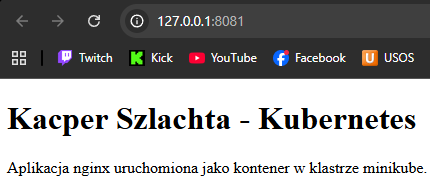

Po zakończeniu testu ręcznie utworzony pod został usunięty, aby dalsze wdrożenie wykonać już w sposób deklaratywny przez plik *YAML*.

---

## 5. Deployment zapisany jako plik YAML

### 5.1. Plik deployment.yml

Manualne wdrożenie zostało zastąpione plikiem `deployment.yml`. *Deployment* opisuje oczekiwany stan aplikacji, obraz kontenera, etykiety oraz liczbę replik.


Plik `deployment.yml`:

```yaml
apiVersion: apps/v1
kind: Deployment
metadata:
  name: kacper-nginx-deployment
spec:
  replicas: 4
  selector:
    matchLabels:
      app: kacper-nginx
  template:
    metadata:
      labels:
        app: kacper-nginx
    spec:
      containers:
        - name: kacper-nginx
          image: kacper-nginx-k8s:1.0
          imagePullPolicy: Never
          ports:
            - containerPort: 80
```

W pliku ustawiono `replicas: 4`, co oznacza, że *Kubernetes* powinien utrzymywać cztery działające instancje aplikacji.

---

### 5.2. Uruchomienie deploymentu

Deployment wdrożono poleceniem `kubectl apply`.

```bash
minikube kubectl -- apply -f deployment.yml
```

Następnie sprawdzono stan deploymentu, podów oraz procesu rollout.

```bash
minikube kubectl -- get deployments
minikube kubectl -- get pods -l app=kacper-nginx
minikube kubectl -- rollout status deployment/kacper-nginx-deployment
```

Wynik pokazał cztery pody w stanie `Running`, a polecenie `rollout status` zakończyło się komunikatem o poprawnym wdrożeniu.

---

### 5.3. Widok deploymentu w Dashboardzie

Po odświeżeniu Dashboardu widoczny był deployment `kacper-nginx-deployment`, cztery działające pody oraz *ReplicaSet* utrzymujący wymaganą liczbę replik.

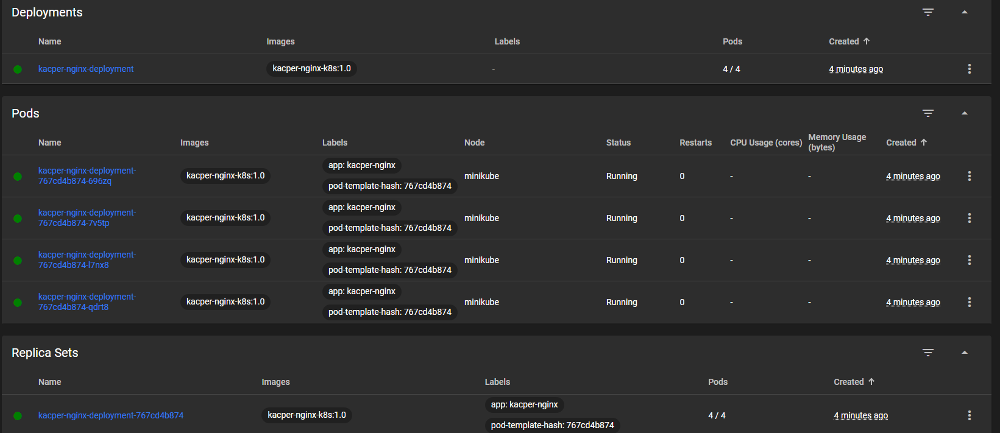

Widok Dashboardu potwierdził, że wdrożenie działa również z poziomu interfejsu graficznego. Deployment posiadał status `4/4`, a wszystkie pody były w stanie `Running`.

---

## 6. Wystawienie aplikacji przez Service

### 6.1. Plik service.yml

W celu udostępnienia deploymentu przygotowano plik `service.yml`. *Service* wybiera pody po etykiecie `app: kacper-nginx` i przekierowuje ruch na port `80` kontenerów.

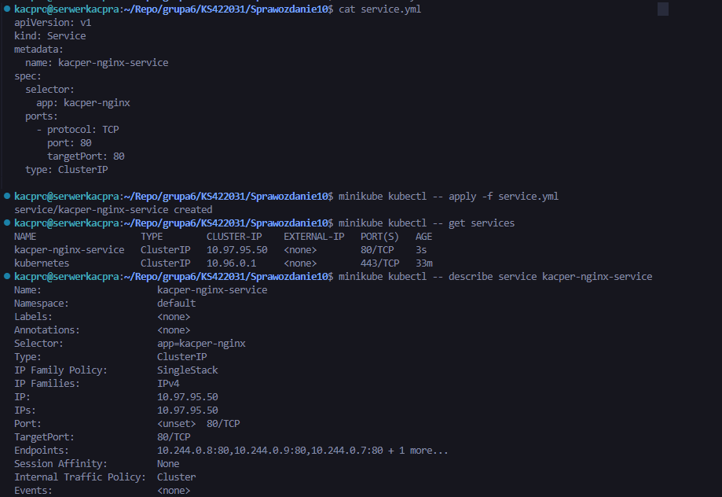

Plik `service.yml`:

```yaml
apiVersion: v1
kind: Service
metadata:
  name: kacper-nginx-service
spec:
  selector:
    app: kacper-nginx
  ports:
    - protocol: TCP
      port: 80
      targetPort: 80
  type: ClusterIP
```

Typ `ClusterIP` oznacza, że usługa jest dostępna wewnątrz klastra. Do testu lokalnego wykorzystano `port-forward`.

---

### 6.2. Wdrożenie Service

Service wdrożono poleceniem:

```bash
minikube kubectl -- apply -f service.yml
```

Następnie sprawdzono listę usług oraz szczegóły utworzonego serwisu.

```bash
minikube kubectl -- get services
minikube kubectl -- describe service kacper-nginx-service
```

W opisie serwisu widoczne były endpointy odpowiadające podom deploymentu, co potwierdziło poprawne połączenie usługi z replikami aplikacji.

---

### 6.3. Przekierowanie portu do Service

Aby uzyskać dostęp do aplikacji przez *Service*, wykonano przekierowanie portu lokalnego `8091` do portu `80` serwisu.

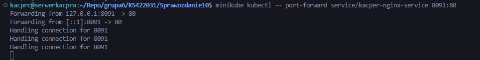

```bash
minikube kubectl -- port-forward service/kacper-nginx-service 8091:80
```

Połączenie z serwisem sprawdzono przez `curl`, korzystając z portu lokalnego `8091`.

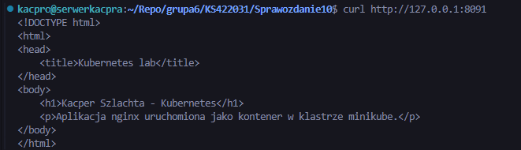

```bash
curl http://127.0.0.1:8091
```

Otrzymano odpowiedź HTML z aplikacji, co potwierdziło, że ruch przechodzi przez *Service* do jednego z podów należących do deploymentu.

---

## 7. Końcowy stan klastra

Na końcu sprawdzono pełny stan zasobów w klastrze.

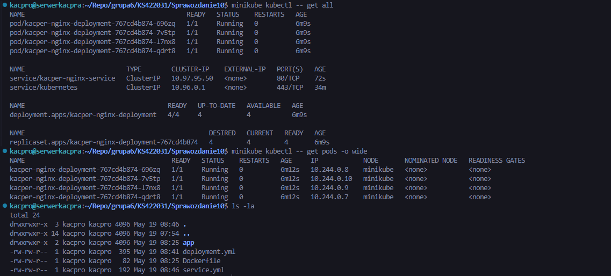

```bash
minikube kubectl -- get all
minikube kubectl -- get pods -o wide
ls -la
```

Wynik `get all` pokazał cztery pody aplikacji `kacper-nginx-deployment`, service `kacper-nginx-service`, deployment `kacper-nginx-deployment` oraz replicaset utrzymujący cztery repliki.

