# Sprawozdanie - Kubernetes (2)

**Kacper Szlachta 422031**

---

## 1. Cel ćwiczenia

Celem ćwiczenia było wykonanie aktualizacji wdrożenia w *Kubernetes* z użyciem kilku wersji własnego obrazu kontenera, sprawdzenie działania mechanizmu *rollout*, obsługa błędnej wersji obrazu oraz porównanie strategii wdrażania: *Recreate*, *RollingUpdate* i *Canary Deployment*. Ćwiczenie wykonano w środowisku lokalnym opartym o *Minikube*, *Docker* oraz narzędzie *kubectl*.

---

## 2. Przygotowanie obrazów kontenerów

Na początku przygotowano trzy wersje własnego obrazu bazującego na *nginx:alpine*. Dwie wersje były poprawne, natomiast trzecia została przygotowana celowo jako wadliwa, aby jej uruchomienie kończyło się błędem.

Dla wersji poprawnych przygotowano osobne katalogi *image-v1* oraz *image-v2*, w których znajdował się plik *Dockerfile* oraz własny plik *index.html*. Oba obrazy korzystały z bazowego obrazu *nginx:alpine*, ale zawierały inną treść strony. Dodatkowo przygotowano katalog *image-bad* z wadliwym obrazem, którego kontener kończył działanie błędem.

Zawartość plików oraz lista zbudowanych obrazów zostały sprawdzone poleceniami:

    cat image-v1/Dockerfile
    cat image-v1/index.html
    cat image-v2/Dockerfile
    cat image-v2/index.html
    cat image-bad/Dockerfile
    docker images | grep kacper-nginx-k8s

W wyniku utworzono trzy obrazy:

    kacper-nginx-k8s:1.1
    kacper-nginx-k8s:1.2
    kacper-nginx-k8s:bad

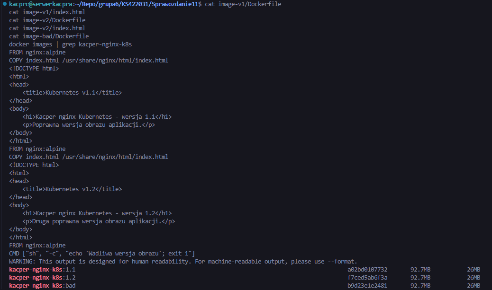

Następnie obrazy zostały załadowane do środowiska *Minikube*, aby mogły być używane przez lokalny klaster *Kubernetes*.

    minikube image load kacper-nginx-k8s:1.1
    minikube image load kacper-nginx-k8s:1.2
    minikube image load kacper-nginx-k8s:bad
    minikube image ls | grep kacper-nginx-k8s

Sprawdzenie listy obrazów potwierdziło dostępność wersji *1.0*, *1.1*, *1.2* oraz *bad*.

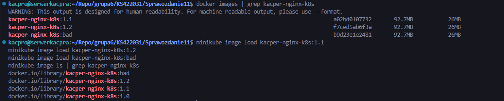

---

## 3. Skalowanie wdrożenia

Początkowe wdrożenie działało jako *kacper-nginx-deployment*, a serwis jako *kacper-nginx-service*. Deployment korzystał z obrazu *kacper-nginx-k8s:1.0*.

Najpierw wykonano zwiększenie liczby replik do 8.

    kubectl scale deployment kacper-nginx-deployment --replicas=8
    kubectl get deployment,pods -o wide

Po wykonaniu komendy Kubernetes utworzył dodatkowe pody, aby osiągnąć wymaganą liczbę replik.

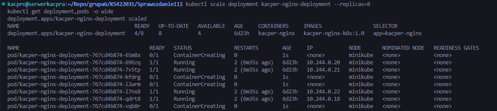

Następnie zmniejszono liczbę replik do 1.

    kubectl scale deployment kacper-nginx-deployment --replicas=1
    kubectl get deployment,pods -o wide

Wynik pokazał usuwanie nadmiarowych podów i pozostawienie jednej aktywnej repliki.

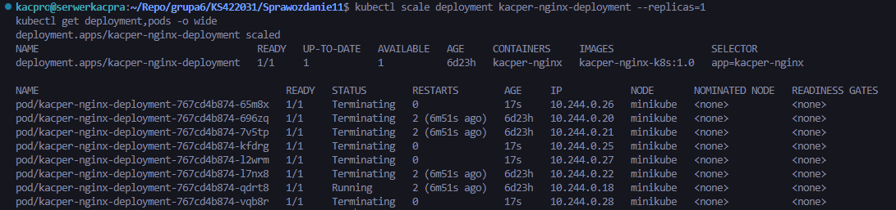

Kolejnym krokiem było zmniejszenie liczby replik do 0.

    kubectl scale deployment kacper-nginx-deployment --replicas=0
    kubectl get deployment,pods -o wide

W tym stanie deployment nadal istniał, ale nie utrzymywał żadnego działającego poda.

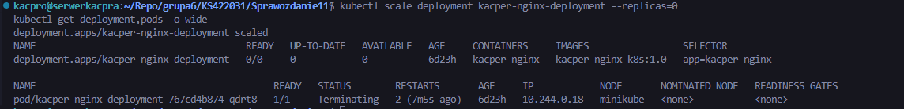

Na końcu ponownie zwiększono liczbę replik do 4.

    kubectl scale deployment kacper-nginx-deployment --replicas=4
    kubectl get deployment,pods -o wide

Kubernetes utworzył nowe pody, a deployment wrócił do działania z czterema replikami.

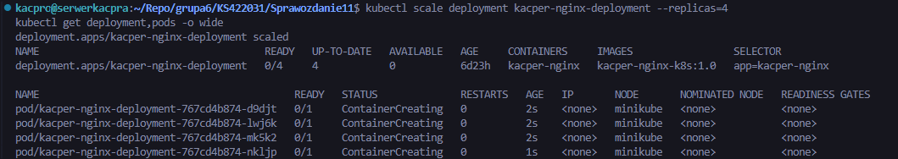

Stan po skalowaniu zapisano do pliku *deployment-after-scaling.yaml*.

    kubectl get deployment kacper-nginx-deployment -o yaml > deployment-after-scaling.yaml
    ls -la

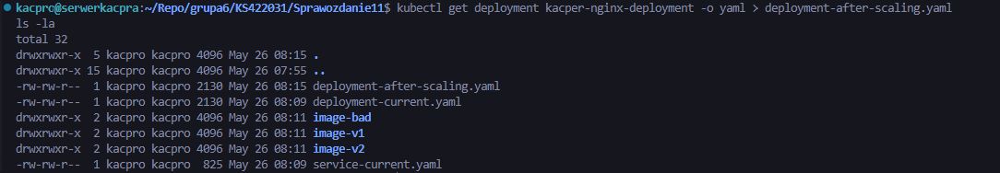

---

## 4. Aktualizacja wersji obrazu

W kolejnym etapie zastosowano nową wersję obrazu *1.1*. Aktualizację wykonano przez zmianę obrazu w istniejącym deploymencie, a następnie sprawdzono status wdrożenia i historię rewizji.

    kubectl set image deployment/kacper-nginx-deployment kacper-nginx=kacper-nginx-k8s:1.1
    kubectl rollout status deployment/kacper-nginx-deployment --timeout=60s
    kubectl get deployment,pods -o wide
    kubectl rollout history deployment/kacper-nginx-deployment

Deployment został poprawnie zaktualizowany. W historii wdrożenia pojawiła się kolejna rewizja, a pody zaczęły korzystać z obrazu *kacper-nginx-k8s:1.1*.

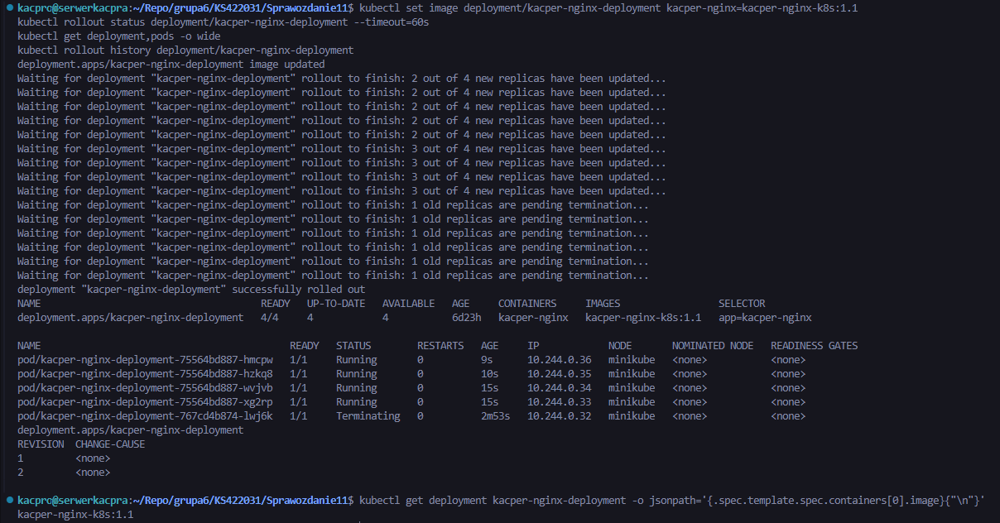

Następnie zastosowano starszą wersję obrazu *1.0*.

    kubectl set image deployment/kacper-nginx-deployment kacper-nginx=kacper-nginx-k8s:1.0
    kubectl rollout status deployment/kacper-nginx-deployment --timeout=60s
    kubectl get deployment,pods -o wide
    kubectl rollout history deployment/kacper-nginx-deployment

Aktualizacja również zakończyła się poprawnie. Kubernetes wymienił pody na wersję korzystającą ze starszego obrazu.

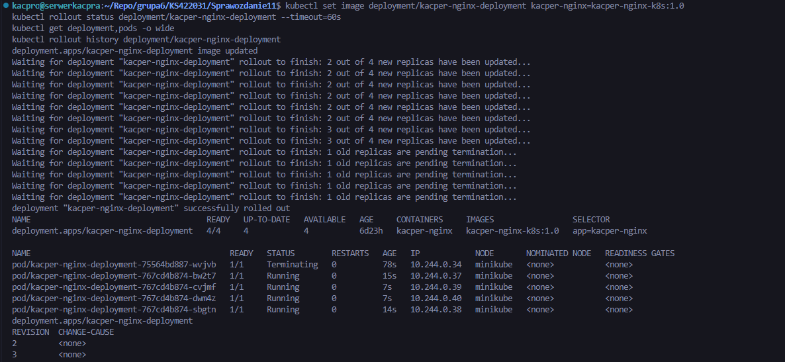

Później zastosowano wersję *1.2*.

    kubectl set image deployment/kacper-nginx-deployment kacper-nginx=kacper-nginx-k8s:1.2
    kubectl rollout status deployment/kacper-nginx-deployment --timeout=60s
    kubectl get deployment,pods -o wide
    kubectl rollout history deployment/kacper-nginx-deployment

Deployment został poprawnie wdrożony, a wszystkie repliki działały z obrazem *kacper-nginx-k8s:1.2*.

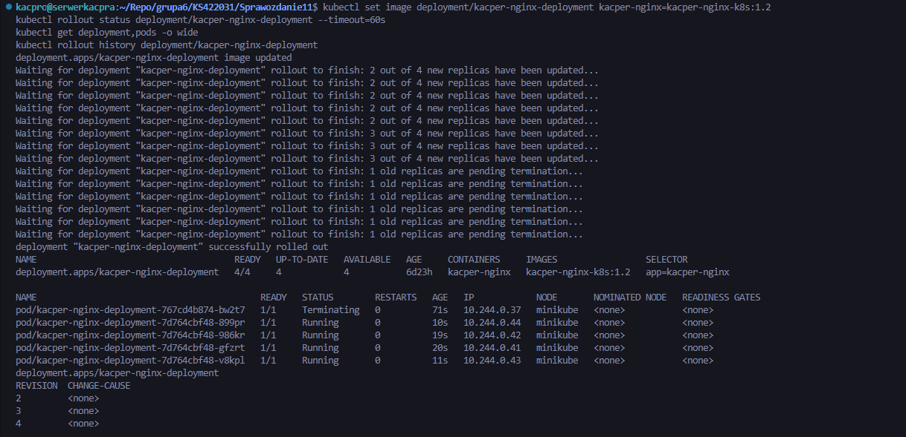

---

## 5. Wdrożenie wadliwego obrazu i analiza błędu

Następnie zastosowano wadliwy obraz *kacper-nginx-k8s:bad*.

    kubectl set image deployment/kacper-nginx-deployment kacper-nginx=kacper-nginx-k8s:bad
    kubectl rollout status deployment/kacper-nginx-deployment --timeout=60s
    kubectl get deployment,pods -o wide
    kubectl rollout history deployment/kacper-nginx-deployment

Wdrożenie nie zakończyło się w czasie 60 sekund. Część nowych podów uruchamiała się z błędem *Error*, ponieważ obraz *bad* kończył działanie natychmiast po starcie kontenera. Jednocześnie część starych podów nadal działała, co wynikało z domyślnej strategii *RollingUpdate*.

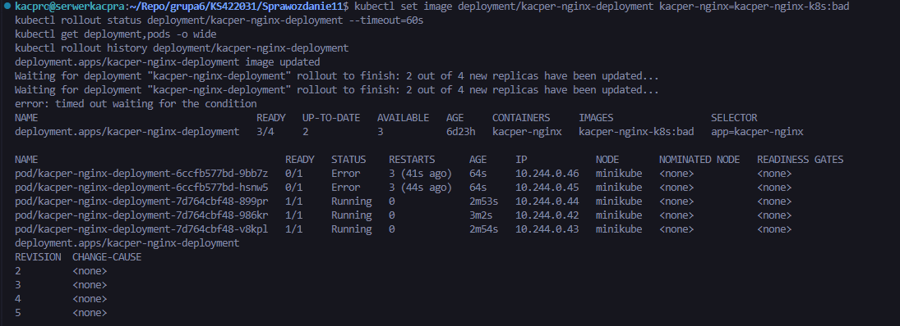

Dodatkową diagnostykę wykonano przez opis deploymentu oraz sprawdzenie stanu podów.

    kubectl describe deployment kacper-nginx-deployment
    kubectl get pods

W opisie deploymentu widoczna była informacja o obrazie *kacper-nginx-k8s:bad*, nowym ReplicaSecie oraz podach, które nie osiągnęły poprawnego stanu. Widać było również, że część replik była niedostępna.

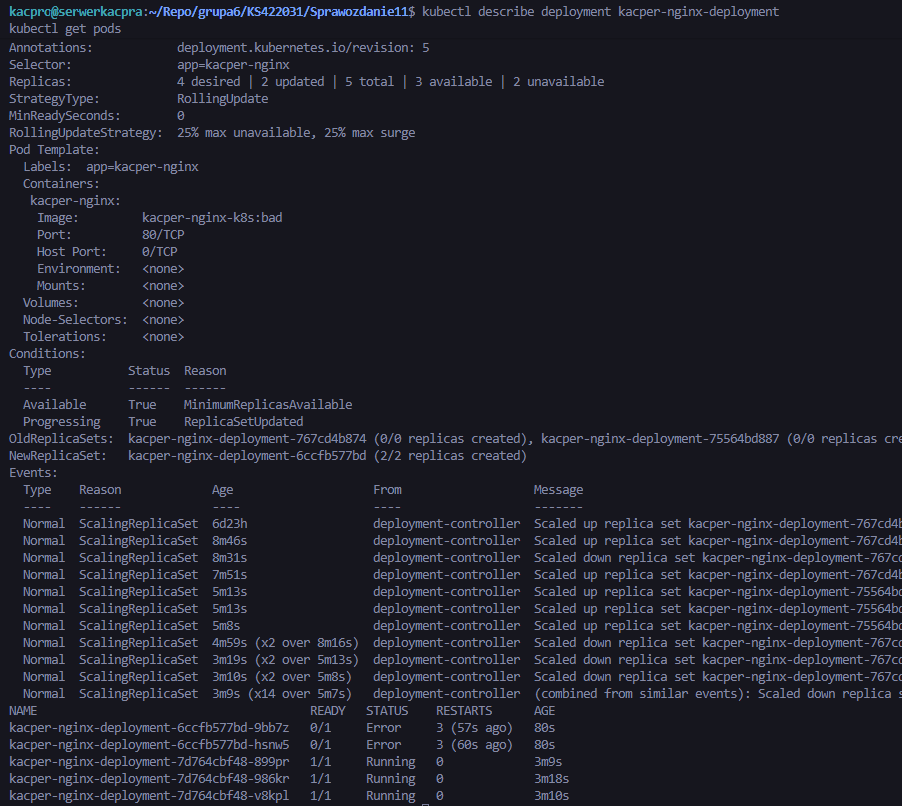

---

## 6. Historia wdrożeń i rollback

Do analizy historii użyto polecenia *kubectl rollout history*. Historia zawierała kolejne rewizje odpowiadające zmianom obrazów: *1.1*, *1.0*, *1.2*, *bad* oraz późniejszemu przywróceniu poprzedniej wersji. Problem z rewizją używającą obrazu *bad* był widoczny przez nieukończony rollout i pody w stanie *Error*.

Przywrócenie poprzedniej działającej wersji wykonano poleceniem:

    kubectl rollout undo deployment/kacper-nginx-deployment
    kubectl rollout status deployment/kacper-nginx-deployment --timeout=60s
    kubectl get deployment,pods -o wide
    kubectl rollout history deployment/kacper-nginx-deployment
    kubectl get deployment kacper-nginx-deployment -o jsonpath='{.spec.template.spec.containers[0].image}{"\n"}'

Po wykonaniu rollbacku deployment wrócił do poprawnego obrazu *kacper-nginx-k8s:1.2*, a wszystkie pody osiągnęły stan *Running*.

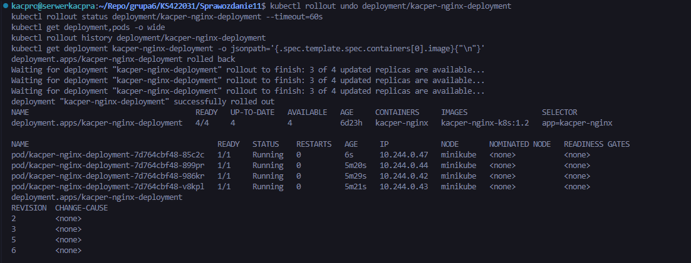

Stan po rollbacku zapisano do pliku *deployment-after-rollback.yaml*.

    kubectl get deployment kacper-nginx-deployment -o yaml > deployment-after-rollback.yaml
    ls -la

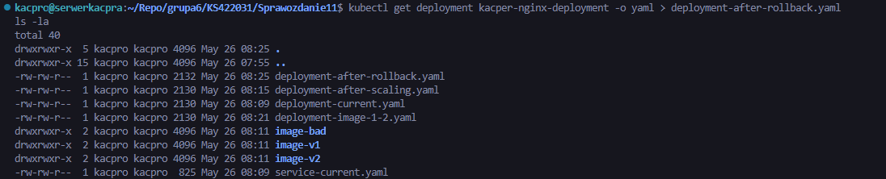

---

## 7. Skrypt sprawdzający wdrożenie

Przygotowano skrypt *check-rollout.sh*, którego zadaniem było sprawdzenie, czy deployment zdążył wdrożyć się w czasie 60 sekund. Skrypt korzystał z polecenia *kubectl rollout status* i zwracał kod wyjścia zależny od wyniku wdrożenia. Przy poprawnym wdrożeniu kończył się kodem 0, a przy nieudanym wdrożeniu wyświetlał dodatkowo stan deploymentu i podów.

Zawartość skryptu pokazano przez polecenie:

    cat check-rollout.sh

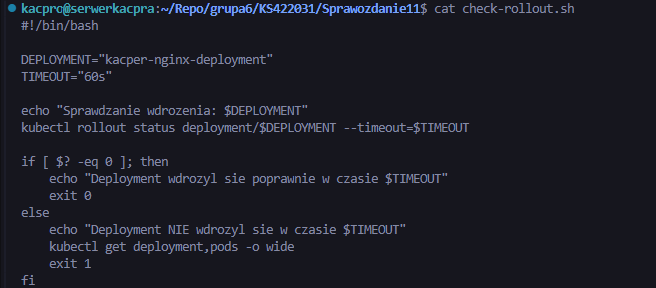

Uruchomienie skryptu dla poprawnie działającego deploymentu zakończyło się sukcesem.

    ./check-rollout.sh

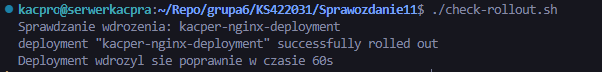

---

## 8. Strategia Recreate

Pierwszą przygotowaną strategią było *Recreate*. W tym wariancie Kubernetes usuwa stare pody przed utworzeniem nowych, co może powodować chwilową niedostępność aplikacji.

Plik *deployment-recreate.yaml* definiował deployment *kacper-nginx-recreate* z czterema replikami, obrazem *kacper-nginx-k8s:1.1* oraz strategią *Recreate*. Dla deploymentu przygotowano również serwis *service-recreate.yaml*, który wybierał pody po etykiecie *app=kacper-nginx-recreate*.

Zawartość pliku deploymentu pokazano na zrzucie ekranu.

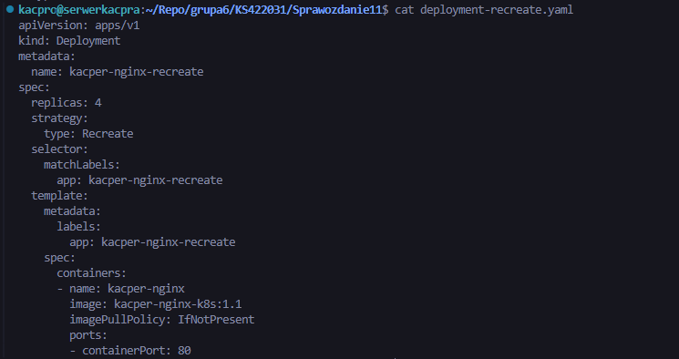

Deployment i service zastosowano poleceniami:

    kubectl apply -f deployment-recreate.yaml
    kubectl apply -f service-recreate.yaml
    kubectl get deployment,pods,svc -o wide

Po uruchomieniu widoczne były cztery repliki deploymentu oraz osobny serwis kierujący ruch do podów oznaczonych etykietą *app=kacper-nginx-recreate*.

---

## 9. Strategia RollingUpdate

Drugą strategią było *RollingUpdate* z własnymi parametrami. Zgodnie z wymaganiem ustawiono *maxUnavailable* większe niż 1 oraz *maxSurge* większe niż 20%.

Plik *deployment-rolling.yaml* definiował deployment *kacper-nginx-rolling* z pięcioma replikami oraz strategią *RollingUpdate*. Ustawiono w nim parametry *maxUnavailable: 2* oraz *maxSurge: 50%*. Parametr *maxUnavailable: 2* oznacza, że podczas aktualizacji maksymalnie dwa pody mogą być niedostępne. Parametr *maxSurge: 50%* pozwala Kubernetesowi utworzyć dodatkowe pody ponad docelową liczbę replik w trakcie wdrożenia.

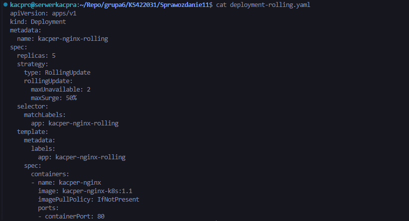

Dla tego deploymentu przygotowano serwis *service-rolling.yaml*, który wybierał pody po etykiecie *app=kacper-nginx-rolling*.

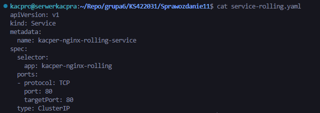

Deployment i service zastosowano poleceniami:

    kubectl apply -f deployment-rolling.yaml
    kubectl apply -f service-rolling.yaml
    kubectl get deployment,pods,svc -o wide

Po zastosowaniu plików widoczny był deployment z pięcioma replikami oraz osobny serwis. Strategia *RollingUpdate* pozwalała na stopniową wymianę podów bez pełnego zatrzymania aplikacji.

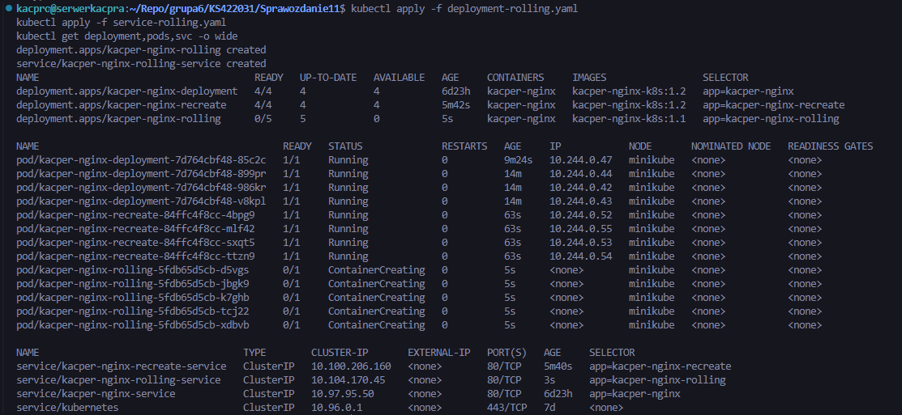

---

## 10. Canary Deployment

Wdrożenie typu *Canary Deployment* przygotowano jako dwa osobne deploymenty obsługiwane przez jeden wspólny service. Wspólną etykietą była *app=kacper-nginx-canary*. Wersję stabilną oznaczono etykietą *version=stable*, a wersję testową etykietą *version=canary*.

Deployment stabilny miał trzy repliki i korzystał z obrazu *kacper-nginx-k8s:1.1*. Deployment canary miał jedną replikę i korzystał z obrazu *kacper-nginx-k8s:1.2*. Wspólny serwis wybierał wszystkie pody z etykietą *app=kacper-nginx-canary*, bez rozróżniania wersji.

Zawartość plików *canary-stable.yaml*, *canary-new.yaml* oraz *service-canary.yaml* pokazano na zrzucie ekranu.

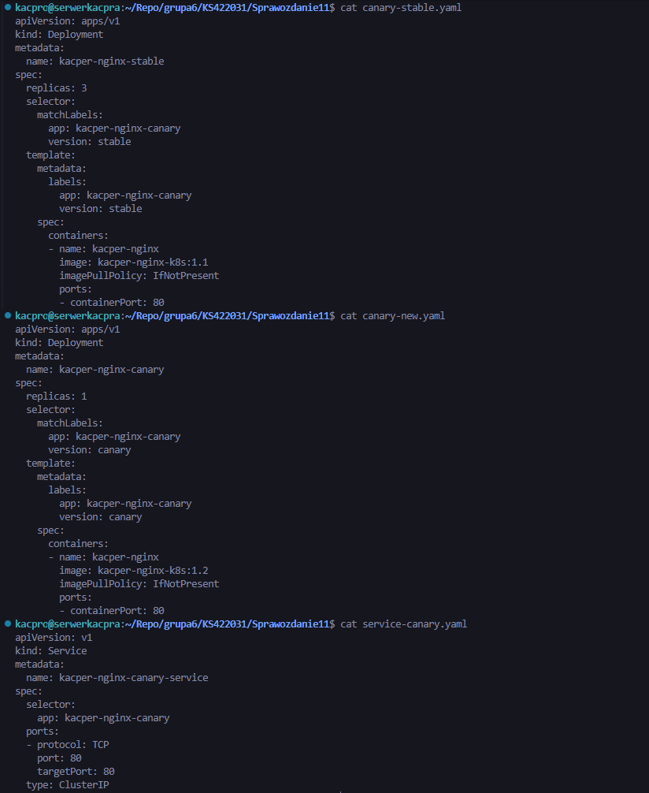

Pliki zastosowano poleceniami:

    kubectl apply -f canary-stable.yaml
    kubectl apply -f canary-new.yaml
    kubectl apply -f service-canary.yaml
    kubectl get deployment,pods,svc -o wide --show-labels

Po wdrożeniu widoczne były dwa deploymenty: stabilny z trzema replikami oraz canary z jedną repliką. Oba zestawy podów posiadały wspólną etykietę *app=kacper-nginx-canary*, dzięki czemu mogły być obsługiwane przez jeden serwis.

Działanie serwisu sprawdzono przez endpointy oraz etykiety podów.

    kubectl get endpoints kacper-nginx-canary-service -o wide
    kubectl get svc kacper-nginx-canary-service -o wide
    kubectl get pods --show-labels | grep kacper-nginx-canary

Wynik pokazał, że serwis posiada endpointy prowadzące zarówno do podów stabilnych, jak i do poda canary. Oznacza to, że niewielka część ruchu może trafiać do nowej wersji aplikacji, a większość do wersji stabilnej.

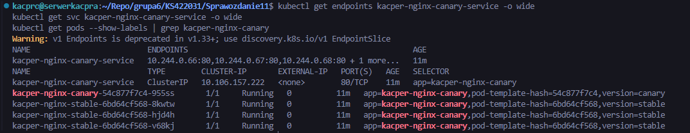

---

## 11. Porównanie strategii wdrażania

Strategia *Recreate* usuwa stare pody przed uruchomieniem nowych. Jest prosta, ale może powodować przerwę w dostępności aplikacji, ponieważ przez pewien czas nie istnieją działające repliki.

Strategia *RollingUpdate* wymienia pody stopniowo. Dzięki parametrom *maxUnavailable* i *maxSurge* można kontrolować, ile podów może być niedostępnych oraz ile dodatkowych podów może zostać utworzonych podczas aktualizacji. W ćwiczeniu ustawiono *maxUnavailable: 2* oraz *maxSurge: 50%*, co pozwoliło na szybszą wymianę replik przy zachowaniu działania aplikacji.

Strategia *Canary Deployment* polegała na równoczesnym uruchomieniu wersji stabilnej oraz testowej. W tym wariancie większość replik działała jako wersja stabilna, a jedna replika jako wersja canary. Wspólny serwis wybierał pody po etykiecie *app=kacper-nginx-canary*, a wersje rozróżniano etykietami *version=stable* i *version=canary*.

