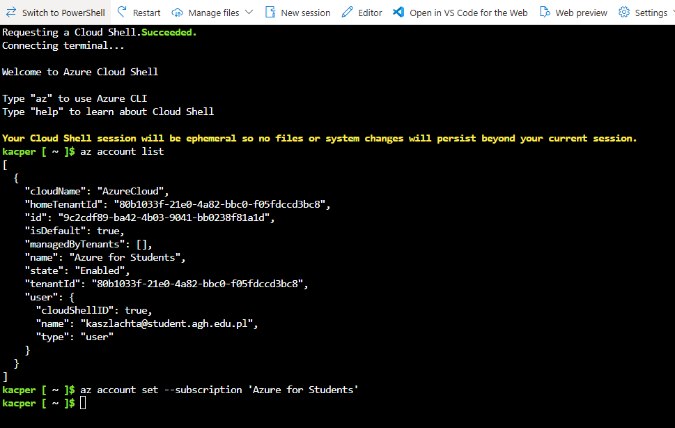
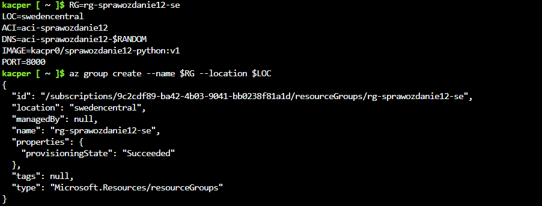
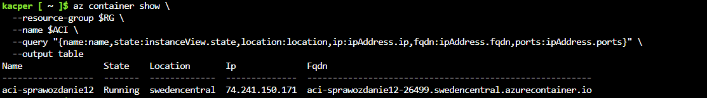
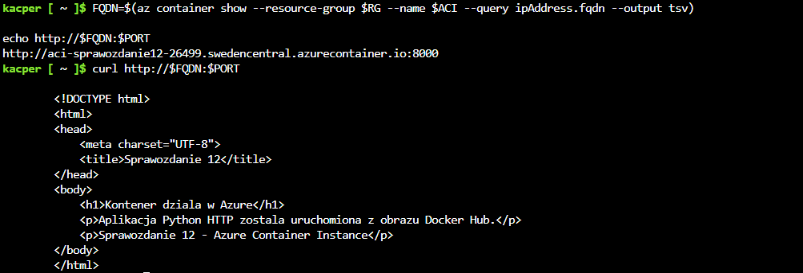
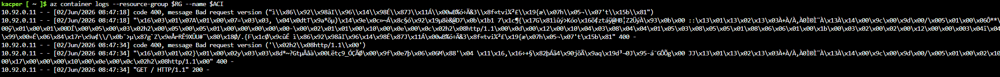
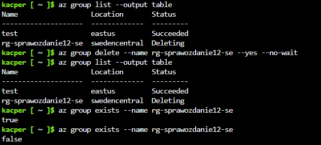

# Sprawozdanie - Lab 12

**Kacper Szlachta 422031**

---

## 1. Cel ćwiczenia

Celem ćwiczenia było wdrożenie własnego kontenera z aplikacją HTTP do środowiska chmurowego *Microsoft Azure*. Obraz kontenera został przygotowany lokalnie, przesłany do *Docker Hub*, a następnie uruchomiony jako zarządzalny kontener w usłudze *Azure Container Instances*. W ramach ćwiczenia sprawdzono również dostęp do aplikacji przez publiczny adres HTTP, stan kontenera, logi oraz usunięto zasoby po zakończeniu pracy.

---

## 2. Przygotowanie obrazu kontenera

Do wdrożenia przygotowano prostą aplikację HTTP napisaną w języku *Python*. Aplikacja działała na porcie `8000` i zwracała stronę HTML informującą o poprawnym uruchomieniu kontenera w Azure.

Obraz został zbudowany lokalnie i przesłany do repozytorium *Docker Hub* użytkownika `kacpr0`.

```
docker build -t sprawozdanie12-python:v1 .
docker tag sprawozdanie12-python:v1 kacpr0/sprawozdanie12-python:v1
docker login -u kacpr0
docker push kacpr0/sprawozdanie12-python:v1
```


Po wykonaniu polecenia `docker push` obraz `kacpr0/sprawozdanie12-python:v1` był dostępny w Docker Hub i mógł zostać użyty przez Azure Container Instances.

---

## 3. Konfiguracja środowiska Azure

Wdrożenie wykonano z poziomu *Azure Cloud Shell* w trybie *Bash*. Najpierw sprawdzono aktywną subskrypcję i ustawiono subskrypcję studencką.

```
az account list
az account set --subscription 'Azure for Students'
```



Następnie zdefiniowano zmienne używane podczas tworzenia zasobów:

```
RG=rg-sprawozdanie12-se
LOC=swedencentral
ACI=aci-sprawozdanie12
DNS=aci-sprawozdanie12-$RANDOM
IMAGE=kacpr0/sprawozdanie12-python:v1
PORT=8000
```

Ze względu na ograniczenia polityki subskrypcji wybrano region `swedencentral`. Dodatkowo zarejestrowano dostawcę zasobów `Microsoft.ContainerInstance`, ponieważ bez tego Azure nie pozwalał na tworzenie instancji kontenerów.

```
az provider register --namespace Microsoft.ContainerInstance
```

---

## 4. Utworzenie grupy zasobów

Do ćwiczenia utworzono osobną grupę zasobów w regionie `swedencentral`.

```
az group create --name $RG --location $LOC
```



Grupa zasobów `rg-sprawozdanie12-se` pełniła rolę kontenera logicznego dla wszystkich zasobów utworzonych w tym ćwiczeniu. Dzięki temu po zakończeniu pracy można było usunąć całość jednym poleceniem.

---

## 5. Wdrożenie kontenera do Azure Container Instances

Kontener wdrożono bezpośrednio z obrazu znajdującego się w *Docker Hub*. Nie było potrzeby tworzenia osobnego *Azure Container Registry*, ponieważ obraz był już dostępny publicznie jako `kacpr0/sprawozdanie12-python:v1`.

```
az container create \
  --resource-group $RG \
  --location $LOC \
  --name $ACI \
  --image $IMAGE \
  --dns-name-label $DNS \
  --ports $PORT \
  --ip-address Public \
  --os-type Linux \
  --cpu 1 \
  --memory 1 \
  --restart-policy Always
```


W konfiguracji ustawiono publiczny adres IP, port `8000`, system `Linux` oraz restart policy `Always`. Dzięki temu aplikacja była dostępna z zewnątrz przez publiczny adres DNS wygenerowany przez Azure.

---

## 6. Sprawdzenie stanu kontenera

Po wdrożeniu sprawdzono podstawowe informacje o kontenerze: nazwę, stan, region, adres IP, FQDN oraz porty.

```
az container show \
  --resource-group $RG \
  --name $ACI \
  --query "{name:name,state:instanceView.state,location:location,ip:ipAddress.ip,fqdn:ipAddress.fqdn,ports:ipAddress.ports}" \
  --output table
```



Kontener `aci-sprawozdanie12` znajdował się w stanie `Running`, co oznaczało, że obraz został poprawnie pobrany z Docker Hub i uruchomiony w Azure Container Instances.

---

## 7. Dostęp do aplikacji HTTP

Adres publiczny aplikacji pobrano z właściwości kontenera.

```
FQDN=$(az container show --resource-group $RG --name $ACI --query ipAddress.fqdn --output tsv)
echo http://$FQDN:$PORT
```

Następnie wykonano test połączenia przez `curl`.

```
curl http://$FQDN:$PORT
```



Aplikacja zwróciła kod HTML, co potwierdziło poprawne działanie serwera HTTP wewnątrz kontenera. Ten sam adres został otwarty w przeglądarce.


Widoczna strona potwierdza, że aplikacja Python HTTP została uruchomiona z obrazu Docker Hub i poprawnie wystawiona jako usługa HTTP w Azure.

---

## 8. Logi kontenera

Do pobrania logów użyto polecenia:

```
az container logs --resource-group $RG --name $ACI
```



W logach widoczny był poprawny request:

```
"GET / HTTP/1.1" 200 -
```

Kod odpowiedzi `200` oznacza, że żądanie HTTP zostało obsłużone poprawnie. W logach pojawiły się również wpisy `400 Bad request version`, które wynikały z prób połączenia w sposób niezgodny z prostym serwerem HTTP działającym na porcie `8000`, prawdopodobnie przez próbę użycia HTTPS. Nie wpływało to na poprawne działanie aplikacji przez zwykły HTTP.

---

## 9. Usunięcie zasobów

Po zakończeniu testów usunięto grupę zasobów zawierającą kontener, aby zatrzymać naliczanie kosztów i zwolnić zasoby subskrypcji.

```
az group delete --name rg-sprawozdanie12-se --yes --no-wait
```

Następnie sprawdzono listę grup zasobów oraz stan usuwania.

```
az group list --output table
az group exists --name rg-sprawozdanie12-se
```



Resource group `rg-sprawozdanie12-se` przeszła w stan `Deleting`, co oznaczało rozpoczęcie usuwania wszystkich zasobów utworzonych w ramach ćwiczenia.


