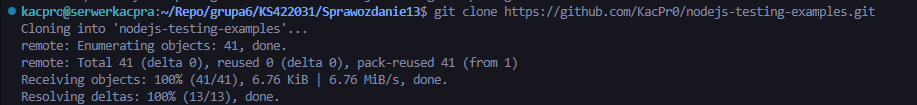
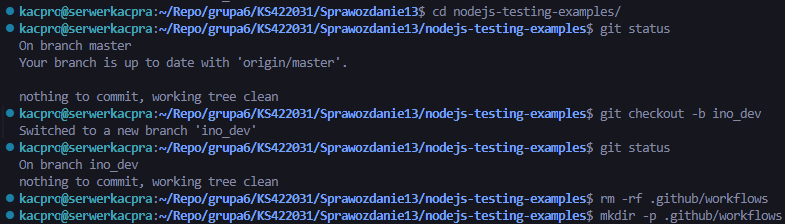
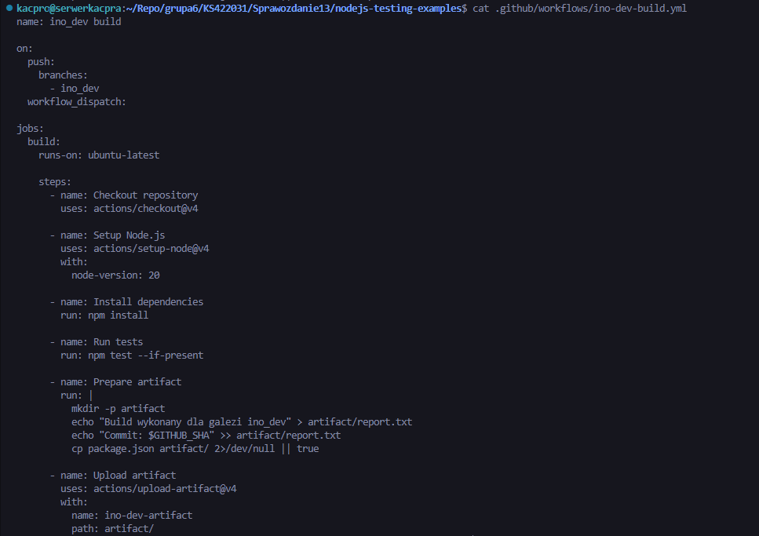
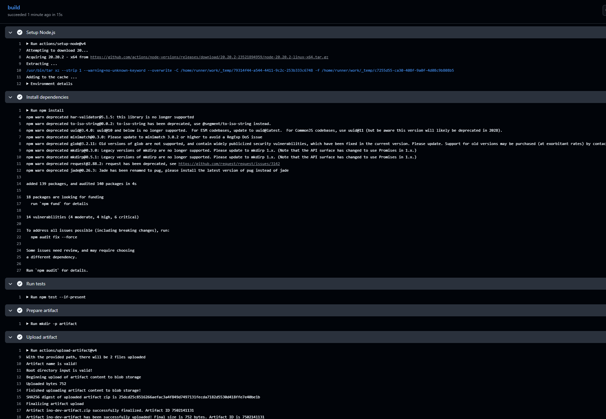
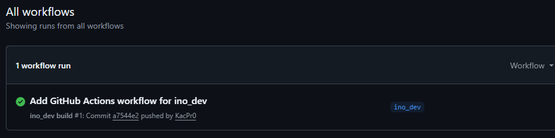
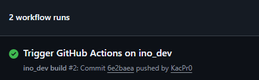

# Sprawozdanie 13 — Shift-left: GitHub Actions

***Kacper Szlachta 422031***

---

## 1. Wstęp

Celem ćwiczenia było przygotowanie własnego procesu *CI* z użyciem *GitHub Actions*. Workflow został wykonany na forku repozytorium `nodejs-testing-examples`, dzięki czemu konfiguracja pipeline’u nie została dodana do głównego projektu. Zgodnie z poleceniem utworzono osobną gałąź `ino_dev`, na której umieszczono własną akcję reagującą na zmiany w tej gałęzi.

---

## 2. Zastosowane technologie i ich działanie

### a) Fork repozytorium i gałąź `ino_dev`

Do wykonania zadania wykorzystano fork repozytorium `nodejs-testing-examples` znajdujący się na koncie użytkownika. Repozytorium zostało sklonowane lokalnie, a dalsze prace wykonano w osobnej gałęzi `ino_dev`. Dzięki temu pipeline został przygotowany w kontrolowanym środowisku, bez ingerowania w główną gałąź projektu.

Na screenie widoczne jest przejście do sklonowanego repozytorium, sprawdzenie statusu oraz utworzenie gałęzi `ino_dev`.

---

### b) Workflow GitHub Actions

Workflow został zapisany w katalogu `.github/workflows` jako plik `ino-dev-build.yml`. Przed dodaniem własnej konfiguracji usunięto istniejące workflowy, aby w repozytorium znajdowała się tylko akcja przygotowana do ćwiczenia.

Najważniejszym elementem konfiguracji był trigger `push` ograniczony do gałęzi `ino_dev`. Dzięki temu akcja uruchamia się automatycznie tylko po wykonaniu zmiany w tej gałęzi. Dodano również `workflow_dispatch`, co umożliwia ręczne uruchomienie workflow z poziomu GitHuba.

Na screenie pokazano pełną zawartość pliku YAML, w tym nazwę workflow, trigger, runner `ubuntu-latest` oraz kroki odpowiedzialne za przygotowanie środowiska, uruchomienie testów i zapisanie artefaktu.

---

### c) Build, testy i artefakt

Workflow działał na runnerze `ubuntu-latest`. W pierwszym kroku pobierany był kod repozytorium, następnie przygotowywane było środowisko Node.js w wersji 20. Po przygotowaniu środowiska wykonywana była instalacja zależności oraz uruchomienie testów projektu.

Po zakończeniu testów tworzony był katalog z artefaktem. W artefakcie zapisano prosty raport z informacją o wykonaniu builda oraz identyfikatorem commita. Dodatkowo do artefaktu dołączono plik `package.json`, jeżeli był dostępny w repozytorium.

Artefakt został przesłany przy pomocy akcji `actions/upload-artifact@v4` pod nazwą `ino-dev-artifact`. W logach joba widoczne jest poprawne wykonanie kolejnych kroków oraz zakończony sukcesem upload artefaktu.

---

## 3. Weryfikacja działania

Po dodaniu pliku workflow wykonano commit `Add GitHub Actions workflow for ino_dev`. W zakładce *Actions* pojawiło się pierwsze wykonanie akcji. Workflow zakończył się sukcesem, co potwierdza zielony status przy uruchomieniu.

Następnie wykonano dodatkową zmianę w repozytorium, aby sprawdzić, czy trigger reaguje na kolejny push do gałęzi `ino_dev`. Po tej zmianie w zakładce *Actions* pojawił się drugi workflow run. Potwierdza to, że akcja została poprawnie powiązana z gałęzią `ino_dev`.

