# Sprawozdanie - Lab 2

**Kacper Szlachta 422031**

---


## 1. Instalacja Dockera w systemie linuksowym

Zainstalowano środowisko *Docker* w systemie *Ubuntu*. Skonfigurowano repozytorium pakietów, zainstalowano komponenty środowiska oraz sprawdzono status usługi.

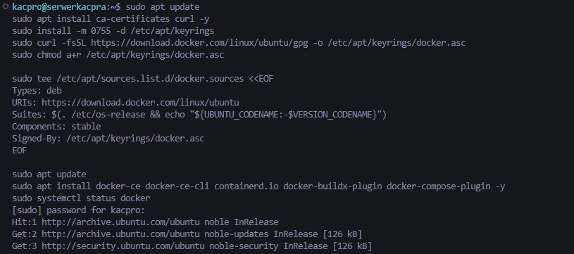

Następnie dodano użytkownika do grupy `docker` i zweryfikowano działanie poleceń `docker version` oraz `docker info`.

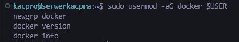

---

## 2. Rejestracja w Docker Hub i zapoznanie z obrazami

Skonfigurowane środowisko zostało przygotowane do pracy z publicznym rejestrem *Docker Hub*. Następnie pobrano wskazane obrazy.

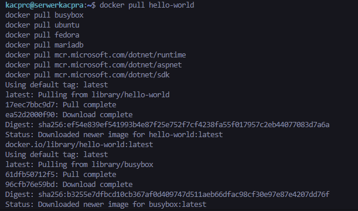

---

## 3. Zapoznanie się z obrazami `hello-world`, `busybox`, `ubuntu`, `fedora`, `mariadb`, `runtime`, `aspnet` i `sdk` dla Microsoft .NET

Pobrano i uruchomiono wymagane obrazy. Dla poszczególnych uruchomień sprawdzono działanie obrazu oraz kod wyjścia procesu.

### 3.1. Obraz `hello-world`

Uruchomiono obraz `hello-world` i potwierdzono poprawne działanie środowiska *Docker*.

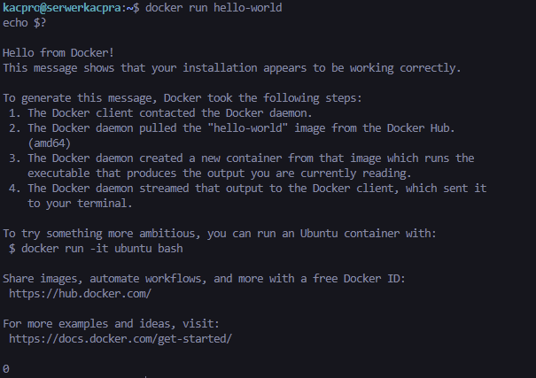

### 3.2. Rozmiary obrazów

Wyświetlono lokalnie dostępne obrazy oraz ich rozmiary.

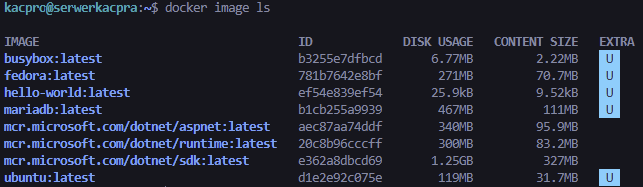

### 3.3. Obrazy `busybox`, `ubuntu`, `fedora` i `.NET runtime`

Uruchomiono obrazy `busybox`, `ubuntu` i `fedora`, a także sprawdzono informacje o obrazie `mcr.microsoft.com/dotnet/runtime`. Po każdym uruchomieniu zweryfikowano kod wyjścia.

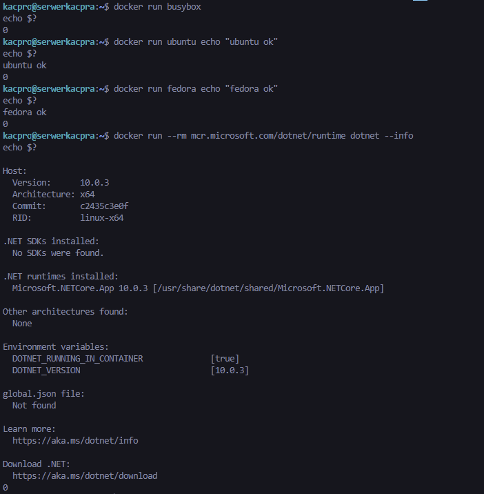

### 3.4. Obraz `.NET aspnet`

Uruchomiono obraz `mcr.microsoft.com/dotnet/aspnet` i wyświetlono informacje środowiskowe za pomocą `dotnet --info`.

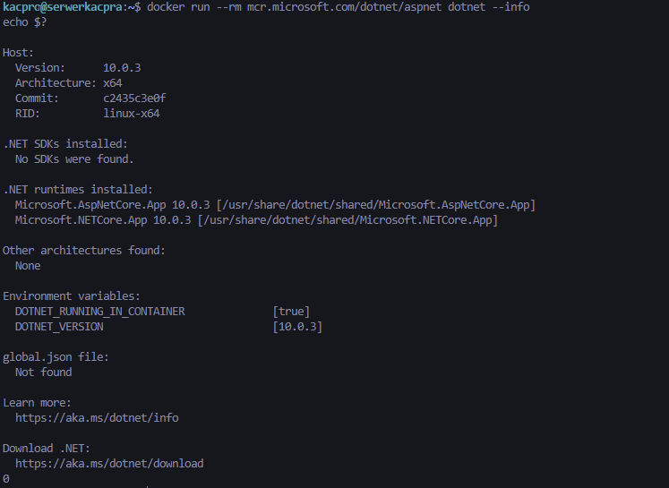

### 3.5. Obraz `mariadb`

Obraz `mariadb` został pobrany i uruchomiony w tle jako działający kontener. Jego obecność była później widoczna na liście lokalnych kontenerów oraz obrazów.

---

## 4. Uruchomienie kontenera z obrazu `busybox`

Uruchomiono kontener z obrazu `busybox`. Następnie połączono się z nim interaktywnie i wywołano informacje o wersji programu `busybox`.

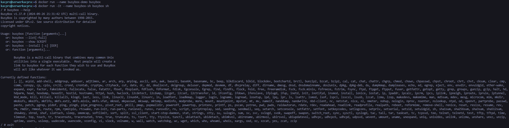

---

## 5. Uruchomienie „systemu w kontenerze”

Uruchomiono kontener z obrazu `ubuntu` w trybie interaktywnym. Wewnątrz kontenera sprawdzono proces `PID 1`, zaktualizowano listę pakietów, a następnie zakończono pracę w kontenerze.

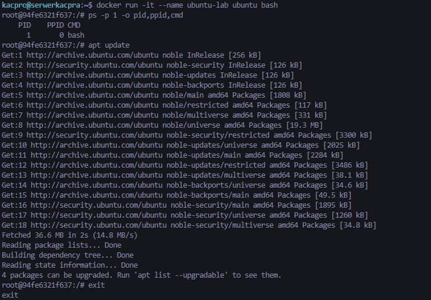

Na hoście wyświetlono procesy związane z działaniem środowiska *Docker*, w tym `dockerd` i `containerd`.

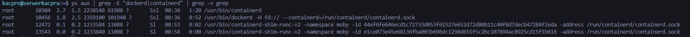

---

## 6. Utworzenie własnego pliku `Dockerfile`, budowa obrazu i klonowanie repozytorium

Przygotowano własny plik `Dockerfile` oparty o obraz `ubuntu`. W obrazie zainstalowano pakiet `git`, ustawiono katalog roboczy oraz sklonowano repozytorium przedmiotowe. Następnie zbudowano obraz `lab1-repo`.

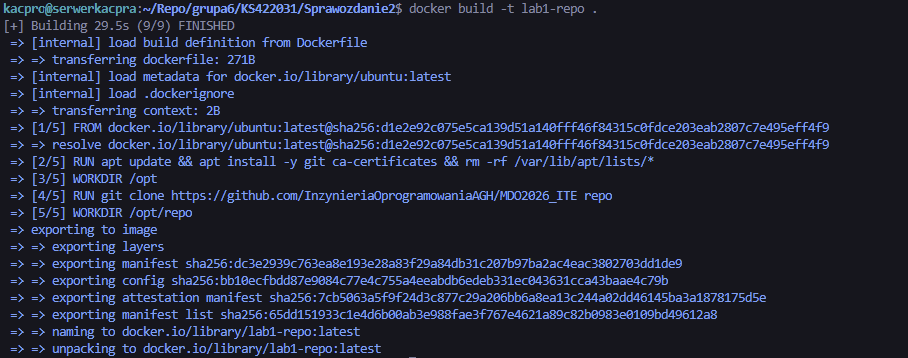

Po zbudowaniu obrazu uruchomiono kontener interaktywnie i zweryfikowano obecność programu `git` oraz sklonowanego repozytorium.

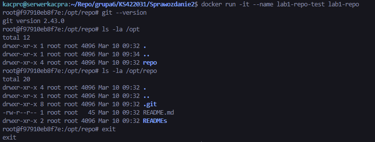

---

## 7. Wyświetlenie uruchomionych kontenerów i czyszczenie zakończonych

Wyświetlono listę lokalnych kontenerów poleceniem `docker ps -a`, a następnie usunięto zakończone kontenery za pomocą `docker container prune`.

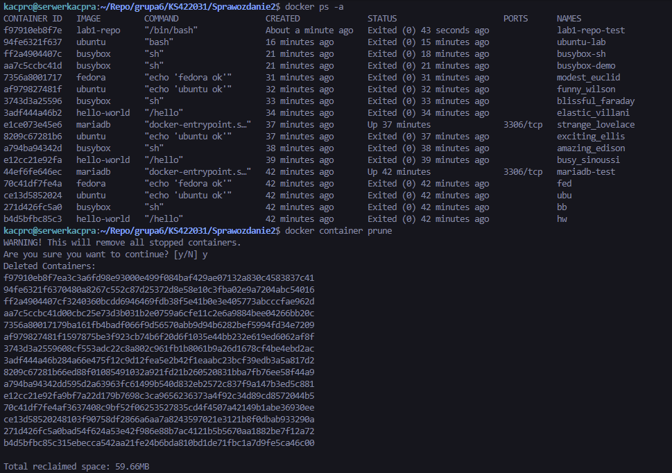

---

## 8. Czyszczenie obrazów przechowywanych w lokalnym magazynie

Wyświetlono obrazy obecne w lokalnym magazynie, a następnie usunięto je poleceniem `docker image prune -a`.

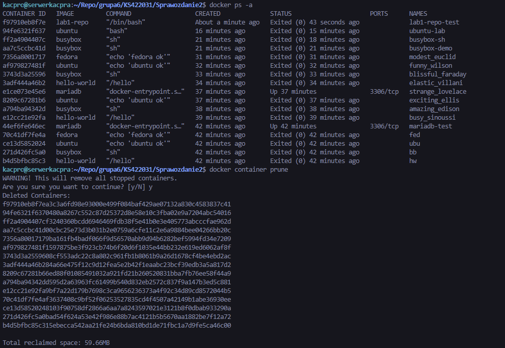

---


## Listing historii poleceń

```bash
sudo apt update
sudo apt install ca-certificates curl -y
sudo install -m 0755 -d /etc/apt/keyrings
sudo curl -fsSL https://download.docker.com/linux/ubuntu/gpg -o /etc/apt/keyrings/docker.asc
sudo chmod a+r /etc/apt/keyrings/docker.asc

sudo tee /etc/apt/sources.list.d/docker.sources <<EOF
Types: deb
URIs: https://download.docker.com/linux/ubuntu
Suites: $(. /etc/os-release && echo "${UBUNTU_CODENAME:-$VERSION_CODENAME}")
Components: stable
Signed-By: /etc/apt/keyrings/docker.asc
EOF

sudo apt update
sudo apt install docker-ce docker-ce-cli containerd.io docker-buildx-plugin docker-compose-plugin -y
sudo systemctl status docker

sudo usermod -aG docker $USER
newgrp docker
docker version
docker info

docker pull hello-world
docker pull busybox
docker pull ubuntu
docker pull fedora
docker pull mariadb
docker pull mcr.microsoft.com/dotnet/runtime
docker pull mcr.microsoft.com/dotnet/aspnet
docker pull mcr.microsoft.com/dotnet/sdk

docker run hello-world
echo $?
docker image ls

docker run busybox
echo $?

docker run ubuntu echo "ubuntu ok"
echo $?

docker run fedora echo "fedora ok"
echo $?

docker run -d -e MARIADB_ROOT_PASSWORD=haslo mariadb
echo $?

docker run --rm mcr.microsoft.com/dotnet/runtime dotnet --info
echo $?

docker run --rm mcr.microsoft.com/dotnet/aspnet dotnet --info
echo $?

docker run --rm mcr.microsoft.com/dotnet/sdk dotnet --info
echo $?

docker run -it busybox sh
busybox --help
exit

docker run -it --name ubuntu-lab ubuntu bash
ps -p 1 -o pid,ppid,cmd
apt update
exit

ps aux | grep -E "dockerd|containerd" | grep -v grep

docker build -t lab1-repo .
docker run -it --name lab1-repo-test lab1-repo
git --version
ls -la /opt
ls -la /opt/repo
exit

docker ps -a
docker container prune

docker image ls
docker image prune -a

```