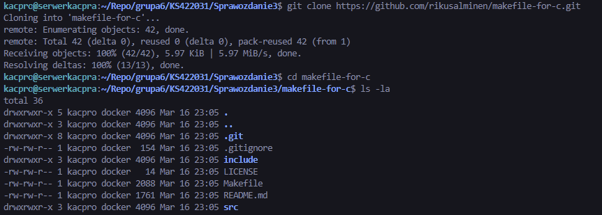
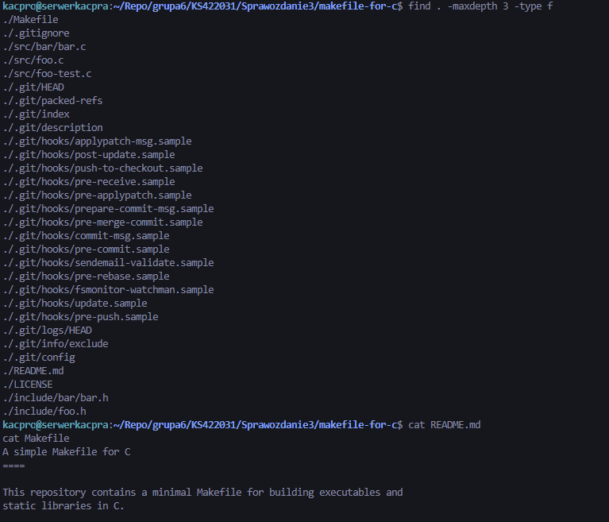
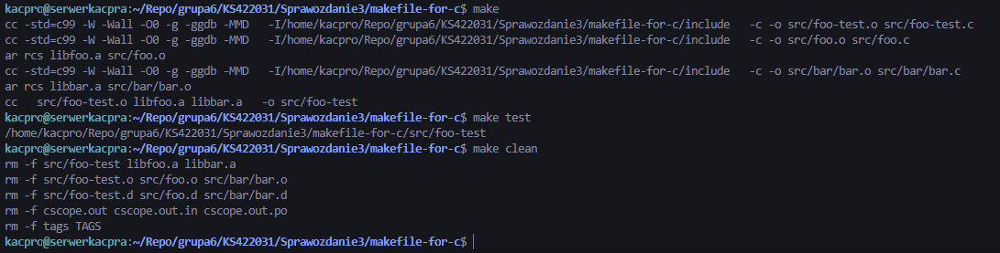
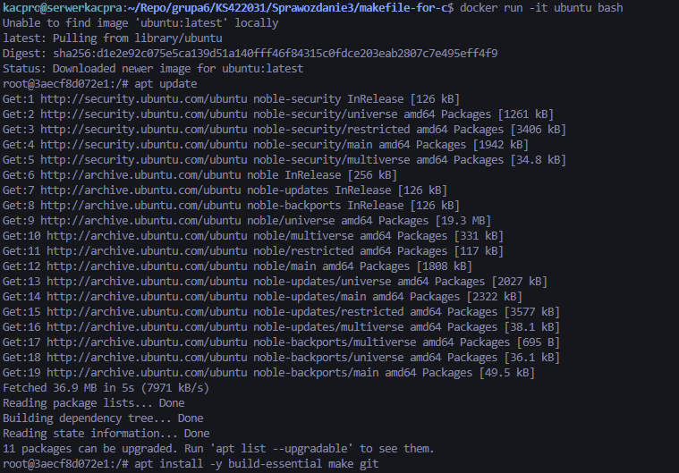
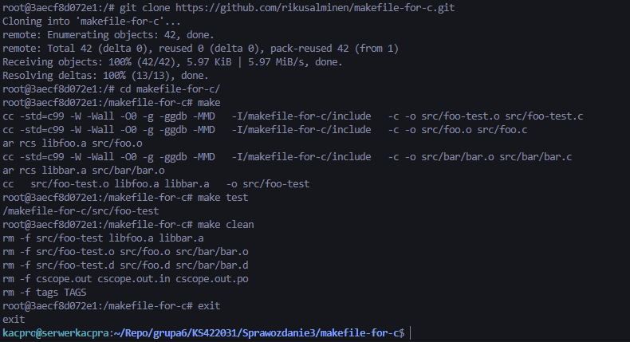
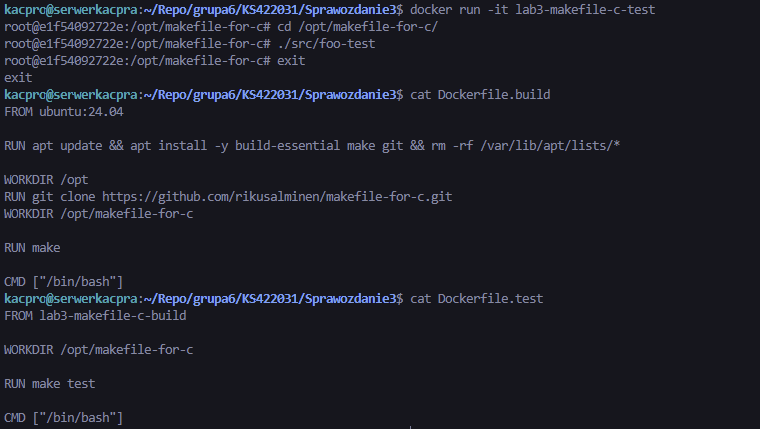
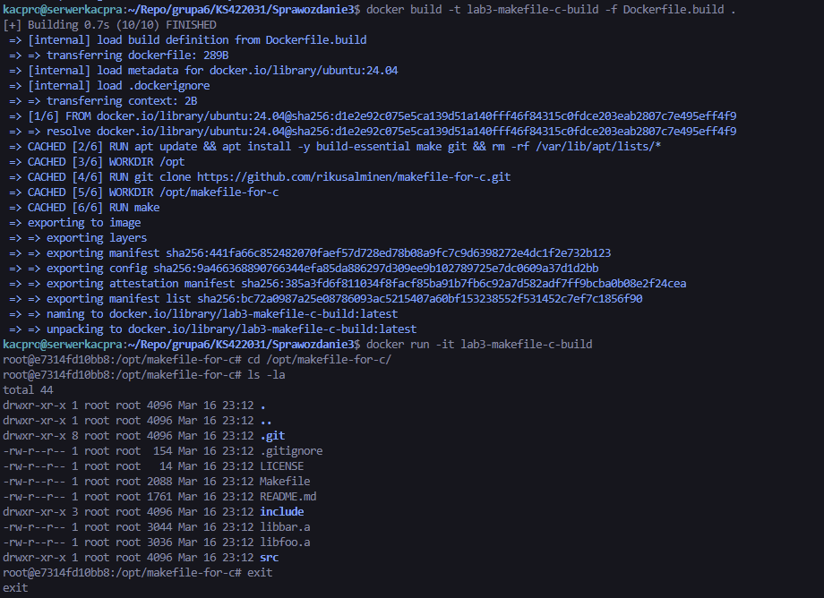
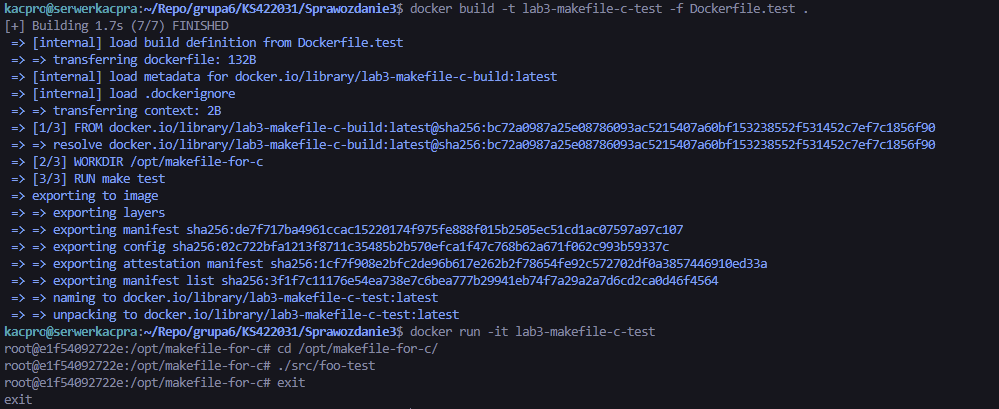
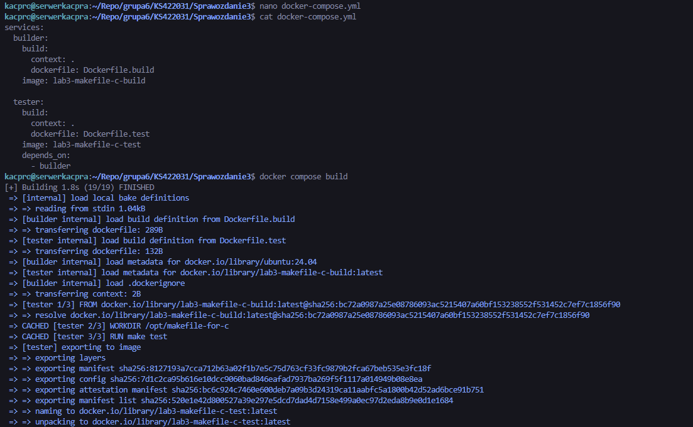
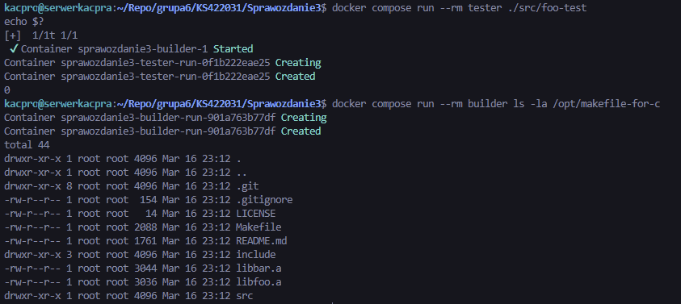

# Sprawozdanie - Lab 3

**Kacper Szlachta 422031**

---


## 1. Wybór oprogramowania na zajęcia

Wybrano repozytorium `rikusalminen/makefile-for-c`. Projekt jest publicznie dostępny, zawiera plik `LICENSE`, plik `Makefile` oraz kod źródłowy w katalogach `src` i `include`.



Dodatkowo sprawdzono zawartość repozytorium oraz obecność podstawowych plików projektu.



---

## 2. Build programu i uruchomienie testów jednostkowych w repozytorium

Po sklonowaniu repozytorium lokalnie wykonano proces budowania poleceniem `make`, następnie uruchomiono testy poleceniem `make test`, a na końcu wyczyszczono artefakty poleceniem `make clean`.



---

## 3. Build i test interaktywnie w kontenerze

Uruchomiono kontener bazowy z obrazu `ubuntu`. Wewnątrz kontenera zainstalowano wymagane narzędzia: `build-essential`, `make` oraz `git`. Następnie sklonowano repozytorium i ponownie wykonano `make`, `make test` oraz `make clean`.





---

## 4. Automatyzacja procesu przy użyciu dwóch plików Dockerfile

Zgodnie z poleceniem przygotowano dwa pliki `Dockerfile`.

### 4.1. `Dockerfile.build`

Plik `Dockerfile.build` odpowiada za przygotowanie środowiska, sklonowanie repozytorium oraz wykonanie buildu programu.

### 4.2. `Dockerfile.test`

Plik `Dockerfile.test` bazuje na obrazie zbudowanym przez `Dockerfile.build` i wykonuje testy bez ponownego budowania projektu.

Treść obu plików została zweryfikowana poleceniem `cat`.



---

## 5. Budowa obrazów i weryfikacja działania kontenerów

Najpierw zbudowano obraz `lab3-makefile-c-build` z użyciem pliku `Dockerfile.build`. Następnie uruchomiono kontener z tego obrazu i sprawdzono obecność repozytorium oraz plików projektu w katalogu `/opt/makefile-for-c`.



Kolejno zbudowano obraz `lab3-makefile-c-test` z użyciem pliku `Dockerfile.test`. Po uruchomieniu kontenera wykonano program testowy `./src/foo-test`.



---

## 6. Docker Compose

Przygotowano plik `docker-compose.yml`, w którym zdefiniowano dwie usługi:
- `builder` bazującą na `Dockerfile.build`,
- `tester` bazującą na `Dockerfile.test` i zależną od usługi `builder`.

Następnie zbudowano kompozycję poleceniem `docker compose build`.



Po zbudowaniu kompozycji uruchomiono usługę `tester`, wykonując `./src/foo-test`, a także usługę `builder`, w której sprawdzono obecność repozytorium i plików projektu.



---

## 7. Różnica między obrazem a kontenerem

*Obraz* jest nieuruchomionym, statycznym szablonem środowiska zawierającym system bazowy, narzędzia i pliki projektu. *Kontener* jest uruchomioną instancją obrazu, w której wykonywany jest konkretny proces. W przygotowanych przykładach w kontenerze wykonywany był między innymi `/bin/bash` oraz program testowy `./src/foo-test`.

---

## Listing historii poleceń

```bash
git clone https://github.com/rikusalminen/makefile-for-c.git
cd makefile-for-c
ls -la
find . -maxdepth 3 -type f
cat README.md

make
make test
make clean

docker run -it ubuntu bash
apt update
apt install -y build-essential make git
git clone https://github.com/rikusalminen/makefile-for-c.git
cd makefile-for-c
make
make test
make clean
exit

cat Dockerfile.build
cat Dockerfile.test

docker build -t lab3-makefile-c-build -f Dockerfile.build .
docker run -it lab3-makefile-c-build
cd /opt/makefile-for-c
ls -la
exit

docker build -t lab3-makefile-c-test -f Dockerfile.test .
docker run -it lab3-makefile-c-test
cd /opt/makefile-for-c
./src/foo-test
exit

cat docker-compose.yml
docker compose build
docker compose run --rm tester ./src/foo-test
echo $?
docker compose run --rm builder ls -la /opt/makefile-for-c
```