# Sprawozdanie - Lab 4

**Kacper Szlachta 422031**

---


## 1. Zachowywanie stanu między kontenerami

### 1.1. Utworzenie woluminów wejściowego i wyjściowego

Na początku utworzono woluminy `proj_in` i `proj_out`, które zostały przeznaczone odpowiednio na kod źródłowy oraz artefakty wyjściowe.

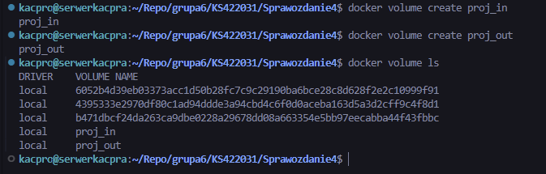

### 1.2. Przygotowanie woluminu wejściowego przy użyciu kontenera pomocniczego

Uruchomiono kontener pomocniczy `helper`, do którego podłączono woluminy wejściowy i wyjściowy. W kontenerze zainstalowano `git`, a następnie sklonowano repozytorium projektu do katalogu `/input`, czyli na wolumin wejściowy. Takie rozwiązanie pozwoliło przygotować kod poza kontenerem bazowym.

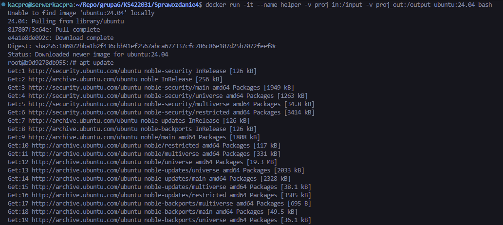

### 1.3. Build projektu w kontenerze bazowym bez Gita

Uruchomiono kontener `builder_nogit` z podłączonymi woluminami `proj_in` i `proj_out`. W kontenerze zainstalowano wyłącznie narzędzia potrzebne do budowania projektu, bez `git`. Następnie wykonano `make`, `make test` oraz skopiowano plik `foo-test` do katalogu `/output`, czyli na wolumin wyjściowy.

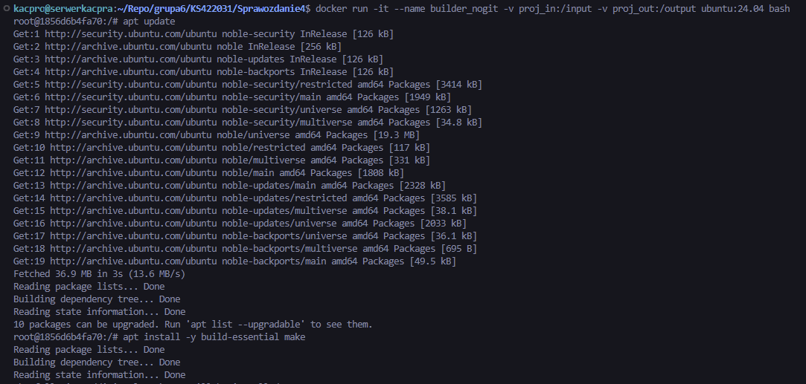

W ten sposób kontener bazowy jedynie budował projekt, a nie był używany do klonowania repozytorium.

### 1.4. Ponowienie operacji z klonowaniem wewnątrz kontenera

Utworzono drugi zestaw woluminów: `proj_in_git` oraz `proj_out_git`.

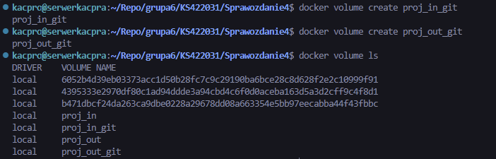

Następnie uruchomiono kontener `builder_git`, do którego podłączono nowe woluminy. W tym wariancie wewnątrz kontenera zainstalowano `git`, sklonowano repozytorium bezpośrednio na wolumin wejściowy, wykonano build i testy, a plik wynikowy zapisano na woluminie wyjściowym.

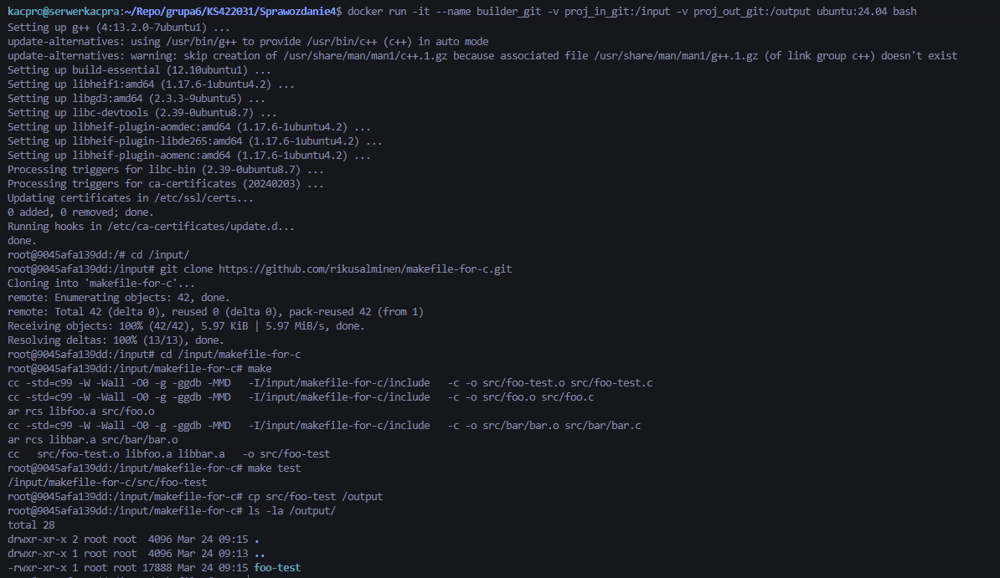

### 1.5. Weryfikacja zawartości woluminów

Po zakończeniu pracy kontenera sprawdzono, że repozytorium zostało zapisane na woluminie wejściowym `proj_in_git`.

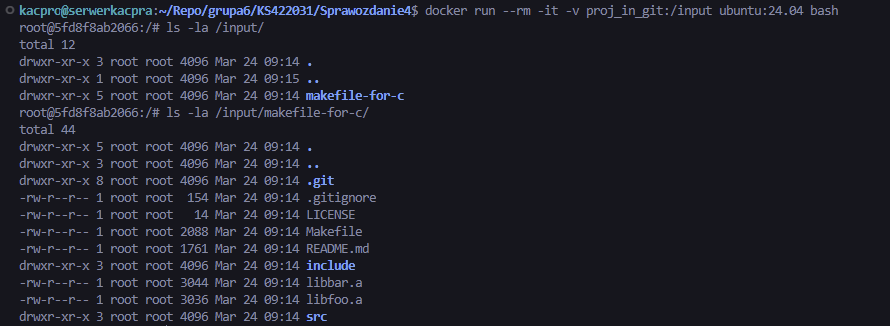

Następnie potwierdzono obecność pliku `foo-test` na woluminie wyjściowym `proj_out_git`. Oznacza to, że wynik buildu pozostał dostępny po zamknięciu kontenera.

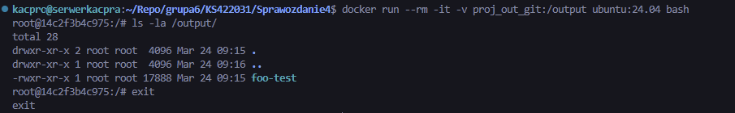

### 1.6. Uwagi o sposobie realizacji

W pierwszym wariancie użyto kontenera pomocniczego oraz woluminu wejściowego, ponieważ kontener bazowy miał jedynie budować projekt i nie korzystać z `git`. W drugim wariancie klonowanie repozytorium wykonano już bezpośrednio wewnątrz kontenera budującego. Rozwiązanie z woluminami umożliwia zachowanie kodu i artefaktów niezależnie od cyklu życia pojedynczego kontenera.

Możliwość wykonania podobnych kroków za pomocą `docker build` i `Dockerfile` istnieje, szczególnie przy użyciu *BuildKit* i instrukcji `RUN --mount`, jednak taki mechanizm lepiej nadaje się do etapów budowania obrazu niż do zwykłego współdzielenia trwałego stanu pomiędzy uruchamianymi kontenerami.

---

## 2. Eksponowanie portu i łączność między kontenerami

### 2.1. Uruchomienie serwera i klienta iperf3

Uruchomiono dwa kontenery: `iperf_server` oraz `iperf_client`. W kontenerze serwera uruchomiono `iperf3 -s`, natomiast w kontenerze klienta przygotowano środowisko do pomiaru ruchu.

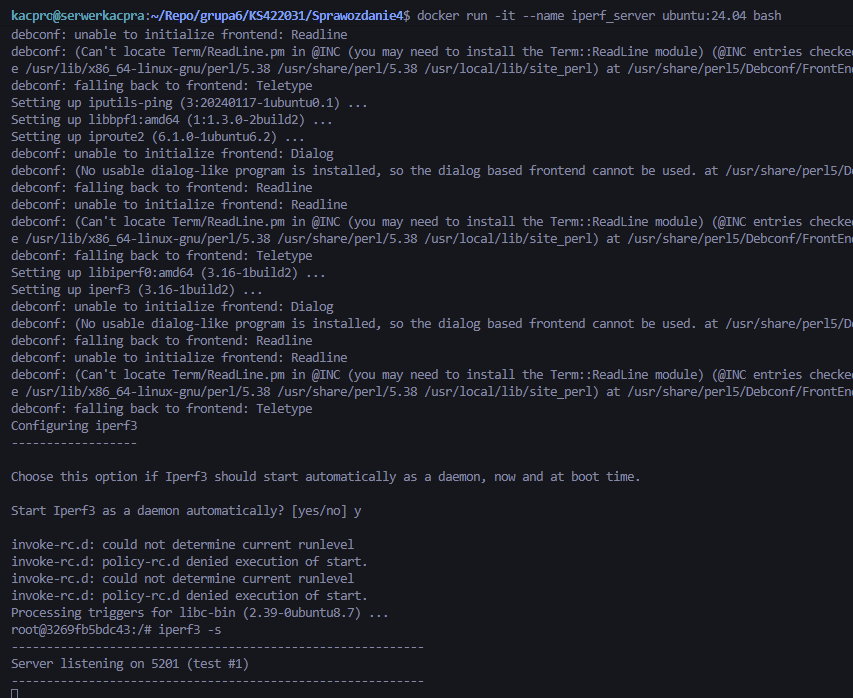

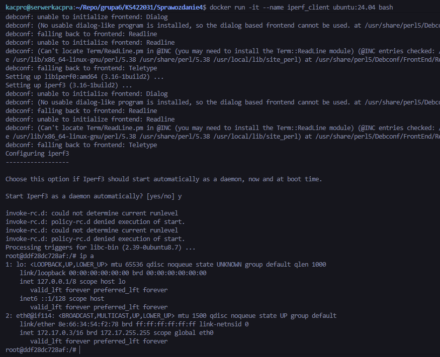

### 2.2. Sprawdzenie adresów IP kontenerów

Następnie odczytano adresy IP obu kontenerów. Pozwoliło to zestawić połączenie bezpośrednio po adresie IP.

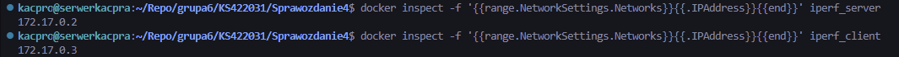

### 2.3. Badanie ruchu między kontenerami po adresie IP

Z kontenera `iperf_client` połączono się z kontenerem `iperf_server` po jego adresie IP i wykonano test przepustowości.

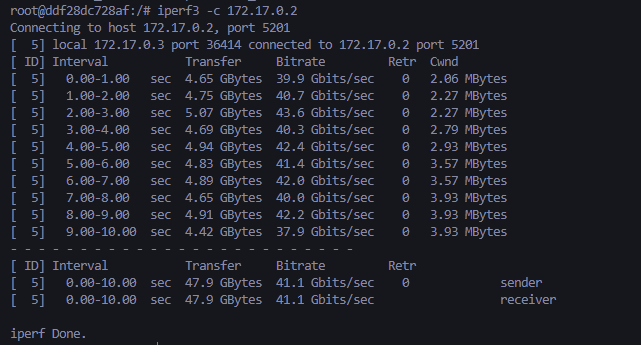

### 2.4. Dedykowana sieć mostkowa

Utworzono własną sieć mostkową `mybridge`, a następnie uruchomiono w niej dwa nowe kontenery: `iperf_server2` oraz `iperf_client2`.

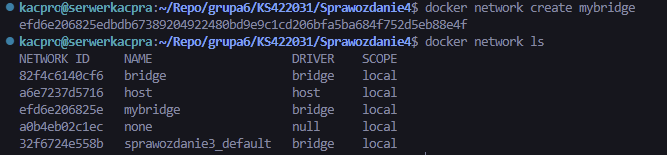

W kontenerze `iperf_server2` uruchomiono serwer `iperf3`. Log serwera potwierdził nawiązanie połączenia oraz odbiór ruchu z drugiego kontenera.

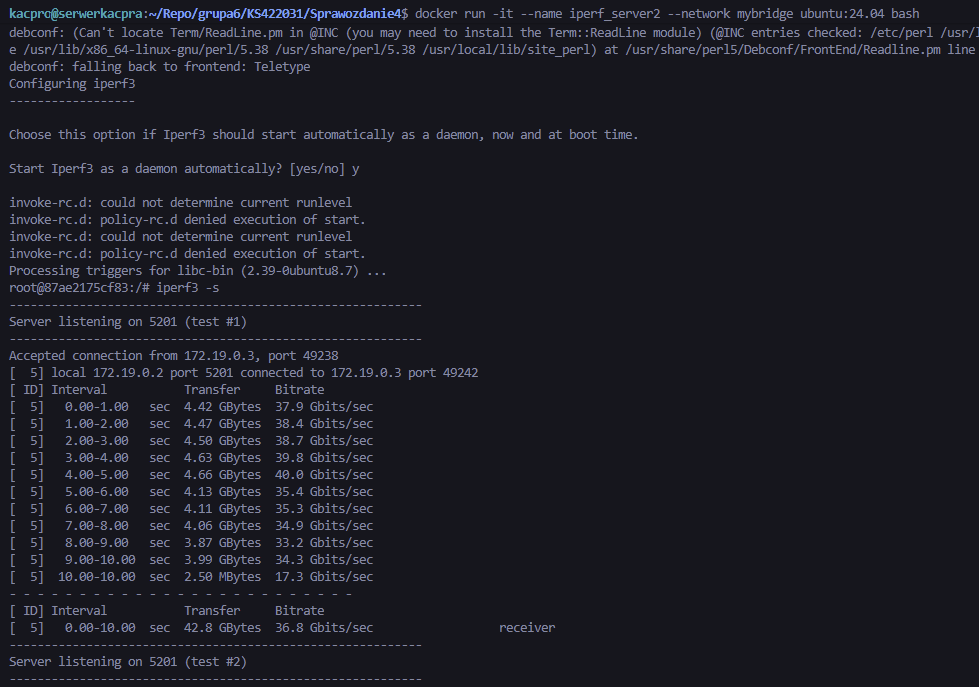

W kontenerze `iperf_client2` wykonano ping po nazwie kontenera `iperf_server2`, a następnie przeprowadzono test `iperf3 -c iperf_server2`. W tym wariancie użyto rozwiązywania nazw zamiast adresu IP.

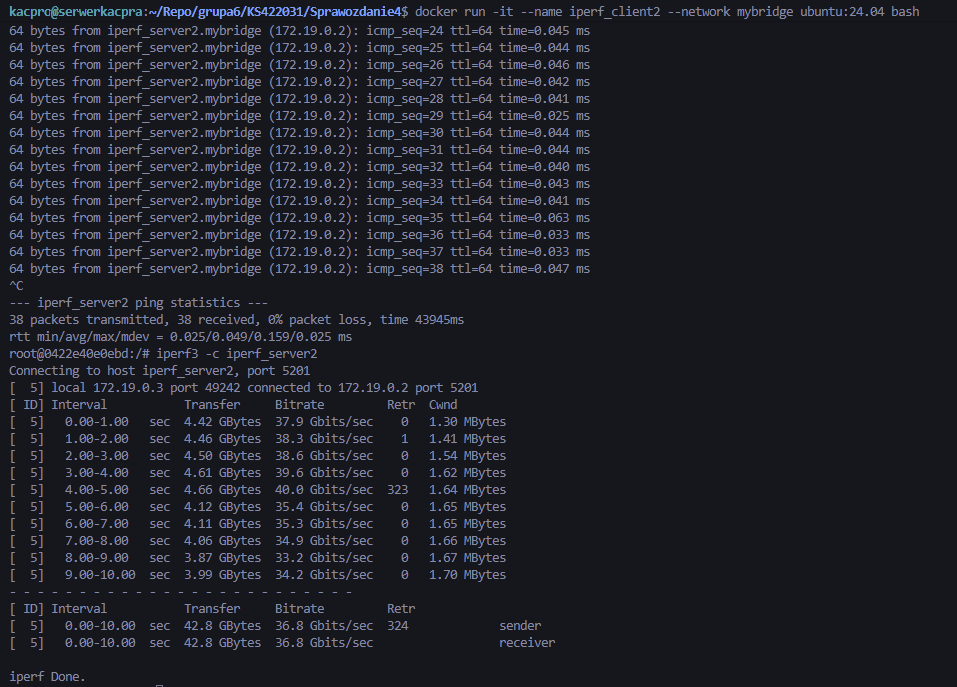

### 2.5. Połączenie z hosta i spoza hosta

Uruchomiono kontener `iperf_server_pub` z wystawionym portem `5203` na hoście. Następnie z hosta wykonano test `iperf3 -c 127.0.0.1 -p 5203`.

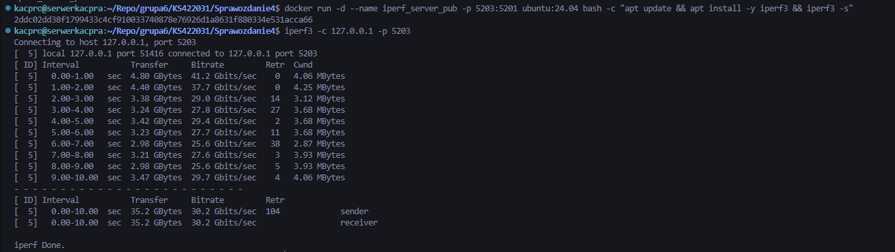

Dodatkowo odczytano adresy IP maszyny i wykonano połączenie do usługi przez adres hosta/VM, co potwierdziło poprawne udostępnienie portu poza samym kontenerem.

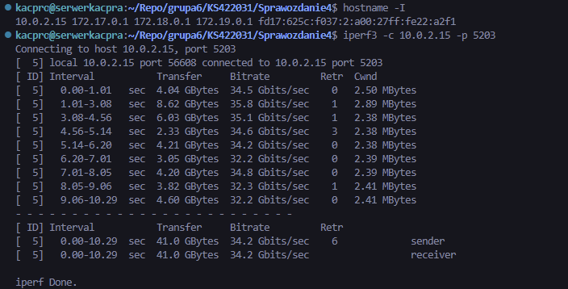

Przepustowość komunikacji została przedstawiona bezpośrednio w wynikach `iperf3`, zarówno po stronie klienta, jak i serwera.

---

## 3. Usługi w rozumieniu systemu, kontenera i klastra

### 3.1. Uruchomienie SSHD w kontenerze

W kontenerze Ubuntu zainstalowano i uruchomiono usługę `sshd`. Skonfigurowano logowanie użytkownika `root` hasłem oraz wystawiono port `2223` na hosta.

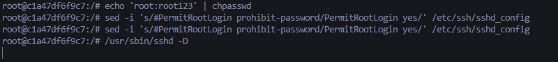

### 3.2. Połączenie z usługą SSH

Następnie wykonano połączenie z hosta do kontenera przez `ssh root@127.0.0.1 -p 2223`. Po zalogowaniu sprawdzono użytkownika oraz nazwę hosta.

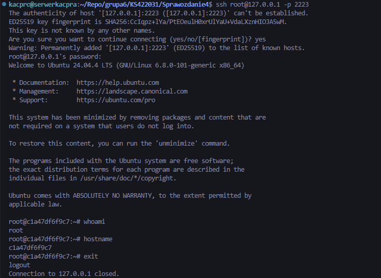

### 3.3. Zalety i wady komunikacji z kontenerem przez SSH

Połączenie przez *SSH* ułatwia administrację i diagnostykę kontenera, szczególnie gdy potrzebny jest dostęp podobny do klasycznego serwera. Z drugiej strony zwiększa to złożoność obrazu, wymaga dodatkowej konfiguracji i poszerza powierzchnię ataku. W praktyce typowe kontenery aplikacyjne nie wymagają osobnej usługi SSH, ponieważ komunikacja z nimi zwykle odbywa się przez proces główny aplikacji lub narzędzia orkiestracji.

---

## 4. Przygotowanie do uruchomienia serwera Jenkins

### 4.1. Utworzenie sieci dla Jenkinsa

Na potrzeby uruchomienia Jenkinsa utworzono dedykowaną sieć `jenkins`.

### 4.2. Uruchomienie Docker-in-Docker

Uruchomiono kontener `jenkins-dind` oparty o obraz `docker:dind`, działający w sieci `jenkins`. Kontener ten odpowiada za środowisko Docker dostępne dla instancji Jenkinsa.

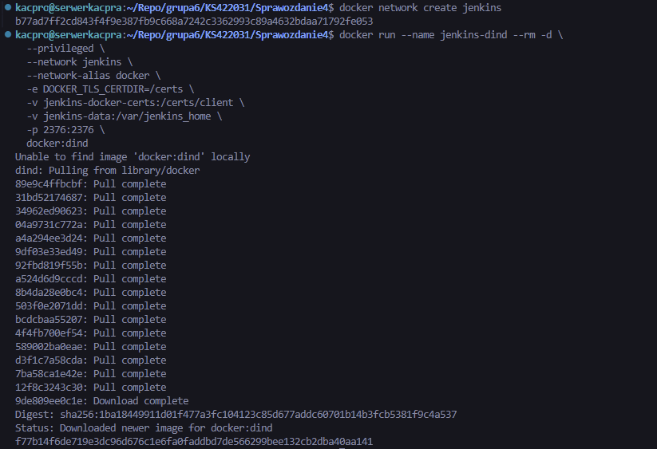

### 4.3. Uruchomienie kontrolera Jenkins

Następnie uruchomiono kontener `jenkins-blueocean` oparty o obraz `jenkins/jenkins:lts-jdk17`, z podłączonymi woluminami danych i certyfikatów. Lista działających kontenerów potwierdziła poprawne uruchomienie Jenkinsa oraz kontenera DIND.

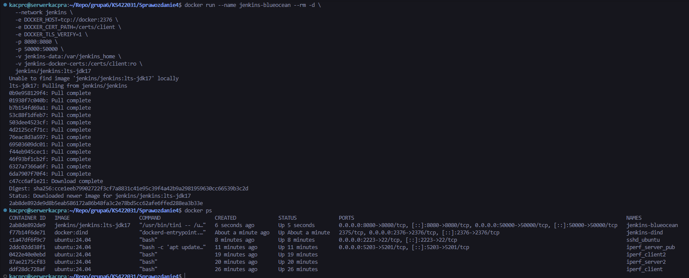

### 4.4. Inicjalizacja instancji i ekran logowania

Po uruchomieniu usługi otwarto interfejs WWW Jenkinsa. Pojawił się ekran odblokowania instancji, co potwierdza poprawny start serwera i gotowość do inicjalizacji.

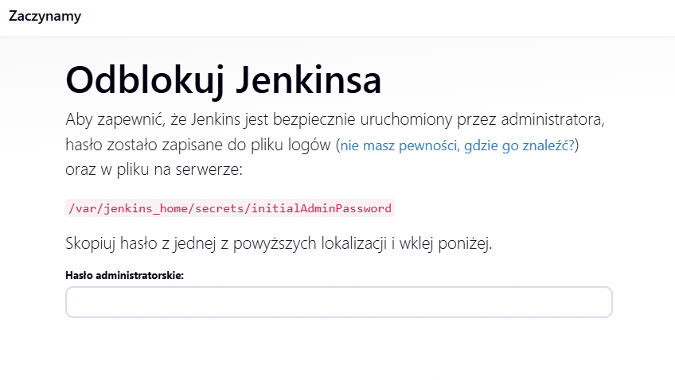

## Listing historii poleceń

```bash
docker volume create proj_in
docker volume create proj_out
docker volume ls

docker run -it --name helper -v proj_in:/input -v proj_out:/output ubuntu:24.04 bash
apt update
apt install -y git
cd /input
git clone https://github.com/rikusalminen/makefile-for-c.git
ls -la /input
ls -la /input/makefile-for-c
exit

docker run -it --name builder_nogit -v proj_in:/input -v proj_out:/output ubuntu:24.04 bash
apt update
apt install -y build-essential make
cd /input/makefile-for-c
make
make test
cp src/foo-test /output/
ls -la /output
exit

docker volume create proj_in_git
docker volume create proj_out_git
docker volume ls

docker run -it --name builder_git -v proj_in_git:/input -v proj_out_git:/output ubuntu:24.04 bash
apt update
apt install -y build-essential make git
cd /input
git clone https://github.com/rikusalminen/makefile-for-c.git
cd /input/makefile-for-c
make
make test
cp src/foo-test /output/
ls -la /output
exit

docker run --rm -it -v proj_in_git:/input ubuntu:24.04 bash
ls -la /input
ls -la /input/makefile-for-c
exit

docker run --rm -it -v proj_out_git:/output ubuntu:24.04 bash
ls -la /output
exit

docker run -it --name iperf_server ubuntu:24.04 bash
apt update
apt install -y iperf3 iproute2 iputils-ping
iperf3 -s

docker run -it --name iperf_client ubuntu:24.04 bash
apt update
apt install -y iperf3 iproute2 iputils-ping
ip a

docker inspect -f '{{range .NetworkSettings.Networks}}{{.IPAddress}}{{end}}' iperf_server
docker inspect -f '{{range .NetworkSettings.Networks}}{{.IPAddress}}{{end}}' iperf_client
iperf3 -c 172.17.0.2

docker network create mybridge
docker network ls

docker run -it --name iperf_server2 --network mybridge ubuntu:24.04 bash
apt update
apt install -y iperf3 iproute2 iputils-ping
iperf3 -s

docker run -it --name iperf_client2 --network mybridge ubuntu:24.04 bash
apt update
apt install -y iperf3 iproute2 iputils-ping
ping iperf_server2
iperf3 -c iperf_server2

docker run -d --name iperf_server_pub -p 5203:5201 ubuntu:24.04 bash -c "apt update && apt install -y iperf3 && iperf3 -s"
iperf3 -c 127.0.0.1 -p 5203
hostname -I
iperf3 -c 10.0.2.15 -p 5203

docker run -it --name sshd_ubuntu -p 2223:22 ubuntu:24.04 bash
apt update
apt install -y openssh-server
mkdir /var/run/sshd
echo 'root:root123' | chpasswd
sed -i 's/#PermitRootLogin prohibit-password/PermitRootLogin yes/' /etc/ssh/sshd_config
sed -i 's/#PasswordAuthentication yes/PasswordAuthentication yes/' /etc/ssh/sshd_config
/usr/sbin/sshd -D

ssh root@127.0.0.1 -p 2223
whoami
hostname
exit

docker network create jenkins

docker run --name jenkins-dind --rm -d \
  --privileged \
  --network jenkins \
  --network-alias docker \
  -e DOCKER_TLS_CERTDIR=/certs \
  -v jenkins-docker-certs:/certs/client \
  -v jenkins-data:/var/jenkins_home \
  -p 2376:2376 \
  docker:dind

docker run --name jenkins-blueocean --rm -d \
  --network jenkins \
  -e DOCKER_HOST=tcp://docker:2376 \
  -e DOCKER_CERT_PATH=/certs/client \
  -e DOCKER_TLS_VERIFY=1 \
  -p 8080:8080 \
  -p 50000:50000 \
  -v jenkins-data:/var/jenkins_home \
  -v jenkins-docker-certs:/certs/client:ro \
  jenkins/jenkins:lts-jdk17

docker ps
```